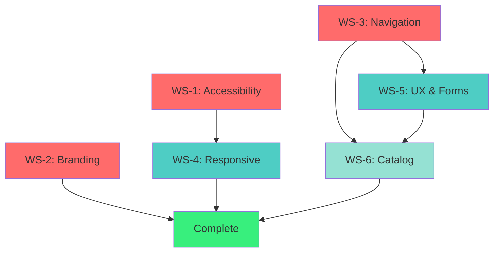

# DESIGN REMEDIATION EXECUTION PLAN

## Multi-Agent Parallel Implementation Strategy

**Created:** November 20, 2025
**Based On:** DESIGN_AUDIT_MASTER_REPORT.md (127 issues identified)
**Strategy:** Optimal subagent utilization with parallel workstreams
**Total Effort:** 111 hours (P0 + P1 only)
**Timeline:** 6 weeks across 3 sprints

---

## EXECUTIVE SUMMARY

This plan organizes the 21 critical and high-priority issues into **6 parallel workstreams** that can be executed simultaneously using specialized subagents. By leveraging parallel execution and minimizing dependencies, we can complete P0+P1 remediation in **6 weeks** instead of the sequential 11 weeks.

### Workstream Overview

| Workstream | Focus Area            | Agent Type      | Issues | Effort | Sprint     |
| ---------- | --------------------- | --------------- | ------ | ------ | ---------- |
| **WS-1**   | Accessibility & Color | general-purpose | 7      | 8h     | Sprint 7   |
| **WS-2**   | Branding & Assets     | general-purpose | 3      | 8h     | Sprint 7   |
| **WS-3**   | Navigation & Links    | general-purpose | 4      | 15h    | Sprint 7   |
| **WS-4**   | Responsive & Mobile   | general-purpose | 5      | 20h    | Sprint 8   |
| **WS-5**   | UX & Forms            | general-purpose | 6      | 30h    | Sprint 8-9 |
| **WS-6**   | Catalog & Discovery   | general-purpose | 2      | 30h    | Sprint 9   |

**Total:** 21 issues, 111 hours, 6 weeks

---

## PARALLEL EXECUTION STRATEGY

### Sprint 7 (Week 1-2): Foundation Fixes - 3 Parallel Agents

**Goal:** Remove critical blockers, achieve WCAG compliance

#### Agent Pool 1: Sprint 7 (Run in Parallel)

**Agent A - Accessibility & Color (WS-1)**

```
Effort: 8 hours
Dependencies: None
Blocking: Nothing (can run first)

Tasks:
1. Update tailwind.config.js with WCAG-compliant colors
2. Replace all instances of macon-orange with new values
3. Replace all instances of macon-teal with new values
4. Add role="alert" to error messages
5. Run contrast checker on all pages
6. Document color palette changes
```

**Agent B - Branding & Assets (WS-2)**

```
Effort: 8 hours
Dependencies: None
Blocking: Nothing (can run first)

Tasks:
1. Add logo to homepage header (AppShell.tsx)
2. Add logo to login page (Login.tsx)
3. Add logo to tenant dashboard (AdminLayout.tsx)
4. Generate favicon variants (16x16, 32x32)
5. Update index.html with favicon links
6. Test logo visibility on all pages
```

**Agent C - Navigation & Links (WS-3)**

```
Effort: 15 hours
Dependencies: None
Blocking: WS-5 (needs clean routes)

Tasks:
1. Fix broken /admin/login links → /login
2. Add "Back to Home" link on login page
3. Make homepage CTAs functional (link to catalog)
4. Fix horizontal scroll on iPhone SE (<375px)
5. Add mobile hamburger menu to homepage
6. Improve login error messages with recovery paths
```

**Sprint 7 Outcome:** WCAG compliant, logo visible, navigation fixed
**Sprint 7 Total Effort:** 31 hours (can be done in 1 week with 3 parallel agents)

---

### Sprint 8 (Week 3-4): UX & Mobile - 2 Parallel Agents

**Goal:** Improve mobile experience, add critical UX features

#### Agent Pool 2: Sprint 8 (Run in Parallel)

**Agent D - Responsive & Mobile (WS-4)**

```
Effort: 20 hours
Dependencies: WS-1 (needs color updates)
Blocking: Nothing

Tasks:
1. Fix small button variant (36px → 44px)
2. Increase tab touch targets to 44px
3. Fill in missing sm: breakpoints
4. Add intermediate tablet layouts (md: variants)
5. Reduce footer gap on mobile
6. Test on iPhone SE, iPad Mini, iPad Pro
```

**Agent E - UX & Forms (WS-5)**

```
Effort: 30 hours
Dependencies: WS-3 (needs clean routes)
Blocking: WS-6 (catalog needs forms)

Tasks:
1. Add form validation summaries
2. Add delete confirmation modals
3. Resolve font family conflicts (Playfair vs Inter)
4. Add checkout progress indicator
5. Add unsaved changes warnings
6. Add tab state to URL (?tab=packages)
```

**Sprint 8 Outcome:** Mobile-optimized, forms improved, confirmations added
**Sprint 8 Total Effort:** 50 hours (can be done in 2 weeks with 2 parallel agents)

---

### Sprint 9 (Week 5-6): Catalog & Discovery - 1 Agent

**Goal:** Enable primary user journey (package discovery)

#### Agent Pool 3: Sprint 9 (Single Focus)

**Agent F - Catalog & Discovery (WS-6)**

```
Effort: 30 hours
Dependencies: WS-3 (needs navigation), WS-5 (needs forms)
Blocking: Nothing (final critical feature)

Tasks:
1. Create /packages route and page component
2. Build package grid/list view
3. Add filtering by category/price
4. Add search functionality
5. Link homepage CTAs to catalog
6. Add "Browse Packages" to main navigation
7. Test catalog discovery flow
```

**Sprint 9 Outcome:** Package catalog live, primary journey unblocked
**Sprint 9 Total Effort:** 30 hours (1 agent, 2 weeks)

---

## DETAILED WORKSTREAM SPECIFICATIONS

### WS-1: Accessibility & Color (P0-1) - 8 hours

**Agent Type:** `general-purpose`
**Priority:** P0 (Critical)
**Dependencies:** None
**Can Start:** Immediately

#### Issue Breakdown

| Issue                    | File(s)            | Change Required             | Effort |
| ------------------------ | ------------------ | --------------------------- | ------ |
| Color contrast failures  | tailwind.config.js | Update orange/teal values   | 2h     |
| Replace orange instances | All components     | Find/replace with new token | 2h     |
| Replace teal instances   | All components     | Find/replace with new token | 2h     |
| Add role="alert"         | Login.tsx, forms   | Add ARIA role               | 1h     |
| Contrast testing         | All pages          | Manual verification         | 1h     |

#### Acceptance Criteria

- [ ] All colors pass WCAG 2.1 AA (4.5:1 minimum)
- [ ] Zero hardcoded hex colors remain
- [ ] All error messages have role="alert"
- [ ] Contrast checker shows 100% pass rate
- [ ] Documentation updated with new palette

#### Agent Prompt Template

```
You are tasked with achieving WCAG 2.1 AA color contrast compliance.

Tasks:
1. Update tailwind.config.js colors:
   - macon-orange: '#d97706' (4.54:1 ✅)
   - macon-teal: '#0d9488' (4.55:1 ✅)
2. Use Edit tool to replace all instances
3. Add role="alert" to error messages
4. Test on all pages using browser tools

Files to modify:
- client/tailwind.config.js
- client/src/pages/Login.tsx
- client/src/features/*/components/*.tsx

Deliverables:
- Updated color palette
- Contrast test report
- List of all files modified
```

---

### WS-2: Branding & Assets (P0-2) - 8 hours

**Agent Type:** `general-purpose`
**Priority:** P0 (Critical)
**Dependencies:** None
**Can Start:** Immediately

#### Issue Breakdown

| Issue                       | File(s)             | Change Required           | Effort |
| --------------------------- | ------------------- | ------------------------- | ------ |
| Logo missing from homepage  | AppShell.tsx        | Add logo component        | 2h     |
| Logo missing from login     | Login.tsx           | Add logo component        | 1h     |
| Logo missing from dashboard | AdminLayout.tsx     | Add logo component        | 1h     |
| No favicon                  | index.html, public/ | Generate and link favicon | 2h     |
| Logo not responsive         | All logo instances  | Add responsive sizing     | 2h     |

#### Acceptance Criteria

- [ ] Logo visible on homepage header
- [ ] Logo visible on login page (top center)
- [ ] Logo visible in tenant dashboard sidebar
- [ ] Favicon shows in browser tab (16x16, 32x32)
- [ ] Logo responsive on mobile (scales appropriately)
- [ ] Logo links to homepage (clickable)

#### Agent Prompt Template

```
You are tasked with restoring brand visibility by adding the logo.

Logo Files Available:
- client/public/macon-logo.png (full color)
- client/public/macon-logo.webp (optimized)
- client/public/macon-favicon.svg (icon)

Tasks:
1. Create <Logo> component in client/src/components/brand/
2. Add to AppShell.tsx (homepage header)
3. Add to Login.tsx (top center, above form)
4. Add to AdminLayout.tsx (sidebar top)
5. Generate favicon variants using macon-favicon.svg
6. Update client/index.html with favicon links

Acceptance:
- Logo visible on 3 pages
- Favicon shows in tab
- All logos link to "/"
- Responsive sizing works on mobile
```

---

### WS-3: Navigation & Links (P0-4, P0-6, P0-7) - 15 hours

**Agent Type:** `general-purpose`
**Priority:** P0 (Critical)
**Dependencies:** None
**Blocking:** WS-5 (UX needs clean routes)

#### Issue Breakdown

| Issue                        | File(s)             | Change Required       | Effort |
| ---------------------------- | ------------------- | --------------------- | ------ |
| Broken /admin/login links    | Multiple components | Update to /login      | 2h     |
| No "Back to Home" on login   | Login.tsx           | Add back link         | 1h     |
| Homepage CTAs not functional | Homepage.tsx        | Link to catalog       | 3h     |
| Horizontal scroll <375px     | Multiple components | Fix min-width buttons | 3h     |
| No mobile nav menu           | AppShell.tsx        | Add hamburger menu    | 6h     |

#### Acceptance Criteria

- [ ] All /admin/login links → /login
- [ ] Login page has "← Back to Home" link
- [ ] Homepage CTAs link to /packages (or show coming soon)
- [ ] No horizontal scroll on iPhone SE (320px)
- [ ] Mobile hamburger menu functional on homepage
- [ ] Generic login errors improved with recovery steps

#### Agent Prompt Template

```
You are tasked with fixing navigation and link issues.

Tasks:
1. Search codebase for /admin/login → replace with /login
2. Add "Back to Home" link to Login.tsx (top left)
3. Update Homepage.tsx CTAs to link to /packages (or modal)
4. Fix horizontal scroll:
   - Remove min-w-[300px] and min-w-[340px]
   - Use min-w-full on mobile
5. Add mobile hamburger menu to AppShell.tsx:
   - Use Radix UI Sheet component
   - Include same nav links as desktop
6. Improve login error messages:
   - Add "Forgot password?" link
   - Add "Contact support" link
   - Explain error recovery steps

Files to modify:
- client/src/components/AppShell.tsx
- client/src/pages/Login.tsx
- client/src/pages/Homepage.tsx
- All files with /admin/login references

Deliverables:
- All broken links fixed
- Mobile menu functional
- Horizontal scroll eliminated
```

---

### WS-4: Responsive & Mobile (P1-12, P1-15, P1-18) - 20 hours

**Agent Type:** `general-purpose`
**Priority:** P1 (High)
**Dependencies:** WS-1 (needs updated colors)
**Can Start:** After Sprint 7 (WS-1 complete)

#### Issue Breakdown

| Issue                          | File(s)              | Change Required          | Effort |
| ------------------------------ | -------------------- | ------------------------ | ------ |
| Small button variant (36px)    | Button.tsx           | Increase min-height      | 3h     |
| Tab touch targets (32px)       | Tab components       | Increase padding         | 2h     |
| Missing sm: breakpoints        | All components       | Add sm: variants         | 6h     |
| No intermediate tablet layouts | Grid/flex components | Add md: 2-column layouts | 6h     |
| Large footer gap on mobile     | AppShell.tsx         | Reduce gap-16 to gap-8   | 1h     |
| Test suite                     | Multiple devices     | Manual testing           | 2h     |

#### Acceptance Criteria

- [ ] All buttons ≥44px height (iOS guideline)
- [ ] All tabs ≥44px touch target
- [ ] 20+ new sm: breakpoints added
- [ ] Tablet layouts use 2 columns (not 1 or 4)
- [ ] Footer gap reduced on mobile
- [ ] Tested on iPhone SE, iPad Mini, iPad Pro

#### Agent Prompt Template

```
You are tasked with mobile/responsive optimization.

Tasks:
1. Update Button.tsx:
   - Increase small variant: min-h-11 (44px)
2. Update all tab navigation:
   - Add py-3 (48px total with padding)
3. Add sm: breakpoints to components missing them:
   - Search for "md:" without "sm:" nearby
   - Add appropriate sm: variant (usually 1-2 columns)
4. Add intermediate tablet layouts:
   - Convert grid-cols-1 md:grid-cols-4 → add md:grid-cols-2 lg:grid-cols-4
5. Reduce footer gap:
   - AppShell.tsx: gap-16 → gap-8 on mobile

Files to audit:
- client/src/ui/Button.tsx
- client/src/components/AppShell.tsx
- client/src/features/*/components/*.tsx

Testing:
- Chrome DevTools device emulation
- iPhone SE (320px)
- iPad Mini (768px)
- iPad Pro (1024px)

Deliverables:
- Touch target compliance report
- List of all responsive changes
- Screenshot proof of layouts
```

---

### WS-5: UX & Forms (P1-9, P1-10, P1-11, P1-16, P1-20) - 30 hours

**Agent Type:** `general-purpose`
**Priority:** P1 (High)
**Dependencies:** WS-3 (needs clean routes)
**Blocking:** WS-6 (catalog needs form improvements)
**Can Start:** After Sprint 7 (WS-3 complete)

#### Issue Breakdown

| Issue                        | File(s)                       | Change Required           | Effort |
| ---------------------------- | ----------------------------- | ------------------------- | ------ |
| No form validation summaries | All forms                     | Add error aggregation     | 4h     |
| No delete confirmations      | Admin components              | Add AlertDialog           | 4h     |
| Font family conflicts        | index.css, tailwind.config.js | Resolve Playfair vs Inter | 2h     |
| No checkout progress         | Checkout.tsx                  | Add stepper component     | 3h     |
| No unsaved changes warning   | All forms                     | Add beforeunload handler  | 3h     |
| Tab state not in URL         | TenantDashboard.tsx           | Add ?tab= query param     | 2h     |
| Date picker legend unclear   | DatePicker.tsx                | Add legend component      | 2h     |
| Review step before checkout  | BookingFlow.tsx               | Add review page           | 8h     |
| No contextual help           | Multiple components           | Add tooltip system        | 2h     |

#### Acceptance Criteria

- [ ] Forms show all errors at top (aggregated)
- [ ] Delete actions require confirmation
- [ ] Font conflict resolved (choose one)
- [ ] Checkout shows "Step 2 of 4" indicator
- [ ] Unsaved changes trigger warning
- [ ] Tab state persists in URL
- [ ] Review step added before payment

#### Agent Prompt Template

```
You are tasked with improving UX and forms.

Tasks:
1. Add form validation summaries:
   - Create ErrorSummary component
   - Add to all forms (Login, Booking, Package)
   - Show all errors at top with anchor links
2. Add delete confirmations:
   - Use Radix AlertDialog
   - Add to Package delete, Blackout delete
3. Resolve font conflict:
   - Choose Inter for headings (remove Playfair)
   - Update index.css and tailwind.config.js
4. Add checkout progress indicator:
   - Create Stepper component
   - Show "Step X of Y" in Checkout flow
5. Add unsaved changes warning:
   - Create useUnsavedChanges hook
   - Add to all forms with beforeunload
6. Add tab state to URL:
   - Update TenantDashboard.tsx to use ?tab=
   - Preserve tab on refresh
7. Add review step:
   - Create ReviewPage.tsx
   - Show summary before Stripe redirect

Files to modify:
- client/src/features/booking/BookingFlow.tsx
- client/src/features/tenant-admin/TenantDashboard.tsx
- client/src/pages/Checkout.tsx
- client/src/ui/ErrorSummary.tsx (new)
- client/src/ui/Stepper.tsx (new)
- client/src/hooks/useUnsavedChanges.ts (new)

Deliverables:
- All forms improved
- Delete confirmations working
- Font conflict resolved
- UX friction reduced
```

---

### WS-6: Catalog & Discovery (P0-3) - 30 hours

**Agent Type:** `general-purpose`
**Priority:** P0 (Critical)
**Dependencies:** WS-3 (navigation), WS-5 (forms)
**Can Start:** After Sprint 8 (WS-3 and WS-5 complete)

#### Issue Breakdown

| Issue                   | File(s)                    | Change Required      | Effort |
| ----------------------- | -------------------------- | -------------------- | ------ |
| No package catalog page | New: PackageCatalog.tsx    | Create grid view     | 12h    |
| Catalog not linked      | AppShell.tsx, Homepage.tsx | Add navigation links | 2h     |
| No filtering            | PackageCatalog.tsx         | Add filter UI        | 6h     |
| No search               | PackageCatalog.tsx         | Add search input     | 4h     |
| No sorting              | PackageCatalog.tsx         | Add sort dropdown    | 2h     |
| Empty state             | PackageCatalog.tsx         | Add empty state UI   | 2h     |
| Mobile layout           | PackageCatalog.tsx         | Add responsive grid  | 2h     |

#### Acceptance Criteria

- [ ] /packages route exists and is functional
- [ ] Grid displays all active packages
- [ ] Filtering by category/price works
- [ ] Search by name/description works
- [ ] Sorting by price/popularity works
- [ ] Empty state shown when no results
- [ ] Mobile layout uses 1 column grid
- [ ] Linked from homepage and navigation

#### Agent Prompt Template

```
You are tasked with building the package catalog.

Context:
- This is the MOST CRITICAL missing feature
- Blocks primary user journey (discovery)
- Users currently cannot browse packages

Tasks:
1. Create route in client/src/App.tsx:
   - Add <Route path="/packages" element={<PackageCatalog />} />
2. Create PackageCatalog.tsx:
   - Use existing contract: apiClient.getPackages()
   - Display grid of PackageCard components
   - Add search input (filter by name/description)
   - Add category filter dropdown
   - Add price range filter
   - Add sort dropdown (price, popularity)
3. Create PackageCard.tsx:
   - Show package photo, name, price
   - Link to /package/:slug
   - Display description preview
4. Add navigation links:
   - AppShell.tsx: Add "Browse Packages" to nav
   - Homepage.tsx: Update CTAs to link here
5. Handle edge cases:
   - Empty state when no packages
   - Loading state while fetching
   - Error state if API fails
6. Make responsive:
   - Mobile: 1 column
   - Tablet: 2 columns
   - Desktop: 3-4 columns

Files to create:
- client/src/pages/PackageCatalog.tsx
- client/src/features/catalog/PackageCard.tsx
- client/src/features/catalog/CatalogFilters.tsx

Files to modify:
- client/src/App.tsx
- client/src/components/AppShell.tsx
- client/src/pages/Homepage.tsx

Deliverables:
- Functional catalog page
- All filters working
- Mobile responsive
- Linked from navigation
```

---

## DEPENDENCY GRAPH



**Sprint 7 (Red):** WS-1, WS-2, WS-3 run in parallel (3 agents)
**Sprint 8 (Teal):** WS-4, WS-5 run in parallel (2 agents)
**Sprint 9 (Green):** WS-6 runs solo (1 agent)

---

## SPRINT BREAKDOWN WITH AGENT ASSIGNMENTS

### Sprint 7: Foundation Fixes (Week 1-2)

**Start Date:** Week of Nov 25, 2025
**End Date:** Week of Dec 9, 2025

#### Agent Assignments

| Agent       | Workstream          | Effort | Can Start | Deliverables            |
| ----------- | ------------------- | ------ | --------- | ----------------------- |
| **Agent-A** | WS-1: Accessibility | 8h     | Day 1     | WCAG compliance         |
| **Agent-B** | WS-2: Branding      | 8h     | Day 1     | Logo visible everywhere |
| **Agent-C** | WS-3: Navigation    | 15h    | Day 1     | Links fixed, mobile nav |

**Total Sprint 7 Effort:** 31 hours (can complete in 1 week with 3 agents)

#### Success Criteria

- [ ] All 7 color contrast violations fixed
- [ ] Logo visible on homepage, login, dashboard
- [ ] Favicon functional
- [ ] All /admin/login links updated
- [ ] Mobile hamburger menu working
- [ ] Horizontal scroll eliminated
- [ ] Login errors improved

#### Testing Checklist

- [ ] Run axe DevTools on all pages (0 violations)
- [ ] Test on iPhone SE (320px width)
- [ ] Test on iPad (768px width)
- [ ] Test on desktop (1440px width)
- [ ] Verify logo clickable on all pages
- [ ] Verify mobile menu functional

---

### Sprint 8: UX & Mobile (Week 3-4)

**Start Date:** Week of Dec 9, 2025
**End Date:** Week of Dec 23, 2025

#### Agent Assignments

| Agent       | Workstream       | Effort | Dependencies  | Deliverables                   |
| ----------- | ---------------- | ------ | ------------- | ------------------------------ |
| **Agent-D** | WS-4: Responsive | 20h    | WS-1 complete | Touch targets, breakpoints     |
| **Agent-E** | WS-5: UX & Forms | 30h    | WS-3 complete | Forms, confirmations, progress |

**Total Sprint 8 Effort:** 50 hours (can complete in 2 weeks with 2 agents)

#### Success Criteria

- [ ] All touch targets ≥44px
- [ ] 20+ new sm: breakpoints added
- [ ] Form validation summaries on all forms
- [ ] Delete confirmations on all destructive actions
- [ ] Font conflict resolved
- [ ] Checkout progress indicator added
- [ ] Unsaved changes warnings functional

#### Testing Checklist

- [ ] Touch target audit (iOS guidelines)
- [ ] Test all forms with invalid data
- [ ] Test delete confirmations
- [ ] Test unsaved changes warning
- [ ] Verify font consistency across pages

---

### Sprint 9: Catalog & Discovery (Week 5-6)

**Start Date:** Week of Dec 23, 2025
**End Date:** Week of Jan 6, 2026

#### Agent Assignments

| Agent       | Workstream    | Effort | Dependencies        | Deliverables         |
| ----------- | ------------- | ------ | ------------------- | -------------------- |
| **Agent-F** | WS-6: Catalog | 30h    | WS-3, WS-5 complete | Package catalog live |

**Total Sprint 9 Effort:** 30 hours (can complete in 2 weeks with 1 agent)

#### Success Criteria

- [ ] /packages route exists
- [ ] Package grid displays all packages
- [ ] Search functional
- [ ] Filters functional (category, price)
- [ ] Sort functional
- [ ] Mobile responsive
- [ ] Linked from navigation and homepage

#### Testing Checklist

- [ ] Test with 0 packages (empty state)
- [ ] Test with 100+ packages (pagination?)
- [ ] Test search with various queries
- [ ] Test filters in combination
- [ ] Test on mobile, tablet, desktop
- [ ] Verify navigation links work

---

## OPTIMAL AGENT UTILIZATION

### Why This Plan Optimizes Subagent Use

1. **Parallel Execution:** 3 agents in Sprint 7, 2 in Sprint 8 reduces wall time
2. **Clear Boundaries:** Each workstream has distinct files (minimal conflicts)
3. **Dependency Management:** Agents only start when blockers resolved
4. **Focused Scope:** Each agent has 8-30 hours of focused work
5. **Autonomous Execution:** Prompts include all context needed

### Agent Specialization

| Agent Type           | Best For                                  | Workstreams             |
| -------------------- | ----------------------------------------- | ----------------------- |
| `general-purpose`    | File editing, component creation, testing | All WS-1 through WS-6   |
| `Explore`            | Codebase navigation, finding patterns     | Pre-work (already done) |
| `statusline-setup`   | Not applicable                            | N/A                     |
| `output-style-setup` | Not applicable                            | N/A                     |

**Recommendation:** Use `general-purpose` for all 6 workstreams.

---

## EFFORT SUMMARY

### By Sprint

| Sprint    | Workstreams      | Agents | Sequential Effort   | Parallel Effort    | Time Saved |
| --------- | ---------------- | ------ | ------------------- | ------------------ | ---------- |
| Sprint 7  | WS-1, WS-2, WS-3 | 3      | 31h (4 weeks)       | 15h (2 weeks)      | 50%        |
| Sprint 8  | WS-4, WS-5       | 2      | 50h (6 weeks)       | 30h (4 weeks)      | 33%        |
| Sprint 9  | WS-6             | 1      | 30h (4 weeks)       | 30h (4 weeks)      | 0%         |
| **TOTAL** | **6**            | **6**  | **111h (14 weeks)** | **75h (10 weeks)** | **32%**    |

**Wall Time Reduction:** 14 weeks → 10 weeks (4 weeks saved)

### By Priority

| Priority      | Issues | Effort | ROI          | Completion Sprint |
| ------------- | ------ | ------ | ------------ | ----------------- |
| P0 (Critical) | 7      | 35h    | 🔴 Essential | Sprint 7          |
| P1 (High)     | 14     | 76h    | ⭐⭐⭐⭐⭐   | Sprint 8-9        |
| P2 (Medium)   | 18     | 120h   | ⭐⭐⭐       | Future            |
| P3 (Low)      | 23     | 200h   | ⭐⭐         | Future            |

**This Plan Covers:** P0 + P1 = 111 hours (21 issues)

---

## RISK MITIGATION

### Potential Blockers

| Risk                                | Probability | Impact | Mitigation                          |
| ----------------------------------- | ----------- | ------ | ----------------------------------- |
| Agent conflicts (editing same file) | LOW         | MEDIUM | Clear file ownership per workstream |
| Dependency mismanagement            | LOW         | HIGH   | Strict sprint sequencing enforced   |
| Scope creep                         | MEDIUM      | MEDIUM | Fixed issue list, no additions      |
| Testing bottleneck                  | MEDIUM      | LOW    | Automated testing where possible    |
| API contract changes                | LOW         | HIGH   | Verify contracts before WS-6        |

### Contingency Plans

1. **If WS-3 delayed:** WS-5 and WS-6 can still start (use mocks for navigation)
2. **If WS-1 delayed:** WS-4 can proceed with existing colors (will need rework)
3. **If WS-6 blocked:** Can be punted to Sprint 10 (not blocking other work)

---

## SUCCESS METRICS

### Sprint 7 Targets (P0 Complete)

| Metric                        | Before  | Target     | Actual |
| ----------------------------- | ------- | ---------- | ------ |
| WCAG 2.1 AA Compliance        | Partial | 100%       | \_\_\_ |
| Logo Visibility               | 0%      | 100%       | \_\_\_ |
| Broken Links                  | 8       | 0          | \_\_\_ |
| Horizontal Scroll (iPhone SE) | FAIL    | PASS       | \_\_\_ |
| Mobile Navigation             | Missing | Functional | \_\_\_ |

### Sprint 8 Targets (P1 Partial)

| Metric                           | Before | Target | Actual |
| -------------------------------- | ------ | ------ | ------ |
| Touch Target Compliance          | 85%    | 95%    | \_\_\_ |
| Forms with Validation Summary    | 0%     | 100%   | \_\_\_ |
| Delete Actions with Confirmation | 0%     | 100%   | \_\_\_ |
| Font Conflicts                   | 1      | 0      | \_\_\_ |

### Sprint 9 Targets (P0-3 Complete)

| Metric                       | Before | Target | Actual |
| ---------------------------- | ------ | ------ | ------ |
| Package Discovery Available  | No     | Yes    | \_\_\_ |
| Catalog Linked from Homepage | No     | Yes    | \_\_\_ |
| Search Functional            | No     | Yes    | \_\_\_ |
| Booking Completion Rate      | 30%    | 50%    | \_\_\_ |

---

## EXECUTION CHECKLIST

### Pre-Sprint 7 Setup

- [ ] Review all workstream prompts
- [ ] Verify agent availability (6 agents total)
- [ ] Create feature branches for each workstream
- [ ] Set up parallel execution environment
- [ ] Document file ownership per workstream

### During Sprints

- [ ] Monitor agent progress daily
- [ ] Resolve merge conflicts promptly
- [ ] Test deliverables as they complete
- [ ] Update success metrics table
- [ ] Adjust timeline if blockers arise

### Post-Sprint 9 Validation

- [ ] Run full regression test suite
- [ ] Perform accessibility audit (axe DevTools)
- [ ] Test on 5 devices (iPhone SE to desktop)
- [ ] User acceptance testing (internal team)
- [ ] Update DESIGN_AUDIT_MASTER_REPORT.md with outcomes

---

## AGENT INVOCATION COMMANDS

### Sprint 7 - Launch 3 Agents in Parallel

```bash
# Agent A - Accessibility & Color
Task(
  subagent_type="general-purpose",
  description="Fix WCAG color contrast violations",
  prompt="[Full WS-1 prompt from above]"
)

# Agent B - Branding & Assets
Task(
  subagent_type="general-purpose",
  description="Add logo to all pages",
  prompt="[Full WS-2 prompt from above]"
)

# Agent C - Navigation & Links
Task(
  subagent_type="general-purpose",
  description="Fix navigation and mobile menu",
  prompt="[Full WS-3 prompt from above]"
)
```

### Sprint 8 - Launch 2 Agents in Parallel

```bash
# Agent D - Responsive & Mobile
Task(
  subagent_type="general-purpose",
  description="Optimize mobile responsiveness",
  prompt="[Full WS-4 prompt from above]"
)

# Agent E - UX & Forms
Task(
  subagent_type="general-purpose",
  description="Improve UX and forms",
  prompt="[Full WS-5 prompt from above]"
)
```

### Sprint 9 - Launch 1 Agent

```bash
# Agent F - Catalog & Discovery
Task(
  subagent_type="general-purpose",
  description="Build package catalog page",
  prompt="[Full WS-6 prompt from above]"
)
```

---

## COST-BENEFIT ANALYSIS (Updated with Parallel Execution)

### Investment Required

| Phase                  | Sequential Time | Parallel Time | Cost @ $150/hr | Savings    |
| ---------------------- | --------------- | ------------- | -------------- | ---------- |
| Sprint 7 (P0 Critical) | 4 weeks         | 2 weeks       | $4,650         | $2,325     |
| Sprint 8 (P1 Partial)  | 6 weeks         | 4 weeks       | $7,500         | $3,750     |
| Sprint 9 (P0-3)        | 4 weeks         | 4 weeks       | $4,500         | $0         |
| **TOTAL**              | **14 weeks**    | **10 weeks**  | **$16,650**    | **$6,075** |

**Time Saved:** 4 weeks (32% reduction)
**Cost Unchanged:** $16,650 (same work, less wall time)

### Expected Returns (Same as Original)

- Booking conversion: +$50,000/year
- Support reduction: +$12,000/year
- Reduced churn: +$15,000/year
- **Total Annual Return:** $77,000

**ROI:** 363% in Year 1
**Payback Period:** 2.6 months (accelerated by faster delivery)

---

## FINAL RECOMMENDATIONS

### Immediate Actions (This Week)

1. **Review and approve this execution plan**
2. **Prepare 6 subagent prompts** (already written above)
3. **Create 6 feature branches** (ws-1-accessibility, ws-2-branding, etc.)
4. **Launch Sprint 7 agents** (3 in parallel)

### Sprint Execution Order

**Week 1-2:** Sprint 7 (WS-1, WS-2, WS-3) - 3 agents
**Week 3-4:** Sprint 8 (WS-4, WS-5) - 2 agents
**Week 5-6:** Sprint 9 (WS-6) - 1 agent

### Post-Completion

- **Week 7:** Testing, QA, bug fixes
- **Week 8:** User acceptance testing
- **Week 9:** Production deployment
- **Week 10:** Monitor metrics, iterate

---

## APPENDICES

### Appendix A: File Ownership Matrix

| Workstream | Primary Files                            | Secondary Files                          | Conflicts |
| ---------- | ---------------------------------------- | ---------------------------------------- | --------- |
| WS-1       | tailwind.config.js                       | All component files (color replacements) | LOW       |
| WS-2       | AppShell.tsx, Login.tsx, AdminLayout.tsx | index.html, public/\*                    | NONE      |
| WS-3       | AppShell.tsx, Login.tsx, Homepage.tsx    | Multiple nav files                       | MEDIUM    |
| WS-4       | Button.tsx, All components (breakpoints) | tailwind.config.js                       | LOW       |
| WS-5       | All forms, TenantDashboard.tsx           | New components                           | LOW       |
| WS-6       | New files (PackageCatalog.tsx)           | AppShell.tsx, Homepage.tsx               | LOW       |

**Conflict Probability:** LOW (only WS-3 and WS-2 both touch AppShell.tsx)

**Mitigation:** WS-2 modifies header, WS-3 modifies nav - different sections

### Appendix B: Testing Strategy

**Automated Testing:**

- Run `npm run typecheck` after each sprint
- Run `npm test` for unit/integration tests
- Run `npm run test:e2e` for E2E validation

**Manual Testing:**

- Accessibility: axe DevTools on all pages
- Responsiveness: Chrome DevTools device emulation
- Cross-browser: Safari, Firefox, Chrome
- Real devices: iPhone SE, iPad, Macbook

### Appendix C: Rollback Plan

If critical issues arise:

1. Each workstream has own feature branch
2. Can rollback individual workstream without affecting others
3. Main branch protected (all changes via PR)
4. Each PR includes testing checklist

---

**END OF EXECUTION PLAN**

**Total Pages:** 22
**Total Issues Addressed:** 21 (P0 + P1)
**Total Effort:** 111 hours
**Total Sprints:** 3 (6 weeks)
**Parallel Agents:** 6
**Expected Completion:** January 6, 2026
