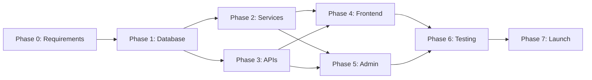

# Three-Tier Segment Storefront: Phased Implementation Plan

## Executive Summary
This plan leverages your existing infrastructure (85% ready) to implement a segment-driven, three-tier booking system with minimal risk and maximum code reuse. Total timeline: 6-8 weeks including testing and rollout.

---

## PHASE 0: External Requirements & Decisions
### 🔴 CRITICAL: Complete Before Any Coding Begins

### A. Business Decisions You Must Make

#### 1. Segment Structure Definition
**Decide by: Before Phase 1 starts**
```yaml
segments:
  - name: "Essential"  # or "Budget"
    target: "Cost-conscious couples"
    price_range: "$2,000 - $5,000"

  - name: "Signature"  # or "Premium"
    target: "Quality-focused couples"
    price_range: "$5,000 - $10,000"

  - name: "Luxury"    # or "Elite"
    target: "Full-service seekers"
    price_range: "$10,000+"
```

#### 2. Tier Matrix Within Each Segment
**Template to complete:**
```yaml
segment: "Signature"
tiers:
  1:
    name: "Signature Essential"
    base_price: $5,000
    max_guests: 50
    features: [4hr coverage, 200 photos, online gallery]

  2:
    name: "Signature Select"
    base_price: $7,500
    max_guests: 100
    features: [6hr coverage, 400 photos, album, engagement shoot]
    popular: true  # Badge this tier

  3:
    name: "Signature Complete"
    base_price: $10,000
    max_guests: 150
    features: [8hr coverage, unlimited photos, 2 albums, video]
```

#### 3. Commission & Pricing Strategy
```yaml
commission_rates:
  Essential: 8%     # Lower margin on budget
  Signature: 10%    # Standard rate
  Luxury: 12%       # Higher margin on premium

dynamic_pricing:
  peak_season: +20%  # June-September
  last_minute: -15%  # < 30 days out

upsell_incentives:
  tier_upgrade: 5% off next tier
  bundle_addons: 10% off 3+ addons
```

#### 4. Upsell Rules Engine
```yaml
rules:
  - trigger: "Viewing tier 1"
    action: "Show tier 2 benefits comparison"

  - trigger: "Added 2+ addons"
    action: "Suggest tier upgrade might be better value"

  - trigger: "High-demand date selected"
    action: "Emphasize limited availability"
```

### B. Design Assets to Prepare

#### 1. UI/UX Mockups Needed
- [ ] Segment selector (3 cards/tabs)
- [ ] Tier comparison table (3-column layout)
- [ ] Upsell modal design
- [ ] "Popular" badge styling
- [ ] Mobile-responsive layouts

#### 2. Content Creation
- [ ] Segment descriptions (50-100 words each)
- [ ] Tier feature lists (bullet points)
- [ ] Upsell copy (value propositions)
- [ ] Scarcity/urgency messaging
- [ ] FAQ for tier differences

#### 3. Photography/Media
- [ ] Hero images for each segment
- [ ] Tier-specific gallery photos
- [ ] Add-on product shots
- [ ] Social proof (testimonials)

### C. Technical Setup Required

#### 1. Stripe Connect Configuration
```bash
# In Stripe Dashboard:
1. Enable Connect if not already
2. Set platform fee structure
3. Configure webhook endpoints:
   - checkout.session.completed
   - payment_intent.succeeded
   - account.updated
4. Test connected account onboarding
```

#### 2. Analytics & Tracking Setup
```javascript
// Google Analytics 4 / Mixpanel events to configure:
{
  'segment_selected': { segment: string },
  'tier_viewed': { segment: string, tier: number },
  'tier_compared': { tiers: string[] },
  'upsell_shown': { from_tier: string, to_tier: string },
  'upsell_accepted': { upgrade_value: number },
  'checkout_started': { segment: string, tier: number }
}
```

#### 3. Environment & Infrastructure
- [ ] Staging environment with test data
- [ ] Test Stripe account (use test keys)
- [ ] CDN for tier comparison images
- [ ] Error tracking (Sentry/Rollbar)
- [ ] Feature flag service (LaunchDarkly/Unleash or build simple)

#### 4. Test Data Preparation
```sql
-- Sample data needed:
- 3 test tenants (one per segment focus)
- 9 packages (3 tiers × 3 segments)
- 10-15 add-ons varied by tier
- Sample bookings for each tier
- Blackout dates for testing scarcity
```

### D. Team Alignment Needed

#### 1. Stakeholder Sign-offs
- [ ] Segment/tier structure approval
- [ ] Pricing matrix confirmation
- [ ] Commission rates agreement
- [ ] Upsell strategy approval

#### 2. Documentation to Prepare
- [ ] Segment positioning guide
- [ ] Tier comparison talking points
- [ ] Admin training materials
- [ ] Customer FAQ

---

## PHASE 1: Database & Model Foundation
### Week 1 | Prerequisites: Phase 0 complete

### Day 1-2: Schema Evolution
```typescript
// 1. Create and run migration
npx prisma migrate dev --name add_segment_tiers

// 2. Update Package model (server/prisma/schema.prisma:107)
model Package {
  // ... existing fields ...
  segment      String?  @default("standard")
  tierLevel    Int?     @default(1)
  tierName     String?
  maxGuests    Int?
  features     Json     @default("[]")
  upsellTargets Json   @default("[]")
  popularBadge Boolean @default(false)
  sortOrder    Int     @default(999)

  @@index([tenantId, segment, tierLevel])
  @@index([tenantId, segment, active])
}
```

### Day 3-4: Repository Layer
```typescript
// Extend server/src/lib/ports/catalog.repository.ts
interface CatalogRepository {
  // New methods
  getPackagesBySegment(tenantId: string, segment: string): Promise<Package[]>
  getPackagesForComparison(tenantId: string, ids: string[]): Promise<Package[]>
  getTiersBySegment(tenantId: string, segment: string): Promise<Package[]>
}

// Implement in server/src/adapters/prisma/catalog.repository.ts
async getPackagesBySegment(tenantId: string, segment: string) {
  return this.prisma.package.findMany({
    where: { tenantId, segment, active: true },
    orderBy: { tierLevel: 'asc' },
    include: { addOns: true }
  });
}
```

### Day 5: Data Migration & Backfill
```typescript
// Script: scripts/migrate-to-segments.ts
async function backfillSegments() {
  // 1. Assign existing packages to segments based on price
  const packages = await prisma.package.findMany();

  for (const pkg of packages) {
    const segment = pkg.basePrice < 500000 ? 'Essential' :
                    pkg.basePrice < 1000000 ? 'Signature' : 'Luxury';

    await prisma.package.update({
      where: { id: pkg.id },
      data: {
        segment,
        tierLevel: 1,
        tierName: `${segment} Package`
      }
    });
  }
}
```

### 🔍 Checkpoint: Database ready, models extended, backward compatible

---

## PHASE 2: Service Layer Implementation
### Week 2 | Prerequisites: Phase 1 complete

### Day 1-2: Core Services

#### Create SegmentService
```typescript
// server/src/services/segment.service.ts
export class SegmentService {
  constructor(
    private catalogRepo: CatalogRepository,
    private cache: CacheService
  ) {}

  async getSegmentPackages(tenantId: string, segment: string) {
    const cacheKey = `segment:${tenantId}:${segment}`;
    // Implementation with caching
  }

  async compareT tiers(tenantId: string, tierIds: string[]) {
    // Return comparison matrix
  }
}
```

#### Create UpsellService
```typescript
// server/src/services/upsell.service.ts
export class UpsellService {
  async calculateUpgrade(from: Package, to: Package) {
    // Price difference, features gained
  }

  async shouldShowUpsell(booking: BookingContext) {
    // Rules engine implementation
  }
}
```

### Day 3-4: Extend Existing Services

#### Enhance CatalogService
```typescript
// Add to server/src/services/catalog.service.ts:108
async getPackagesBySegmentWithTiers(tenantId: string, segment: string) {
  const packages = await this.repository.getPackagesBySegment(tenantId, segment);

  // Group by tier level
  return {
    segment,
    tiers: this.groupByTierLevel(packages),
    comparison: this.generateComparisonMatrix(packages)
  };
}
```

#### Extend BookingService
```typescript
// Add to server/src/services/booking.service.ts:55
async createTieredCheckout(tenantId: string, input: TieredBookingInput) {
  // Check for upsell opportunity
  const upsell = await this.upsellService.checkUpsell(input);

  if (upsell.available) {
    // Include upsell in session metadata
  }

  // Continue with existing checkout flow
  return this.createCheckout(tenantId, input);
}
```

### Day 5: Integration Testing
```typescript
// server/src/services/__tests__/segment.service.test.ts
describe('SegmentService', () => {
  it('returns packages grouped by tier');
  it('handles cache correctly');
  it('maintains tenant isolation');
});
```

### 🔍 Checkpoint: Services operational, can query segments/tiers

---

## PHASE 3: API Layer & Contracts
### Week 2 (continued) | Can parallel with Phase 2

### Day 3-4: Extend DTOs
```typescript
// packages/contracts/src/dto.ts:19
export const PackageWithSegmentDtoSchema = PackageDtoSchema.extend({
  segment: z.enum(['Essential', 'Signature', 'Luxury']),
  tierLevel: z.number().int().min(1).max(3),
  tierName: z.string(),
  features: z.array(z.string()),
  popularBadge: z.boolean()
});

export const TierComparisonDtoSchema = z.object({
  segment: z.string(),
  tiers: z.array(PackageWithSegmentDtoSchema),
  comparisonMatrix: z.record(z.array(z.boolean()))
});
```

### Day 5: New API Endpoints
```typescript
// packages/contracts/src/api.v1.ts:26
export const Contracts = c.router({
  // ... existing ...

  getSegmentPackages: {
    method: 'GET',
    path: '/v1/packages/segment/:segment',
    pathParams: z.object({
      segment: z.enum(['Essential', 'Signature', 'Luxury'])
    }),
    responses: {
      200: z.array(PackageWithSegmentDtoSchema)
    }
  },

  compareTiers: {
    method: 'POST',
    path: '/v1/packages/compare',
    body: z.object({
      packageIds: z.array(z.string()).min(2).max(3)
    }),
    responses: {
      200: TierComparisonDtoSchema
    }
  },

  calculateUpgrade: {
    method: 'POST',
    path: '/v1/bookings/upgrade',
    body: z.object({
      fromPackageId: z.string(),
      toPackageId: z.string()
    }),
    responses: {
      200: z.object({
        priceDifference: z.number(),
        featuresAdded: z.array(z.string()),
        discount: z.number().optional()
      })
    }
  }
});
```

### 🔍 Checkpoint: APIs defined, contracts type-safe

---

## PHASE 4: Frontend Implementation
### Week 3 | Prerequisites: Phases 1-3 complete

### Day 1-2: Component Library

#### Build Core Components
```typescript
// packages/ui/src/SegmentSelector.tsx
export const SegmentSelector: React.FC<{
  segments: Segment[]
  onSelect: (segment: string) => void
}> = ({ segments, onSelect }) => {
  // 3-card layout with hover effects
}

// packages/ui/src/TierComparisonTable.tsx
export const TierComparisonTable: React.FC<{
  tiers: PackageWithSegment[]
}> = ({ tiers }) => {
  // Responsive 3-column comparison
}

// packages/ui/src/UpsellModal.tsx
export const UpsellModal: React.FC<{
  currentTier: Package
  upgradeTier: Package
  onAccept: () => void
  onDecline: () => void
}> = (props) => {
  // Compelling upgrade offer
}
```

### Day 3-4: Integration with Booking Flow

#### Update Widget Flow
```typescript
// apps/widget/src/BookingFlow.tsx
const STEPS = [
  { id: 'segment', component: SegmentSelector },    // NEW
  { id: 'tier', component: TierComparison },        // NEW
  { id: 'addons', component: AddOnSelector },       // EXISTING
  { id: 'date', component: DatePicker },            // EXISTING
  { id: 'contact', component: ContactForm },        // EXISTING
  { id: 'upsell', component: UpsellOffer },        // NEW
  { id: 'checkout', component: StripeRedirect }     // EXISTING
];
```

### Day 5: Mobile Responsiveness
- Test on multiple devices
- Optimize tier table for mobile
- Ensure smooth transitions

### 🔍 Checkpoint: UI components built, flow integrated

---

## PHASE 5: Admin Dashboard
### Week 4 | Can parallel with Phase 4

### Day 1-3: Tenant Admin Features

#### Segment Management Interface
```typescript
// apps/admin/src/pages/SegmentManager.tsx
- Configure which segments to offer
- Set tier structure within segments
- Manage features per tier
- Upload tier-specific imagery
- Set pricing and availability
```

#### Analytics Dashboard
```typescript
// apps/admin/src/pages/SegmentAnalytics.tsx
- Conversion funnel by segment
- Tier popularity metrics
- Upsell success rates
- Revenue by segment/tier
- A/B test results
```

### Day 4-5: Platform Admin Tools
```typescript
// apps/platform-admin/src/pages/TenantSegments.tsx
- View all tenant segment configs
- Set commission rates by segment
- Monitor platform-wide trends
- Manage feature flags
```

### 🔍 Checkpoint: Admin tools operational

---

## PHASE 6: Testing & Optimization
### Week 5 | Prerequisites: Phases 1-5 complete

### Day 1-2: Comprehensive Testing

#### Test Coverage Areas
```bash
# Unit Tests
npm test -- segment.service.spec.ts
npm test -- upsell.service.spec.ts
npm test -- tier.comparison.spec.ts

# Integration Tests
npm run test:integration -- booking-with-tiers
npm run test:integration -- segment-isolation

# E2E Tests
npm run test:e2e -- full-booking-flow
npm run test:e2e -- admin-segment-config
```

### Day 3: Performance Optimization
```typescript
// Optimize queries
- Add database indexes
- Implement query caching
- Lazy load tier comparisons
- CDN for tier images

// Caching strategy
const CACHE_TIMES = {
  segments: 3600,        // 1 hour
  tiers: 1800,          // 30 min
  comparison: 900,      // 15 min
  availability: 300     // 5 min
};
```

### Day 4-5: Load Testing
```bash
# Use k6 or Artillery
k6 run tests/load/segment-comparison.js
k6 run tests/load/tier-booking.js

# Target metrics
- Tier comparison < 200ms
- Booking creation < 500ms
- 1000 concurrent users
```

### 🔍 Checkpoint: All tests passing, performance validated

---

## PHASE 7: Staged Rollout
### Week 6 | Prerequisites: All phases complete

### Day 1: Feature Flag Setup
```typescript
// Feature flag configuration
const FLAGS = {
  'segments.enabled': false,
  'segments.tenant.whitelist': ['test-tenant-1'],
  'upsell.enabled': false,
  'upsell.percentage': 10  // A/B test on 10%
};
```

### Day 2-3: Beta Testing
```yaml
beta_test_plan:
  tenants: 3
  duration: 48 hours
  monitoring:
    - Error rates
    - Conversion metrics
    - Page load times
    - User feedback
```

### Day 4: Gradual Rollout
```yaml
rollout_stages:
  1: "5% of tenants"
  2: "25% of tenants"
  3: "50% of tenants"
  4: "100% deployment"

rollback_triggers:
  - "Error rate > 1%"
  - "Conversion drop > 10%"
  - "Page load > 3s"
```

### Day 5: Full Launch
- Remove feature flags
- Update documentation
- Announce to tenants
- Monitor metrics

### 🔍 Checkpoint: System live, monitored, stable

---

## Critical Path & Dependencies



### Parallel Work Streams
- **Backend team**: Phases 1-3 (Database, Services, APIs)
- **Frontend team**: Phase 4 (Components) - can start mockups early
- **Admin team**: Phase 5 (Dashboard) - can parallel with Phase 4
- **QA team**: Prepare tests during development

---

## Risk Mitigation Matrix

| Risk | Probability | Impact | Mitigation |
|------|------------|---------|------------|
| Migration fails | Low | High | Test on staging, backup first |
| Performance degrades | Medium | High | Implement caching early, load test |
| Cross-tenant data leak | Low | Critical | Maintain strict isolation, audit |
| Low upsell conversion | Medium | Medium | A/B test, iterate quickly |
| Complex UX confuses users | Medium | Medium | User testing, simple defaults |

---

## Success Metrics & KPIs

### Technical Metrics
- Page load time < 2s (P95)
- API response time < 200ms (P95)
- Error rate < 0.1%
- Test coverage > 80%
- Zero security incidents

### Business Metrics
- Segment engagement > 60%
- Tier comparison rate > 40%
- Upsell conversion > 15%
- AOV increase > 20%
- Support tickets < 5% increase

### Go/No-Go Checkpoints
1. **After Phase 1**: Models migrated successfully?
2. **After Phase 3**: APIs performing within SLA?
3. **After Phase 5**: Admin tools usable?
4. **After Phase 6**: All tests passing?
5. **During Phase 7**: Metrics within targets?

---

## Post-Launch Roadmap

### Month 2: Optimization
- Analyze conversion funnels
- A/B test upsell strategies
- Optimize tier features
- Refine pricing

### Month 3: Expansion
- Add more segments
- Seasonal tier variations
- Bundle offerings
- Loyalty programs

### Month 4: Advanced Features
- AI-powered recommendations
- Dynamic pricing engine
- Predictive availability
- Automated upsells

---

## Quick Reference Checklist

### Before You Start Coding
- [ ] Segment/tier structure decided
- [ ] Pricing matrix approved
- [ ] Commission rates set
- [ ] Design mockups ready
- [ ] Content written
- [ ] Stripe configured
- [ ] Analytics setup
- [ ] Staging environment ready

### Week 1 Deliverables
- [ ] Database migration complete
- [ ] Models extended
- [ ] Repository methods added
- [ ] Basic services created

### Week 2 Deliverables
- [ ] All services implemented
- [ ] API contracts defined
- [ ] DTOs extended
- [ ] Integration tests passing

### Week 3 Deliverables
- [ ] Frontend components built
- [ ] Booking flow updated
- [ ] Mobile responsive
- [ ] Widget integrated

### Week 4 Deliverables
- [ ] Admin dashboard updated
- [ ] Analytics implemented
- [ ] Segment management working
- [ ] Platform admin tools ready

### Week 5 Deliverables
- [ ] All tests passing
- [ ] Performance optimized
- [ ] Load testing complete
- [ ] Documentation updated

### Week 6 Deliverables
- [ ] Feature flags configured
- [ ] Beta test complete
- [ ] Gradual rollout started
- [ ] Full launch achieved

---

## Final Notes

Your platform's architecture is exceptionally well-suited for this implementation. The modular design, type safety, and multi-tenant patterns mean you can build this with confidence. The biggest risk is not technical but ensuring the business logic (segments, tiers, pricing) is clearly defined before starting.

Start with Phase 0 - gather all requirements and decisions. Then execute phases sequentially for the critical path, while running parallel work streams where possible. The feature flag approach allows safe iteration and rollback if needed.

Remember: You're building on a solid foundation. Trust the existing patterns and focus on incremental, tested additions rather than major rewrites.