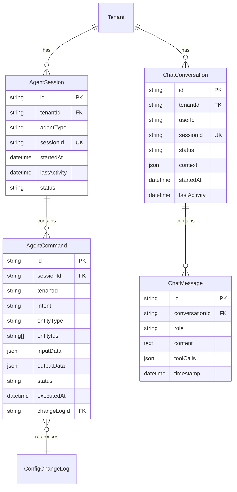

# feat: AI-Powered Storefront Configuration

## Overview

Simplify tenant storefront setup using AI agents. Two complementary approaches:

1. **Developer-Facing (Claude Code CLI)**: Chat with Claude Code to configure storefronts using natural language commands
2. **Customer-Facing (Tenant Chatbot)**: Conversational UI that guides tenants through storefront configuration

**Recommendation**: Start with Approach 1 (faster time-to-value, lower risk), then build Approach 2 using shared backend infrastructure.

---

## Problem Statement

### Current Pain Points
- Visual Editor requires manual navigation through multiple UI elements
- Bulk operations (e.g., update all package prices) require repetitive clicking
- New tenants face steep learning curve for storefront configuration
- No semantic search for finding/modifying related packages
- Power users want CLI-level efficiency for common operations

### Opportunity
- AI agents can interpret natural language commands and execute configuration changes
- Semantic naming system enables precise identification of storefront elements
- Conversational UI reduces friction for non-technical users
- Audit trails provide accountability for AI-made changes

---

## Proposed Solution

### Approach 1: Developer-Facing (Claude Code CLI) - MVP

**How it works:**
```
User: "Update all Wellness Retreat packages to use earthy green (#2d5016) as accent color"
Claude Code: [Calls MAIS API] → Updates 3 packages → Returns summary

User: "Increase prices for all Micro-Wedding packages by 15%"
Claude Code: [Calls MAIS API with dryRun=true] → Shows preview → User confirms → Executes
```

**Key Features:**
- Natural language command parsing
- Bulk operations with preview/confirmation
- Integration with existing draft/publish workflow
- Full audit trail with agent attribution
- Rollback capability for last 10 operations

### Approach 2: Customer-Facing (Tenant Chatbot) - Future

**How it works:**
```
Bot: "Welcome! Let's set up your storefront. What's your business name?"
User: "Bella Weddings"
Bot: "What type of events do you specialize in?"
User: "Intimate weddings and elopements"
Bot: "I'll create two segments: 'Intimate Weddings' and 'Romantic Elopements'. What colors represent your brand?"
User: "Soft pink and gold"
Bot: "Beautiful! Here's a preview... [shows storefront] Confirm to publish?"
```

**Key Features:**
- Conversational onboarding wizard
- Streaming responses for real-time feel
- Proactive suggestions based on analytics
- Multi-language support (English + Spanish)

---

## Technical Approach

### Architecture

```
┌─────────────────────────────────────────────────────────────────┐
│                      Client Layer                                │
├─────────────────────────────────────────────────────────────────┤
│  Claude Code CLI          │  Tenant Dashboard Chatbot Widget    │
│  (Natural language input) │  (Conversational UI)                │
└──────────────┬────────────┴───────────────┬─────────────────────┘
               │                            │
               ▼                            ▼
┌─────────────────────────────────────────────────────────────────┐
│                    Agent API Layer                               │
│  POST /v1/agent/commands    POST /v1/chatbot/conversations      │
│  GET  /v1/agent/config      POST /v1/chatbot/messages (SSE)     │
│  POST /v1/agent/rollback    GET  /v1/chatbot/suggestions        │
└──────────────┬────────────────────────────┬─────────────────────┘
               │                            │
               ▼                            ▼
┌─────────────────────────────────────────────────────────────────┐
│                    AI Agent Service                              │
│  ┌─────────────┐  ┌─────────────┐  ┌─────────────────────────┐  │
│  │ Claude      │  │ Tool        │  │ Conversation            │  │
│  │ Adapter     │  │ Executor    │  │ Memory Service          │  │
│  │ (API calls) │  │ (Actions)   │  │ (State management)      │  │
│  └─────────────┘  └─────────────┘  └─────────────────────────┘  │
└──────────────┬────────────────────────────┬─────────────────────┘
               │                            │
               ▼                            ▼
┌─────────────────────────────────────────────────────────────────┐
│                 Existing MAIS Services                           │
│  CatalogService  │  SegmentService  │  BrandingService          │
│  BookingService  │  AuditService    │  PackageDraftService      │
└─────────────────────────────────────────────────────────────────┘
```

### Semantic Naming System

Enable AI to precisely identify storefront elements:

```typescript
// Semantic identifiers for AI-driven editing
interface StorefrontElement {
  semanticId: string;        // e.g., "tenant.branding.primaryColor"
  humanName: string;         // e.g., "Primary Brand Color"
  type: 'color' | 'text' | 'image' | 'price' | 'boolean';
  path: string[];            // e.g., ["tenant", "branding", "primaryColor"]
  currentValue: unknown;
  validations: ZodSchema;
}

// Example semantic map
const STOREFRONT_ELEMENTS = {
  // Branding
  'tenant.branding.primaryColor': { humanName: 'Primary Brand Color', type: 'color' },
  'tenant.branding.secondaryColor': { humanName: 'Secondary Brand Color', type: 'color' },
  'tenant.branding.logo': { humanName: 'Logo Image', type: 'image' },
  'tenant.branding.fontFamily': { humanName: 'Font Family', type: 'text' },

  // Packages (dynamic: package.{slug}.{field})
  'package.{slug}.title': { humanName: 'Package Title', type: 'text' },
  'package.{slug}.description': { humanName: 'Package Description', type: 'text' },
  'package.{slug}.price': { humanName: 'Package Price', type: 'price' },
  'package.{slug}.active': { humanName: 'Package Active Status', type: 'boolean' },

  // Segments (dynamic: segment.{slug}.{field})
  'segment.{slug}.name': { humanName: 'Segment Name', type: 'text' },
  'segment.{slug}.heroTitle': { humanName: 'Segment Hero Title', type: 'text' },
};
```

### Tool Definitions for Claude

```typescript
// server/src/services/ai-agent.service.ts
const AGENT_TOOLS: Tool[] = [
  {
    name: 'get_storefront_config',
    description: 'Get current storefront configuration (branding, segments, packages)',
    input_schema: {
      type: 'object',
      properties: {
        include: {
          type: 'array',
          items: { type: 'string', enum: ['branding', 'segments', 'packages', 'drafts'] },
          description: 'Which configuration sections to include',
        },
      },
    },
    strict: true,
  },
  {
    name: 'update_branding',
    description: 'Update tenant branding (colors, logo, font)',
    input_schema: {
      type: 'object',
      properties: {
        primaryColor: { type: 'string', pattern: '^#[0-9A-Fa-f]{6}$' },
        secondaryColor: { type: 'string', pattern: '^#[0-9A-Fa-f]{6}$' },
        accentColor: { type: 'string', pattern: '^#[0-9A-Fa-f]{6}$' },
        backgroundColor: { type: 'string', pattern: '^#[0-9A-Fa-f]{6}$' },
        fontFamily: { type: 'string' },
      },
    },
    strict: true,
  },
  {
    name: 'bulk_update_packages',
    description: 'Update multiple packages at once',
    input_schema: {
      type: 'object',
      properties: {
        filter: {
          type: 'object',
          properties: {
            segmentSlug: { type: 'string' },
            active: { type: 'boolean' },
            priceRange: {
              type: 'object',
              properties: {
                min: { type: 'number' },
                max: { type: 'number' },
              },
            },
          },
        },
        updates: {
          type: 'object',
          properties: {
            priceMultiplier: { type: 'number', minimum: 0.1, maximum: 10 },
            priceAddition: { type: 'number' },
            descriptionPrefix: { type: 'string' },
            descriptionSuffix: { type: 'string' },
            active: { type: 'boolean' },
          },
        },
        dryRun: { type: 'boolean', default: true },
      },
      required: ['filter', 'updates'],
    },
    strict: true,
  },
  {
    name: 'publish_drafts',
    description: 'Publish all pending draft changes to live storefront',
    input_schema: {
      type: 'object',
      properties: {
        confirm: { type: 'boolean', description: 'Must be true to execute' },
      },
      required: ['confirm'],
    },
    strict: true,
  },
  {
    name: 'discard_drafts',
    description: 'Discard all pending draft changes',
    input_schema: {
      type: 'object',
      properties: {
        confirm: { type: 'boolean', description: 'Must be true to execute' },
      },
      required: ['confirm'],
    },
    strict: true,
  },
];
```

### Implementation Phases

#### Phase 1: Agent API Foundation (Week 1)

**Tasks:**
- [ ] Add `@anthropic-ai/sdk` dependency to server
- [ ] Create `ClaudeAdapter` implementing `AIAgentProvider` port
- [ ] Add `AgentSession` and `AgentCommand` Prisma models
- [ ] Create `/v1/agent/config` endpoint (read-only)
- [ ] Create `/v1/agent/commands` endpoint (execute with dryRun)
- [ ] Add agent attribution to `ConfigChangeLog`

**Files to create/modify:**
```
server/src/adapters/claude.adapter.ts          # NEW: Claude API wrapper
server/src/lib/ports.ts                        # ADD: AIAgentProvider interface
server/src/services/ai-agent.service.ts        # NEW: Agent orchestration
server/src/routes/agent.routes.ts              # NEW: Agent API endpoints
server/prisma/schema.prisma                    # ADD: AgentSession, AgentCommand
packages/contracts/src/api.agent.v1.ts         # NEW: Agent API contracts
```

#### Phase 2: Tool Execution (Week 2)

**Tasks:**
- [ ] Implement `get_storefront_config` tool
- [ ] Implement `update_branding` tool with validation
- [ ] Implement `bulk_update_packages` tool with dryRun
- [ ] Implement `publish_drafts` and `discard_drafts` tools
- [ ] Add rollback capability via `AgentCommand` history
- [ ] Add rate limiting (10 commands/minute per tenant)

**Files to create/modify:**
```
server/src/services/ai-agent.service.ts        # ADD: Tool implementations
server/src/middleware/agent-rate-limit.ts      # NEW: Rate limiting
server/test/services/ai-agent.service.test.ts  # NEW: Unit tests
```

#### Phase 3: Chatbot UI (Week 3-4) - Optional

**Tasks:**
- [ ] Add `ChatConversation` and `ChatMessage` Prisma models
- [ ] Create SSE streaming endpoint for chat responses
- [ ] Build `ChatInterface` React component with Vercel AI SDK
- [ ] Add chatbot widget to tenant dashboard
- [ ] Implement conversation memory service

**Files to create/modify:**
```
server/src/routes/chatbot.routes.ts                    # NEW: Chat endpoints
server/src/services/conversation-memory.service.ts     # NEW: State management
client/src/features/ai-agent/ChatInterface.tsx         # NEW: Chat UI
client/src/features/ai-agent/ChatWidget.tsx            # NEW: Dashboard widget
packages/contracts/src/api.chatbot.v1.ts               # NEW: Chat contracts
```

---

## Data Model Changes

### New Models

```prisma
// Agent Session Tracking
model AgentSession {
  id           String   @id @default(cuid())
  tenantId     String
  agentType    String   // 'claude_code', 'chatbot', 'api'
  sessionId    String   @unique
  startedAt    DateTime @default(now())
  lastActivity DateTime @default(now())
  status       String   // 'active', 'idle', 'closed'

  tenant       Tenant   @relation(fields: [tenantId], references: [id], onDelete: Cascade)
  commands     AgentCommand[]

  @@index([tenantId, status])
  @@map("agent_sessions")
}

// Command History (for undo/redo)
model AgentCommand {
  id          String   @id @default(cuid())
  sessionId   String
  tenantId    String
  intent      String   // 'update_branding', 'bulk_update_packages', etc.
  entityType  String   // 'Package', 'Segment', 'Tenant'
  entityIds   String[] // Affected entity IDs
  inputData   Json     // Tool input parameters
  outputData  Json?    // Tool output (for rollback)
  status      String   // 'pending', 'completed', 'failed', 'rolled_back'
  executedAt  DateTime @default(now())
  changeLogId String?  // Reference to ConfigChangeLog

  session     AgentSession @relation(fields: [sessionId], references: [id], onDelete: Cascade)

  @@index([tenantId, executedAt])
  @@index([sessionId])
  @@map("agent_commands")
}

// Chatbot Conversations (Phase 3)
model ChatConversation {
  id           String   @id @default(cuid())
  tenantId     String
  userId       String
  sessionId    String   @unique
  status       String   // 'active', 'idle', 'archived'
  context      Json     // Current conversation state
  startedAt    DateTime @default(now())
  lastActivity DateTime @default(now())

  tenant       Tenant        @relation(fields: [tenantId], references: [id], onDelete: Cascade)
  messages     ChatMessage[]

  @@index([tenantId, status])
  @@map("chat_conversations")
}

model ChatMessage {
  id             String   @id @default(cuid())
  conversationId String
  role           String   // 'user', 'assistant', 'system'
  content        String   @db.Text
  toolCalls      Json?
  timestamp      DateTime @default(now())

  conversation   ChatConversation @relation(fields: [conversationId], references: [id], onDelete: Cascade)

  @@index([conversationId, timestamp])
  @@map("chat_messages")
}
```

### Schema Updates

```prisma
// Extend ConfigChangeLog for agent attribution
model ConfigChangeLog {
  // Existing fields...
  agentId     String?  // NEW: 'claude_code', 'chatbot_v1'
  sessionId   String?  // NEW: Link to AgentSession

  @@index([tenantId, agentId])
}

// Extend Package for semantic metadata
model Package {
  // Existing fields...
  semanticTags String[] @default([])  // NEW: AI-generated tags
  lastAIUpdate DateTime?               // NEW: Track AI modifications
}
```

---

## Acceptance Criteria

### Functional Requirements

- [ ] **AC-1**: Tenant admin can authenticate via JWT and execute agent commands
- [ ] **AC-2**: Agent commands are scoped to authenticated tenant (no cross-tenant access)
- [ ] **AC-3**: `dryRun=true` returns preview without modifying data
- [ ] **AC-4**: All agent actions create audit trail with agent attribution
- [ ] **AC-5**: Rollback capability for completed commands within 24 hours
- [ ] **AC-6**: Rate limiting prevents abuse (10 commands/min per tenant)

### Non-Functional Requirements

- [ ] **AC-7**: Command execution < 5s for bulk operations (50 packages)
- [ ] **AC-8**: Error messages include actionable remediation steps
- [ ] **AC-9**: Zero data loss on partial failures (atomic transactions)
- [ ] **AC-10**: Streaming responses for chatbot < 500ms to first token

### Security Requirements

- [ ] **AC-11**: No prompt injection vulnerabilities (tool use with Zod schemas)
- [ ] **AC-12**: No secrets exposed in logs or command history
- [ ] **AC-13**: Session expiration after 30 minutes of inactivity
- [ ] **AC-14**: Destructive operations require explicit confirmation

---

## Security Considerations

### Prompt Injection Defense

```typescript
// Use XML tags to separate system prompts from user input
const buildPrompt = (userMessage: string, context: StorefrontContext) => `
<system_prompt>
You are a storefront configuration assistant for MAIS platform.
You can ONLY use the provided tools to make changes.
Never execute actions without user confirmation.
Current tenant: ${context.tenantId}
</system_prompt>

<available_tools>
${JSON.stringify(AGENT_TOOLS, null, 2)}
</available_tools>

<user_message>
${userMessage}
</user_message>
`;
```

### Permission Model

```typescript
enum AIActionCategory {
  READ_ONLY = 'read_only',        // Safe for autonomous AI
  STANDARD_WRITE = 'standard_write', // Reversible, preview required
  SENSITIVE = 'sensitive',        // Requires explicit confirmation
}

const ACTION_CATEGORIES: Record<string, AIActionCategory> = {
  'get_storefront_config': AIActionCategory.READ_ONLY,
  'update_branding': AIActionCategory.STANDARD_WRITE,
  'bulk_update_packages': AIActionCategory.STANDARD_WRITE,
  'publish_drafts': AIActionCategory.SENSITIVE,
  'discard_drafts': AIActionCategory.SENSITIVE,
};
```

### Audit Trail Requirements

Every agent action must log:
- `tenantId`: Multi-tenant isolation
- `userId`: Who initiated the command
- `agentId`: Which AI agent (`claude_code`, `chatbot_v1`)
- `sessionId`: Link to conversation/session
- `intent`: What action was attempted
- `inputData`: Tool input parameters
- `outputData`: Result (for rollback)
- `beforeSnapshot`: Entity state before change
- `afterSnapshot`: Entity state after change

---

## Success Metrics

### Phase 1 (Agent API)
- 5+ tenants using CLI weekly
- 50+ commands executed successfully
- < 5% error rate on command execution
- 0 security incidents

### Phase 2 (Chatbot)
- 80% of new tenants complete onboarding via chatbot
- 3+ conversations per tenant per month
- < 3s p90 response time
- > 90% intent recognition accuracy

---

## Dependencies & Prerequisites

### External Dependencies
- `@anthropic-ai/sdk` - Claude API client
- `ai` (Vercel AI SDK) - React hooks for streaming chat (Phase 3)

### Internal Dependencies
- Existing `AuditService` for change logging
- Existing `PackageDraftService` for draft workflow
- Existing tenant authentication middleware

### Infrastructure Requirements
- Claude API key (`ANTHROPIC_API_KEY` env var)
- Rate limiting storage (existing Redis or in-memory)

---

## Risk Analysis & Mitigation

| Risk | Likelihood | Impact | Mitigation |
|------|------------|--------|------------|
| Prompt injection attack | Medium | High | Tool use with Zod schemas, no freeform SQL |
| Claude API outage | Low | Medium | Graceful degradation to manual UI |
| Runaway API costs | Medium | Medium | Rate limiting, token budgets per request |
| Cross-tenant data leakage | Low | Critical | All queries scoped by tenantId, unit tests |
| Concurrent edit conflicts | Medium | Low | Optimistic locking, conflict detection |

---

## Future Considerations

### Extensibility
- Add more tools as features are built (booking management, analytics)
- Multi-language support for chatbot (Spanish, French)
- Voice input for mobile users
- Integration with Slack/Teams for notifications

### Long-term Vision
- Proactive AI suggestions based on analytics
- A/B testing recommendations
- Automated seasonal updates
- Competitor analysis and pricing suggestions

---

## References

### Internal
- `client/src/features/tenant-admin/visual-editor/` - Current visual editor
- `server/src/services/package-draft.service.ts` - Draft workflow
- `server/src/services/audit.service.ts` - Audit trail
- `docs/solutions/PREVENTION-STRATEGIES-INDEX.md` - Security patterns

### External
- [Anthropic Tool Use Documentation](https://docs.anthropic.com/en/docs/tool-use)
- [Vercel AI SDK](https://ai-sdk.dev/)
- [AI Agent Security Best Practices](https://workos.com/blog/securing-ai-agents)

---

## ERD: New Models



---

**Document Version**: 1.0
**Created**: 2025-12-03
**Author**: Claude (Opus 4.5)
**Status**: Draft - Pending Review
