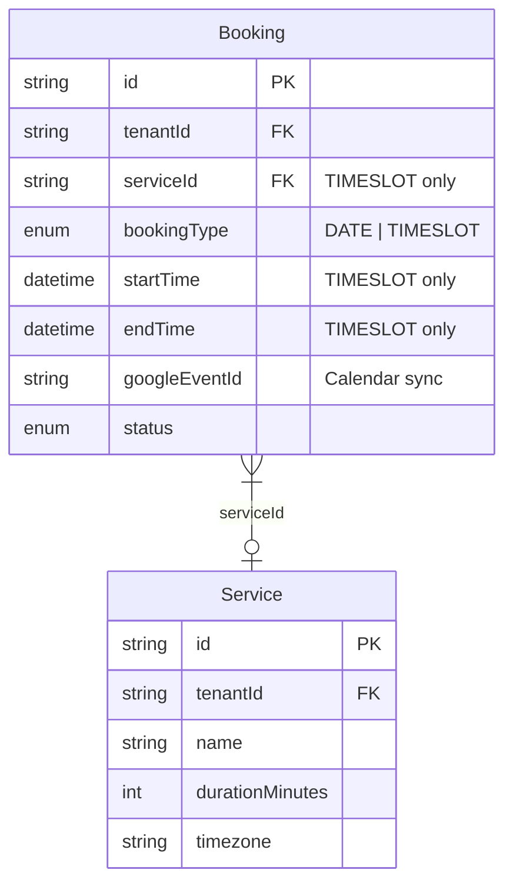

# fix: Resolve P1 Critical Issues in Scheduling Platform

## Overview

This plan addresses **6 critical (P1) issues** + **Google Calendar sync** discovered during code review of the scheduling platform feature. These issues **block merge** and must be resolved before production.

**Branch:** `feat/scheduling-platform`
**Commit:** `862a324`
**Estimated Effort:** ~6-8 hours (parallelized)

---

## Problem Statement

The scheduling platform implementation has critical gaps:

1. **Double-booking** - Customers can book the same time slot simultaneously
2. **Runtime failures** - Interface mismatches cause `TypeError` despite TypeScript compilation
3. **Security/Performance** - Loading all bookings into memory, filtering client-side
4. **Incomplete API** - Missing public booking endpoint contract
5. **UI bugs** - Wrong slot selection due to React key issues
6. **No Calendar sync** - TIMESLOT bookings don't sync to Google Calendar

---

## Execution Order (Best Practice)

```
Phase 1: Interface Fix (30 min)
    ↓
Phase 2: Database Constraint FIRST (45 min)  ← Safety net before code
    ↓
Phase 3: Conflict Detection + Calendar Sync (2 hours)
    ↓
Phase 4-6: Parallel Execution (2 hours wall-clock)
    ├── Admin Filter Optimization
    ├── API Contract
    └── React Key Fix
    ↓
Phase 7: Validation (30 min)
```

**Key insight:** Database constraint deploys BEFORE conflict detection code to prevent race conditions during rollout.

---

## Phase 1: Fix Interface Mismatch (30 minutes)

**Problem:** Local interfaces don't match `ports.ts`. DI uses `as any`.

**Files:**

- `server/src/services/scheduling-availability.service.ts`
- `server/src/di.ts`

**Changes:**

```typescript
// scheduling-availability.service.ts
// REMOVE lines 45-74 (local interface definitions)

// ADD at top:
import { ServiceRepository, AvailabilityRuleRepository } from '../lib/ports';
```

```typescript
// di.ts - REMOVE 'as any' (lines 161-162, 330-331)
// BEFORE
const schedulingAvailabilityService = new SchedulingAvailabilityService(
  serviceRepo as any,
  availabilityRuleRepo as any,
  bookingRepo
);

// AFTER
const schedulingAvailabilityService = new SchedulingAvailabilityService(
  serviceRepo,
  availabilityRuleRepo,
  bookingRepo
);
```

**Method Name Updates in service:**
| Current (Wrong) | Correct (ports.ts) |
|-----------------|-------------------|
| `findById()` | `getById()` |
| `findBySlug()` | `getBySlug()` |
| `findAll()` | `getAll()` |
| `findEffectiveRules(tenantId, serviceId, date)` | `getEffectiveRules(tenantId, date, serviceId?)` |

**Validation:** `npm run typecheck` passes without errors

---

## Phase 2: Database Constraint (45 minutes)

**Why first:** Constraint must exist BEFORE new code deploys to prevent race conditions.

**Files:**

- `server/prisma/schema.prisma`

**Pre-Migration Check (5 min):**

```sql
-- Run in production DB to verify no duplicates exist
SELECT "tenantId", "serviceId", "startTime", "endTime", COUNT(*)
FROM "Booking"
WHERE "bookingType" = 'TIMESLOT' AND "status" IN ('PENDING', 'CONFIRMED')
GROUP BY "tenantId", "serviceId", "startTime", "endTime"
HAVING COUNT(*) > 1;
-- Must return 0 rows
```

**Schema Changes:**

```prisma
model Booking {
  // ... existing fields

  // NEW: Prevent duplicate timeslot bookings
  @@unique([tenantId, serviceId, startTime, endTime])

  // NEW: Index for timeslot conflict queries
  @@index([tenantId, bookingType, startTime, status])
  @@index([tenantId, serviceId, startTime])
}
```

**Migration:**

```bash
cd server
npm exec prisma migrate dev --name add_timeslot_unique_constraint
```

**Validation:** Migration succeeds, constraint exists in DB

---

## Phase 3: Conflict Detection + Google Calendar Sync (2 hours)

### 3A: Implement findTimeslotBookings()

**Files:**

- `server/src/lib/ports.ts`
- `server/src/adapters/prisma/booking.repository.ts`
- `server/src/services/scheduling-availability.service.ts`

**Interface (ports.ts):**

```typescript
export interface BookingRepository {
  // ... existing methods

  /**
   * Find TIMESLOT bookings for conflict detection
   * Returns only PENDING/CONFIRMED bookings
   */
  findTimeslotBookings(tenantId: string, date: Date, serviceId?: string): Promise<Booking[]>;
}
```

**Implementation (booking.repository.ts):**

```typescript
async findTimeslotBookings(
  tenantId: string,
  date: Date,
  serviceId?: string
): Promise<Booking[]> {
  const startOfDay = new Date(date);
  startOfDay.setUTCHours(0, 0, 0, 0);

  const endOfDay = new Date(date);
  endOfDay.setUTCHours(23, 59, 59, 999);

  const bookings = await this.prisma.booking.findMany({
    where: {
      tenantId,
      bookingType: 'TIMESLOT',
      status: { in: ['PENDING', 'CONFIRMED'] },
      startTime: { gte: startOfDay, lte: endOfDay },
      ...(serviceId && { serviceId }),
    },
    include: {
      customer: true,
    },
    orderBy: { startTime: 'asc' },
  });

  return bookings.map(b => this.toDomainBooking(b));
}
```

**Service Update (scheduling-availability.service.ts):**

```typescript
// REPLACE the stub method (lines 392-407)
private async getTimeslotBookings(
  tenantId: string,
  date: Date
): Promise<TimeSlotBooking[]> {
  const bookings = await this.bookingRepo.findTimeslotBookings(tenantId, date);
  return bookings.map(b => ({
    id: b.id,
    serviceId: b.serviceId!,
    startTime: b.startTime!,
    endTime: b.endTime!,
    status: b.status as 'PENDING' | 'CONFIRMED',
  }));
}
```

### 3B: Google Calendar Sync for TIMESLOT Bookings

**Files:**

- `server/src/services/booking.service.ts`
- `server/src/services/google-calendar.service.ts`

**Update booking.service.ts - onAppointmentPaymentCompleted():**

```typescript
async onAppointmentPaymentCompleted(
  tenantId: string,
  sessionId: string,
  input: AppointmentCheckoutInput
): Promise<Booking> {
  // ... existing booking creation code

  const booking = await this.bookingRepo.create(tenantId, bookingData);

  // NEW: Sync to Google Calendar
  if (this.googleCalendarService) {
    try {
      const service = await this.serviceRepo.getById(tenantId, input.serviceId);
      const eventId = await this.googleCalendarService.createAppointmentEvent({
        tenantId,
        bookingId: booking.id,
        serviceName: service?.name || 'Appointment',
        clientName: input.customerName,
        clientEmail: input.customerEmail,
        startTime: booking.startTime!,
        endTime: booking.endTime!,
        timezone: service?.timezone || 'America/New_York',
        notes: input.notes,
      });

      if (eventId) {
        await this.bookingRepo.updateGoogleEventId(tenantId, booking.id, eventId);
      }
    } catch (error) {
      // Log but don't fail booking - calendar sync is best-effort
      this.logger.error({ error, bookingId: booking.id }, 'Failed to sync appointment to Google Calendar');
    }
  }

  return booking;
}
```

**Add to google-calendar.service.ts:**

```typescript
async createAppointmentEvent(params: {
  tenantId: string;
  bookingId: string;
  serviceName: string;
  clientName: string;
  clientEmail: string;
  startTime: Date;
  endTime: Date;
  timezone: string;
  notes?: string;
}): Promise<string | null> {
  const calendar = await this.getCalendarClient(params.tenantId);
  if (!calendar) return null;

  const event = await calendar.events.insert({
    calendarId: 'primary',
    requestBody: {
      summary: `${params.serviceName} - ${params.clientName}`,
      description: params.notes || `Appointment with ${params.clientName} (${params.clientEmail})`,
      start: {
        dateTime: params.startTime.toISOString(),
        timeZone: params.timezone,
      },
      end: {
        dateTime: params.endTime.toISOString(),
        timeZone: params.timezone,
      },
      attendees: [
        { email: params.clientEmail, displayName: params.clientName },
      ],
    },
  });

  return event.data.id || null;
}
```

**Validation:**

- Unit test: `findTimeslotBookings()` returns correct bookings
- Integration test: Concurrent booking attempts - one succeeds, one fails

---

## Phase 4: Admin Filter Optimization (1 hour) — PARALLEL

**Problem:** Loads all bookings into memory, filters with `as any`.

**Files:**

- `server/src/services/booking.service.ts`
- `server/src/routes/tenant-admin-scheduling.routes.ts`

**New Service Method (booking.service.ts):**

```typescript
async getTimeslotAppointments(
  tenantId: string,
  filters?: {
    status?: string;
    serviceId?: string;
    startDate?: Date;
    endDate?: Date;
  }
): Promise<Booking[]> {
  return this.bookingRepo.findMany({
    where: {
      tenantId,
      bookingType: 'TIMESLOT',
      ...(filters?.status && { status: filters.status }),
      ...(filters?.serviceId && { serviceId: filters.serviceId }),
      ...(filters?.startDate && { startTime: { gte: filters.startDate } }),
      ...(filters?.endDate && { startTime: { lte: filters.endDate } }),
    },
    orderBy: { startTime: 'asc' },
  });
}
```

**Route Update (tenant-admin-scheduling.routes.ts):**

```typescript
// REPLACE lines 498-501
// BEFORE
let bookings = await bookingService.getAllBookings(tenantId);
bookings = bookings.filter((b: any) => b.bookingType === 'TIMESLOT');

// AFTER
const appointments = await bookingService.getTimeslotAppointments(tenantId, {
  status: req.query.status as string | undefined,
  serviceId: req.query.serviceId as string | undefined,
  startDate: req.query.startDate ? new Date(req.query.startDate as string) : undefined,
  endDate: req.query.endDate ? new Date(req.query.endDate as string) : undefined,
});
```

---

## Phase 5: API Contract (1 hour) — PARALLEL

**Problem:** Public checkout uses raw fetch, no type safety.

**Files:**

- `packages/contracts/src/dto.ts`
- `packages/contracts/src/api.v1.ts`
- `client/src/features/scheduling/AppointmentBookingFlow.tsx`

**DTO Schema (dto.ts):**

```typescript
export const CreateAppointmentCheckoutDtoSchema = z.object({
  serviceId: z.string().min(1),
  date: z.string().regex(/^\d{4}-\d{2}-\d{2}$/),
  startTime: z.string().datetime(),
  endTime: z.string().datetime(),
  customerName: z.string().min(1).max(100),
  customerEmail: z.string().email(),
  customerPhone: z.string().optional(),
  notes: z.string().max(1000).optional(),
});

export const AppointmentCheckoutResponseSchema = z.object({
  checkoutUrl: z.string().url(),
  sessionId: z.string(),
});

export type CreateAppointmentCheckoutDto = z.infer<typeof CreateAppointmentCheckoutDtoSchema>;
```

**Contract (api.v1.ts):**

```typescript
createAppointmentCheckout: {
  method: 'POST',
  path: '/v1/public/appointments/checkout',
  body: CreateAppointmentCheckoutDtoSchema,
  responses: {
    201: AppointmentCheckoutResponseSchema,
    400: BadRequestErrorSchema,
    401: UnauthorizedErrorSchema,
    404: NotFoundErrorSchema,
    409: z.object({
      error: z.string(),
      code: z.literal('SLOT_UNAVAILABLE')
    }),
    500: InternalServerErrorSchema,
  },
  summary: 'Create checkout session for appointment booking',
},
```

**Frontend Update (AppointmentBookingFlow.tsx):**

```typescript
// REPLACE raw fetch (lines 120-154)
const result = await api.createAppointmentCheckout({
  body: {
    serviceId: selectedService.id,
    date: selectedDate,
    startTime: selectedSlot.startTime,
    endTime: selectedSlot.endTime,
    customerName: customerInfo.name,
    customerEmail: customerInfo.email,
    customerPhone: customerInfo.phone,
    notes: customerInfo.notes,
  },
});

if (result.status === 201) {
  window.location.href = result.body.checkoutUrl;
} else if (result.status === 409) {
  setError('This time slot is no longer available. Please select another.');
} else {
  setError('Failed to create booking. Please try again.');
}
```

---

## Phase 6: React Key Fix (15 minutes) — PARALLEL

**Problem:** Using array index as key causes wrong slot selection.

**File:** `client/src/features/scheduling/TimeSlotPicker.tsx`

**Change (line 159):**

```typescript
// BEFORE
{data.slots.map((slot: TimeSlotDto, index: number) => {
  return (
    <button key={index} ...>

// AFTER
{data.slots.map((slot: TimeSlotDto) => {
  return (
    <button key={`${slot.serviceId}-${slot.startTime}`} ...>
```

---

## Phase 7: Validation (30 minutes)

### Test Suite

```bash
npm test                    # All 606+ tests pass
npm run typecheck           # No errors, no 'as any'
npm run test:e2e            # E2E booking flow works
```

### Concurrent Booking Test

```typescript
// Add to test/integration/booking.service.test.ts
test('Concurrent booking attempts - one succeeds, one fails', async () => {
  const slot = {
    serviceId: 'service_1',
    startTime: new Date('2025-12-15T14:00:00Z'),
    endTime: new Date('2025-12-15T14:30:00Z'),
  };

  // Fire both requests simultaneously
  const [result1, result2] = await Promise.all([
    bookingService.createAppointmentCheckout(tenantId, { ...slot, customerEmail: 'a@test.com' }),
    bookingService.createAppointmentCheckout(tenantId, { ...slot, customerEmail: 'b@test.com' }),
  ]);

  // One succeeds, one fails
  const statuses = [result1.status, result2.status].sort();
  expect(statuses).toEqual([201, 409]);

  // Database has exactly 1 booking
  const bookings = await bookingRepo.findTimeslotBookings(tenantId, slot.startTime);
  expect(bookings).toHaveLength(1);
});
```

### Performance Check

```typescript
test('Availability query < 50ms with 1000 bookings', async () => {
  await seedBookings(tenantId, 1000);

  const start = performance.now();
  await availabilityService.getAvailableSlots({
    tenantId,
    serviceId: 'service_1',
    date: new Date('2025-12-15'),
  });
  const duration = performance.now() - start;

  expect(duration).toBeLessThan(50);
});
```

---

## Acceptance Criteria

### Functional

- [ ] `getAvailableSlots()` excludes slots with existing PENDING/CONFIRMED bookings
- [ ] Two concurrent booking attempts for same slot - one succeeds (201), one fails (409)
- [ ] Admin appointments endpoint queries DB directly (no in-memory filter)
- [ ] Public checkout uses type-safe contract client
- [ ] TimeSlotPicker maintains correct selection after slot list refresh
- [ ] TIMESLOT bookings sync to Google Calendar

### Non-Functional

- [ ] TypeScript compiles without `as any` in DI or routes
- [ ] Availability check < 50ms with 1000 bookings
- [ ] Admin appointments list < 100ms with 10,000 bookings

### Quality Gates

- [ ] All 606+ existing tests pass
- [ ] New concurrent booking test passes
- [ ] `npm run typecheck` passes
- [ ] Code review approved

---

## Files Changed Summary

| File                                                        | Change                                       | Phase |
| ----------------------------------------------------------- | -------------------------------------------- | ----- |
| `server/src/services/scheduling-availability.service.ts`    | Remove local interfaces, update method calls | 1, 3  |
| `server/src/di.ts`                                          | Remove `as any`                              | 1     |
| `server/prisma/schema.prisma`                               | Add constraint + indexes                     | 2     |
| `server/src/lib/ports.ts`                                   | Add `findTimeslotBookings`                   | 3     |
| `server/src/adapters/prisma/booking.repository.ts`          | Implement method                             | 3     |
| `server/src/services/booking.service.ts`                    | Add calendar sync + appointments method      | 3, 4  |
| `server/src/services/google-calendar.service.ts`            | Add appointment event method                 | 3     |
| `server/src/routes/tenant-admin-scheduling.routes.ts`       | Use new service method                       | 4     |
| `packages/contracts/src/dto.ts`                             | Add checkout DTOs                            | 5     |
| `packages/contracts/src/api.v1.ts`                          | Add checkout contract                        | 5     |
| `client/src/features/scheduling/AppointmentBookingFlow.tsx` | Use contract client                          | 5     |
| `client/src/features/scheduling/TimeSlotPicker.tsx`         | Fix React key                                | 6     |

---

## Timeline

| Phase     | Task                          | Time                    | Parallel? |
| --------- | ----------------------------- | ----------------------- | --------- |
| 1         | Interface fix                 | 30 min                  | No        |
| 2         | DB constraint                 | 45 min                  | No        |
| 3         | Conflict detection + Calendar | 2 hours                 | No        |
| 4         | Admin filter                  | 1 hour                  | Yes       |
| 5         | API contract                  | 1 hour                  | Yes       |
| 6         | React key                     | 15 min                  | Yes       |
| 7         | Validation                    | 30 min                  | No        |
| **Total** |                               | **~6 hours wall-clock** |           |

---

## ERD: Booking Model



---

_Plan updated: 2025-11-28_
_Reviewers: DHH-style, Kieran-style, Simplicity_
_Includes: Google Calendar sync, reordered phases, concurrent booking test_
