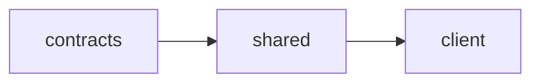

# Vercel Build Quick Reference Card

**Print this page and keep it handy during deployments**

---

## Pre-Deployment Checklist (2 minutes)

```bash
# 1. Run verification script
npm run verify-build

# 2. If verification passes, deploy
vercel --prod
```

---

## Emergency Build Failure Response

**Symptom:** "Cannot resolve @macon/contracts" or "dist/index.js not found"

**Quick Fix:**

1. Check build scripts have `--force`:

   ```bash
   grep '"build"' packages/*/package.json
   # Should see: "build": "tsc -b --force"
   ```

2. Check Vite config points to `.js` files:

   ```bash
   grep 'alias:' client/vite.config.ts
   # Should see: ../packages/contracts/dist/index.js
   ```

3. Manually clean and rebuild:
   ```bash
   rm -rf packages/*/dist client/dist
   npm run build --workspace=@macon/contracts
   npm run build --workspace=@macon/shared
   npm run build --workspace=@macon/web
   ```

---

## Critical File Patterns

### ✅ CORRECT Build Script

```json
// packages/contracts/package.json
{
  "scripts": {
    "build": "tsc -b --force" // ← --force is critical
  }
}
```

### ✅ CORRECT Vite Alias

```typescript
// client/vite.config.ts
{
  alias: {
    "@macon/contracts": path.resolve(__dirname, "../packages/contracts/dist/index.js"),
    //                                                                    ^^^^^^^^^ ← .js extension
  }
}
```

### ✅ CORRECT Vercel Config

```json
// vercel.json
{
  "buildCommand": "npm run build --workspace=@macon/contracts && npm run build --workspace=@macon/shared && npm run build --workspace=@macon/web",
  "outputDirectory": "client/dist"
}
```

---

## Build Sequence (Must be in this order)



**Command:**

```bash
npm run build --workspace=@macon/contracts && \
npm run build --workspace=@macon/shared && \
npm run build --workspace=@macon/web
```

---

## Verification Commands

```bash
# Verify dist folders exist
ls packages/contracts/dist/index.js
ls packages/shared/dist/index.js
ls client/dist/index.html

# Verify build scripts
grep --force packages/*/package.json

# Verify Vite config
grep '@macon/contracts' client/vite.config.ts

# Full verification
npm run verify-build
```

---

## Common Mistakes

| ❌ WRONG                                           | ✅ CORRECT                                                  |
| -------------------------------------------------- | ----------------------------------------------------------- |
| `"build": "tsc -b"`                                | `"build": "tsc -b --force"`                                 |
| `"@macon/contracts": "../packages/contracts/dist"` | `"@macon/contracts": "../packages/contracts/dist/index.js"` |
| `"outputDirectory": "dist"`                        | `"outputDirectory": "client/dist"`                          |
| Build in parallel                                  | Build sequentially (contracts → shared → client)            |

---

## When to Disable Vercel Cache

**ONLY if:**

- Experiencing persistent build failures after code changes
- Just upgraded major dependencies (TypeScript, Vite, etc.)
- Debugging incremental compilation issues

**How:**

1. Vercel Dashboard → Project Settings → Build & Development
2. Uncheck "Use Build Cache"
3. Re-enable after issue resolved

---

## Emergency Contacts

**Documentation:**

- Full guide: `/docs/deployment/VERCEL_BUILD_PREVENTION_GUIDE.md`
- Deployment checklist: `/docs/deployment/PRODUCTION_DEPLOYMENT_CHECKLIST.md`

**Key Files:**

- `/vercel.json` - Vercel configuration
- `/client/vite.config.ts` - Vite aliases
- `/packages/contracts/package.json` - Build scripts
- `/scripts/verify-build.sh` - Verification script

---

## Success Indicators

After `npm run verify-build`, you should see:

```
✅ All verification checks passed!

Build outputs verified:
   - packages/contracts/dist/index.js
   - packages/shared/dist/index.js
   - client/dist/index.html
```

**If you see all green checkmarks, it's safe to deploy.**

---

**Last Updated:** November 26, 2025
**Version:** 1.0
