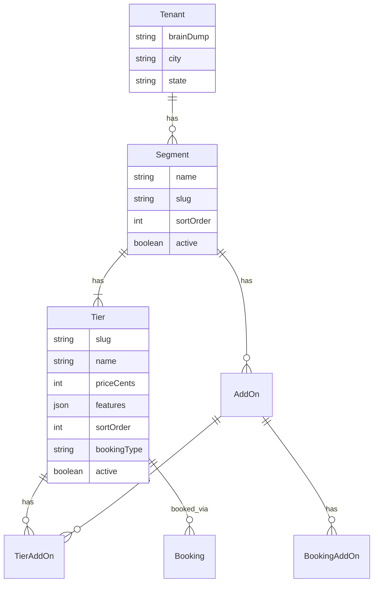

# feat: Onboarding Conversation Redesign

## Overview

Replace the deterministic 15-question slot machine onboarding with an LLM-driven adaptive conversation that acts like a business mentor sitting with the tenant over coffee. This is a foundational redesign touching the data model, agent system, signup flow, and frontend.

**Design spec:** `docs/architecture/ONBOARDING_CONVERSATION_DESIGN.md`
**Full brainstorm:** `docs/brainstorms/2026-02-11-onboarding-conversation-redesign-brainstorm.md`

## Problem Statement / Motivation

The current slot machine forces every tenant through 15 fixed questions in a rigid order. This creates a poor experience:

- **Experienced users** (who already know their pricing, segments, and clients) get asked redundant questions
- **New users** get overwhelmed by questions they can't answer yet (pricing, target market) without context
- **All users** experience an unnatural, robotic flow that doesn't adapt to what they've already shared
- **Package model confusion** — Packages are the bookable entity but don't map to how service businesses actually think (segments → tiers)
- **Research waste** — Auto-fires $0.03-0.10 research at signup even when unnecessary

The new system captures a "brain dump" at signup, lets the LLM read it, and adapts the conversation — fast-tracking experienced users and mentoring new ones.

## Proposed Solution

### Core Changes (8 Workstreams)

| #   | Change                          | Summary                                                      |
| --- | ------------------------------- | ------------------------------------------------------------ |
| 1   | Signup form                     | Add city/state + freetext brain dump textarea                |
| 2   | Delete slot machine             | Remove `slot-machine.ts` + all 32 file references            |
| 3   | Promote Tier, deprecate Package | Tier becomes bookable entity. Package model sunset.          |
| 4   | Research → on-demand            | Remove auto-fire. Trigger only when tenant asks.             |
| 5   | New agent tools                 | `manage_segments`, `manage_tiers`, `manage_addons`           |
| 6   | Rewrite system prompt           | LLM-driven conversation, brain dump processing               |
| 7   | Two-phase onboarding            | Phase 1: MVP sprint → reveal. Phase 2: enhancement           |
| 8   | Lightweight state tracker       | Minimal "what's done, what's missing" for session continuity |

### Data Model

```
Segment (who you serve)         →  "Weddings", "Portraits", "Individual Therapy"
  └─ Tier (how they buy)        →  3 pricing options per segment (bookable)
      └─ AddOn (extras)         →  "Second Photographer", "Rush Editing"
```

### Key Decisions (from brainstorm)

| #   | Decision                | Choice                                 | Rationale                                                                                                                                                                                                             |
| --- | ----------------------- | -------------------------------------- | --------------------------------------------------------------------------------------------------------------------------------------------------------------------------------------------------------------------- |
| 1   | TierLevel enum          | **Replace with sortOrder**             | Current GOOD/BETTER/BEST doesn't fit all businesses (duration-based, count-based pricing). Use `sortOrder: 1,2,3` with `@@unique([segmentId, sortOrder])`                                                             |
| 2   | Max segments            | **5 per tenant**                       | Prevents scope creep. MVP = 1. Phase 2 adds up to 4 more.                                                                                                                                                             |
| 3   | Session continuity      | **DB-backed state**                    | Brain dump + discovery facts + section content persisted in DB. LLM reads current state each session via bootstrap.                                                                                                   |
| 4   | Package deprecation     | **Soft delete → hard delete**          | Phase 1 adds `tierId` to Booking (nullable). Phase 7 migrates data + deletes Package model.                                                                                                                           |
| 5   | Testimonial intake      | **Phase 2 enhancement**                | Agent asks "Got any client reviews?" → stores as TESTIMONIALS section content                                                                                                                                         |
| 6   | Reveal trigger          | **Deterministic**                      | MVP sections (HERO + ABOUT + SERVICES) with non-placeholder content → reveal. Backend validates, not LLM.                                                                                                             |
| 7   | Onboarding phases       | **Simplify to 4**                      | NOT_STARTED / BUILDING / COMPLETED / SKIPPED. Remove DISCOVERY/MARKET_RESEARCH/SERVICES/MARKETING phases.                                                                                                             |
| 8   | Tier price unit         | **Cents (Int), not Dollars (Decimal)** | Booking.totalPrice, Payment.amount, BookingAddOn.unitPrice are all Int (cents). Tier.priceCents stays consistent — no cents↔dollars conversion at service boundaries. Current schema's Decimal(10,2) was a mismatch. |
| 9   | Migration join strategy | **sourcePackageId, not slug**          | Slugs are mutable. Add temporary `sourcePackageId` column to Tier during migration for guaranteed data integrity. Drop after migration.                                                                               |

## Technical Approach

### Architecture



### Implementation Phases

---

#### Phase 1: Additive Schema Changes (Non-Breaking)

**Goal:** Add new fields and relations without breaking anything. Package model stays.

**Prisma Schema Changes:**

```prisma
// === Tenant: Add brain dump + location fields + Tier relation ===
model Tenant {
  // ... existing fields ...
  brainDump String? @db.Text  // Freetext "who are you, what do you do"
  city      String?           // City from signup form
  state     String?           // State from signup form
  tiers     Tier[]            // ⚠️ Required: Prisma needs both sides of the Tier→Tenant relation
}

// === Tier: Promote to bookable entity ===
model Tier {
  id        String  @id @default(cuid())
  tenantId  String  // Direct tenant ref for isolation queries
  segmentId String
  segment   Segment @relation(fields: [segmentId], references: [id], onDelete: Cascade)
  tenant    Tenant  @relation(fields: [tenantId], references: [id], onDelete: Cascade)

  // Replace TierLevel enum with flexible sortOrder
  sortOrder   Int       // 1, 2, 3 (display order within segment)
  slug        String    // URL-safe name for booking routes
  name        String    // Display name: "Essential", "Signature", "Premier"
  description String?   @db.Text
  priceCents  Int       // Price in cents (consistent with Booking.totalPrice, Payment.amount)
  currency    String    @default("USD")
  features    Json      // Array of TierFeature objects

  // Booking integration
  bookingType     BookingType @default(DATE)
  durationMinutes Int?
  depositPercent  Int?        @default(0)
  active          Boolean     @default(true)

  // Photo gallery (migrated from Package)
  photos Json @default("[]") // [{url, filename, size, order}]

  // Relations
  addOns   TierAddOn[]
  bookings Booking[]

  createdAt DateTime @default(now())
  updatedAt DateTime @updatedAt

  @@unique([segmentId, sortOrder])
  @@unique([tenantId, slug])
  @@index([tenantId, active])
  @@index([segmentId])
}

// === New join table: TierAddOn ===
model TierAddOn {
  tierId  String
  addOnId String
  tier    Tier  @relation(fields: [tierId], references: [id], onDelete: Cascade)
  addOn   AddOn @relation(fields: [addOnId], references: [id], onDelete: Cascade)

  @@id([tierId, addOnId])
  @@index([tierId])
  @@index([addOnId])
}

// === Booking: Add tierId (nullable during transition) ===
model Booking {
  // ... existing fields ...
  tierId String?  // New: nullable during Package→Tier transition
  tier   Tier?    @relation(fields: [tierId], references: [id], onDelete: Restrict)
  // ⚠️ onDelete: Restrict — prevents deleting a Tier that has bookings (matches BookingAddOn→AddOn pattern)
}

// === AddOn: Add TierAddOn relation ===
model AddOn {
  // ... existing fields ...
  tiers TierAddOn[]  // New relation
}
```

**Migration:** `npx prisma migrate dev --create-only --name add_tier_booking_brain_dump`

> ⚠️ **Existing Tier data migration required.** Current Tier rows (created by tenant provisioning) have `level TierLevel` (GOOD/BETTER/BEST), `price Decimal(10,2)`, no `tenantId`, no `slug`, no `bookingType`, no `active` flag. The migration must:
>
> 1. Add new columns as **nullable** first: `tenantId String?`, `slug String?`, `sortOrder Int?`, `bookingType`, `active`, `photos`
> 2. Backfill from existing data:
>    ```sql
>    -- Backfill tenantId from parent Segment
>    UPDATE "Tier" t SET "tenantId" = s."tenantId" FROM "Segment" s WHERE t."segmentId" = s.id;
>    -- Convert TierLevel → sortOrder
>    UPDATE "Tier" SET "sortOrder" = CASE level WHEN 'GOOD' THEN 1 WHEN 'BETTER' THEN 2 WHEN 'BEST' THEN 3 END;
>    -- Generate slug from name
>    UPDATE "Tier" SET slug = LOWER(REGEXP_REPLACE(name, '[^a-zA-Z0-9]+', '-', 'g'));
>    -- Convert Decimal price → Int cents
>    UPDATE "Tier" SET "priceCents" = ROUND(price * 100)::INT;
>    -- Set defaults
>    UPDATE "Tier" SET "bookingType" = 'DATE', active = true, photos = '[]'::jsonb WHERE "bookingType" IS NULL;
>    ```
> 3. Make columns non-nullable: `ALTER TABLE "Tier" ALTER COLUMN "tenantId" SET NOT NULL` etc.
> 4. Drop old columns: `level`, `price`
> 5. Drop old unique constraint `[segmentId, level]`, add new `[segmentId, sortOrder]`
> 6. Validate: `SELECT id, "priceCents" FROM "Tier" WHERE "priceCents" != ROUND(price * 100)` (before dropping `price`)

**Files to modify:**

- `server/prisma/schema.prisma` — Schema changes above
- `packages/contracts/src/schemas/tier.schema.ts` — Update TierSchema (remove TierLevel, add sortOrder/slug/bookingType/active)
- `packages/contracts/src/dto.ts` — Add TierDto with new fields
- No deletions yet — Package model remains functional

**Acceptance Criteria:**

- [x] Migration runs cleanly on dev database
- [x] Tier model has: tenantId, sortOrder, slug, bookingType, active fields
- [x] TierAddOn join table created
- [x] Booking has nullable tierId field
- [x] Tenant has brainDump, city, state fields
- [x] TierLevel enum removed, replaced with sortOrder
- [x] Existing Tier data migrated (level GOOD→1, BETTER→2, BEST→3)
- [x] Tier.priceCents is Int (cents), matching Booking.totalPrice/Payment.amount convention
- [x] Booking→Tier uses `onDelete: Restrict` (prevents deleting tiers with bookings)
- [x] `prisma validate` passes
- [x] Both workspace typechecks pass

---

#### Phase 2: Signup Form + Auth Backend

**Goal:** Capture brain dump, city, and state at registration.

**Frontend — `apps/web/src/app/signup/page.tsx`:**

```tsx
// Add to form state:
const [city, setCity] = useState('');
const [state, setState] = useState('');
const [brainDump, setBrainDump] = useState('');

// Add to form UI (after business name, before email):
<div className="flex gap-3">
  <Input label="City" value={city} onChange={setCity} placeholder="Austin" />
  <Select label="State" value={state} onChange={setState} options={US_STATES} />
</div>
<Textarea
  label="Tell us about your business"
  value={brainDump}
  onChange={setBrainDump}
  placeholder="Who are you? What do you do, and who do you do it for? The more you share, the better we can help."
  rows={4}
/>
```

**Backend — `server/src/routes/auth.routes.ts`:**

```typescript
// Update signup endpoint to accept new fields
const signupBody = z.object({
  email: z.string().email(),
  password: z.string().min(8),
  businessName: z.string().min(1),
  city: z.string().optional(),
  state: z.string().optional(),
  brainDump: z.string().optional(),
});

// Pass to TenantProvisioningService
await provisioningService.createTenant({
  ...existing,
  city: body.city,
  state: body.state,
  brainDump: body.brainDump,
});
```

**Files to modify:**

- `apps/web/src/app/signup/page.tsx` — Add city, state, brainDump fields
- `server/src/routes/auth.routes.ts` — Accept new fields in signup body
- `server/src/services/tenant-provisioning.service.ts` — Store new fields on Tenant
- `packages/contracts/src/dto.ts` — Update SignupDto

**Acceptance Criteria:**

- [x] Signup form shows city, state, brain dump fields
- [x] Fields are optional (don't block registration)
- [x] Brain dump textarea has helpful placeholder text
- [x] Backend stores all three fields on Tenant record
- [x] State uses dropdown with US states (+ "Other" for international)
- [x] Brain dump max length: 2000 characters (prevent abuse)
- [ ] E2E test: signup with brain dump → verify stored on tenant (deferred to Phase 9)

---

#### Phase 3: Delete Slot Machine + New State Tracker

> ⚠️ **ATOMIC DEPLOYMENT: Phases 3, 4, and 5 must deploy together as a single release.** Phase 3 deletes the slot machine, Phase 4 creates replacement tools, Phase 5 rewrites the prompt. Deploying Phase 3 alone leaves the agent in a broken state (no slot machine AND no replacement tools). Implement as separate PRs for review clarity, but merge and deploy all three simultaneously.

**Goal:** Remove the deterministic state engine. Replace with lightweight tracking.

**Delete completely:**

- `server/src/lib/slot-machine.ts` (340 lines)
- `server/test/lib/slot-machine.test.ts`
- `server/src/lib/slot-machine.test.ts`

**Update `server/src/services/discovery.service.ts`:**

Remove `computeSlotMachine()` call from `storeFact()`. Replace with:

```typescript
// Lightweight state computation (replaces slot machine)
async storeFact(tenantId: string, key: string, value: unknown): Promise<StoreFactResult> {
  // ... existing read-modify-write on branding.discoveryFacts ...

  // NEW: Simple state check (no slot machine)
  const state = this.computeOnboardingState(knownFactKeys, tenant);

  return {
    stored: true,
    key,
    value,
    totalFactsKnown: knownFactKeys.length,
    knownFactKeys,
    currentPhase: state.phase,
    readyForReveal: state.readyForReveal,
    missingForMVP: state.missingForMVP,
    message: `Stored ${key}. Known: ${knownFactKeys.join(', ')}`,
  };
}

// Minimal deterministic checks (what remains from slot machine)
private computeOnboardingState(factKeys: string[], tenant: Tenant) {
  const hasBrainDump = !!tenant.brainDump;
  const hasSegment = factKeys.includes('primarySegment');
  const hasTiers = factKeys.includes('tiersConfigured');

  // MVP readiness = at least one segment + tiers configured
  // + HERO/ABOUT/SERVICES sections have non-placeholder content
  // (Section content checked separately via SectionContentService)

  return {
    phase: tenant.onboardingPhase,
    readyForReveal: hasSegment && hasTiers,
    missingForMVP: [
      !hasSegment && 'primarySegment',
      !hasTiers && 'tiersConfigured',
    ].filter(Boolean),
  };
}
```

**Remove auto-fire research from `storeFact()`:**

```typescript
// DELETE these lines from storeFact():
// const shouldTriggerResearch = hasBusinessType && hasLocation && !alreadyTriggered;
// if (shouldTriggerResearch) { this.researchService.triggerAsync(...) }
```

**Update `server/src/services/context-builder.service.ts`:**

Remove `import { computeSectionReadiness } from '../lib/slot-machine'`. Replace section readiness computation with a simple check against `SectionContentService.isPlaceholderContent()`.

**Update `packages/contracts/src/schemas/section-blueprint.schema.ts`:**

- Remove `DISCOVERY_FACT_KEYS` (15 fixed keys) — replace with flexible key set
- Keep `MVP_REVEAL_SECTION_TYPES` (HERO, ABOUT, SERVICES) — reveal trigger stays deterministic
- Remove `computeSectionReadiness()` export
- Keep `SECTION_BLUEPRINT` structure (sections still have types and ordering)

**Simplify OnboardingPhase enum (two-step approach):**

> ⚠️ **PostgreSQL cannot remove enum values with ALTER TYPE.** Phase 3 only ADDS `BUILDING`. The old values (DISCOVERY, MARKET_RESEARCH, SERVICES, MARKETING) stay until Phase 7 migrates data and recreates the enum.

Step 1 (Phase 3): Add BUILDING value only:

```sql
ALTER TYPE "OnboardingPhase" ADD VALUE 'BUILDING';
```

Step 2 (Phase 7): After data migration resets intermediate phases → recreate enum without old values:

```sql
-- Create new enum, update column, drop old enum (see Phase 7 migration)
```

Target enum (achieved after Phase 7):

```prisma
enum OnboardingPhase {
  NOT_STARTED
  BUILDING    // Replaces DISCOVERY/MARKET_RESEARCH/SERVICES/MARKETING
  COMPLETED
  SKIPPED
}
```

**Files to modify:**

- `server/src/lib/slot-machine.ts` — **DELETE**
- `server/test/lib/slot-machine.test.ts` — **DELETE**
- `server/src/lib/slot-machine.test.ts` — **DELETE**
- `server/src/services/discovery.service.ts` — Remove slot machine import + computeSlotMachine call. Remove auto-fire research. Add lightweight state check.
- `server/src/services/context-builder.service.ts` — Remove slot machine import + section readiness from slot machine. Simplify bootstrap data.
- `packages/contracts/src/schemas/section-blueprint.schema.ts` — Remove DISCOVERY_FACT_KEYS, remove computeSectionReadiness
- `server/prisma/schema.prisma` — Simplify OnboardingPhase enum
- `server/src/agent-v2/deploy/tenant/src/constants/shared.ts` — Update synced constants (remove fact keys)
- `server/src/agent-v2/deploy/tenant/src/constants/discovery-facts.ts` — Remove fixed fact key enum
- `packages/contracts/src/schemas/onboarding.schema.ts` — ⚠️ ~550 lines of phase-aware discriminated unions, event types (DISCOVERY_STARTED, etc.), and command schemas must be simplified to match new 4-value enum. Major refactor.
- All files importing from `slot-machine.ts` (grep to find remaining refs)

> ⚠️ **context-builder.service.ts has two Package/slot-machine dependencies** that break in this phase:
>
> 1. `import { computeSectionReadiness } from '../lib/slot-machine'` (line 19) — replace with SectionContentService check
> 2. `hasNonSeedPackages()` queries `prisma.package.count()` (lines 529-533) — replace with tier count check

**Migration:** `npx prisma migrate dev --name simplify_onboarding_phase`

**Acceptance Criteria:**

- [x] `slot-machine.ts` deleted, no file references remain
- [x] `storeFact()` works without slot machine (stores fact, returns state)
- [x] Auto-fire research removed from `storeFact()`
- [x] OnboardingPhase: BUILDING added (step 1 of 2; old values stay until Phase 7 recreates enum)
- [x] ContextBuilder provides bootstrap data without slot machine
- [x] Clean typecheck: `rm -rf server/dist && npm run --workspace=server typecheck && npm run --workspace=apps/web typecheck`
- [x] Existing unit tests updated or deleted (slot machine tests removed, discovery tests rewritten)

---

#### Phase 4: New Agent Tools (Cloud Run)

**Goal:** Replace `manage_packages` with segment/tier/addon tools. Update discovery tools.

##### 4a. Backend API Endpoints

**New routes in `server/src/routes/internal-agent-content-generation.routes.ts`:**

```typescript
// POST /content-generation/manage-segments
// Actions: list, create, update, delete
// Body: { action, segmentId?, name?, slug?, ... }

// POST /content-generation/manage-tiers
// Actions: list, create, update, delete
// Body: { action, tierId?, segmentId?, name?, priceCents?, features?, sortOrder?, ... }

// POST /content-generation/manage-addons
// Actions: list, create, update, delete
// Body: { action, addOnId?, segmentId?, name?, priceCents?, ... }
```

**New services (extract from route handlers per project pattern):**

- `server/src/services/segment.service.ts` — Already exists, extend with agent-facing CRUD
- `server/src/services/tier.service.ts` — **NEW** — Tier CRUD with validation (max 3 per segment default, customizable)
- Keep `server/src/services/catalog.service.ts` — Update to work with Tiers

##### 4b. Agent Tools (Cloud Run tenant-agent)

**New tool: `manage_segments`**

- `server/src/agent-v2/deploy/tenant/src/tools/segments.ts`
- Actions: list, create, update, delete (T3)
- Schema: flat `z.object()` with runtime switch validation (ADK pattern)
- Returns full state: `{ segment, totalSegments, maxSegments: 5 }`

**New tool: `manage_tiers`**

- `server/src/agent-v2/deploy/tenant/src/tools/tiers.ts`
- Actions: list, create, update, delete (T3)
- Enforces: max 5 tiers per segment (configurable), unique sortOrder per segment
- ⚠️ **Tool accepts `priceInDollars` (NOT priceCents)** — LLMs are unreliable at arithmetic. Handler converts: `const priceCents = Math.round(params.priceInDollars * 100)` (matches current `manage_packages` pattern at `packages.ts:251`). Add sanity bounds: `if (priceCents < 100 || priceCents > 5000000) return { error: 'Price out of range' }`
- Returns: `{ tier, segment, totalTiers, pricingHint }`

**New tool: `manage_addons`**

- `server/src/agent-v2/deploy/tenant/src/tools/addons.ts`
- Actions: list, create, update, delete (T3)
- Segment-scoped or global (null segmentId)
- Returns: `{ addon, segment?, totalAddons }`

**Update existing tools:**

| Tool                                    | Change                                                                                                                                                                                                                                                                                                                                                     |
| --------------------------------------- | ---------------------------------------------------------------------------------------------------------------------------------------------------------------------------------------------------------------------------------------------------------------------------------------------------------------------------------------------------------- |
| `discovery.ts` (`store_discovery_fact`) | Remove slot machine nextAction. Return structured `StoreFactResponse`: `{ stored, key, totalFactsKnown, knownFactKeys, currentPhase, mvpReadiness: { hasSegment, hasTiers, mvpSectionsReady (from SectionContentService.isPlaceholderContent), missingItems[] } }`. This contract replaces the slot machine's `nextAction` as the agent's progress signal. |
| `discovery.ts` (`get_known_facts`)      | No slot machine metrics in response                                                                                                                                                                                                                                                                                                                        |
| `first-draft.ts` (`build_first_draft`)  | Replace seed package cleanup with seed tier check. Update instructions for tier-based workflow.                                                                                                                                                                                                                                                            |
| `research.ts` (`delegate_to_research`)  | Update description: "Call when tenant asks about pricing or is stuck" (not auto-triggered)                                                                                                                                                                                                                                                                 |
| `packages.ts` (`manage_packages`)       | **DELETE** — replaced by `manage_tiers`                                                                                                                                                                                                                                                                                                                    |
| `index.ts`                              | Remove `manage_packages`, add `manage_segments`, `manage_tiers`, `manage_addons`                                                                                                                                                                                                                                                                           |
| `agent.ts`                              | Update tool list and trust tier assignments                                                                                                                                                                                                                                                                                                                |

**Constants sync:**

- Update `server/src/agent-v2/deploy/tenant/src/constants/shared.ts` — Remove DISCOVERY_FACT_KEYS, update MVP_SECTION_TYPES if needed
- Update `server/src/agent-v2/deploy/tenant/src/constants/discovery-facts.ts` — Remove or replace with flexible fact tracking
- Add constants drift test

**Files to modify/create:**

- `server/src/routes/internal-agent-content-generation.routes.ts` — Add segment/tier/addon endpoints
- `server/src/services/tier.service.ts` — **NEW**
- `server/src/services/segment.service.ts` — Extend for agent CRUD
- `server/src/agent-v2/deploy/tenant/src/tools/segments.ts` — **NEW**
- `server/src/agent-v2/deploy/tenant/src/tools/tiers.ts` — **NEW**
- `server/src/agent-v2/deploy/tenant/src/tools/addons.ts` — **NEW**
- `server/src/agent-v2/deploy/tenant/src/tools/packages.ts` — **DELETE**
- `server/src/agent-v2/deploy/tenant/src/tools/discovery.ts` — Update
- `server/src/agent-v2/deploy/tenant/src/tools/first-draft.ts` — Update
- `server/src/agent-v2/deploy/tenant/src/tools/research.ts` — Update description
- `server/src/agent-v2/deploy/tenant/src/tools/index.ts` — Update exports
- `server/src/agent-v2/deploy/tenant/src/agent.ts` — Update tool list
- `server/src/agent-v2/deploy/tenant/src/constants/shared.ts` — Update
- `server/src/agent-v2/deploy/tenant/src/constants/discovery-facts.ts` — Update
- `server/src/agent-v2/deploy/tenant/src/types/api-responses.ts` — Add new response types

**Acceptance Criteria:**

- [x] `manage_segments` tool: list/create/update/delete segments (max 5)
- [x] `manage_tiers` tool: list/create/update/delete tiers per segment
- [x] `manage_addons` tool: list/create/update/delete add-ons
- [x] `manage_packages` tool deleted, no references remain
- [x] `store_discovery_fact` works without slot machine
- [x] `build_first_draft` uses tiers instead of packages
- [x] `delegate_to_research` description updated for on-demand use
- [x] All tools follow ADK patterns: flat z.object(), runtime switch, wrapToolExecute
- [x] Trust tiers assigned correctly: T1 (list), T2 (create/update), T3 (delete with confirmation)
- [x] Tool results return full state (not just success flag) per pitfall #52
- [ ] Constants drift test passes

---

#### Phase 5: Rewrite Tenant Agent System Prompt

**Goal:** Replace slot machine protocol with LLM-driven conversation. Brain dump processing.

**File:** `server/src/agent-v2/deploy/tenant/src/prompts/system.ts`

**New prompt structure (466 lines → ~500 lines):**

```
## Identity
You are a business concierge — like a mentor sitting with them over coffee.

## Brain Dump Processing
When you see the brain dump, analyze for:
- Experience level (jargon? pricing mentioned? vague/specific?)
- Client types mentioned → map to segments
- Services mentioned → map to tiers
- Pricing mentioned → parse into tier structure
- Tone (formal/casual) → adapt your communication style

## Experience Adaptation
| Signal | Mode | Behavior |
| Brain dump has pricing + client types + jargon | Fast-track | Confirm, structure, build |
| Brief, vague, "just starting out" | Mentoring | Guide, suggest, educate |

## Phase 1: MVP Sprint → Big Reveal
1. Read brain dump. Open with context-aware greeting (NOT "what's your business?")
2. Confirm or discover primary segment
3. Set up 3 tiers for primary segment
4. Gather unique value + approach (HERO/ABOUT content)
5. Call build_first_draft → generate HERO + ABOUT + SERVICES → reveal

## Phase 2: Tenant-Led Enhancement
After reveal, tenant chooses from menu:
- Add more segments (up to 5)
- Set up add-ons for tiers
- Add testimonials / FAQ / gallery
- Re-work existing sections

## Research (On-Demand Only)
NEVER auto-trigger research.
Offer when:
- Tenant asks "What should I charge?"
- Tenant is stuck on pricing → "Want me to look at what others in [city] charge?"

## State Tracking
Each turn, check what's done and what's missing:
- [x] Brain dump received
- [x] Primary segment confirmed
- [ ] 3 tiers configured
- [ ] HERO content generated
- ...
Agent maintains this mentally via get_known_facts + get_page_structure.

## Segment Discovery Fallback
If brain dump is too vague to extract a segment after 2 attempts:
→ Offer industry picker: "Are you a photographer, therapist, coach, wedding planner, or something else?"
→ If still unclear: create "General Services" default segment, refine later in Phase 2.

## Conversation Rules
- ONE question at a time (never stacked questions)
- After every response: tool call, generated content, or specific next question
- Loop detection: If you've asked something twice, call get_known_facts
- Build with narrative: explain WHY you wrote what you wrote
```

**Key differences from current prompt:**
| Current | New |
|---------|-----|
| Slot machine protocol (ASK/BUILD_FIRST_DRAFT/TRIGGER_RESEARCH) | LLM reads state, decides next action |
| 15 fixed fact keys with required/optional per section | Flexible facts, LLM determines what to ask |
| Scripted Q1 (business type) + Q2 (location) | Brain dump provides context, skip redundant Qs |
| Auto-fire research after Q2 | On-demand only |
| `manage_packages` for pricing | `manage_segments` + `manage_tiers` + `manage_addons` |
| Phase sequence: DISCOVERY → MARKETING | Phase 1: MVP sprint. Phase 2: tenant-led |

**Files to modify:**

- `server/src/agent-v2/deploy/tenant/src/prompts/system.ts` — Full rewrite
- `server/src/services/context-builder.service.ts` — Update bootstrap data to include brain dump, segments, tiers

**Acceptance Criteria:**

- [ ] System prompt references new tools (manage_segments, manage_tiers, manage_addons)
- [ ] No references to slot machine, manage_packages, or 15 fixed fact keys
- [ ] Brain dump processing instructions included
- [ ] Experience adaptation table (fast-track vs mentoring)
- [ ] Phase 1 (MVP sprint) and Phase 2 (enhancement) clearly defined
- [ ] Research is on-demand only (explicit instruction)
- [ ] Forbidden vocabulary maintained (no "Great!", "Perfect!", etc.)
- [ ] Financial safety protocol maintained (T3 for destructive operations)

---

#### Phase 6: Frontend Migration (Booking + Storefront)

**Goal:** Update booking pages and storefront to use Tier instead of Package.

##### 6a. Booking Flow

**Current:** `/t/[slug]/book/[packageSlug]/page.tsx`
**New:** `/t/[slug]/book/[tierSlug]/page.tsx`

```
/t/[slug]/book/[tierSlug]/page.tsx
  - Fetch tier by slug (instead of package)
  - Display tier name, price, features
  - Show available add-ons for tier's segment
  - Create booking with tierId (instead of packageId)
```

**Files to modify:**

- `apps/web/src/app/t/[slug]/book/[packageSlug]/page.tsx` — Rename to `[tierSlug]`, fetch Tier
- `apps/web/src/app/t/_domain/book/[packageSlug]/page.tsx` — Same rename for domain routes
- `apps/web/src/app/t/[slug]/book/success/page.tsx` — Update confirmation to show tier details
- `apps/web/src/app/t/_domain/book/success/page.tsx` — Same for domain routes

##### 6b. Storefront Sections

**ServicesPageContent / SegmentPackagesSection:**

- Rename `SegmentPackagesSection` → `SegmentTiersSection`
- Display tiers (name, price, features) instead of packages
- Add-ons shown below tiers for the segment
- Book button links to `/book/[tierSlug]`

**PricingSection:**

- Currently renders from SectionContent JSON
- Update to pull from Tier model (real pricing data, not just display text)
- Agent writes pricing section content from Tier data

**Files to modify:**

- `apps/web/src/components/tenant/SegmentPackagesSection.tsx` — Rename, use Tier data
- `apps/web/src/components/tenant/pages/ServicesPageContent.tsx` — Use Tier data
- `apps/web/src/components/tenant/TenantLandingPage.tsx` — Update services section
- `apps/web/src/app/(protected)/admin/tenants/[id]/page.tsx` — Admin view: show tiers not packages
- `apps/web/src/components/photos/PhotoGrid.tsx` — If photos move to Tier, update refs
- `apps/web/src/components/photos/PhotoUploader.tsx` — Same
- `apps/web/src/components/photos/PhotoDeleteDialog.tsx` — Same

##### 6c. Booking Backend

**Update booking creation to accept `tierId`:**

```typescript
// server/src/routes/bookings.routes.ts
const createBookingBody = z.object({
  // ... existing fields ...
  tierId: z.string().min(1), // Replace packageId
  addOnIds: z.array(z.string()).optional(),
});
```

**Update booking service:**

- `server/src/services/booking.service.ts` — Accept tierId, look up Tier for pricing
- `server/src/services/appointment-booking.service.ts` — Same for TIMESLOT bookings
- `server/src/services/availability.service.ts` — Tier-based availability

**Files to modify:**

- `server/src/routes/bookings.routes.ts` — Accept tierId
- `server/src/services/booking.service.ts` — Tier-based booking logic
- `server/src/services/appointment-booking.service.ts` — Tier-based scheduling
- `server/src/routes/packages.routes.ts` — Rename/replace with tier routes
- `server/src/routes/admin-packages.routes.ts` — Rename for tier admin
- `server/src/adapters/prisma/catalog.repository.ts` — Query tiers instead of packages
- `server/src/jobs/webhook-processor.ts` — ⚠️ **CRITICAL:** `StripeSessionSchema` (line 37) has `packageId: z.string()` (REQUIRED). Must: (1) make `packageId` optional, (2) add `tierId: z.string().optional()`, (3) add dual-ID fallback: `const tierId = metadata.tierId ?? await lookupTierByPackageId(metadata.packageId)`. Same for `MetadataSchema`. This enables the 48-hour Stripe transition window.
- `server/src/services/wedding-booking.orchestrator.ts` — 12+ `packageId` references (writes packageId into Stripe metadata). Must write `tierId` instead.

**Acceptance Criteria:**

- [ ] Booking page loads tier by slug
- [ ] Booking creation uses tierId (not packageId)
- [ ] Storefront displays tiers with pricing, features, book button
- [ ] Add-ons shown for relevant segment
- [ ] Stripe checkout uses tier price
- [ ] Admin page shows tiers instead of packages
- [ ] Photo management works with tiers (if applicable)

---

#### Phase 7: Package Model Deletion + Data Migration

**Goal:** Remove Package from schema. Migrate existing data. Final cleanup.

**CRITICAL: This is the breaking change. All other phases must be complete first.**

**Data migration approach:**

> ⚠️ **Use TypeScript migration script (not raw SQL)** — the codebase uses CUIDs (`@default(cuid())`), not UUIDs. Raw SQL `gen_random_uuid()` would create IDs in the wrong format. Use `createId()` from `@paralleldrive/cuid2` in a TypeScript seed/migration script.

> ⚠️ **sourcePackageId for safe joins** — slugs are mutable. Joining `Package.slug = Tier.slug` to migrate bookings could silently miss renamed packages. Add a temporary `sourcePackageId` column to Tier for migration integrity, drop it after.

```typescript
// server/prisma/migrations/XXXX_migrate_packages_to_tiers/migration.ts
// Run via: npx tsx server/prisma/migrations/XXXX_migrate_packages_to_tiers/migration.ts

import { PrismaClient } from '../../src/generated/prisma';
import { createId } from '@paralleldrive/cuid2';

const prisma = new PrismaClient();

async function migrate() {
  await prisma.$transaction(async (tx) => {
    // 0. Auto-publish pending Package drafts (preserve unpublished work)
    await tx.$executeRaw`
      UPDATE "Package"
      SET name = COALESCE("draftTitle", name),
          description = COALESCE("draftDescription", description),
          "basePrice" = COALESCE("draftPriceCents", "basePrice"),
          "hasDraft" = false
      WHERE "hasDraft" = true
    `;

    // 0b. Reset tenants stuck in intermediate onboarding phases
    // ⚠️ Must UPDATE rows BEFORE recreating the Enum (Postgres can't remove enum values)
    // ⚠️ BUILDING must be excluded — tenants actively onboarding should keep their progress
    await tx.$executeRaw`
      UPDATE "Tenant"
      SET "onboardingPhase" = 'NOT_STARTED'
      WHERE "onboardingPhase" NOT IN ('NOT_STARTED', 'BUILDING', 'COMPLETED', 'SKIPPED')
    `;

    // 0c. Recreate OnboardingPhase enum without old values
    // (PostgreSQL cannot ALTER TYPE ... DROP VALUE — must CREATE/DROP/RENAME)
    await tx.$executeRaw`CREATE TYPE "OnboardingPhase_new" AS ENUM ('NOT_STARTED', 'BUILDING', 'COMPLETED', 'SKIPPED')`;
    await tx.$executeRaw`ALTER TABLE "Tenant" ALTER COLUMN "onboardingPhase" TYPE "OnboardingPhase_new" USING "onboardingPhase"::text::"OnboardingPhase_new"`;
    await tx.$executeRaw`DROP TYPE "OnboardingPhase"`;
    await tx.$executeRaw`ALTER TYPE "OnboardingPhase_new" RENAME TO "OnboardingPhase"`;

    // 1. Add temporary sourcePackageId to Tier for migration join integrity
    await tx.$executeRaw`
      ALTER TABLE "Tier" ADD COLUMN IF NOT EXISTS "sourcePackageId" TEXT
    `;

    // 1b. ⚠️ GUARD: Abort if orphaned packages exist (null segmentId)
    // These would be silently skipped by the migration. Run fix-orphaned-packages.ts first.
    const orphanedPackages = await tx.$queryRaw<[{ count: bigint }]>`
      SELECT COUNT(*) as count FROM "Package" WHERE "segmentId" IS NULL
    `;
    if (Number(orphanedPackages[0].count) > 0) {
      throw new Error(
        `ABORT: ${orphanedPackages[0].count} packages have NULL segmentId and would be silently skipped. ` +
          `Run: npx tsx server/scripts/fix-orphaned-packages.ts first.`
      );
    }

    // 1c. Query existing max sortOrder per segment to prevent @@unique collision
    const maxSortOrders = await tx.$queryRaw<Array<{ segmentId: string; maxSort: number }>>`
      SELECT "segmentId", MAX("sortOrder") as "maxSort" FROM "Tier" GROUP BY "segmentId"
    `;
    const sortOrderOffset = new Map<string, number>();
    for (const row of maxSortOrders) {
      sortOrderOffset.set(row.segmentId, row.maxSort);
    }

    // 2. For each Package with a segmentId, create a Tier (using CUID IDs)
    const packages = await tx.$queryRaw<
      Array<{
        id: string;
        tenantId: string;
        segmentId: string;
        slug: string;
        name: string;
        description: string | null;
        basePrice: number;
        bookingType: string;
        active: boolean;
        createdAt: Date;
        groupingOrder: number | null;
      }>
    >`
      SELECT id, "tenantId", "segmentId", slug, name, description,
             "basePrice", "bookingType"::text, active, "createdAt", "groupingOrder"
      FROM "Package"
      WHERE "segmentId" IS NOT NULL
        AND id NOT IN (SELECT "sourcePackageId" FROM "Tier" WHERE "sourcePackageId" IS NOT NULL)
      ORDER BY "segmentId", "groupingOrder" NULLS LAST, "createdAt"
    `;

    // Group by segment to compute sortOrder
    const bySegment = new Map<string, typeof packages>();
    for (const pkg of packages) {
      const list = bySegment.get(pkg.segmentId) ?? [];
      list.push(pkg);
      bySegment.set(pkg.segmentId, list);
    }

    for (const [segmentId, pkgs] of bySegment) {
      // Start sortOrder AFTER existing tiers to prevent @@unique collision
      const offset = sortOrderOffset.get(segmentId) ?? 0;
      for (let i = 0; i < pkgs.length; i++) {
        const p = pkgs[i];
        await tx.$executeRaw`
          INSERT INTO "Tier" (id, "tenantId", "segmentId", "sortOrder", slug, name, description,
                              "priceCents", currency, features, "bookingType", active,
                              "photos", "sourcePackageId", "createdAt", "updatedAt")
          VALUES (${createId()}, ${p.tenantId}, ${p.segmentId}, ${offset + i + 1}, ${p.slug}, ${p.name},
                  ${p.description}, ${p.basePrice}, 'USD', '[]'::jsonb,
                  ${p.bookingType}::"BookingType", ${p.active},
                  '[]'::jsonb, ${p.id}, NOW(), NOW())
          ON CONFLICT DO NOTHING
        `;
      }
    }

    // 3. Update Booking.tierId using sourcePackageId (safe join, not slug-based)
    await tx.$executeRaw`
      UPDATE "Booking" b
      SET "tierId" = t.id
      FROM "Tier" t
      WHERE t."sourcePackageId" = b."packageId"
        AND b."tierId" IS NULL
    `;

    // 4. Migrate PackageAddOn → TierAddOn (using sourcePackageId)
    await tx.$executeRaw`
      INSERT INTO "TierAddOn" ("tierId", "addOnId")
      SELECT t.id, pa."addOnId"
      FROM "PackageAddOn" pa
      JOIN "Tier" t ON t."sourcePackageId" = pa."packageId"
      ON CONFLICT DO NOTHING
    `;

    // 4b. Copy Package photos to migrated Tiers
    await tx.$executeRaw`
      UPDATE "Tier" t SET photos = p.photos
      FROM "Package" p
      WHERE t."sourcePackageId" = p.id AND p.photos IS NOT NULL AND p.photos != '[]'::jsonb
    `;

    // 5. Verify: all bookings with packageId now have tierId
    const orphanedBookings = await tx.$queryRaw<[{ count: bigint }]>`
      SELECT COUNT(*) as count FROM "Booking"
      WHERE "packageId" IS NOT NULL AND "tierId" IS NULL
    `;
    if (Number(orphanedBookings[0].count) > 0) {
      throw new Error(`ABORT: ${orphanedBookings[0].count} bookings would be orphaned`);
    }

    // 6. Verify: Package table is empty or fully migrated before dropping
    const remainingPackages = await tx.$queryRaw<[{ count: bigint }]>`
      SELECT COUNT(*) as count FROM "Package"
      WHERE "segmentId" IS NOT NULL
        AND id NOT IN (SELECT "sourcePackageId" FROM "Tier" WHERE "sourcePackageId" IS NOT NULL)
    `;
    if (Number(remainingPackages[0].count) > 0) {
      throw new Error(`ABORT: ${remainingPackages[0].count} packages not migrated to tiers`);
    }

    // 7. Drop temporary column, then Package tables
    await tx.$executeRaw`ALTER TABLE "Tier" DROP COLUMN IF EXISTS "sourcePackageId"`;
    await tx.$executeRaw`DROP TABLE IF EXISTS "PackageAddOn"`;
    await tx.$executeRaw`ALTER TABLE "Booking" DROP COLUMN IF EXISTS "packageId"`;
    await tx.$executeRaw`DROP TABLE IF EXISTS "Package"`;
  });

  console.log('Migration complete: Package → Tier');
}

migrate()
  .catch(console.error)
  .finally(() => prisma.$disconnect());
```

**Delete all Package-related code:**

- `server/src/services/catalog.service.ts` — Remove Package methods, keep Tier/Segment
- `server/src/services/package-draft.service.ts` — **DELETE** (draft workflow moves to SectionContent)
- `server/src/routes/packages.routes.ts` — **DELETE** or convert to tier routes
- `server/src/routes/admin-packages.routes.ts` — **DELETE** or convert
- `server/src/routes/internal-agent-content-generation.routes.ts` — Remove `/manage-packages` endpoint
- `server/src/lib/mappers/package.mapper.ts` — **DELETE**
- `packages/contracts/src/dto.ts` — Delete PackageDto, CreatePackageDto, UpdatePackageDto, PackageResponseDtoSchema, etc.
- `packages/contracts/src/schemas/section-blueprint.schema.ts` — Remove `SEED_PACKAGE_NAMES`
- `server/src/di.ts` — Remove PackageDraftService, PackagesController registrations
- `server/test/helpers/fakes.ts` — Remove Package factory
- `e2e/tests/booking.spec.ts` — Update for tier-based booking
- `e2e/tests/booking-mock.spec.ts` — Update
- All documentation referencing Package model

**Files to DELETE:**

- `server/src/services/package-draft.service.ts`
- `server/src/lib/mappers/package.mapper.ts`
- `server/src/agent-v2/deploy/tenant/src/tools/packages.ts` (already deleted in Phase 4)
- `docs/solutions/patterns/PACKAGE_MANAGEMENT_TOOLS_AGENT_CRUD_PATTERN.md` (outdated)
- `docs/solutions/agent-issues/AGENT_PACKAGE_MANAGEMENT_TOOL_IMPLEMENTATION.md` (outdated)

**Acceptance Criteria:**

- [ ] Package model removed from Prisma schema
- [ ] PackageAddOn removed, TierAddOn fully replaces it
- [ ] Booking.packageId column removed
- [ ] All existing bookings have tierId populated (migration verified)
- [ ] No TypeScript files import Package types
- [ ] All Package-related DTOs deleted from contracts
- [ ] Clean typecheck: `rm -rf server/dist packages/*/dist && npm run --workspace=server typecheck && npm run --workspace=apps/web typecheck`
- [ ] All tests pass
- [ ] Data migration tested on staging first

---

#### Phase 8: Customer Agent Updates

**Goal:** Update customer-agent to browse tiers instead of packages.

The customer-agent currently uses tools that fetch packages for booking. These must be updated:

**Files to modify:**

- `server/src/agent-v2/deploy/customer/src/tools/` — Update package browsing tools to use Tier
- `server/src/agent-v2/deploy/customer/src/prompts/system.ts` — Update to reference tiers/segments
- `server/src/agent-v2/deploy/customer/src/agent.ts` — Update tool references

**A2A Commerce Structure:**
The customer-agent receives the Segment→Tier→AddOn tree as JSON for agent-to-agent shopping:

```json
{
  "segments": [{
    "id": "seg_abc",
    "name": "Wedding Photography",
    "tiers": [
      { "id": "tier_1", "name": "Essential", "priceCents": 350000, "priceFormatted": "$3,500", "features": [...] },
      { "id": "tier_2", "name": "Signature", "priceCents": 500000, "priceFormatted": "$5,000", "features": [...] },
      { "id": "tier_3", "name": "Premier", "priceCents": 800000, "priceFormatted": "$8,000", "features": [...] }
    ],
    "addOns": [
      { "id": "addon_1", "name": "Second Photographer", "priceCents": 50000, "priceFormatted": "$500" }
    ]
  }]
}
```

**Acceptance Criteria:**

- [ ] Customer-agent browses tiers (not packages) for booking
- [ ] A2A tree structure (segments → tiers → addOns) serialized correctly
- [ ] Booking flow through customer-agent creates booking with tierId

---

#### Phase 9: Cloud Run Deployment + E2E Testing

**Goal:** Deploy all changes to production. Verify end-to-end.

**Deployment order (critical):**

1. Run Prisma migration on production database
2. Deploy backend (Render) — new routes, services, schema
3. Deploy tenant-agent (Cloud Run) — new tools, prompt
4. Deploy customer-agent (Cloud Run) — tier-based browsing
5. Deploy research-agent (Cloud Run) — no functional changes, but redeploy for freshness
6. Deploy frontend (Render/Vercel) — new signup form, tier booking pages

**Use `agent=all` for Cloud Run deployment** (per memory: auto-deploy only triggers for agent-specific changes, not shared deps).

**GitHub Actions:** Trigger full redeploy via `workflow_dispatch` with `agent=all`.

**IMPORTANT: Rewrite E2E tests BEFORE migration (not after).** Update `e2e/tests/booking.spec.ts` and `booking-mock.spec.ts` to use Tier-based booking flow during Phase 6, so they pass on both old and new schema. This prevents a window where all E2E tests are broken.

**E2E Smoke Test:**

1. Create fresh tenant with brain dump
2. Verify brain dump stored on tenant record
3. Open tenant dashboard → chat → verify brain dump greeting
4. Complete Phase 1: confirm segment → create 3 tiers → generate MVP sections → reveal
5. Verify reveal triggers correctly
6. Phase 2: add second segment, add add-ons
7. Customer-agent: browse tiers → book → verify booking with tierId
8. Research: ask "What should I charge?" → verify on-demand research triggers

**Constants drift test:**

```typescript
// server/test/lib/constants-sync.test.ts
import { MVP_REVEAL_SECTION_TYPES } from '@macon/contracts';
import { MVP_SECTION_TYPES } from '../agent-v2/deploy/tenant/src/constants/shared';

test('agent MVP_SECTION_TYPES matches canonical', () => {
  expect([...MVP_SECTION_TYPES].sort()).toEqual([...MVP_REVEAL_SECTION_TYPES].sort());
});
```

**Files to create:**

- `server/test/lib/constants-sync.test.ts` — Constants drift test
- Update `.github/workflows/deploy-agents.yml` if needed

**Acceptance Criteria:**

- [ ] All 3 Cloud Run agents redeployed with `agent=all`
- [ ] Prisma migration applied to production without errors
- [ ] E2E smoke test passes: signup → brain dump → conversation → tiers → reveal → booking
- [ ] Constants drift test in CI
- [ ] No 404s on agent endpoints
- [ ] Research agent responds to on-demand calls (no auto-fire)
- [ ] Existing tenants unaffected (graceful handling of missing brain dump)

---

## Open Questions (from SpecFlow Analysis)

| #   | Question                                                                                                                      | Recommendation                                                                                                                                                                                                                                                            |
| --- | ----------------------------------------------------------------------------------------------------------------------------- | ------------------------------------------------------------------------------------------------------------------------------------------------------------------------------------------------------------------------------------------------------------------------- |
| 1   | **Backward compat for `/book/[packageSlug]` URLs?** Existing bookmarked/shared links will break.                              | Add 301 redirects from `/book/[packageSlug]` → `/book/[tierSlug]` using slug mapping table. Redirects live for 90 days.                                                                                                                                                   |
| 2   | **Can we require all tenants to re-onboard?** Or must we preserve existing onboarding progress?                               | NO — preserve data. Migrate Package→Tier silently. Force-reset only tenants stuck in intermediate phases (DISCOVERY/MARKET_RESEARCH/SERVICES/MARKETING) to NOT_STARTED.                                                                                                   |
| 3   | **Brain dump PII risk?** Freetext may contain PII (client names, addresses, pricing).                                         | Brain dump is stored as plaintext on Tenant record (same as businessName). No additional encryption needed — same security model as existing branding JSON.                                                                                                               |
| 4   | **What happens to existing pre-computed research data?** Tenants who already have `branding.researchData` from auto-fire.     | Preserve it. The new on-demand `delegate_to_research` tool already checks backend for pre-computed results (Tier 2 in `research.ts:174-212`). Old data still gets surfaced.                                                                                               |
| 5   | **Tenants with pending Package drafts?** `draftTitle`, `draftDescription`, `draftPriceCents` fields have unpublished changes. | Auto-publish all pending Package drafts before migration. Add to migration script: `UPDATE "Package" SET name = "draftTitle", description = "draftDescription", "basePrice" = "draftPriceCents" WHERE "hasDraft" = true`.                                                 |
| 6   | **Empty segment fallback?** What if LLM fails to extract segment from brain dump?                                             | Agent prompt should include structured fallback: offer industry picker ("Are you a photographer, therapist, wedding planner, or something else?"). If still unclear after 2 attempts, create "General Services" default segment.                                          |
| 7   | **Tenants stuck in intermediate onboarding phases?** DISCOVERY/MARKET_RESEARCH/SERVICES/MARKETING phases are being removed.   | Phase 7 migration: `UPDATE "Tenant" SET "onboardingPhase" = 'NOT_STARTED' WHERE "onboardingPhase" NOT IN ('NOT_STARTED', 'BUILDING', 'COMPLETED', 'SKIPPED')`. These tenants restart with the new LLM-driven flow. (⚠️ BUILDING excluded — active tenants keep progress.) |

## Alternative Approaches Considered

| Approach                                            | Why Rejected                                                                                  |
| --------------------------------------------------- | --------------------------------------------------------------------------------------------- |
| Keep Package, add Tier as separate bookable         | Two bookable entities = confusion. Clean break is better per "no debt" principle.             |
| Gradual slot machine deprecation (keep some phases) | Half-built systems stacked. Delete entirely per brainstorm decision.                          |
| Keep TierLevel enum (GOOD/BETTER/BEST)              | Doesn't fit all businesses (duration-based, count-based pricing). sortOrder is more flexible. |
| Auto-migrate Package→Tier at runtime                | Risk of data loss during migration. Explicit migration script is safer.                       |
| Keep research auto-fire with opt-out                | Costs money per signup. On-demand is cheaper and more intentional.                            |

## Acceptance Criteria

### Functional Requirements

- [ ] New tenant signup captures business name, city, state, brain dump
- [ ] Agent reads brain dump and adapts conversation (fast-track vs mentoring)
- [ ] Agent creates segments, tiers, add-ons through new tools
- [ ] MVP reveal triggers when HERO + ABOUT + SERVICES have content + tiers configured
- [ ] Research triggers only on-demand (tenant asks for pricing help)
- [ ] Booking flow uses Tier (not Package)
- [ ] Customer-agent browses tiers for A2A commerce
- [ ] Phase 2: tenant can add segments, add-ons, testimonials, FAQ after reveal

### Non-Functional Requirements

- [ ] No regression in booking flow for existing tenants
- [ ] All existing bookings retain data integrity (tierId populated from migration)
- [ ] Multi-tenant isolation maintained (all queries scoped by tenantId)
- [ ] Clean typecheck across all workspaces after every phase
- [ ] Agent response latency ≤ current (Gemini 2.0 Flash, 4096 max tokens)

### Quality Gates

- [ ] Each phase passes workspace-level typecheck before merge
- [ ] Constants drift test in CI
- [ ] E2E smoke test: full onboarding flow with brain dump
- [ ] Data migration tested on staging before production

## Dependencies & Prerequisites

| Dependency                  | Status                | Impact                                       |
| --------------------------- | --------------------- | -------------------------------------------- |
| PR #42 (Enterprise Review)  | Open, pending merge   | Must merge first — touches same files        |
| PR #46 (Service Extraction) | Open, pending merge   | Must merge first — DI container changes      |
| Cloud Run agent redeploy    | Manual trigger needed | Use `agent=all` after all code changes       |
| Staging database            | Exists                | Test migration script on staging before prod |

## Risk Analysis & Mitigation

_Informed by SpecFlow analysis (23 risks identified, 4 P1-CRITICAL)._

| Risk                                                                                           | Severity        | Mitigation                                                                                                                                                                                                                                                                                                                                   |
| ---------------------------------------------------------------------------------------------- | --------------- | -------------------------------------------------------------------------------------------------------------------------------------------------------------------------------------------------------------------------------------------------------------------------------------------------------------------------------------------- |
| **Booking.packageId FK cascade** — deleting Package orphans existing bookings                  | **P1-CRITICAL** | Add `tierId` to Booking first (nullable). Migrate all packageId→tierId. Keep packageId during transition. Only drop in Phase 7.                                                                                                                                                                                                              |
| **Stripe metadata references packageId** in `checkout-session.factory.ts` + 8 webhook handlers | **P1-CRITICAL** | Webhook handlers must check for BOTH `metadata.tierId` AND `metadata.packageId` during 48-hour transition window. New checkout sessions write `tierId`; old in-flight sessions still have `packageId`. Add helper: `const tierId = metadata.tierId ?? await lookupTierByPackageId(metadata.packageId)`. Remove packageId fallback after 48h. |
| **Customer-agent browses Packages** — `get_services` tool queries Package table                | **P1-CRITICAL** | Phase 8 rewrites customer-agent for Segment→Tier hierarchy. Deploy simultaneously with tenant-agent.                                                                                                                                                                                                                                         |
| **Package photo system** — Package has `photos` JSON, Tier has none                            | **P1**          | Add `photos Json @default("[]")` to Tier model in Phase 1 schema migration.                                                                                                                                                                                                                                                                  |
| Package→Tier migration loses booking data                                                      | P1              | Test migration on staging first. Backup production DB before migration. Run in maintenance window.                                                                                                                                                                                                                                           |
| Existing tenants mid-onboarding break                                                          | P1              | Graceful fallback: if no brain dump, agent uses current greeting flow. Force-reset incomplete onboarding to NOT_STARTED.                                                                                                                                                                                                                     |
| Cloud Run agents out of sync with backend                                                      | P1              | Deploy monolith FIRST (new endpoints), THEN agents. Keep `/manage-packages` as deprecated stub (410 Gone). Deploy all agents with `agent=all`.                                                                                                                                                                                               |
| **Concurrent booking during migration** — customer mid-checkout when Package deleted           | P1              | Run migration in maintenance window. Keep Package table until Phase 7.                                                                                                                                                                                                                                                                       |
| **Agent-to-monolith API version mismatch** — agent calls new endpoint before it exists         | P2              | Deploy monolith before agents. Keep old endpoints as deprecated stubs.                                                                                                                                                                                                                                                                       |
| Stripe checkout references packageId                                                           | P2              | Update Stripe metadata to use tierId. Verify checkout session creation.                                                                                                                                                                                                                                                                      |
| TierLevel enum removal breaks existing tiers                                                   | P2              | Migration converts GOOD→1, BETTER→2, BEST→3 in same transaction                                                                                                                                                                                                                                                                              |
| Brain dump parsing failure → worse UX than slot machine                                        | P2              | Add structured fallback: industry picker if LLM can't extract segment. Track parse failures in agent evaluation.                                                                                                                                                                                                                             |
| **Booking confirmation emails** reference Package name                                         | P2              | Store tier name in Booking record (denormalized) or update email builder to fetch Tier.                                                                                                                                                                                                                                                      |
| **Frontend ISR cache** returns stale Package data for 60s                                      | P2              | Force ISR cache purge on deployment. Deploy frontend AFTER migration completes.                                                                                                                                                                                                                                                              |
| Brain dump too long → expensive LLM calls                                                      | P3              | Max 2000 chars at signup. Truncate in system prompt context if needed.                                                                                                                                                                                                                                                                       |
| Research agent 404 (stale deploy)                                                              | P2              | Already experienced (todo #8001). Force redeploy. Health check endpoint.                                                                                                                                                                                                                                                                     |
| **Slug collision** — LLM generates duplicate tier/segment slugs                                | P3              | Add slug collision detection in agent tool. Auto-append number: "weddings-2".                                                                                                                                                                                                                                                                |

## Success Metrics

- **Time to reveal:** Average turns from signup to first reveal should decrease (from ~15 slot machine questions to ~5-8 adaptive questions)
- **Research cost:** Per-signup research cost drops to $0 (on-demand only saves $0.03-0.10/signup)
- **Conversation quality:** Experienced users get fast-tracked (< 5 turns to reveal)
- **Data model clarity:** A2A commerce tree (segments → tiers → addOns) is JSON-serializable

## Future Considerations

- **Phase 2 tools:** `manage_testimonials`, `manage_faq`, `manage_gallery` for post-reveal enhancement
- **Multi-language brain dump:** Parse non-English brain dumps (low priority)
- **Brain dump analysis scoring:** Confidence score for experience level detection
- **Tier templates:** Industry-specific tier templates (photographer: Essential/Signature/Premier, therapist: Single/4-Pack/12-Pack)

## Implementation Checklist (Per-Phase)

> These checks catch the long tail of Package references that aren't individually listed in each phase's files-to-modify. Run before marking any phase complete.

**Before each phase:**

- [ ] `grep -r "Package\|packageId\|PackageDto\|PackageAddOn" --files-with-matches` in the relevant directories — identify ALL files that need updating
- [ ] Review `server/src/di.ts` for service/controller registrations that reference Package types

**After each phase:**

- [ ] `rm -rf server/dist packages/*/dist && npm run --workspace=server typecheck && npm run --workspace=apps/web typecheck` — catches orphan imports
- [ ] `npm test` — catches runtime failures
- [ ] E2E tests pass (update booking tests in Phase 6, not Phase 9)

**Before Phase 7 (destructive migration):**

- [ ] Run `npx tsx server/scripts/fix-orphaned-packages.ts` — fix null-segmentId packages
- [ ] Backup production database
- [ ] Run migration on staging first, verify all counts
- [ ] Verify booking confirmation emails display tier name (not package name)
- [ ] Verify `tenant-provisioning.service.ts` creates seed Tiers (not seed Packages)
- [ ] Verify 301 redirects from `/book/[packageSlug]` → `/book/[tierSlug]` are in place

**Review findings:** Full agent review reports at `docs/reviews/*.md` (7 agents, 118 findings, reviewed 2026-02-12).

## References & Research

### Internal References

- Design spec: `docs/architecture/ONBOARDING_CONVERSATION_DESIGN.md`
- Full brainstorm: `docs/brainstorms/2026-02-11-onboarding-conversation-redesign-brainstorm.md`
- Current slot machine: `server/src/lib/slot-machine.ts` (to be deleted)
- Current system prompt: `server/src/agent-v2/deploy/tenant/src/prompts/system.ts:1-466`
- ADK patterns: `docs/solutions/patterns/ADK_AGENT_DEVELOPMENT_QUICK_REFERENCE.md`
- Service extraction: `docs/solutions/logic-errors/service-extraction-di-circular-dep-resolution.md`
- Package management: `docs/solutions/patterns/PACKAGE_MANAGEMENT_TOOLS_AGENT_CRUD_PATTERN.md`
- Agent deployment: `server/src/agent-v2/deploy/SERVICE_REGISTRY.md`
- Pitfalls index: `docs/PITFALLS_INDEX.md`

### Related Work

- PR #42: Enterprise Review Sprint (touches same files)
- PR #46: Service Extraction + DI (DI container changes)
- Todo #8001: Research agent 404 cold start
- Todo #8003: Auto-deploy shared dependencies
