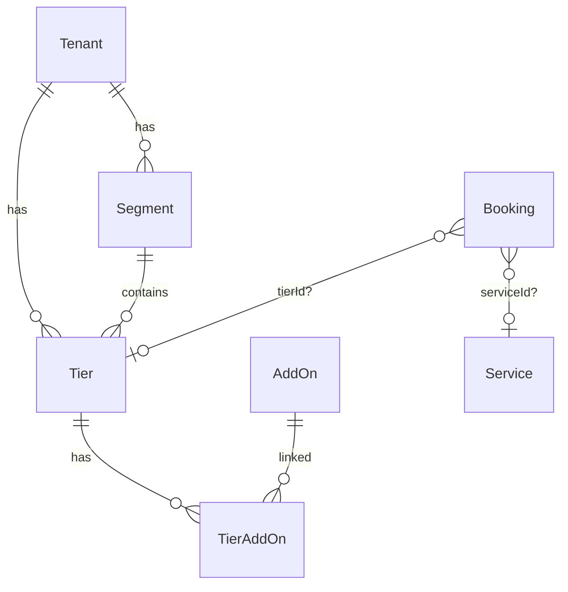

# Complete Package → Tier Migration

## Overview

Eliminate the legacy `Package` entity entirely and consolidate all bookable entities around the `Tier` model.

**Key constraint: No real users or production data exist.** This means no careful FK migration, no deployment timing, no Stripe in-flight sessions, no saved bookmarks. We can make breaking changes freely.

**Target state:** Two bookable entities (`Tier` for priced offerings, `Service` for time-slot scheduling) with `tierId?` and `serviceId?` on `Booking`. The `Package` model, `PackageAddOn` join table, and all Package-related code are deleted.

## Status

| Phase                             | Status                    | Details                                                                                                               |
| --------------------------------- | ------------------------- | --------------------------------------------------------------------------------------------------------------------- |
| Phase 1: Schema + Data Foundation | ✅ MERGED (PR #51)        | New Tier table, data backfill, stopped creating Packages                                                              |
| Phase 2: Backend Read Paths       | ✅ COMMITTED (`104a00cd`) | 100 files, -1519 LOC. Contracts, domain, services, adapters, routes, tests all renamed. Cache invalidation bug fixed. |
| Phase 3: Complete Cleanup         | ⬜ TODO                   | Frontend + agents + schema drop — single pass                                                                         |

## Phase 3: Complete Cleanup (Everything Remaining)

**Effort:** 2-3 days | **Branch:** `refactor/package-tier-phase3-complete`

Since there are no real users or data, we collapse the original Phases 3-5 into a single pass. No phased rollout needed.

### 3.1 Prisma Schema: Drop Package Model

```bash
npx prisma migrate dev --create-only --name drop_package_model
```

**Custom migration SQL:**

```sql
-- Drop PackageAddOn join table
DROP TABLE IF EXISTS "PackageAddOn";

-- Drop packageId from Booking
ALTER TABLE "Booking" DROP CONSTRAINT IF EXISTS "Booking_packageId_fkey";
DROP INDEX IF EXISTS "Booking_packageId_idx";
ALTER TABLE "Booking" DROP COLUMN IF EXISTS "packageId";

-- Drop Package table
DROP TABLE IF EXISTS "Package";

-- Update audit log references
UPDATE "ConfigChangeLog"
SET "entityType" = 'Tier'
WHERE "entityType" = 'Package';
```

**Update `schema.prisma`:**

- [ ] DELETE `Package` model
- [ ] DELETE `PackageAddOn` model
- [ ] DELETE `packageId` from `Booking` model + its relation + index
- [ ] REMOVE `packages Package[]` from `Tenant` model
- [ ] REMOVE `packages Package[]` from `Segment` model
- [ ] REMOVE `packages PackageAddOn[]` from `AddOn` model

### 3.2 Agent Modernization

**Customer Agent:**

- [ ] `server/src/agent-v2/deploy/customer/src/tools/booking.ts` — `recommendPackageTool` → `recommendTierTool`, tool name `recommend_package` → `recommend_tier`
- [ ] `server/src/agent-v2/deploy/customer/src/tools/index.ts` — update imports
- [ ] `server/src/agent-v2/deploy/customer/src/agent.ts` — update tool registration
- [ ] `server/src/agent-v2/deploy/customer/src/prompts/system.ts` — "Package" → "Tier"/"offering"

**Tenant Agent:**

- [ ] `server/src/agent-v2/deploy/tenant/src/tools/tiers.ts` — remove "Package" from example names
- [ ] `server/src/agent-v2/deploy/tenant/src/tools/storefront-write.ts` — "packages" → "tiers"
- [ ] `server/src/agent-v2/deploy/tenant/src/tools/vocabulary.ts` — "packages" → "tiers"
- [ ] `server/src/agent-v2/deploy/tenant/src/prompts/system.ts` — "packages" → "offerings"/"tiers"

**Tests:**

- [ ] `server/src/agent-v2/__tests__/trust-tier-enforcement.test.ts` — update tool name lists

### 3.3 Frontend Migration (~30 files)

**Types + API:**

- [ ] `apps/web/src/lib/tenant.client.ts` — `PackageData` → `TierData`, `.packages` → `.tiers`
- [ ] `apps/web/src/lib/tenant.ts` — `getTenantPackages` → `getTenantTiers`, etc.
- [ ] `apps/web/src/lib/packages.ts` — RENAME → `tiers.ts`
- [ ] `apps/web/src/lib/api.ts` — `api.getPackages()` → `api.getTiers()`

**Booking Flow:**

- [ ] `apps/web/src/components/booking/DateBookingWizard.tsx` — `PackageData` → `TierData`, `packageId` → `tierId`
- [ ] `apps/web/src/app/t/[slug]/book/[packageSlug]/page.tsx` — RENAME dir → `[tierSlug]`, update refs
- [ ] `apps/web/src/app/t/[slug]/book/success/page.tsx` — update refs
- [ ] `apps/web/src/app/t/_domain/book/[packageSlug]/page.tsx` — RENAME dir → `[tierSlug]`, update refs
- [ ] `apps/web/src/app/t/_domain/book/success/page.tsx` — update refs

**Storefront Display:**

- [ ] `apps/web/src/components/tenant/SegmentPackagesSection.tsx` — RENAME → `SegmentTiersSection.tsx`
- [ ] `apps/web/src/components/tenant/TenantLandingPage.tsx` — update refs
- [ ] `apps/web/src/components/tenant/TenantSiteShell.tsx` — "View Packages" → "View Services"
- [ ] `apps/web/src/components/tenant/StickyMobileCTA.tsx` — "View Packages" → "View Services"
- [ ] `apps/web/src/components/tenant/sections/HeroSection.tsx` — "View Packages" → "View Services"

**Photo Management:**

- [ ] `apps/web/src/hooks/usePhotoUpload.ts` — `PackagePhoto` → `TierPhoto`, paths → `/tiers/:id/photos`
- [ ] `apps/web/src/components/photos/PhotoUploader.tsx` — `packageId` → `tierId`
- [ ] `apps/web/src/components/photos/PhotoGrid.tsx` — `PackagePhoto` → `TierPhoto`
- [ ] `apps/web/src/components/photos/PhotoDeleteDialog.tsx` — `PackagePhoto` → `TierPhoto`

**Dashboard + Admin:**

- [ ] `apps/web/src/app/(protected)/tenant/dashboard/page.tsx` — "Packages" → "Tiers"
- [ ] `apps/web/src/components/dashboard/DashboardView.tsx` — same
- [ ] `apps/web/src/app/(protected)/admin/tenants/[id]/page.tsx` — same
- [ ] `apps/web/src/app/(protected)/admin/bookings/page.tsx` — `packageId` → `tierId`
- [ ] `apps/web/src/app/(protected)/tenant/projects/page.tsx` — `booking.package` → `booking.tier`
- [ ] `apps/web/src/app/(protected)/tenant/scheduling/page.tsx` — same

**Marketing Pages (cosmetic text):**

- [ ] `ProductPreviewTabs.tsx`, `DemoChatWidget.tsx`, `BookingMockup.tsx`, `FullStorefrontPreview.tsx`, `StorefrontPreview.tsx`, `DemoStorefrontShowcase.tsx`, various BookingFlowDemo components

### 3.4 Seeds + Scripts

**DELETE entirely:**

- [ ] `server/create-tenant-packages.ts`
- [ ] `server/scripts/fix-orphaned-packages.ts`
- [ ] `server/scripts/fix-orphaned-packages-sql.ts`

**Refactor:**

- [ ] `server/prisma/seeds/utils.ts` — DELETE Package seed utilities, keep Tier only
- [ ] Seed files (`demo.ts`, `e2e.ts`, etc.) — replace Package calls with Tier
- [ ] `server/scripts/setup-segments.ts`, `query-tenant.ts`, `migrate-to-signed-urls.ts`, `delete-test-tenants.ts`, `test-commission.ts` — Package → Tier

### 3.5 E2E Tests

- [ ] `e2e/tests/booking.spec.ts` — `packageSlug` → `tierSlug`
- [ ] `e2e/tests/booking-mock.spec.ts` — same
- [ ] `e2e/tests/booking-flow.spec.ts` — `booking.package` → `booking.tier`
- [ ] `e2e/tests/nextjs-booking-flow.spec.ts` — same
- [ ] `e2e/tests/storefront.spec.ts` — "Packages" text → "Tiers"/"Services"
- [ ] `e2e/tests/visual-editor.spec.ts` — same
- [ ] `e2e/tests/tenant-multi-page.spec.ts` — same
- [ ] `e2e/tests/admin-flow.spec.ts` — same

### 3.6 Final Verification

```bash
# Zero Package references in source
grep -r "Package" server/src/ --include="*.ts" -l  # should return 0 (except Prisma generated)
grep -r "packageId" server/src/ --include="*.ts" -l  # should return 0
grep -r "PackageData\|packageSlug\|packageId" apps/web/src/ --include="*.tsx" --include="*.ts" -l  # 0
grep -r "packageId\|Package" server/scripts/ --include="*.ts" -l  # 0

# Clean typecheck + tests
rm -rf server/dist && npm run --workspace=server typecheck && npm run --workspace=apps/web typecheck
npm test
```

### 3.7 Acceptance Criteria

- [ ] `Package` model does not exist in `schema.prisma`
- [ ] `PackageAddOn` model does not exist
- [ ] `Booking.packageId` does not exist
- [ ] Zero TypeScript files reference "Package" as a domain entity
- [ ] All seeds create Tiers, not Packages
- [ ] All tests pass
- [ ] Typecheck passes both workspaces
- [ ] After merge: deploy agents with `agent=all`

## ERD: Target State



## References

- Todo: `todos/10004-pending-p1-booking-entity-sprawl-complete-package-to-tier-migration.md`
- Technical debt audit: `docs/solutions/architecture/TECHNICAL_DEBT_AUDIT_2026-02-13.md`
