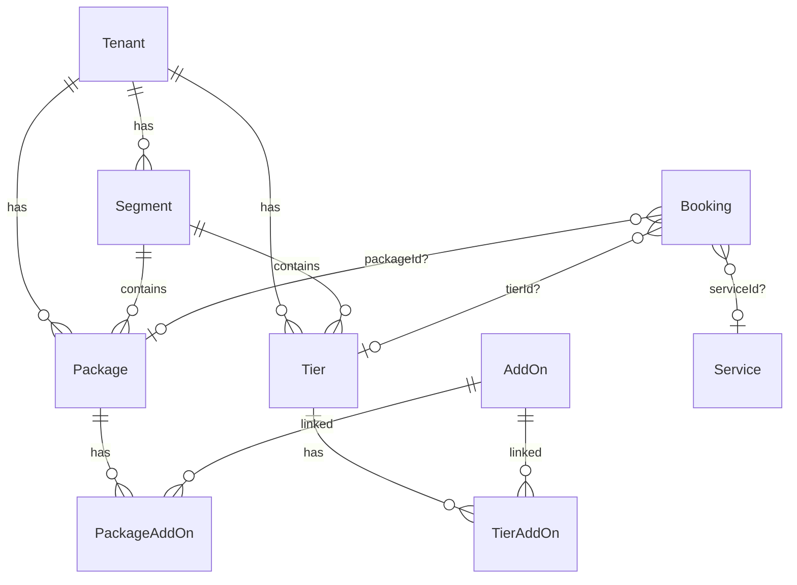
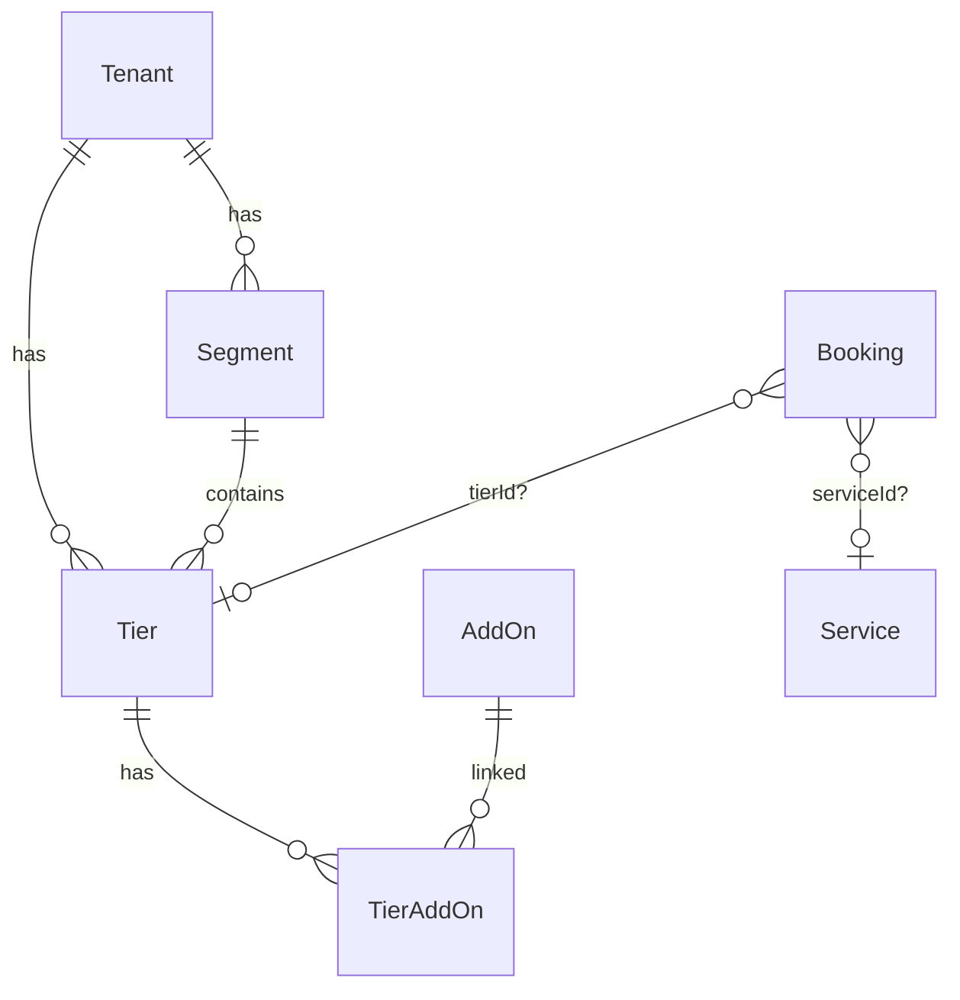

# Complete Package → Tier Migration

## Overview

Eliminate the legacy `Package` entity entirely and consolidate all bookable entities around the `Tier` model. This migration touches **~125 files** with ~2,000+ references, spanning the full stack from Prisma schema through contracts, services, routes, agents, frontend, E2E tests, and scripts.

> **Review status (2026-02-14):** Plan reviewed via 4-agent gap analysis. ~35 missing files added (webhook processor, E2E tests, segment/audit/commission services, standalone scripts). Effort estimate revised from 9-14 to 11-15 days. See "Review Findings" appendix.

**Current state:** Three bookable entities coexist (`Package`, `Tier`, `Service`) with three nullable FKs on `Booking` (`packageId?`, `tierId?`, `serviceId?`). The schema comment at line 268 says "Tier replaces Package" but the migration is incomplete.

**Target state:** Two bookable entities (`Tier` for priced offerings, `Service` for time-slot scheduling) with `tierId?` and `serviceId?` on `Booking`. The `Package` model, `PackageAddOn` join table, and all Package-related code are deleted.

**Key decision:** The Package draft system (6 columns + 171-line `PackageDraftService`) is being **dropped entirely**. The AI agent + `SectionContent` pattern replaces manual draft editing.

## Feature Parity Matrix

| Capability         | Package (OLD)            | Tier (NEW)                | Status                  |
| ------------------ | ------------------------ | ------------------------- | ----------------------- |
| id, tenantId, slug | `id`, `tenantId`, `slug` | `id`, `tenantId`, `slug`  | Parity                  |
| Display name       | `name`                   | `name`                    | Parity                  |
| Description        | `description?`           | `description?`            | Parity                  |
| Price              | `basePrice` (int)        | `priceCents` (int)        | Parity (naming differs) |
| Active toggle      | `active`                 | `active`                  | Parity                  |
| Segment            | `segmentId?` (optional)  | `segmentId` (required)    | Tier stricter           |
| Photo gallery      | `photos` (Json)          | `photos` (Json)           | Parity                  |
| Booking type       | `bookingType`            | `bookingType`             | Parity                  |
| Ordering           | `groupingOrder?`         | `sortOrder` (required)    | Tier stricter           |
| Grouping           | `grouping?`              | N/A (Segment serves this) | Tier simplified         |
| Currency           | N/A                      | `currency` (default USD)  | Tier richer             |
| Features list      | N/A                      | `features` (Json)         | Tier richer             |
| Duration           | N/A                      | `durationMinutes?`        | Tier richer             |
| Deposit            | N/A                      | `depositPercent?`         | Tier richer             |
| Draft editing      | 6 columns + service      | **DROPPED**               | By design               |
| AddOn relations    | `PackageAddOn` join      | `TierAddOn` join          | Parity                  |
| Booking relation   | `Booking.packageId?`     | `Booking.tierId?`         | Migration target        |

**Conclusion:** Tier is a superset of Package. No functionality is lost (except drafts, by decision).

## Risk Analysis

### High Risk

1. **Production data migration** — Existing bookings reference `packageId`. Must backfill `tierId` before dropping column.
2. **Stripe metadata** — In-flight checkout sessions store `packageId` in Stripe metadata. Webhook handler must accept both `packageId` and `tierId` during transition window.
3. **Public URL breakage** — Booking URLs use `/book/[packageSlug]`. Changing to `/book/[tierSlug]` breaks any saved links/bookmarks.

### Medium Risk

4. **AddOn ownership** — `PackageAddOn` rows need corresponding `TierAddOn` rows. If a Package has add-ons but no matching Tier exists, data is lost.
5. **Provisioning race** — `tenant-provisioning.service.ts` currently creates both Packages and Tiers. Must stop creating Packages atomically.

### Low Risk

6. **Agent tool naming** — `recommend_package` tool rename is mechanical but requires agent redeployment.
7. **Email templates** — "Package: {name}" text in confirmation emails needs updating.
8. **Marketing pages** — "Packages" text on landing pages is cosmetic.

### Mitigation Strategy

- **Risk 1:** Run verification queries on prod DB before migration. Create a rollback migration.
- **Risk 2:** Clean break — webhook handler uses `tierId` only. Any in-flight checkout sessions with `packageId` will fail gracefully (customer retries with new session). No backward compat shim.
- **Risk 3:** Clean break — delete `/book/[packageSlug]` entirely. No redirects. Bookmarks break. We build forward.
- **Risk 4:** Phase 1 migration SQL creates Tiers for any orphan Packages and copies add-on links.

## Implementation Phases

> **Principle: Clean break.** No backward-compat shims, no redirects, no transition periods. Delete the old system completely in each phase. Build forward.

Each phase is an independently shippable PR. The system must work correctly at each checkpoint.

---

### Phase 1: Data Foundation + Schema Migration

**Effort:** 1-2 days | **PR:** `refactor/package-tier-phase1-schema`

The foundation phase ensures every `Booking` with a `packageId` gets a corresponding `tierId`, and stops creating new Packages.

#### 1.1 Pre-Migration Audit (manual, no code changes)

Run against production database:

```sql
-- Count bookings by FK type
SELECT
  COUNT(CASE WHEN "packageId" IS NOT NULL AND "tierId" IS NULL THEN 1 END) AS package_only,
  COUNT(CASE WHEN "tierId" IS NOT NULL AND "packageId" IS NULL THEN 1 END) AS tier_only,
  COUNT(CASE WHEN "packageId" IS NOT NULL AND "tierId" IS NOT NULL THEN 1 END) AS both,
  COUNT(CASE WHEN "packageId" IS NULL AND "tierId" IS NULL AND "serviceId" IS NOT NULL THEN 1 END) AS service_only,
  COUNT(*) AS total
FROM "Booking";

-- Find Packages without corresponding Tiers
SELECT p.id, p."tenantId", p.slug, p.name, p."basePrice"
FROM "Package" p
LEFT JOIN "Tier" t ON t."tenantId" = p."tenantId" AND t.slug = p.slug
WHERE t.id IS NULL;

-- Check PackageAddOns that need TierAddOn equivalents
SELECT pa."packageId", pa."addOnId", p.slug as "packageSlug"
FROM "PackageAddOn" pa
JOIN "Package" p ON p.id = pa."packageId"
LEFT JOIN "Tier" t ON t."tenantId" = p."tenantId" AND t.slug = p.slug
LEFT JOIN "TierAddOn" ta ON ta."tierId" = t.id AND ta."addOnId" = pa."addOnId"
WHERE ta."tierId" IS NULL;

-- CRITICAL: Tenants with Packages but NO Segments (migration SQL will fail on these)
-- If any rows returned, must create a default Segment for those tenants first.
SELECT p."tenantId", COUNT(*) as package_count
FROM "Package" p
LEFT JOIN "Segment" s ON s."tenantId" = p."tenantId"
WHERE s.id IS NULL
AND EXISTS (SELECT 1 FROM "Booking" b WHERE b."packageId" = p.id)
GROUP BY p."tenantId";
```

- [ ] Record results in this plan file (update counts below)
- [ ] Confirm: how many orphan Packages need Tiers created?
- [ ] Confirm: how many PackageAddOn links need TierAddOn copies?
- [ ] Confirm: zero tenants with Packages but no Segments (or create Segments first)

#### 1.2 Prisma Migration: Backfill + FK Swap

```bash
npx prisma migrate dev --create-only --name complete_package_to_tier_backfill
```

**Custom migration SQL** (`server/prisma/migrations/<timestamp>_complete_package_to_tier_backfill/migration.sql`):

```sql
-- ============================================
-- PHASE 1: Create Tiers for orphan Packages
-- (Packages that have bookings but no corresponding Tier)
-- ============================================

-- Create matching Tiers for every Package that doesn't have one
INSERT INTO "Tier" ("id", "tenantId", "segmentId", "sortOrder", "slug", "name", "description", "priceCents", "currency", "features", "bookingType", "active", "photos", "createdAt", "updatedAt")
SELECT
  -- Generate new CUID-like ID (use gen_random_uuid as placeholder, Prisma will handle)
  'tier_migrated_' || p.id,
  p."tenantId",
  COALESCE(p."segmentId", (
    -- If Package has no segment, use the tenant's first segment
    SELECT s.id FROM "Segment" s WHERE s."tenantId" = p."tenantId" ORDER BY s."createdAt" ASC LIMIT 1
  )),
  COALESCE(p."groupingOrder", 1),
  p.slug,
  p.name,
  p.description,
  p."basePrice", -- Package.basePrice maps to Tier.priceCents
  'USD',
  '[]'::jsonb, -- Empty features array
  p."bookingType",
  p.active,
  p.photos,
  p."createdAt",
  NOW()
FROM "Package" p
LEFT JOIN "Tier" t ON t."tenantId" = p."tenantId" AND t.slug = p.slug
WHERE t.id IS NULL
-- Only create for Packages that have bookings (others can be dropped)
AND EXISTS (SELECT 1 FROM "Booking" b WHERE b."packageId" = p.id);

-- ============================================
-- PHASE 2: Copy PackageAddOn → TierAddOn for migrated Tiers
-- ============================================

INSERT INTO "TierAddOn" ("tierId", "addOnId")
SELECT t.id, pa."addOnId"
FROM "PackageAddOn" pa
JOIN "Package" p ON p.id = pa."packageId"
JOIN "Tier" t ON t."tenantId" = p."tenantId" AND t.slug = p.slug
LEFT JOIN "TierAddOn" ta ON ta."tierId" = t.id AND ta."addOnId" = pa."addOnId"
WHERE ta."tierId" IS NULL;

-- ============================================
-- PHASE 3: Backfill Booking.tierId from packageId
-- ============================================

UPDATE "Booking" b
SET "tierId" = t.id
FROM "Package" p
JOIN "Tier" t ON t."tenantId" = p."tenantId" AND t.slug = p.slug
WHERE b."packageId" = p.id
AND b."tierId" IS NULL;

-- ============================================
-- PHASE 4: Verify no orphan bookings
-- ============================================

-- This should return 0. If it doesn't, the migration has a bug.
DO $$
DECLARE
  orphan_count INTEGER;
BEGIN
  SELECT COUNT(*) INTO orphan_count
  FROM "Booking"
  WHERE "packageId" IS NOT NULL AND "tierId" IS NULL;

  IF orphan_count > 0 THEN
    RAISE EXCEPTION 'Migration failed: % bookings still have packageId without tierId', orphan_count;
  END IF;
END $$;
```

> **NOTE:** Do NOT drop `packageId` or the `Package` model yet. Phase 2-4 code changes must land first. The column stays as a read-only artifact during the transition window.

#### 1.3 Stop Creating New Packages

**Files to change:**

- [x] `server/src/services/tenant-provisioning.service.ts:106-188` — Remove `createDefaultSegmentAndPackages()` Package creation. Keep only Tier creation.
- [x] `server/src/services/context-builder.service.ts:517-531` — Change `hasNonSeedPackages()` to query `Tier` instead of `Package`
- [x] `server/src/services/discovery.service.ts:62-74` — Change `packagesCreated` to check Tier count

#### 1.4 Phase 1 Acceptance Criteria

- [x] All bookings with `packageId` now also have `tierId`
- [x] No new Packages are created during provisioning
- [x] Existing read paths still work (Package model still in schema)
- [x] All 1214+ tests pass
- [x] Typecheck passes: `npm run --workspace=server typecheck && npm run --workspace=apps/web typecheck`

---

### Phase 2: Backend Consolidation (Contracts → Domain → Services → Routes)

**Effort:** 4-6 days | **PR:** `refactor/package-tier-phase2-backend`

The largest phase. Systematically replaces all Package references in the backend with Tier equivalents.

#### 2.1 Contracts: Retire Package DTOs + API Endpoints

**File: `packages/contracts/src/dto.ts`**

| Lines    | Current                                                                        | Action                                |
| -------- | ------------------------------------------------------------------------------ | ------------------------------------- |
| 108      | `packageId` in AddOnDto                                                        | Rename to `tierId`                    |
| 141-171  | `PackageDtoSchema` + `PackageDto`                                              | DELETE — use existing `TierDtoSchema` |
| 192, 218 | `packageId`, `packageName` in BookingDto                                       | Rename to `tierId`, `tierName`        |
| 234, 245 | `packageId` in CreateCheckoutDto, CreateBookingDto                             | Rename to `tierId`                    |
| 341-388  | `CreatePackageDtoSchema`, `UpdatePackageDtoSchema`, `PackageResponseDtoSchema` | DELETE                                |
| 392, 406 | `packageId` in AddOn schemas                                                   | Rename to `tierId`                    |
| 481-533  | Photo/Draft DTOs (5 schemas)                                                   | DELETE (draft system dropped)         |
| 537-552  | Publish/Discard DTOs                                                           | DELETE                                |
| 1028     | `packageId` in booking ref                                                     | Rename to `tierId`                    |

**File: `packages/contracts/src/api.v1.ts`**

| Lines     | Current                           | Action                                                                     |
| --------- | --------------------------------- | -------------------------------------------------------------------------- |
| 96-114    | `getPackages`, `getPackageBySlug` | Rename → `getTiers`, `getTierBySlug` (update paths `/packages` → `/tiers`) |
| 349-487   | 8 tenant admin package endpoints  | DELETE all. Tier admin endpoints already exist or need creation.           |
| 785-843   | 4 admin package endpoints         | DELETE all. Use admin tier endpoints.                                      |
| 1143-1151 | `getSegmentWithPackages`          | Rename → `getSegmentWithTiers`                                             |

**File: `packages/contracts/src/schemas/onboarding.schema.ts`**

| Lines | Current             | Action                    |
| ----- | ------------------- | ------------------------- |
| 194   | `createdPackageIds` | Rename → `createdTierIds` |

**File: `packages/contracts/src/schemas/section-blueprint.schema.ts`**

| Lines | Current              | Action                                                                  |
| ----- | -------------------- | ----------------------------------------------------------------------- |
| 256   | `SEED_PACKAGE_NAMES` | Rename → `SEED_TIER_NAMES` (keep values: "Basic Package"→"Basic", etc.) |

**File: `packages/contracts/src/landing-page.ts`**

| Lines | Current                       | Action                                            |
| ----- | ----------------------------- | ------------------------------------------------- |
| 232   | `'View Packages'` default CTA | Change to `'View Services'` or `'View Offerings'` |

#### 2.2 Domain Layer: Entities, Ports, Errors, Mappers

**File: `server/src/lib/entities.ts`**

- [ ] Lines 9-15: DELETE `PackagePhoto` interface (Tier uses same Json structure)
- [ ] Lines 19-40: DELETE `Package` interface
- [ ] Lines 42-49: `AddOn.packageId` → `AddOn.tierId`
- [ ] Lines 55-101: `Booking.packageId` → DELETE field
- [ ] Lines 106-113: `CreateBookingInput.packageId` → `CreateBookingInput.tierId`

**File: `server/src/lib/ports.ts`**

- [ ] Lines 14-71: `CatalogRepository` — DELETE all 20+ Package methods. Keep only Tier methods. If Tier methods don't exist yet, create them mirroring the Package interface.
- [ ] Lines 304: Booking port — `packageId` → `tierId`
- [ ] Lines 781-858: DELETE `CreatePackageInput`, `PackagePhoto`, `UpdatePackageInput`, `PackageWithDraft`, `UpdatePackageDraftInput`
- [ ] Lines 858-868: AddOn input types — `packageId` → `tierId`
- [ ] Lines 1021-1029: `uploadPackagePhoto` → `uploadTierPhoto`, `deletePackagePhoto` → `deleteTierPhoto`

**File: `server/src/lib/errors/business.ts`**

- [ ] Lines 186-226: Rename `PackageError` → `TierError`, `PackageNotAvailableError` → `TierNotAvailableError`, `PackageQuotaExceededError` → `TierQuotaExceededError`

**File: `server/src/lib/mappers/package.mapper.ts`**

- [ ] RENAME file → `tier.mapper.ts`
- [ ] Rename all functions: `mapPackageToDto` → `mapTierToDto`, `mapPackagesToDto` → `mapTiersToDto`, etc.

**File: `server/src/lib/tenant-defaults.ts`**

- [ ] Lines 28-56: Rename `DEFAULT_PACKAGE_TIERS` → `DEFAULT_TIERS`, `PackageTierKey` → `DefaultTierKey`, `PackageTierConfig` → `DefaultTierConfig`

**File: `server/src/validation/tenant-admin.schemas.ts`**

- [ ] Lines 18-121: DELETE `createPackageSchema`, `updatePackageSchema` and types. Use Tier validation schemas.

#### 2.3 Services: Catalog, Booking, Orchestrator

**File: `server/src/services/catalog.service.ts` (628 lines) — HEAVY REFACTOR**

- [ ] Rename all Package methods to Tier equivalents: `getAllPackages` → `getAllTiers`, `getPackageBySlug` → `getTierBySlug`, etc.
- [ ] Update all `prisma.package.*` calls to `prisma.tier.*`
- [ ] Update cache key prefix: `"packages:"` → `"tiers:"`
- [ ] Remove any Package-specific logic that Tier already handles

**File: `server/src/services/package-draft.service.ts` (171 lines) — DELETE ENTIRELY**

**File: `server/src/services/booking.service.ts`**

- [ ] Lines 183-303: Replace `packageTitle` lookup → `tierName` lookup via `prisma.tier.findUnique()`
- [ ] Lines 371, 456: `packageId` → `tierId` in booking data mapping
- [ ] Lines 580-679: `onPaymentCompleted` — Use `tierId` only from metadata. Clean break, no `packageId` fallback.

**File: `server/src/services/wedding-booking.orchestrator.ts` (209 lines)**

- [ ] Line 30: `packageId: string` → `tierId: string` in `CreateDateBookingInput`
- [ ] Lines 55-173: Change `prisma.package.findUnique()` → `prisma.tier.findUnique()`, update validation
- [ ] Line 89: Stripe metadata: `packageId: pkg.id` → `tierId: tier.id` (clean break — no backward compat)

**File: `server/src/services/idempotency.service.ts`**

- [ ] Lines 365-392: Checkout idempotency key: `packageId` → `tierId`

**File: `server/src/services/tenant-provisioning.service.ts`**

- [ ] Remove all Package creation code (started in Phase 1, complete here)
- [ ] Remove Package imports

**File: `server/src/services/segment.service.ts`** _(added by review)_

- [ ] Lines 6, 21, 295: Remove `Package` import, change `PackageWithAddOns` type to Tier equivalent

**File: `server/src/services/audit.service.ts`** _(added by review)_

- [ ] Lines 48-50: Change entityType `'Package'` → `'Tier'`

**File: `server/src/services/commission.service.ts`** _(added by review)_

- [ ] Replace `packageId` references with `tierId`

**File: `server/src/jobs/webhook-processor.ts`** _(added by review — CRITICAL)_

- [ ] Extracts `packageId` from Stripe metadata during payment completion — must switch to `tierId`. Clean break, no fallback.

#### 2.4 Routes: Retire 3 Files, Refactor 5

**DELETE entirely:**

- [ ] `server/src/routes/packages.routes.ts` (22 lines)
- [ ] `server/src/routes/tenant-admin-packages.routes.ts` (591 lines)
- [ ] `server/src/routes/admin-packages.routes.ts` (77 lines)

**Refactor:**

- [ ] `server/src/routes/index.ts` — Remove all Package controller/service imports, wire Tier routes instead
- [ ] `server/src/routes/tenant-admin-addons.routes.ts` — `packageId` → `tierId` in add-on mapping
- [ ] `server/src/routes/internal-agent-booking.routes.ts` — Replace `RecommendPackageSchema` → `RecommendTierSchema`, update all Package listing/filtering logic to use Tier
- [ ] `server/src/routes/internal-agent-discovery.routes.ts` — `packagesCreated` → `tiersCreated`, `no_packages` → `no_tiers`
- [ ] `server/src/routes/public-date-booking.routes.ts` — `packageId` → `tierId` in booking creation flow
- [ ] `server/src/routes/segments.routes.ts` — `getSegmentWithPackages` returns Package data → switch to Tier _(added by review)_
- [ ] `server/src/controllers/platform-admin.controller.ts` — `booking.package` references in booking listings _(added by review)_

#### 2.5 Adapters

**File: `server/src/adapters/prisma/catalog.repository.ts` (~800 lines) — HEAVIEST SINGLE FILE**

- [ ] Rename all 20+ methods from `Package` to `Tier` equivalents
- [ ] Change all `this.prisma.package.*` → `this.prisma.tier.*`
- [ ] Update private mappers: `toDomainPackage` → `toDomainTier`, etc.
- [ ] DELETE draft-related methods: `getAllPackagesWithDrafts`, `updateDraft`, `publishDrafts`, `discardDrafts`

**File: `server/src/adapters/prisma/booking.repository.ts`**

- [ ] Lines 118, 211, 785, 1006, 1064: `packageId` → `tierId` in booking creation, mapping, types

**File: `server/src/adapters/prisma/segment.repository.ts`**

- [ ] Line 197: `findByIdWithPackages` → `findByIdWithTiers`

**File: `server/src/adapters/mock/index.ts` (~530 lines)**

- [ ] Rename `packages` Map → `tiers` Map
- [ ] Update all 30+ mock methods to use Tier naming
- [ ] Update seed data: "Starter Package" → "Starter", etc.

**File: `server/src/adapters/upload.adapter.ts`**

- [ ] Lines 30, 235, 305-351, 470: `uploadPackagePhoto` → `uploadTierPhoto`, `deletePackagePhoto` → `deleteTierPhoto`, `getPackagePhotoUploadDir` → `getTierPhotoUploadDir`
- [ ] Config: `maxPackagePhotoSizeMB` → `maxTierPhotoSizeMB`, `packagePhotoUploadDir` → `tierPhotoUploadDir`

**File: `server/src/adapters/stripe.adapter.ts`**

- [ ] Lines 52-53, 129-130: `name: 'Wedding Package'` → dynamic: `name: tierName` (pass as parameter)

**File: `server/src/adapters/postmark.adapter.ts`**

- [ ] Lines 160, 310, 345: `Package: ${payload.packageTitle}` → `Service: ${payload.tierName}` (or just the tier name)

#### 2.6 DI Container

**File: `server/src/di.ts`**

- [ ] Lines 24, 35, 43, 73, 79, 97, 118, 163, 167: Remove `PackageDraftService`, `PackagesController`, `AdminPackagesController` registrations. Update upload config naming.

#### 2.7 Phase 2 Acceptance Criteria

- [ ] Zero imports of `Package` type from entities/ports (except Prisma client for backward-compat reads)
- [ ] `packages.routes.ts`, `tenant-admin-packages.routes.ts`, `admin-packages.routes.ts`, `package-draft.service.ts` are deleted
- [ ] `package.mapper.ts` renamed to `tier.mapper.ts`
- [ ] All API endpoints use `/tiers` paths (no `/packages` routes)
- [ ] Booking service uses `tierId` only in Stripe metadata (clean break)
- [ ] Webhook processor uses `tierId` only (clean break)
- [ ] All 1214+ tests pass (updated to use Tier)
- [ ] Typecheck passes both workspaces

> **DEPLOY WARNING:** After Phase 2 merge, the frontend's Package API calls (`/packages/*`) will 404 because the routes are deleted. The public storefront booking flow is broken until Phase 4 completes. **Deploy Phase 2 during low-traffic hours** and monitor webhook failures for 1 hour post-deploy (Stripe clean break). Phases 3+4 should follow within 1-2 days.

---

### Phase 3: Agent Modernization

**Effort:** 1 day | **PR:** `refactor/package-tier-phase3-agents`

#### 3.1 Customer Agent

**File: `server/src/agent-v2/deploy/customer/src/tools/booking.ts`**

- [ ] Line 37: `RecommendPackageParams` → `RecommendTierParams`
- [ ] Lines 219-249: Rename `recommendPackageTool` → `recommendTierTool`, tool name `recommend_package` → `recommend_tier`
- [ ] Update internal API calls from `/packages` → `/tiers`

**File: `server/src/agent-v2/deploy/customer/src/tools/index.ts`**

- [ ] Line 18: Update import and export

**File: `server/src/agent-v2/deploy/customer/src/agent.ts`**

- [ ] Lines 34, 98: Update tool registration

**File: `server/src/agent-v2/deploy/customer/src/prompts/system.ts`**

- [ ] Line 64: "Package Recommendations" → "Service Recommendations" or "Tier Recommendations"
- [ ] Line 96: "Use recommend_package" → "Use recommend_tier"

#### 3.2 Tenant Agent

**File: `server/src/agent-v2/deploy/tenant/src/tools/tiers.ts`**

- [ ] Lines 59, 111-112, 146: Remove "Package" from example names in descriptions (already uses Tier tool structure)

**File: `server/src/agent-v2/deploy/tenant/src/tools/storefront-write.ts`**

- [ ] Line 214: "pricing: Pricing tiers/packages" → "pricing: Pricing tiers"

**File: `server/src/agent-v2/deploy/tenant/src/tools/vocabulary.ts`**

- [ ] Line 103: "packages" → "tiers" in PRICING category mapping

**File: `server/src/agent-v2/deploy/tenant/src/prompts/system.ts`**

- [ ] Lines 65, 94: "your wedding packages" → "your service tiers" or "your offerings"

#### 3.3 Tests

**File: `server/src/agent-v2/__tests__/trust-tier-enforcement.test.ts`**

- [ ] Lines 48-69: Update trust tier tool lists: `recommend_package` → `recommend_tier`, remove `get_packages`, `upsert_package`, `delete_package`

#### 3.4 Phase 3 Acceptance Criteria

- [ ] No agent tool uses "package" in its name
- [ ] System prompts reference "tiers" or "offerings", not "packages"
- [ ] Trust tier tests pass with updated tool names
- [ ] Agents deployed to Cloud Run: `agent=all` (CRITICAL: shared deps changed)

---

### Phase 4: Frontend Migration

**Effort:** 3-4 days | **PR:** `refactor/package-tier-phase4-frontend`

#### 4.1 Types + API Client

**File: `apps/web/src/lib/tenant.client.ts`**

- [ ] Lines 100-118: Rename `PackageData` → `TierData` (or use existing Tier type if one exists)
- [ ] Line 134: `TenantStorefrontData.packages` → `.tiers`
- [ ] Line 225: `createDateBooking` param `packageId` → `tierId`

**File: `apps/web/src/lib/tenant.ts`**

- [ ] Line 122: `getTenantPackages()` → `getTenantTiers()`
- [ ] Line 292: `getTenantPackageBySlug()` → `getTenantTierBySlug()`
- [ ] Lines 392, 691: `packageId` → `tierId` in booking types

**File: `apps/web/src/lib/packages.ts`**

- [ ] RENAME → `apps/web/src/lib/tiers.ts`
- [ ] Update `TIER_ORDER` constant (already correctly named)

**File: `apps/web/src/lib/api.ts`**

- [ ] Line 33: `api.getPackages()` → `api.getTiers()`

#### 4.2 Booking Flow (HIGH PRIORITY — most complex)

**File: `apps/web/src/components/booking/DateBookingWizard.tsx`**

- [ ] Lines 37, 58, 90: `PackageData` → `TierData`
- [ ] Lines 264, 397, 472: `packageId` → `tierId` in checkout submission

**File: `apps/web/src/app/t/[slug]/book/[packageSlug]/page.tsx`**

- [ ] RENAME directory → `apps/web/src/app/t/[slug]/book/[tierSlug]/page.tsx`
- [ ] Lines 5-116: Update all Package references to Tier
- [ ] "Package Not Found" → "Service Not Found", "Package Unavailable" → "Service Unavailable"

**File: `apps/web/src/app/t/[slug]/book/success/page.tsx`**

- [ ] Lines 4-180: `getTenantPackageBySlug` → `getTenantTierBySlug`, `PackageIcon` → appropriate icon

**File: `apps/web/src/app/t/_domain/book/[packageSlug]/page.tsx`**

- [ ] RENAME directory → `apps/web/src/app/t/_domain/book/[tierSlug]/page.tsx`
- [ ] Lines 5-123: Same changes as `[slug]` version

**File: `apps/web/src/app/t/_domain/book/success/page.tsx`**

- [ ] Lines 4-164: Same changes as `[slug]` version

**No backward-compat redirects.** Old `/book/[packageSlug]` URLs are deleted. Clean break — build forward.

#### 4.3 Storefront Display

**File: `apps/web/src/components/tenant/SegmentPackagesSection.tsx`**

- [ ] RENAME → `SegmentTiersSection.tsx`
- [ ] Lines 4-480: Rename component `SegmentPackagesSection` → `SegmentTiersSection`, `TierCard` stays, `SegmentWithTiers` stays
- [ ] Update all `packages` prop names → `tiers`

**File: `apps/web/src/components/tenant/TenantLandingPage.tsx`**

- [ ] Lines 5-121: Update Package injection references to Tier

**File: `apps/web/src/components/tenant/TenantSiteShell.tsx`**

- [ ] Line 39: "View Packages" → "View Services" (or configurable CTA text)

**File: `apps/web/src/components/tenant/StickyMobileCTA.tsx`**

- [ ] Line 33: "View Packages" → "View Services"

**File: `apps/web/src/components/tenant/sections/HeroSection.tsx`**

- [ ] Line 22: "View Packages" → "View Services"

#### 4.4 Photo Management

**File: `apps/web/src/hooks/usePhotoUpload.ts`**

- [ ] Lines 7-232: `PackagePhoto` → `TierPhoto`, `packageId` param → `tierId`, API paths `packages/:id/photos` → `tiers/:id/photos`

**File: `apps/web/src/components/photos/PhotoUploader.tsx`**

- [ ] Lines 7-174: `packageId` prop → `tierId`, "Package Photos" label → "Photos"

**File: `apps/web/src/components/photos/PhotoGrid.tsx`**

- [ ] Lines 6-82: `PackagePhoto` → `TierPhoto`, "Package photo" alt text → "Photo"

**File: `apps/web/src/components/photos/PhotoDeleteDialog.tsx`**

- [ ] Lines 13-16: `PackagePhoto` → `TierPhoto`

#### 4.5 Dashboard + Admin

**File: `apps/web/src/app/(protected)/tenant/dashboard/page.tsx`**

- [ ] Lines 10, 37, 136-138: `Package` icon → `Layers` or `Grid` icon, `hasPackages` → `hasTiers`, "Packages" label → "Tiers" or "Services"

**File: `apps/web/src/components/dashboard/DashboardView.tsx`**

- [ ] Lines 24, 51, 129-131: Same pattern as above

**File: `apps/web/src/app/(protected)/admin/tenants/[id]/page.tsx`**

- [ ] Lines 6, 79-80: Update Package icon and label

**File: `apps/web/src/app/(protected)/admin/bookings/page.tsx`**

- [ ] Line 21: `packageId` → `tierId`

**File: `apps/web/src/app/(protected)/tenant/projects/page.tsx`** _(added by review)_

- [ ] `booking.package` reference → `booking.tier`

**File: `apps/web/src/app/(protected)/tenant/scheduling/page.tsx`** _(added by review)_

- [ ] `booking.package` reference → `booking.tier`

#### 4.6 Marketing Pages (cosmetic text only)

- [ ] `ProductPreviewTabs.tsx` — "Package" label
- [ ] `DemoChatWidget.tsx` — "Essential Package" → "Essential"
- [ ] `BookingMockup.tsx` — "Package" label
- [ ] `FullStorefrontPreview.tsx` — "Packages" section
- [ ] `StorefrontPreview.tsx` — "Packages" section
- [ ] `DemoStorefrontShowcase.tsx` — "Packages" link
- [ ] Various BookingFlowDemo stage components

#### 4.7 Phase 4 Acceptance Criteria

- [ ] No frontend file imports `PackageData` or references `packageId`
- [ ] Booking flow works end-to-end with `tierId`
- [ ] URL `/t/{slug}/book/{tierSlug}` resolves correctly
- [ ] Old URL `/t/{slug}/book/[packageSlug]` directory deleted (clean break, no redirects)
- [ ] Photo upload/delete works with Tier IDs
- [ ] Typecheck passes: `npm run --workspace=apps/web typecheck`

---

### Phase 5: Schema Cleanup + Final Deletion

**Effort:** 2-3 days | **PR:** `refactor/package-tier-phase5-cleanup`

The final phase. Everything Package-related is deleted.

#### 5.1 Final Prisma Migration

```bash
npx prisma migrate dev --create-only --name drop_package_model
```

**Custom migration SQL:**

```sql
-- ============================================
-- FINAL CLEANUP: Drop Package model entirely
-- ============================================

-- 1. Verify zero remaining packageId references
DO $$
DECLARE
  remaining_count INTEGER;
BEGIN
  SELECT COUNT(*) INTO remaining_count
  FROM "Booking" WHERE "packageId" IS NOT NULL;

  IF remaining_count > 0 THEN
    RAISE EXCEPTION 'Cannot drop: % bookings still reference packageId', remaining_count;
  END IF;
END $$;

-- 2. Drop foreign key constraints
ALTER TABLE "Booking" DROP CONSTRAINT IF EXISTS "Booking_packageId_fkey";

-- 3. Drop packageId column and index from Booking
DROP INDEX IF EXISTS "Booking_packageId_idx";
ALTER TABLE "Booking" DROP COLUMN IF EXISTS "packageId";

-- 4. Drop PackageAddOn join table
DROP TABLE IF EXISTS "PackageAddOn";

-- 5. Drop Package table
DROP TABLE IF EXISTS "Package";

-- 6. Clean up ConfigChangeLog references (update entityType values)
UPDATE "ConfigChangeLog"
SET "entityType" = 'Tier'
WHERE "entityType" = 'Package';
```

#### 5.2 Update Prisma Schema

- [ ] DELETE `Package` model (lines 387-439)
- [ ] DELETE `PackageAddOn` model (lines 467-476)
- [ ] DELETE `packageId` from `Booking` model (line 482) and its relation (line 547) and index (line 570)
- [ ] REMOVE `packages Package[]` from `Tenant` model (line 134)
- [ ] REMOVE `packages Package[]` from `Segment` model (line 253)
- [ ] REMOVE `packages PackageAddOn[]` from `AddOn` model (line 457)

#### 5.3 Seeds + Fixtures

**File: `server/prisma/seeds/utils.ts`**

- [ ] DELETE `PackageSeedOptions`, `createOrUpdatePackage()`, `createOrUpdatePackages()`, `linkAddOnToPackage()`, `linkAddOnsToPackage()`
- [ ] Keep only Tier seed utilities (add if they don't exist)

**Seed files:** `demo.ts`, `e2e.ts`, `la-petit-mariage.ts`, `little-bit-horse-farm.ts`, `plate.ts`

- [ ] Replace all `createOrUpdatePackage()` calls with Tier equivalents

**File: `server/prisma/seeds/upgrade-tenant-pages.ts`**

- [ ] Remove Package references

#### 5.4 Tests

All **26+** test files with Package references need updating:

**Unit/Integration tests (18 originally listed + 6 added by review):**

| File                                     | Occurrences | Action                                                 |
| ---------------------------------------- | ----------- | ------------------------------------------------------ |
| `catalog.service.integration.test.ts`    | 33          | Rewrite for Tier CRUD                                  |
| `booking.service.date.test.ts`           | 29          | `packageId` → `tierId`                                 |
| `tenant-isolation.integration.test.ts`   | 24          | Package isolation → Tier isolation                     |
| `audit.service.test.ts`                  | 19          | `Package` entity → `Tier`                              |
| `tenant-admin-photos.test.ts`            | 53          | Package photos → Tier photos                           |
| `internal-agent-bootstrap.test.ts`       | 16          | Package bootstrap → Tier                               |
| `internal-agent-storefront.test.ts`      | 9           | Package storefront → Tier                              |
| `checkout-session.factory.test.ts`       | 7           | `packageId` → `tierId`                                 |
| `tenant-admin-scheduling.test.ts`        | 6           | Package scheduling → Tier                              |
| Seed tests (3 files)                     | 16          | Update seed verifications                              |
| `discovery.service.test.ts`              | 3           | `packagesCreated` → `tiersCreated`                     |
| `http/packages.test.ts`                  | 53          | **DELETE ENTIRELY** _(added by review)_                |
| `segment.service.integration.spec.ts`    | —           | Package+Segment integration → Tier _(added by review)_ |
| `segment-repository.integration.spec.ts` | —           | Package repo → Tier _(added by review)_                |
| `commission.service.spec.ts`             | —           | Package commission → Tier _(added by review)_          |
| `schema-consistency.spec.ts`             | —           | Package schema checks → Tier _(added by review)_       |
| `validation.spec.ts`                     | —           | Package validation → Tier _(added by review)_          |
| Others (4 files)                         | ~6          | Mechanical renames                                     |

**E2E tests (8 files — added by review):**

| File                                    | References                 | Action                   |
| --------------------------------------- | -------------------------- | ------------------------ |
| `e2e/tests/booking.spec.ts`             | `packageSlug` in URLs      | Update to `tierSlug`     |
| `e2e/tests/booking-mock.spec.ts`        | `packageSlug` in URLs      | Update to `tierSlug`     |
| `e2e/tests/booking-flow.spec.ts`        | `booking.package` refs     | Update to `booking.tier` |
| `e2e/tests/nextjs-booking-flow.spec.ts` | `booking.package` refs     | Update to `booking.tier` |
| `e2e/tests/storefront.spec.ts`          | "Packages" text assertions | Update text              |
| `e2e/tests/visual-editor.spec.ts`       | "Package" text assertions  | Update text              |
| `e2e/tests/tenant-multi-page.spec.ts`   | "Packages" section checks  | Update text              |
| `e2e/tests/admin-flow.spec.ts`          | "Package" admin flow       | Update text              |

#### 5.5 Scripts + Standalone Files _(added by review)_

**DELETE entirely:**

- [ ] `server/create-tenant-packages.ts` — Legacy Package creation script (not in `scripts/`)
- [ ] `server/scripts/fix-orphaned-packages.ts` — Package orphan cleanup (no longer relevant)
- [ ] `server/scripts/fix-orphaned-packages-sql.ts` — SQL version of above

**Refactor:**

- [ ] `server/scripts/setup-segments.ts` — Creates Packages for segments → switch to Tier creation
- [ ] `server/scripts/query-tenant.ts` — Queries Package table → query Tier
- [ ] `server/scripts/migrate-to-signed-urls.ts` — Package photo migration → Tier photos
- [ ] `server/scripts/delete-test-tenants.ts` — Deletes test Packages → Tiers
- [ ] `server/scripts/test-commission.ts` — Package commission tests → Tier

#### 5.7 Final Cleanup Checklist

- [ ] `grep -r "Package" server/src/ --include="*.ts" -l` returns 0 files (except Prisma generated client)
- [ ] `grep -r "packageId" server/src/ --include="*.ts" -l` returns 0 files
- [ ] `grep -r "PackageData\|packageSlug\|packageId" apps/web/src/ --include="*.tsx" --include="*.ts" -l` returns 0 files
- [ ] `grep -r "packageId\|packageSlug\|Package" e2e/ --include="*.ts" -l` returns 0 files _(added by review)_
- [ ] `grep -r "packageId\|Package" server/scripts/ --include="*.ts" -l` returns 0 files _(added by review)_
- [ ] `rm -rf server/dist packages/*/dist && npm run --workspace=server typecheck && npm run --workspace=apps/web typecheck` passes
- [ ] All tests pass: `npm test`
- [ ] No orphan imports after deletions (Pitfall #14)

#### 5.8 Phase 5 Acceptance Criteria

- [ ] `Package` model does not exist in `schema.prisma`
- [ ] `PackageAddOn` model does not exist in `schema.prisma`
- [ ] `Booking.packageId` does not exist
- [ ] Zero TypeScript files reference "Package" as a domain entity
- [ ] All seeds create Tiers, not Packages
- [ ] All tests pass (1214+)
- [ ] Typecheck passes both workspaces
- [ ] `ConfigChangeLog` entries updated from 'Package' to 'Tier'

---

## ERD: Before and After

### Before (current)



### After (target)



## Implementation Sequence

```
Phase 1 (1d)  →  Phase 2 (4-6d)  →  Phase 3 (1d)  →  Phase 4 (3-4d)  →  Phase 5 (2-3d)
   Schema &         Backend            Agents           Frontend           Drop Package
   Data backfill    consolidation      modernize        migration          model & cleanup
```

**Each phase is a separate PR. Merge sequentially. Deploy after each merge.**

**After Phase 3:** Trigger full agent redeploy: `agent=all` (shared deps changed).

**After Phase 5:** Trigger full agent redeploy again (Package references removed from contracts).

> **Aggressive option:** Phases 2+5 can be combined if you want to drop the Package model in the same PR as the backend consolidation. This creates a larger PR (~60 files) but avoids any period where dead Package code lingers. The plan is structured as 5 phases for reviewability, but the principle is: **delete everything as soon as nothing references it.**

## References

### Internal

- Todo: `todos/10004-pending-p1-booking-entity-sprawl-complete-package-to-tier-migration.md`
- Technical debt audit: `docs/solutions/architecture/TECHNICAL_DEBT_AUDIT_2026-02-13.md` (Issue #3)
- Dual system migration pattern: `docs/solutions/patterns/DUAL_SYSTEM_MIGRATION_QUICK_REFERENCE.md`
- Safe table drop pattern: `docs/solutions/database-issues/SCHEMA_DEPRECATION_SAFE_DROP_PATTERN.md`
- Nullable→backfill→NOT NULL example: `server/prisma/migrations/20260212000000_add_tier_booking_brain_dump/migration.sql`
- Prisma migration workflow: `docs/solutions/database-issues/migration-system-consolidation.md`

### Key Files (by change volume)

1. `server/src/adapters/prisma/catalog.repository.ts` (~800 lines) — heaviest single file
2. `server/src/routes/tenant-admin-packages.routes.ts` (591 lines) — delete entirely
3. `server/src/adapters/mock/index.ts` (~530 lines) — full mock rewrite
4. `server/src/services/catalog.service.ts` (628 lines) — heavy refactor
5. `packages/contracts/src/dto.ts` — 30+ schema changes
6. `packages/contracts/src/api.v1.ts` — 12+ endpoint changes
7. `apps/web/src/components/tenant/SegmentPackagesSection.tsx` (480 lines) — rename + refactor

---

## Appendix: Review Findings (2026-02-14)

> Added by 4-agent technical review. Items tagged _(added by review)_ are inline above.

### Review Summary

| Category               | Original | Added                          | Total    |
| ---------------------- | -------- | ------------------------------ | -------- |
| Backend services       | 6        | 3 (segment, audit, commission) | 9        |
| Routes/controllers     | 8        | 2 (segments, platform-admin)   | 10       |
| Jobs/workers           | 0        | 1 (webhook-processor)          | 1        |
| Unit/integration tests | 18       | 6                              | 24       |
| E2E tests              | 0        | 8                              | 8        |
| Scripts                | 0        | 8 (3 delete + 5 refactor)      | 8        |
| Frontend pages         | ~20      | 2 (projects, scheduling)       | ~22      |
| **Total files**        | **~90**  | **~35**                        | **~125** |

### Architecture Notes

1. **Stripe clean break timing:** Deploy Phase 2 during low-traffic hours. Average checkout→completion is <5 min, so risk window is small. Monitor webhook errors for 1 hour.
2. **Frontend downtime window:** Between Phase 2 merge (deletes `/packages` routes) and Phase 4 merge (updates frontend to `/tiers`), the booking flow 404s. Keep this window to 1-2 days max.
3. **Migration SQL edge case:** `COALESCE(p."segmentId", ...)` fails if a tenant has Packages but zero Segments. Pre-check query added to Phase 1.1.
4. **ID format:** `'tier_migrated_' || p.id` produces longer IDs than CUIDs. Verify column length is sufficient (VARCHAR or TEXT — Prisma uses TEXT by default, so this is fine).
5. **Effort revised:** 9-14d → 11-15d (gap files add ~2 days of mechanical work to Phases 2+5).
