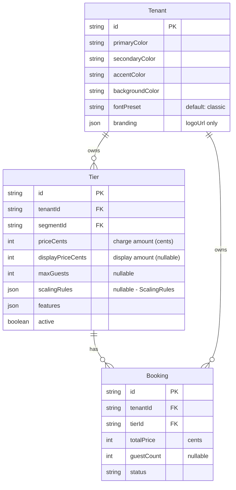

# Per-Person Scaling Pricing + Per-Tenant Visual Theming

## Overview

Two enterprise-grade features built sequentially. **Phase 1** adds per-person scaling pricing to the Tier model, booking flow, and Stripe checkout — enabling retreat hosts, private chefs, and workshop leaders to charge per guest. **Phase 2** completes the partially-built per-tenant theming system with CSS custom properties, Tailwind theme mapping, font presets, and a classy default theme.

**Branch:** `feat/per-person-pricing-tenant-theming`

## Important Context

**No real users yet — clean database.** This means:

- No data migration SQL needed (no existing tenant data to preserve)
- Can set new defaults directly in schema (no migration for existing rows)
- Can use `prisma migrate reset` freely if migrations conflict
- No backwards compatibility constraints on DTOs
- Can make breaking changes without feature flags

## Problem Statement

1. **Pricing:** Tier model only supports flat `priceCents`. Real service businesses need per-person scaling: "Dinner is $110/person for 2-10 guests." No guest count is captured in the booking flow. No way to display or charge per-person rates.

2. **Theming:** All storefronts look identical — hardcoded Macon brand colors and fonts. Tenant color columns exist but aren't injected as CSS. No dynamic font loading. The agent can update branding but it has no visible effect on most components.

## ERD: Schema Changes



---

## Phase 1: Per-Person Scaling Pricing

### 1.1 Schema Migration

**Migration name:** `add_per_person_pricing_fields`

Add to `Tier` model in `server/prisma/schema.prisma`:

```prisma
maxGuests        Int?     // Max guests for this tier (null = no limit)
scalingRules     Json?    // ScalingRules JSON (validated by Zod)
displayPriceCents Int?    // Display price if different from charge price
```

Add to `Booking` model:

```prisma
guestCount       Int?     // Number of guests for this booking
```

**Migration SQL:**

```sql
ALTER TABLE "Tier" ADD COLUMN "maxGuests" INTEGER;
ALTER TABLE "Tier" ADD COLUMN "scalingRules" JSONB;
ALTER TABLE "Tier" ADD COLUMN "displayPriceCents" INTEGER;
ALTER TABLE "Booking" ADD COLUMN "guestCount" INTEGER;

-- Index for guest capacity queries
CREATE INDEX "Tier_tenantId_maxGuests_idx" ON "Tier"("tenantId", "maxGuests");
```

**Files:**

- [ ] `server/prisma/schema.prisma` — Add 3 fields to Tier, 1 to Booking
- [ ] `server/prisma/migrations/YYYYMMDDHHMMSS_add_per_person_pricing_fields/migration.sql`

### 1.2 Contracts: Zod Schemas + DTOs

**New schema file:** `packages/contracts/src/schemas/scaling-rules.schema.ts`

```typescript
import { z } from 'zod';

export const ScalingComponentSchema = z.object({
  name: z.string().min(1).max(100),
  includedGuests: z.number().int().min(0),
  perPersonCents: z.number().int().min(0),
  maxGuests: z.number().int().min(1).optional(),
});

export const ScalingRulesSchema = z.object({
  components: z.array(ScalingComponentSchema).min(1).max(10),
});

export type ScalingComponent = z.infer<typeof ScalingComponentSchema>;
export type ScalingRules = z.infer<typeof ScalingRulesSchema>;
```

**Update existing DTOs in `packages/contracts/src/dto.ts`:**

```typescript
// TierDto — add fields
maxGuests: z.number().int().nullable(),
scalingRules: ScalingRulesSchema.nullable(),
displayPriceCents: z.number().int().nullable(),

// BookingDto — add field
guestCount: z.number().int().nullable(),

// CreateDateBookingDto — add field
guestCount: z.number().int().min(1).max(100).optional(),
```

**Files:**

- [ ] `packages/contracts/src/schemas/scaling-rules.schema.ts` — New file
- [ ] `packages/contracts/src/schemas/tier.schema.ts` — Re-export scaling rules
- [ ] `packages/contracts/src/dto.ts` — Update TierDto, BookingDto, CreateDateBookingDto
- [ ] `packages/contracts/src/index.ts` — Export new schema

### 1.3 Pricing Engine Service

**New service:** `server/src/services/scaling-price.service.ts`

```typescript
interface ScalingPriceResult {
  basePriceCents: number; // Tier's priceCents
  scalingTotalCents: number; // Sum of per-person charges
  totalBeforeCommission: number; // base + scaling
  componentBreakdown: Array<{
    name: string;
    includedGuests: number;
    additionalGuests: number;
    perPersonCents: number;
    subtotalCents: number;
  }>;
}

function calculateScalingPrice(
  tier: { priceCents: number; scalingRules: ScalingRules | null; maxGuests: number | null },
  guestCount: number
): ScalingPriceResult;
```

**Logic:**

1. If no `scalingRules`, return `basePriceCents` as-is (flat pricing)
2. Validate `guestCount` against `maxGuests`
3. For each component: `additionalGuests = max(0, guestCount - component.includedGuests)`
4. Component subtotal: `additionalGuests * component.perPersonCents`
5. Total: `basePriceCents + sum(component subtotals)`

**Integration:** Called by `WeddingBookingOrchestrator.createDateBooking()` before checkout session creation.

**Files:**

- [ ] `server/src/services/scaling-price.service.ts` — New service
- [ ] `server/src/services/scaling-price.service.test.ts` — Unit tests
- [ ] `server/src/di.ts` — Register in DI container

### 1.4 Backend: Booking Flow Updates

**Update `WeddingBookingOrchestrator.createDateBooking()`** in `server/src/services/wedding-booking.orchestrator.ts`:

1. Accept `guestCount` from request DTO
2. If tier has `scalingRules` and `guestCount` not provided → error
3. Call `ScalingPriceService.calculateScalingPrice(tier, guestCount)`
4. Pass calculated total to `WeddingDepositService.calculateDeposit()` (replaces `tier.priceCents`)
5. Include `guestCount` in Stripe metadata
6. Store `guestCount` on Booking record

**Update `BookingService.onPaymentCompleted()`** in `server/src/services/booking.service.ts`:

1. Read `guestCount` from Stripe metadata
2. Pass to booking creation

**Update `CheckoutSessionFactory`** in `server/src/services/checkout-session.factory.ts`:

1. Add `guestCount` to metadata schema
2. Include guest count in line item description: `"Curated Weekend (6 guests)"`

**Update route validation** in `server/src/routes/public-date-booking.routes.ts`:

1. Add `guestCount` to `CreateDateBookingDtoSchema` validation
2. Validate against tier's `maxGuests`

**Files:**

- [ ] `server/src/services/wedding-booking.orchestrator.ts` — Add scaling price calculation
- [ ] `server/src/services/booking.service.ts` — Accept guestCount in onPaymentCompleted
- [ ] `server/src/services/checkout-session.factory.ts` — guestCount in metadata + line item description
- [ ] `server/src/routes/public-date-booking.routes.ts` — Accept guestCount, validate vs maxGuests

### 1.5 Agent Tool: manage_tiers Update

**Update** `server/src/agent-v2/deploy/tenant/src/tools/tiers.ts`:

Add parameters:

```typescript
maxGuests: z.number().int().min(1).max(100).optional()
  .describe('Maximum number of guests for this tier'),
displayPriceInDollars: z.number().optional()
  .describe('Display price in dollars if different from charge price (e.g., includes venue)'),
scalingRules: z.object({
  components: z.array(z.object({
    name: z.string().describe('Component name, e.g., "Private Chef Dinner"'),
    includedGuests: z.number().int().describe('Guests included in base price'),
    perPersonDollars: z.number().describe('Additional cost per person in DOLLARS'),
  })).max(10),
}).optional().describe('Per-person pricing rules'),
```

**Key pattern:** Agent sends `perPersonDollars`, tool converts to `perPersonCents` (LLMs are bad at cent math — Pitfall from existing tool).

**Backend endpoint:** Update `POST /internal/tenants/:tenantId/tiers` (create) and `PATCH /internal/tenants/:tenantId/tiers/:tierId` (update) to accept new fields.

**Files:**

- [ ] `server/src/agent-v2/deploy/tenant/src/tools/tiers.ts` — Add scaling params
- [ ] `server/src/routes/content-generation.routes.ts` — Accept new fields in tier CRUD

### 1.6 Frontend: Guest Count Step

**Update** `apps/web/src/components/booking/DateBookingWizard.tsx`:

1. Change `STEP_LABELS` from `['Confirm', 'Date', 'Details', 'Pay']` to `['Confirm', 'Guests', 'Date', 'Details', 'Pay']`
2. Add `GuestCountStep` memoized component
3. Add state: `guestCount`, `scalingBreakdown`
4. Calculate price client-side for display (backend recalculates authoritatively)
5. Only show Guests step if tier has `maxGuests` or `scalingRules` (skip for flat-price tiers)
6. Pass `guestCount` to booking API call

**GuestCountStep component shows:**

- Stepper (+/-) for guest count with min 1, max `tier.maxGuests`
- Live price breakdown per scaling component
- Total price updating in real-time

**New utility:** `apps/web/src/lib/pricing.ts`

```typescript
export function calculateScalingPrice(tier: TierDto, guestCount: number): PriceBreakdown;
export function formatPriceDisplay(tier: TierDto): string;
// Returns "From $1,000" for flat, "$110/person" for per-person
```

**Update tier cards** to display per-person pricing:

- If tier has `scalingRules`: show "From $X" or "$Y/person"
- If tier has `displayPriceCents`: show display price, not charge price

**Files:**

- [ ] `apps/web/src/components/booking/DateBookingWizard.tsx` — Add Guests step
- [ ] `apps/web/src/lib/pricing.ts` — New: client-side price calculation + display formatting
- [ ] `apps/web/src/components/tier/TierCard.tsx` (or equivalent) — Per-person price display

### 1.7 Tests

**Unit tests:**

- [ ] `server/src/services/scaling-price.service.test.ts` — Price calculations for all sample data scenarios:
  - Flat tier (no scaling rules) → returns base price
  - Single component (dinner $110/person, 2 included, 6 guests) → correct total
  - Multi-component (floral $60 + meal $90, 6 guests) → correct total
  - Guest count below included → no additional charge
  - Guest count at max → correct total
  - Guest count exceeds max → error
  - Edge: 0 scaling components → returns base price
  - Edge: all components have includedGuests > guestCount → base price only

**Integration tests:**

- [ ] Booking creation with guest count flows through to Stripe metadata
- [ ] Booking record stores guestCount correctly
- [ ] Tenant isolation: tier scaling rules scoped by tenantId

**Constants sync test:**

- [ ] Extend `server/src/lib/constants-sync.test.ts` — verify ScalingRulesSchema available in agent deploy

### 1.8 Acceptance Criteria (Phase 1)

- [ ] Tier model supports `maxGuests`, `scalingRules`, `displayPriceCents` fields
- [ ] Booking model stores `guestCount`
- [ ] Agent can create tiers with per-person pricing via `manage_tiers` tool
- [ ] Booking wizard shows Guests step when tier has scaling rules
- [ ] Guest count drives live price calculation in wizard
- [ ] Stripe checkout charges correct scaled amount
- [ ] Booking record reflects guest count and correct total
- [ ] Flat-price tiers skip the Guests step (no regression)
- [ ] All sample data scenarios calculate correctly (elopement, retreat, getaway)
- [ ] Both workspaces typecheck clean

---

## Phase 2: Per-Tenant Visual Theming

### 2.1 Schema Migration

**Migration name:** `add_font_preset_to_tenant`

Add to `Tenant` model in `server/prisma/schema.prisma`:

```prisma
fontPreset       String    @default("classic")  // Font preset name
```

**Migration SQL:**

```sql
ALTER TABLE "Tenant" ADD COLUMN "fontPreset" TEXT NOT NULL DEFAULT 'classic';
```

**Branding JSON cleanup:** The `branding` JSON field retains `logoUrl` only. The `fontFamily` key in branding JSON becomes ignored (superseded by `fontPreset` column). No destructive migration needed — just stop reading it.

**Files:**

- [ ] `server/prisma/schema.prisma` — Add fontPreset to Tenant
- [ ] `server/prisma/migrations/YYYYMMDDHHMMSS_add_font_preset_to_tenant/migration.sql`

### 2.2 Contracts: Font Presets Constant + Updated DTOs

**New file:** `packages/contracts/src/constants/font-presets.ts`

```typescript
export interface FontPreset {
  heading: string; // Google Font family name
  body: string; // Google Font family name
  headingFallback: string; // CSS fallback stack
  bodyFallback: string;
  googleFontsUrl: string; // Prebuilt <link> href
  description: string; // For agent: "Clean and modern"
}

export const FONT_PRESETS: Record<string, FontPreset> = {
  classic: {
    heading: 'Playfair Display',
    body: 'Inter',
    headingFallback: 'Georgia, serif',
    bodyFallback: 'system-ui, sans-serif',
    googleFontsUrl:
      'https://fonts.googleapis.com/css2?family=Inter:wght@400;500;600;700&family=Playfair+Display:wght@400;700&display=swap',
    description: 'Elegant and timeless',
  },
  modern: {
    heading: 'DM Sans',
    body: 'DM Sans',
    headingFallback: 'system-ui, sans-serif',
    bodyFallback: 'system-ui, sans-serif',
    googleFontsUrl:
      'https://fonts.googleapis.com/css2?family=DM+Sans:wght@400;500;600;700&display=swap',
    description: 'Clean and contemporary',
  },
  warm: {
    heading: 'Lora',
    body: 'Source Sans 3',
    headingFallback: 'Georgia, serif',
    bodyFallback: 'system-ui, sans-serif',
    googleFontsUrl:
      'https://fonts.googleapis.com/css2?family=Lora:wght@400;700&family=Source+Sans+3:wght@400;600&display=swap',
    description: 'Warm and inviting',
  },
  // ... 5-7 more presets
} as const;

export const FONT_PRESET_NAMES = Object.keys(FONT_PRESETS) as Array<keyof typeof FONT_PRESETS>;
```

**Update DTOs:**

```typescript
// TenantPublicDto — add fontPreset
fontPreset: z.string().optional(),

// UpdateBrandingDto — add fontPreset
fontPreset: z.enum(FONT_PRESET_NAMES).optional(),
```

**Files:**

- [ ] `packages/contracts/src/constants/font-presets.ts` — New file: FONT_PRESETS constant
- [ ] `packages/contracts/src/index.ts` — Export font presets
- [ ] `packages/contracts/src/dto.ts` — Update TenantPublicDto, UpdateBrandingDto

### 2.3 CSS Custom Properties Injection

**Update** `apps/web/src/components/tenant/TenantSiteShell.tsx`:

Inject a `<style>` tag (or inline style on root div) with CSS custom properties derived from tenant data:

```typescript
const fontPreset = FONT_PRESETS[tenant.fontPreset || 'classic'] || FONT_PRESETS.classic;

const themeVars = {
  '--color-primary': tenant.primaryColor || '#2d3436',
  '--color-secondary': tenant.secondaryColor || '#b8860b',
  '--color-accent': tenant.accentColor || '#8B9E86',
  '--color-background': tenant.backgroundColor || '#ffffff',
  '--font-heading': `'${fontPreset.heading}', ${fontPreset.headingFallback}`,
  '--font-body': `'${fontPreset.body}', ${fontPreset.bodyFallback}`,
} as React.CSSProperties;
```

**Google Fonts `<link>` injection** — add to the layout's `<head>`:

```typescript
// In the layout.tsx or via next/head
<link rel="preconnect" href="https://fonts.googleapis.com" />
<link rel="preconnect" href="https://fonts.gstatic.com" crossOrigin="anonymous" />
<link href={fontPreset.googleFontsUrl} rel="stylesheet" />
```

**Both route trees** must inject: `apps/web/src/app/t/[slug]/(site)/layout.tsx` AND `apps/web/src/app/_domain/(site)/layout.tsx` — both already use `TenantSiteShell`, so the injection happens automatically via the shared component.

**Files:**

- [ ] `apps/web/src/components/tenant/TenantSiteShell.tsx` — Inject CSS vars + font link
- [ ] `apps/web/src/app/t/[slug]/(site)/layout.tsx` — May need head metadata for fonts
- [ ] `apps/web/src/app/_domain/(site)/layout.tsx` — Same head metadata

### 2.4 Tailwind Config: Theme Mapping

**Update** `apps/web/tailwind.config.js`:

```javascript
theme: {
  extend: {
    colors: {
      // Replace hardcoded hex with CSS var references
      primary: {
        DEFAULT: 'var(--color-primary)',
        foreground: '#FFFFFF',
      },
      secondary: {
        DEFAULT: 'var(--color-secondary)',
        foreground: '#FFFFFF',
      },
      accent: {
        DEFAULT: 'var(--color-accent)',
        foreground: '#FFFFFF',
      },
      // Keep macon-* colors for platform pages (admin, login, etc.)
      'macon-navy': { DEFAULT: '#1a365d', /* ... */ },
      'macon-orange': { DEFAULT: '#d97706', /* ... */ },
      'macon-teal': { DEFAULT: '#0d9488', /* ... */ },
    },
    fontFamily: {
      heading: 'var(--font-heading)',
      body: 'var(--font-body)',
    },
  },
},
```

**Key design decision:** Keep `macon-*` prefixed colors for platform pages (admin dashboard, login). The `primary`/`secondary`/`accent` tokens become tenant-aware via CSS vars. This means platform pages (not within TenantSiteShell) fall back to the CSS var defaults or use `macon-*` explicitly.

**Files:**

- [ ] `apps/web/tailwind.config.js` — Map semantic tokens to CSS vars

### 2.5 Component Migration: Hardcoded → Theme-Aware

Migrate storefront components from hardcoded Macon colors to theme-aware classes. This is an incremental process — the CSS var defaults match the current Macon colors, so unreachered components won't break.

**Priority components (tenant-facing):**

- [ ] `apps/web/src/components/tenant/TenantNav.tsx` — Nav background, link colors
- [ ] `apps/web/src/components/tenant/TenantFooter.tsx` — Footer background, text
- [ ] `apps/web/src/components/sections/HeroSection.tsx` — CTA button color
- [ ] `apps/web/src/components/sections/PricingSection.tsx` — Tier card accents
- [ ] `apps/web/src/components/sections/FeaturesSection.tsx` — Feature highlights
- [ ] `apps/web/src/components/sections/AboutSection.tsx` — Accent colors
- [ ] `apps/web/src/components/booking/DateBookingWizard.tsx` — Button colors, accents
- [ ] `apps/web/src/components/chat/CustomerChatWidget.tsx` — Already uses primaryColor prop → switch to CSS var
- [ ] `apps/web/src/components/tenant/StickyMobileCTA.tsx` — CTA button

**Migration pattern per component:**

```diff
- <button className="bg-macon-navy text-white hover:bg-macon-navy/90">
+ <button className="bg-primary text-white hover:bg-primary/90">
```

**Drift prevention:** Add `// MIGRATION[theming]: expires 2026-03-16` comments to any component not yet migrated. All components must be migrated within 30 days per `DUAL_SYSTEM_MIGRATION_DRIFT_PREVENTION.md`.

### 2.6 Default Theme: Neutral-Elegant Palette

Design a new default palette that works universally for service professionals. Replace the Macon brand defaults directly in the Prisma schema. **No data migration needed** — no real users, clean database.

**Proposed defaults (finalize during implementation):**

```
primaryColor:     #2d3436  (deep charcoal — professional, works with any accent)
secondaryColor:   #b8860b  (warm gold — subtle luxury)
accentColor:      #8B9E86  (sage green — the HANDLED signature color)
backgroundColor:  #ffffff  (clean white)
fontPreset:       classic  (Playfair Display + Inter)
```

Just update the `@default()` values in schema.prisma and run `prisma migrate dev`.

**Files:**

- [ ] `server/prisma/schema.prisma` — Update default values for color columns

### 2.7 Agent Tool: update_branding Update

**Update** `server/src/agent-v2/deploy/tenant/src/tools/branding.ts`:

1. Add `fontPreset` parameter (validated against `FONT_PRESET_NAMES`)
2. Write colors to dedicated columns (not branding JSON)
3. Write fontPreset to dedicated column
4. Branding JSON only for logoUrl

**Add semantic description support:** Agent maps "warm and earthy" → suggest `warm` preset + earth-tone colors. This is prompt engineering in the system prompt, not code.

**Copy FONT_PRESET_NAMES to agent deploy** (Cloud Run can't import from contracts):

- [ ] `server/src/agent-v2/deploy/tenant/src/constants/font-presets.ts` — Copy of preset names
- [ ] Extend `constants-sync.test.ts` to verify agent copy matches contracts canonical

**Files:**

- [ ] `server/src/agent-v2/deploy/tenant/src/tools/branding.ts` — Add fontPreset, write to columns
- [ ] `server/src/agent-v2/deploy/tenant/src/constants/font-presets.ts` — Preset names for agent
- [ ] `server/src/routes/tenant-admin-branding.routes.ts` — Accept fontPreset in update
- [ ] `server/src/lib/constants-sync.test.ts` — Verify font preset sync

### 2.8 Tests

**Unit tests:**

- [ ] `apps/web/src/lib/__tests__/font-presets.test.ts` — All presets have valid Google Fonts URLs
- [ ] Theme variable injection produces correct CSS

**Integration tests:**

- [ ] Tenant with custom colors → storefront renders with those colors (visual regression or snapshot)
- [ ] Tenant with custom fontPreset → correct Google Fonts URL injected
- [ ] Default tenant → classic theme applied
- [ ] Agent `update_branding` with fontPreset → column updated correctly

**Constants sync test:**

- [ ] Agent FONT_PRESET_NAMES matches contracts FONT_PRESET_NAMES

### 2.9 Acceptance Criteria (Phase 2)

- [ ] Tenant storefronts use CSS custom properties for all brand colors
- [ ] `bg-primary`, `text-secondary`, `font-heading` Tailwind classes resolve to tenant colors
- [ ] Font presets system with 8-10 named options (heading + body paired)
- [ ] Google Fonts loaded dynamically via `<link>` tag with `font-display: swap`
- [ ] New neutral-elegant default theme (not Macon brand colors)
- [ ] Agent can set colors and font preset conversationally
- [ ] Platform pages (admin, login) unaffected — use `macon-*` colors
- [ ] Both `[slug]` and `_domain` route trees get theming (via shared TenantSiteShell)
- [ ] No layout shift from font loading
- [ ] Both workspaces typecheck clean
- [ ] All components migrated within 30-day window (no permanent hardcoded colors on tenant pages)

---

## Alternative Approaches Considered

### Scaling Rules: Separate Table vs JSON

Rejected separate `ScalingRule` table because rules are always read with their tier (no independent queries). JSON avoids join complexity and doesn't require migrations when the schema shape evolves.

### Theming: Inline Styles vs CSS Custom Properties

Rejected inline styles (React context + `style={{}}`) because it loses Tailwind utility support (hover states, responsive breakpoints, opacity modifiers). CSS custom properties are the industry standard for runtime theming.

### Fonts: Individual Selection vs Paired Presets

Rejected individual font selection because service professionals aren't designers — bad pairings make storefronts look unprofessional. Paired presets guarantee every combination looks polished.

### Venue Split: Deduction Engine vs Two Price Fields

Rejected a `priceAdjustments` deduction engine because it adds calculation complexity. Two explicit fields (`priceCents` for charge, `displayPriceCents` for display) make intent clear and are trivial to implement.

---

## Risk Analysis

| Risk                                  | Likelihood | Impact                                 | Mitigation                                                                          |
| ------------------------------------- | ---------- | -------------------------------------- | ----------------------------------------------------------------------------------- |
| Scaling price calculation bugs        | Medium     | High (wrong Stripe charges)            | Comprehensive unit tests with all sample data; backend recalculates authoritatively |
| Tailwind class migration misses       | Medium     | Low (component looks like Macon brand) | 30-day migration window; feature parity matrix tracking                             |
| Font preset constant drift            | Low        | Medium (agent sets invalid preset)     | Constants sync test catches immediately                                             |
| CSS var cascade issues                | Low        | Medium (colors don't apply)            | CSS vars on root div; Tailwind maps at config level                                 |
| Google Fonts loading delay            | Low        | Low (fallback fonts render first)      | `font-display: swap` prevents layout shift                                          |
| Guest count not validated server-side | Low        | High (wrong charges)                   | Backend always recalculates; never trust frontend total                             |

---

## Implementation Checklist Summary

### Phase 1: Per-Person Scaling Pricing

- [ ] 1.1 Schema migration (Tier: maxGuests, scalingRules, displayPriceCents; Booking: guestCount)
- [ ] 1.2 Contracts (ScalingRulesSchema, updated DTOs)
- [ ] 1.3 Pricing engine service + unit tests
- [ ] 1.4 Backend booking flow updates (orchestrator, checkout, webhook)
- [ ] 1.5 Agent tool: manage_tiers with scaling params
- [ ] 1.6 Frontend: Guests step in wizard + per-person price display
- [ ] 1.7 All tests pass, both workspaces typecheck clean

### Phase 2: Per-Tenant Visual Theming

- [ ] 2.1 Schema migration (fontPreset column)
- [ ] 2.2 Contracts (FONT_PRESETS constant, updated DTOs)
- [ ] 2.3 CSS custom properties injection in TenantSiteShell
- [ ] 2.4 Tailwind config: semantic tokens → CSS vars
- [ ] 2.5 Component migration (priority storefront components)
- [ ] 2.6 Default theme palette + migration for existing tenants
- [ ] 2.7 Agent tool: update_branding with fontPreset
- [ ] 2.8 Constants sync test for font presets
- [ ] 2.9 All tests pass, both workspaces typecheck clean

---

## References

### Internal

- Brainstorm: `docs/brainstorms/2026-02-16-segment-tier-pricing-theming-brainstorm.md`
- Constants drift prevention: `docs/solutions/patterns/CONSTANTS_DUPLICATION_TRAP_SECTION_TYPES.md`
- Dual-system migration: `docs/solutions/patterns/DUAL_SYSTEM_MIGRATION_DRIFT_PREVENTION.md`
- Schema deprecation: `docs/solutions/database-issues/SCHEMA_DEPRECATION_SAFE_DROP_PATTERN.md`
- Prevention quick reference: `docs/solutions/PREVENTION-QUICK-REFERENCE.md`

### Key Source Files

- Tier schema: `server/prisma/schema.prisma:268`
- Tier Zod schema: `packages/contracts/src/schemas/tier.schema.ts`
- Booking orchestrator: `server/src/services/wedding-booking.orchestrator.ts`
- Checkout factory: `server/src/services/checkout-session.factory.ts`
- Commission service: `server/src/services/commission.service.ts`
- Booking wizard: `apps/web/src/components/booking/DateBookingWizard.tsx`
- TenantSiteShell: `apps/web/src/components/tenant/TenantSiteShell.tsx`
- Agent tiers tool: `server/src/agent-v2/deploy/tenant/src/tools/tiers.ts`
- Agent branding tool: `server/src/agent-v2/deploy/tenant/src/tools/branding.ts`
- Tailwind config: `apps/web/tailwind.config.js`
