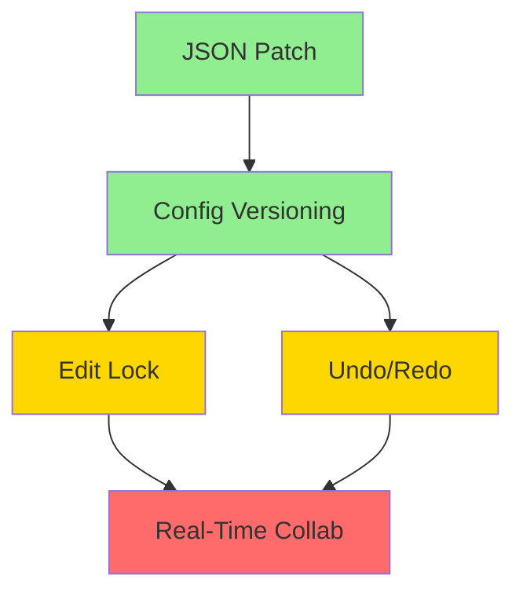

# Enterprise Build Mode Roadmap

> **Status:** Future | **Created:** 2026-01-12 | **Priority:** P3 (after integrity fixes)

## Overview

This document captures **enterprise-grade enhancements** for Build Mode that go beyond bug fixes. These features are designed for scale, multi-user editing, and performance optimization.

**Prerequisites:** Complete `plans/agent-system-integrity-fixes.md` (Phases 1-5) before starting this work.

## Deferred Features

### 1. JSON Patch for Config Updates

**Current State:** Build Mode sends full config objects via postMessage on every change.

**Problem:**

- Full config pushes are ~10-50KB per update
- Inefficient for real-time collaborative editing
- Race conditions possible with concurrent updates

**Enterprise Solution:**

```typescript
// Instead of sending full config:
postMessage({ type: 'UPDATE_CONFIG', data: fullConfig });

// Use JSON Patch (RFC 6902):
postMessage({
  type: 'PATCH_CONFIG',
  patch: [
    { op: 'replace', path: '/pages/home/sections/0/content/headline', value: 'New Headline' },
  ],
});
```

**Files to modify:**

- `apps/web/src/components/preview/PreviewPanel.tsx`
- `apps/web/src/hooks/useBuildModeSync.ts`
- Add `fast-json-patch` or similar library

**Benefits:**

- 100x smaller payloads for single-field edits
- Foundation for operational transform (collaborative editing)
- Easier conflict detection

**Effort estimate:** 2-3 days

---

### 2. Config Versioning

**Current State:** No version tracking for config changes.

**Problem:**

- Can't detect concurrent edits in multiple tabs
- No undo/redo history
- No audit trail of changes

**Enterprise Solution:**

```typescript
interface VersionedConfig {
  version: number;
  updatedAt: Date;
  updatedBy: string;
  config: PagesConfig;
  patches?: JsonPatch[]; // Optional: store patches for undo
}

// On save, include version for optimistic locking:
await api.saveLandingPageConfig({
  config: newConfig,
  expectedVersion: currentVersion, // Server rejects if mismatch
});
```

**Database changes:**

```sql
ALTER TABLE branding ADD COLUMN config_version INTEGER DEFAULT 1;
ALTER TABLE branding ADD COLUMN config_updated_at TIMESTAMP;
ALTER TABLE branding ADD COLUMN config_updated_by UUID REFERENCES users(id);
```

**Effort estimate:** 3-4 days

---

### 3. Edit Lock / Multi-Tab Detection

**Current State:** Multiple browser tabs can edit the same config simultaneously.

**Problem:**

- Last write wins, causing data loss
- No warning when another tab/user is editing
- Referenced in `todos/242-deferred-p2-concurrent-tab-detection.md`

**Enterprise Solution:**

**Option A: Optimistic Locking (simpler)**

```typescript
// Use config_version from above
// Show conflict resolution UI when versions diverge
```

**Option B: Pessimistic Locking (more robust)**

```typescript
// Acquire edit lock before entering Build Mode
const lock = await api.acquireEditLock({
  tenantId,
  resourceType: 'landing_page_config',
  ttlSeconds: 300, // 5 min auto-release
});

// Heartbeat to extend lock while editing
setInterval(() => api.extendEditLock(lock.id), 60_000);

// Release on exit
window.addEventListener('beforeunload', () => {
  navigator.sendBeacon('/api/release-lock', JSON.stringify({ lockId: lock.id }));
});
```

**UI considerations:**

- Show "Sarah is currently editing" banner
- Show "Your changes may overwrite recent edits" warning
- Offer "Take over editing" option (with confirmation)

**Effort estimate:** 4-5 days

---

### 4. Real-Time Collaborative Editing

**Current State:** Single-user editing only.

**Problem:**

- Teams can't collaborate in real-time
- No presence awareness
- No cursor sharing

**Enterprise Solution:**

This is a significant architecture change requiring:

1. WebSocket infrastructure (e.g., Socket.io, Ably, Liveblocks)
2. Operational Transform (OT) or CRDT for conflict resolution
3. Presence API for cursor/selection sharing
4. Permission model for who can edit simultaneously

**Recommended approach:** Use Liveblocks or similar managed service rather than building from scratch.

**Effort estimate:** 2-3 weeks

---

### 5. Undo/Redo Stack

**Current State:** No undo capability for config changes.

**Problem:**

- Users can't undo mistakes
- Only draft/publish provides safety net
- No granular change history

**Enterprise Solution:**

```typescript
// Client-side undo stack
interface UndoStack {
  past: JsonPatch[][]; // Reverse patches to undo
  future: JsonPatch[][]; // Forward patches to redo
}

function applyChange(patch: JsonPatch[]) {
  const reversePatch = jsonPatch.generate(config, patch);
  undoStack.past.push(reversePatch);
  undoStack.future = []; // Clear redo on new change
  applyPatch(config, patch);
}

function undo() {
  const patch = undoStack.past.pop();
  if (patch) {
    const reversePatch = jsonPatch.generate(config, patch);
    undoStack.future.push(reversePatch);
    applyPatch(config, patch);
  }
}
```

**Effort estimate:** 2-3 days (depends on JSON Patch being implemented first)

---

## Implementation Order



**Recommended order:**

1. **JSON Patch** (foundation for everything else)
2. **Config Versioning** (enables conflict detection)
3. **Edit Lock** OR **Undo/Redo** (parallel tracks)
4. **Real-Time Collab** (requires all above)

---

## Success Criteria

| Feature           | Metric                  | Target                            |
| ----------------- | ----------------------- | --------------------------------- |
| JSON Patch        | Payload size reduction  | >90% for single-field edits       |
| Config Versioning | Conflict detection rate | 100% of concurrent edits detected |
| Edit Lock         | Data loss incidents     | 0 per month                       |
| Undo/Redo         | Undo stack depth        | 50 operations                     |
| Real-Time Collab  | Sync latency            | <100ms                            |

---

## Related Documents

- `todos/242-deferred-p2-concurrent-tab-detection.md` - Original todo for multi-tab detection
- `plans/agent-system-integrity-fixes.md` - Prerequisite fixes (Phases 1-5)
- `docs/architecture/BUILD_MODE_VISION.md` - Build Mode architecture overview

---

## Decision Log

| Date       | Decision                                      | Rationale                                                                 |
| ---------- | --------------------------------------------- | ------------------------------------------------------------------------- |
| 2026-01-12 | Defer enterprise features to separate roadmap | Focus on integrity fixes first; these features require dedicated planning |
| 2026-01-12 | Recommend Liveblocks for real-time collab     | Building OT/CRDT from scratch is 10x effort for similar result            |

---

_Created during agent system integrity planning session_
