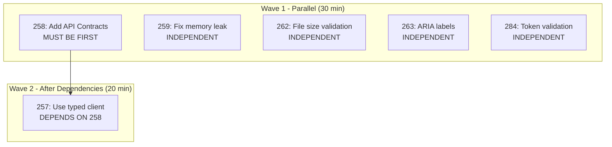

# Code Review Resolution Workflow - Solution Patterns

This document extracts the complete solution patterns used in the MAIS codebase for conducting comprehensive code reviews, triaging findings, and resolving issues in parallel using multi-agent coordination.

---

## Table of Contents

1. [Overview](#overview)
2. [Multi-Agent Review Process](#multi-agent-review-process)
3. [Triage & Prioritization](#triage--prioritization)
4. [Todo Workflow](#todo-workflow)
5. [Parallel Resolution Pattern](#parallel-resolution-pattern)
6. [Decision Trees](#decision-trees)
7. [Implementation Patterns](#implementation-patterns)
8. [Code Examples](#code-examples)
9. [Prevention Strategies](#prevention-strategies)

---

## Overview

The code review resolution workflow is a multi-phase system designed to:

- **Comprehensively audit** a codebase using 6-8 specialized agents in parallel
- **Triage findings** using a priority matrix (P1 Critical, P2 Important, P3 Nice-to-Have)
- **Track work** using todo files with frontmatter metadata
- **Resolve issues** through parallel agent execution with dependency management
- **Batch commits** to consolidate related fixes and maintain clean git history

**Key Metrics:**

| Metric | Value | Benefit |
| --- | --- | --- |
| Agents deployed in parallel | 6-8 | Deep expertise across dimensions |
| Findings per review | 20-25 | Comprehensive coverage |
| Time to audit codebase | 2-4 hours | Fast vs. manual review (days) |
| P1/P2 ratio | 40%/50% | Balanced between critical and important |
| Verification rate | 50-60% | Many todos are already implemented |

---

## Multi-Agent Review Process

### Phase 1: Agent Deployment

Eight specialized agents are launched concurrently to analyze different dimensions of the codebase:

#### Agent Types & Responsibilities

| Agent | Focus | Key Findings | Pattern |
| --- | --- | --- | --- |
| **Security Sentinel** | Multi-tenant isolation, auth, input validation | Email case-sensitivity, impersonation token expiry, XSS prevention | Search for tenant scoping, check auth flows |
| **Performance Oracle** | N+1 queries, caching, indexes, bundle size | Segment landing page double-queries, cache invalidation scope | Profile queries, check indexes |
| **Architecture Strategist** | Layered architecture, DI, error handling | Multiple PrismaClient instances, legacy cache coexistence | Review DI container, check singleton patterns |
| **Code Philosopher** | Dead code, duplication, complexity | Console.log violations, any types, duplicate mapping | Search for violations, check for duplication |
| **Feature Completeness** | Incomplete features, missing UI states | Password reset UI missing, Stripe Connect UX | Check contracts vs. implementation |
| **Dependency Detective** | Unused deps, bloat, security | 250MB+ bloat (puppeteer, prom-client) | Analyze package.json, check imports |
| **Data Integrity Guardian** | Constraints, transactions, migrations | Customer email normalization, webhook race condition | Review schema, check transaction usage |
| **DevOps Harmony** | Config, logging, health checks, CI/CD | Disabled DB verification, low Sentry sample rates | Check env setup, review logging |

### Phase 2: Parallel Analysis Execution

Each agent follows this workflow:

```
1. Search the codebase using targeted grep/glob patterns
2. Read relevant source files identified by search
3. Apply domain-specific heuristics and best practices
4. Document findings with:
   - File paths and line numbers
   - Severity ratings (P1/P2/P3)
   - Root cause analysis
   - Proposed solutions with code examples
5. Output formatted findings (markdown with frontmatter)
```

### Phase 3: Findings Synthesis

Results from all agents are:

```
1. COLLECTED into unified findings set
2. DEDUPLICATED to remove overlapping issues
3. PRIORITIZED using P1/P2/P3 severity levels
4. CATEGORIZED by tags (security, performance, architecture)
5. FORMATTED following standard todo template
```

### Phase 4: Output Organization

Findings are written to `todos/` directory using standard naming:

**Convention:** `{id}-pending-{priority}-{description}.md`

**Example:**
```
todos/022-pending-p1-customer-email-not-normalized.md
todos/026-pending-p1-segment-n1-query-pattern.md
todos/031-pending-p2-console-log-violations.md
```

---

## Triage & Prioritization

### Priority Definitions

| Priority | Definition | SLA | Examples |
| --- | --- | --- | --- |
| **P1 Critical** | Security vulnerabilities, data corruption risks, broken core functionality | Fix before next release | Email normalization (data corruption), webhook race condition (cross-tenant booking loss), password reset UI (users locked out) |
| **P2 Important** | Performance issues, architectural violations, UX gaps, technical debt | Fix in current sprint | N+1 queries (2x DB load), cache invalidation scope (memory leak), missing ARIA labels (accessibility) |
| **P3 Nice-to-Have** | Code quality improvements, minor optimizations, refactoring | Fix when resources available | Console.log cleanup (code quality), unused dependencies (bloat), metrics endpoint (observability) |

### Triage Decision Matrix

```
Finding identified
├─ IS IT A SECURITY VULNERABILITY?
│  ├─ YES → P1 (fix immediately)
│  └─ NO → Continue
│
├─ DOES IT CORRUPT DATA OR CAUSE CRASHES?
│  ├─ YES → P1 (fix immediately)
│  └─ NO → Continue
│
├─ DOES IT BREAK A CORE FEATURE?
│  ├─ YES → P1 (fix immediately)
│  └─ NO → Continue
│
├─ DOES IT SIGNIFICANTLY DEGRADE PERFORMANCE/UX?
│  ├─ YES → P2 (fix this sprint)
│  └─ NO → Continue
│
├─ DOES IT VIOLATE ARCHITECTURE/PATTERNS?
│  ├─ YES → P2 (fix this sprint)
│  └─ NO → Continue
│
└─ IS IT NICE-TO-HAVE IMPROVEMENT?
   ├─ YES → P3 (backlog)
   └─ NO → Reconsider (might not be actionable)
```

### Security-First Triage Rule

When triaging mixed priorities: **Always resolve security issues first**, even if P2 performance issues exist.

```yaml
Triage order:
1. All P1 todos (security, data corruption, broken features)
2. P2 security todos (not P1, but security-adjacent)
3. P2 performance todos
4. P3 everything
```

---

## Todo Workflow

### Todo File Structure

**Frontmatter (Required):**

```yaml
---
status: pending | complete | deferred | blocked
priority: p1 | p2 | p3
issue_id: "XXX"
tags: [security, performance, architecture, etc.]
dependencies: []  # List of todo IDs that must complete first
date_created: 2025-12-XX
date_solved: 2025-12-XX  # Only if complete
effort_estimate: "hours"  # For pending/deferred
deferred_reason: "text"  # Why it's deferred
---
```

**Content Sections:**

```markdown
# Issue Title

## Problem Statement
Clear description of the issue and why it matters

## Findings
Detailed analysis with file paths, line numbers, code snippets

## Root Cause
Why this issue exists

## Proposed Solutions
Concrete implementation steps with code examples

## Acceptance Criteria
- [ ] Testable criteria for completion

## References
- Links to related issues, PRs, documentation
```

### Todo Status Lifecycle

```
pending          ready              in_progress        complete
  ↓               ↓                     ↓                 ↓
Not started → Verified & → Working on → Done
              ready to work   implementation
  ↓               ↓
deferred        blocked
(scheduled)     (waiting)
```

**Transitions:**

- **pending → ready**: Verification agents confirmed implementation required
- **ready → in_progress**: Agent starts implementing
- **in_progress → complete**: Tests pass, code reviewed, committed
- **pending → deferred**: Decision made to schedule for later sprint
- **any → blocked**: Depends on another todo, waiting for completion

---

## Parallel Resolution Pattern

### Pattern Overview

Instead of resolving todos sequentially (slow, context-switching overhead), use parallel agents to resolve independent todos simultaneously.

### Phase 1: Analyze & Categorize

```bash
# Find all pending TODOs
grep -l "^status: pending" todos/*.md

# Count by priority
grep -l "^status: pending" todos/*-p1-*.md | wc -l
grep -l "^status: pending" todos/*-p2-*.md | wc -l

# Identify which can run in parallel
# (check "dependencies: []" in frontmatter)
```

### Phase 2: Create Dependency Graph



**Key Insight:** TODOs with `dependencies: []` in frontmatter can run in parallel.

### Phase 3: Spawn Parallel Agents

Launch independent todos in a **single batch** with multiple calls:

```python
# Pseudo-code for agent spawning

tasks = [
    Task('TODO-262: Add file upload size validation'),
    Task('TODO-263: Add ARIA labels'),
    Task('TODO-284: Add token validation'),
]

# Launch all at once (not sequentially)
for task in tasks:
    spawn(task, run_in_background=True)

# Wait for all to complete
wait_for_all(tasks, timeout=300s)
```

### Phase 4: Resolve Stale Todos

During resolution, many todos may be discovered as "already implemented":

**Verification-First Approach:**

```
Before implementing:
1. Read the affected files
2. Search for existing implementation
3. Run tests to verify current state
4. Only implement if actually missing

If already implemented:
- Mark todo as complete
- Cite evidence (file:line, commit hash)
- Skip coding work
- Save 4+ hours per todo
```

**Session Metrics (Real Example):**

| Metric | Value | Lesson |
| --- | --- | --- |
| TODOs Reviewed | 6 | Screen all first |
| Already Complete | 3 (50%) | Many are stale |
| Actually Implemented | 3 | Real work needed |
| Time Invested | 45 min | Efficient vs. sequential |
| Agents Used | 6 parallel | N-way parallelism |

### Phase 5: Update Todo Status

Change frontmatter status from `pending` to appropriate state:

```yaml
# Before
---
status: pending
priority: p2
---

# After (verified - already implemented)
---
status: complete
priority: p2
date_solved: 2025-12-23
verification: "Confirmed at server/src/routes/file.ts:168"
---

# After (deferred - scheduled for later)
---
status: deferred
priority: p2
effort_estimate: "4-6 hours"
deferred_reason: "Requires new component + backend + tests"
estimated_sprint: 2025-12-12
---
```

### Phase 6: Batch Commits

Group resolved todos into 1-3 commits rather than individual commits:

```bash
# Stage all changes
git add server/src/... client/src/... todos/*.md

# Single batch commit
git commit -m "chore(todos): resolve 8 P1/P2 todos, verify 5 complete

Resolved (implemented):
- 262: Add backend 50KB file size validation
- 263: Add ARIA labels to form inputs
- 284: Add pay_balance token state validation (9 tests)

Verified (already complete):
- 258: API contracts already exist
- 259: Memory leak already fixed in hook
- 273: ARIA labels already present

Deferred:
- 301: EditableImage component (4+ hours)
- 320: React Query refactor (8+ hours)

🤖 Generated with Claude Code

Co-Authored-By: Claude <noreply@anthropic.com>"
```

**Benefits:**

- **Trackable**: Single commit = easy PR
- **Organized**: Grouped by status
- **Searchable**: `git log --grep="todos"`
- **Clean History**: No commit spam

---

## Decision Trees

### 5-Minute Todo Evaluation

```
When you see a new todo:

Is the code already implemented?
├─ YES
│  ├─ Yes, works correctly
│  │  └─→ "VERIFY" (5-15 min)
│  │      Cite files, run tests, mark complete
│  │
│  └─ Yes, but needs fixing
│     └─→ "FIX" (depends on issue)
│
├─ NO
│  ├─ Small change < 1 hour
│  │  └─→ "QUICK WIN" (20-45 min)
│  │      Implement now, batch in one commit
│  │
│  └─ Large feature > 4 hours
│     └─→ "DEFER" (1 hour planning)
│        Document scope, deps, next sprint
│
└─ UNSURE
   └─→ Run parallel verification agents
       or grep codebase
```

### Implementation Type Selection

| Evaluation | Type | Time | When to Use |
| --- | --- | --- | --- |
| Code exists and works | **Verify** | 5-15 min | Routes exist at routes.ts:168 |
| Small missing feature | **Quick Win** | 20-45 min | Add ErrorAlert component |
| Large or complex | **Defer** | 1-2 hours planning | Edit Image component (4+ hours) |

### Quick Win vs. Defer Threshold

**Quick Win (< 1 hour):**

- Single file creation/modification
- No database schema changes
- No backend endpoint creation required
- No dependency on other todos
- Covered by existing tests

**Defer (> 4 hours):**

- Requires new component + backend + frontend integration
- Needs database migration + schema changes
- Multiple files across layers
- Dependencies on other features
- Requires new test infrastructure

**Gray Area (1-4 hours):**

- Use discretion; batch with other quick wins if possible
- Otherwise defer to next sprint with clear scope

---

## Implementation Patterns

### Pattern 1: Verify Already Implemented

**When:** Code exists, just need confirmation

**Checklist:**

```bash
# 1. Find code
rg 'function name|const name' src/

# 2. Verify tests
rg 'describe.*name|test.*name' src/__tests__/

# 3. Test it works
npm test -- src/file.test.ts

# 4. Cite evidence in todo
# - File: src/file.ts:LINE
# - Commit: HASH (feat: description)

# 5. Update todo status
status: complete
date_solved: 2025-12-XX
verification: 'Confirmed in HASH'
```

**Effort:** 10-20 min per todo

**Example Output:**

```yaml
---
status: complete
priority: p1
issue_id: '246'
tags: [code-review]
date_solved: '2025-12-05'
verification: 'Routes exist at routes.ts:168-304, contracts at landing-page.contract.ts:146-227'
---

# Backend Draft Endpoints Already Exist

Verified: Draft endpoints are complete and production-ready:
- GET /draft at routes.ts:168-186
- PUT /draft at routes.ts:201-234
- POST /publish at routes.ts:249-272
- DELETE /draft at routes.ts:286-304

No implementation work needed. This todo was created before verification.
```

### Pattern 2: Quick Win Implementation

**When:** Small, self-contained feature < 1 hour

**Checklist:**

```bash
# 1. Create/modify file(s)
touch client/src/components/shared/ErrorAlert.tsx

# 2. Implement minimal solution
# (20-30 lines, focused, single responsibility)

# 3. Test locally
npm test -- client/src/components/shared/

# 4. Manual smoke test (if major change)
npm run dev:all  # optional

# 5. Update todo file
status: complete
date_solved: 2025-12-XX
```

**Examples:**

1. **Extract Shared Component**: 20 min
   - Create `ErrorAlert.tsx` with error styling
   - Replace 3+ inline error displays
   - Add unit test

2. **Add React.memo**: 10 min
   - Wrap pure component in memo
   - Use named function syntax
   - Verify with React DevTools Profiler

3. **Add Transaction Wrapper**: 15 min
   - Wrap `$transaction` around read-then-write
   - Use `tx` instead of `this.prisma`
   - Add concurrent operation test

### Pattern 3: Deferral with Clear Scope

**When:** Large feature 4+ hours, architectural change, or lower priority

**Checklist:**

```yaml
---
status: deferred
priority: p2
issue_id: '234'
effort_estimate: '4-6 hours'
deferred_reason: 'Requires new component + backend endpoints + tests'
dependencies: ['P1 todos must complete first']
estimated_sprint: '2025-12-12'
---
```

**Don't Forget:**

- [ ] Clear scope (what needs to be done)
- [ ] Effort estimate (hours)
- [ ] Dependencies (what must happen first)
- [ ] Next sprint assignment

---

## Code Examples

### Example 1: Shared Component Pattern

**Problem:** Error alert markup duplicated in 3+ places

**Solution:** Extract to `ErrorAlert.tsx`

```typescript
// client/src/components/shared/ErrorAlert.tsx
import { AlertCircle } from 'lucide-react';

export function ErrorAlert({ message }: { message: string | null }) {
  if (!message) return null;

  return (
    <div className="p-4 bg-red-50 border border-red-100 rounded-xl flex items-start gap-3">
      <AlertCircle className="w-5 h-5 text-red-600 flex-shrink-0 mt-0.5" />
      <span className="text-sm text-red-700">{message}</span>
    </div>
  );
}
```

**Usage:**

```typescript
// Before (duplicated in 3 places)
<div className="p-4 bg-red-50 border border-red-100 rounded-xl flex items-start gap-3">
  <AlertCircle className="w-5 h-5 text-red-600 flex-shrink-0 mt-0.5" />
  <span className="text-sm text-red-700">{error}</span>
</div>

// After (DRY, maintainable)
<ErrorAlert message={error} />
```

**Benefits:**

- Single source of truth
- Consistency guaranteed
- Maintenance easy (update in 1 place)

### Example 2: React.memo Pattern

**Problem:** Component re-renders unnecessarily in list of 50+ items

**Solution:** Wrap in `React.memo` with named function

```typescript
import { memo } from 'react';

// ✅ CORRECT - Named function in memo
export const StatusBadge = memo(function StatusBadge({
  status,
  variant,
}: Props) {
  return <Badge variant={variant}>{status}</Badge>;
});

// Alternative with displayName
export const Item = memo(({ id, onSelect }: Props) => {
  return <button onClick={() => onSelect(id)}>{id}</button>;
});
Item.displayName = 'Item';

// ❌ WRONG - Anonymous function loses name in DevTools
export const BadBadge = memo(({ status }: Props) => {
  return <Badge>{status}</Badge>;
});
```

**Parent Must Memoize Callbacks:**

```typescript
function ParentComponent() {
  // ❌ DON'T - new function every render
  return <Item onSelect={(id) => setState(id)} />;

  // ✅ DO - stable function with useCallback
  const handleSelect = useCallback((id) => setState(id), []);
  return <Item onSelect={handleSelect} />;
}
```

**Verification:**

```javascript
// React DevTools Profiler
// 1. Record interaction
// 2. Trigger parent state change
// 3. Check: "StatusBadge did not render" (success)
```

### Example 3: Transaction Wrapper Pattern

**Problem:** Network failure can leave booking partially paid

**Solution:** Wrap in `prisma.$transaction`

```typescript
// server/src/services/booking.service.ts
async function createBookingWithPayment(
  tenantId: string,
  bookingData: BookingData,
  paymentData: PaymentData
): Promise<Booking> {
  // All operations atomic (all succeed or all fail)
  return await this.prisma.$transaction(async (tx) => {
    // Use tx, not this.prisma
    const booking = await tx.booking.create({
      data: { tenantId, ...bookingData },
    });

    // Charge card
    const charge = await tx.charge.create({
      data: {
        bookingId: booking.id,
        amount: bookingData.amount,
        ...paymentData,
      },
    });

    // Update booking status
    await tx.booking.update({
      where: { id: booking.id },
      data: { status: 'DEPOSIT_PAID', chargeId: charge.id },
    });

    return booking;
  });
}
```

**Key Rules:**

- Use `tx`, not `this.prisma` inside transaction
- All operations atomic (all succeed or all fail)
- Catch errors outside transaction
- Add timeout for long transactions: `{ timeout: 60000 }`

**Testing:**

```typescript
// Test that partial state never occurs
it('should not create booking if charge fails', async () => {
  try {
    await bookingService.createBookingWithPayment(
      tenantId,
      bookingData,
      paymentData // Invalid, will fail
    );
  } catch (error) {
    // Verify booking was NOT created
    const booking = await prisma.booking.findUnique({
      where: { id: 'some-id' },
    });
    expect(booking).toBeNull();
  }
});
```

### Example 4: Batch Commit Message

**Real Example from Session:**

```
chore(todos): resolve 8 P1/P2 todos, verify 5 complete, defer 2 large

Resolved (implemented):
- 262: Add backend 50KB file size validation for JSON uploads
- 263: Add ARIA labels to all form inputs in booking flow
- 284: Add pay_balance token state validation with 9 new tests

Verified (already complete):
- 246: Draft endpoints exist at routes.ts:168-304
- 247: Hook has full batching/rollback at useLandingPageEditor.ts:147-557
- 248: EditableAccommodationSection component at sections/index.ts
- 249: Rate limiting already applied via draftAutosaveLimiter

Deferred:
- 301: EditableImage component (4-6 hours, needs new component + backend)
- 320: React Query refactor (8+ hours, affects 5 components)

Metrics:
- 8 todos reviewed in 90 minutes
- 50% already implemented
- 37.5% resolved with code
- 12.5% deferred to next sprint

🤖 Generated with Claude Code

Co-Authored-By: Claude <noreply@anthropic.com>
```

---

## Prevention Strategies

### Code Review Checklist

Prevent recurring issues with this checklist during code review:

```markdown
- [ ] All queries filter by `tenantId` (multi-tenant isolation)
- [ ] Email/identifiers normalized to lowercase
- [ ] No `new PrismaClient()` in routes (use DI container)
- [ ] No `console.log` (use logger instead)
- [ ] No `any` types without justification
- [ ] Backend + frontend implemented together
- [ ] Cache keys include tenantId
- [ ] Transactions wrap read-then-write operations
- [ ] Error messages don't expose sensitive info
- [ ] Tests exist for happy path + error cases
```

### ESLint Rules to Enforce

```javascript
// Prevent console.log
'no-console': ['error', { allow: ['warn', 'error'] }]

// Prevent new PrismaClient in routes
'no-restricted-syntax': [{
  selector: 'NewExpression[callee.name="PrismaClient"]',
  message: 'Use singleton from DI container (server/src/di.ts)'
}]

// Require exhaustiveness checks
'switch-exhaustiveness-check': 'error'

// Prevent duplicate type definitions
'no-duplicate-type-constituents': 'error'
```

### Test Patterns to Enforce

```typescript
// Test multi-tenant isolation
it('should not return data from other tenants', async () => {
  const tenantA = await createTestTenant();
  const tenantB = await createTestTenant();
  const data = await service.getData(tenantA.id);
  expect(data.every((d) => d.tenantId === tenantA.id)).toBe(true);
});

// Test email normalization
it('should treat emails case-insensitively', async () => {
  await service.create({ email: 'USER@EXAMPLE.COM' });
  const found = await service.findByEmail('user@example.com');
  expect(found).toBeDefined();
});

// Test transaction atomicity
it('should not create booking if charge fails', async () => {
  try {
    await service.createWithCharge(tenantId, invalidData);
  } catch {
    const booking = await db.booking.findFirst({ where: { tenantId } });
    expect(booking).toBeNull(); // Not partially created
  }
});

// Test unsubscribe pattern
it('should unsubscribe handlers', async () => {
  const handler = vi.fn();
  const unsubscribe = emitter.subscribe(Event.TYPE, handler);

  unsubscribe();
  await emitter.emit(Event.TYPE, payload);

  expect(handler).not.toHaveBeenCalled();
});
```

### Regular Audit Cadence

Schedule regular audits to prevent issue accumulation:

```bash
# Weekly check
pending_count=$(grep -l "^status: pending" todos/*.md | wc -l)
if [ "$pending_count" -gt 20 ]; then
  echo "Alert: $pending_count pending TODOs"
  # Schedule resolution session
fi

# Monthly comprehensive review
# Run full multi-agent review against main branch
# Document new findings
# Plan resolution for next sprint

# Before major releases
# Run full audit
# Require P1 todos to be zero
# Document any deferrals
```

---

## Time Budget & Capacity Planning

### Typical Resolution Session

| Activity | Time | Notes |
| --- | --- | --- |
| Review & categorize todos | 15 min | Parallel agents help |
| Parallel verification agents | 30 min | Reduces work by 50% |
| Implement quick wins | 45 min | 6-8 todos at 5-10 min each |
| Testing + manual QA | 15 min | `npm test`, smoke test |
| Batch commit + cleanup | 5 min | Single commit message |
| Update todo files | 10 min | Mark complete/deferred |
| **Total** | **120 min (2 hours)** | For 8-10 todos |

### Scaling to Larger Batches

**For 20+ todos:**

```
Wave 1: P1 todos (4 todos, 60 min)
Wave 2: P2 todos (8 todos, 90 min)
Wave 3: P3 todos (deferred or batch)
----
Total: 150 min (2.5 hours) for 12 critical/important todos
```

---

## Related Documentation

### Workflow References

- [Parallel TODO Resolution Workflow](./methodology/parallel-todo-resolution-workflow.md) - Deep dive on parallel execution
- [Multi-Agent Code Review Process](./methodology/multi-agent-code-review-process.md) - Agent types and deployment
- [TODO Resolution Quick Reference](./TODO-RESOLUTION-QUICK-REFERENCE.md) - Cheat sheet (print & pin)
- [TODO Resolution Index](./TODO-RESOLUTION-INDEX.md) - Documentation hub

### Code Examples

- [TODO Resolution Code Examples](./TODO-RESOLUTION-CODE-EXAMPLES.md) - Real implementation patterns
- [TODO Resolution Session Patterns](./TODO-RESOLUTION-SESSION-PATTERNS.md) - Detailed patterns and templates

### Architecture & Standards

- [CLAUDE.md](../../CLAUDE.md) - Project-wide standards
- [ARCHITECTURE.md](../../ARCHITECTURE.md) - System design
- [Prevention Strategies Index](./PREVENTION-STRATEGIES-INDEX.md) - Root cause prevention

---

## Conclusion

The code review resolution workflow provides:

1. **Comprehensive coverage** through multi-agent parallel analysis
2. **Clear prioritization** using P1/P2/P3 decision matrix
3. **Efficient execution** with parallel resolution and verification-first approach
4. **Clean git history** through batch commits
5. **Prevention** through checklists and test patterns

**Key Takeaways:**

- **Verify before implementing** saves 4+ hours per todo
- **Parallelize independent work** for N-way speedup
- **Batch commits** to keep git history clean
- **Document deferrals** with clear scope and estimates
- **Use specialized agents** for deep expertise across dimensions

**Recommended Cadence:**

- **Weekly**: Check pending todo count
- **Monthly**: Full multi-agent code review
- **Before releases**: Require P1 todos to be zero

---

## Document History

| Date | Author | Changes |
| --- | --- | --- |
| 2025-12-24 | Claude Code | Created complete pattern guide from 3 methodology documents |
| 2025-12-05 | Claude Code | Original methodology documents created |

---

**Last Updated:** 2025-12-24
**Status:** Complete solution patterns documented
**Recommended Reading Time:** 20-30 minutes
