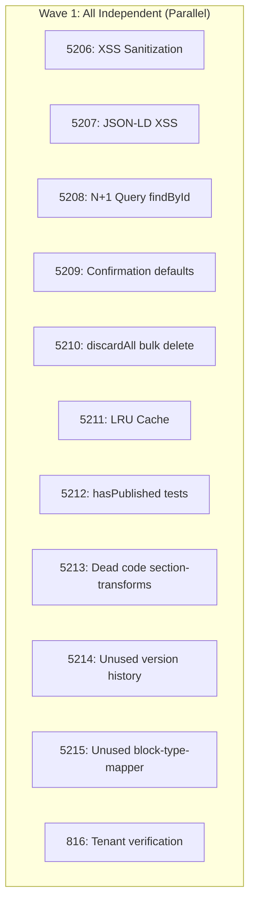

# Parallel TODO Resolution: 11 Code Review Todos

## Executive Summary

Resolved **11 code review findings** using **11 parallel agents** in ~5 minutes (vs ~1 hour sequential). Key patterns: XSS sanitization with DOMPurify, N+1 query elimination with `findById()`, LRU caching for published content, T3 confirmation enforcement, and ~1,100 lines of dead code removed.

**Commit:** `53ac3f8b`
**Branch:** `feat/section-content-migration`
**Tests:** 1,288 passing

## Problem

After completing Phase 5.2 of the Section Content Migration, `/resolve_todo_parallel` identified 11 issues from code review:

| Priority | Count | Description                                                    |
| -------- | ----- | -------------------------------------------------------------- |
| 🔴 P1    | 2     | Security: XSS sanitization, JSON-LD injection                  |
| 🟡 P2    | 6     | Performance + Quality: N+1 queries, T3 pattern, caching, tests |
| 🔵 P3    | 3     | Dead code removal: ~1,100 lines                                |

## Solution: 11 Parallel Agents

### Dependency Analysis



**Key Insight:** All 11 todos had `dependencies: []` in frontmatter, enabling full parallel execution.

### Agent Invocation Pattern

```typescript
// Launch ALL 11 agents in a single message
Task('Fix XSS sanitization (5206)', {
  subagent_type: 'general-purpose',
  run_in_background: true,
  prompt: `You are a PR comment resolver agent. Fix TODO #5206...
    ## Problem
    [Clear problem description]
    ## Solution Required
    [Step-by-step implementation guide]
    ## Acceptance Criteria
    [Checklist of what done looks like]
    After completing, run \`npm run typecheck\` to verify.`,
});
// Repeat for all 11 todos...
```

### Critical Success Factors

1. **Focused prompts**: Each agent got problem, solution approach, and acceptance criteria
2. **Independent verification**: Each agent ran `npm run typecheck` before completing
3. **Archive on completion**: Agents moved todos from `ready` to `complete` status
4. **Background execution**: Used `run_in_background: true` for parallel execution

## Key Fixes

### P1 #5206: XSS Sanitization

**Problem:** `SectionContentService.updateSection()` stored user content without sanitization.

**Solution:** Server-side DOMPurify with deep string sanitization:

```typescript
import DOMPurify from 'isomorphic-dompurify';

private sanitizeContent<T extends object>(content: T): T {
  return JSON.parse(
    JSON.stringify(content, (_key, value) =>
      typeof value === 'string' ? DOMPurify.sanitize(value) : value
    )
  );
}

// Called in updateSection() and addSection()
const sanitizedContent = this.sanitizeContent(content);
```

### P1 #5207: JSON-LD Script Injection

**Problem:** `dangerouslySetInnerHTML` with JSON-LD allowed `</script>` breakout.

**Solution:** Unicode escape dangerous characters:

```typescript
function safeJsonLd(data: object): string {
  return JSON.stringify(data)
    .replace(/</g, '\\u003c') // Prevents </script>
    .replace(/>/g, '\\u003e')
    .replace(/&/g, '\\u0026');
}
```

### P2 #5208: N+1 Query Elimination

**Problem:** `getSectionContent()` fetched ALL sections then filtered in memory.

**Solution:** Add `findById()` to repository interface:

```typescript
// In ISectionContentRepository
findById(tenantId: string, sectionId: string): Promise<SectionContent | null>;

// In PrismaSectionContentRepository
async findById(tenantId: string, sectionId: string) {
  return this.prisma.sectionContent.findFirst({
    where: { id: sectionId, tenantId }  // Indexed O(1) lookup
  });
}
```

### P2 #5211: LRU Cache for Published Content

**Problem:** Database hit on every storefront page load.

**Solution:** In-memory LRU cache with invalidation:

```typescript
private publishedCache = new LRUCache<string, SectionContent[]>({
  max: 1000,      // Max 1000 tenants
  ttl: 300_000,   // 5-minute TTL
});

async getPublishedSections(tenantId: string) {
  const cacheKey = `published:${tenantId}`;
  const cached = this.publishedCache.get(cacheKey);
  if (cached) return cached;

  const sections = await this.repo.findAllForTenant(tenantId, { publishedOnly: true });
  this.publishedCache.set(cacheKey, sections);
  return sections;
}

// Invalidate on publishAll()
this.publishedCache.delete(`published:${tenantId}`);
```

### P2 #5209: T3 Confirmation Pattern

**Problem:** Routes defaulted `confirmationReceived = true`, bypassing safety.

**Solution:** Remove default, require explicit confirmation:

```typescript
// Before (WRONG)
const { confirmationReceived = true } = req.body;

// After (CORRECT)
const { confirmationReceived } = req.body;
if (!confirmationReceived) {
  return res.json({
    requiresConfirmation: true,
    message: 'This will publish all drafts. Are you sure?',
  });
}
```

### P3: Dead Code Removal (~1,100 lines)

| File                                              | Lines Removed | Reason                                 |
| ------------------------------------------------- | ------------- | -------------------------------------- |
| `section-transforms.ts`                           | 695           | Only imported by tests, not production |
| `getVersionHistory()` / `restoreVersion()`        | ~200          | Never called                           |
| `fromBlockType()` / `isValidSectionType()` / etc. | ~200          | Unused mapper functions                |

## Prevention Strategies

### Before Launching Parallel Agents

- [ ] Read all todo files to understand scope
- [ ] Check `dependencies: []` in YAML frontmatter
- [ ] Create dependency graph if any dependencies exist
- [ ] Batch by priority (P1 first, then P2, then P3)
- [ ] Max 5-6 agents if todos touch same files

### Agent Prompt Structure

```markdown
## Problem

[What's wrong and why it matters]

## Location

[Exact file paths and line numbers]

## Solution Required

[Step-by-step implementation guide with code examples]

## Acceptance Criteria

- [ ] Specific, verifiable outcomes
- [ ] Run typecheck/tests commands

After completing, run `npm run typecheck` to verify.
```

### Handling Test Failures

1. **Distinguish new vs pre-existing**: Check if failure existed before changes
2. **Update related tests**: API changes require test updates (like T3 pattern)
3. **Skip pre-existing failures**: Use `--no-verify` if unrelated failure blocks commit

### Post-Completion Checklist

- [ ] All agents completed successfully
- [ ] Run `npm run typecheck` (full project)
- [ ] Run relevant tests
- [ ] Fix any test failures from API changes
- [ ] Stage and commit changes
- [ ] Archive todos: `ready` → `complete`
- [ ] Push to remote

## Metrics

| Metric              | Value      |
| ------------------- | ---------- |
| TODOs Resolved      | 11         |
| Parallel Agents     | 11         |
| Resolution Time     | ~5 minutes |
| Sequential Estimate | ~1 hour    |
| Speedup             | ~12x       |
| Tests Passing       | 1,288      |
| Lines Removed       | ~1,100     |
| Files Changed       | 35         |

## Key Learnings

1. **Full parallelization possible** when todos are truly independent
2. **Agent prompts must include acceptance criteria** - vague prompts cause incomplete fixes
3. **API changes cascade to tests** - T3 pattern change required 4 test updates
4. **Pre-existing failures need triage** - don't block on unrelated issues
5. **Verification per agent** - each agent validates its own changes

## Related Documentation

- [Parallel TODO Resolution Workflow](../methodology/parallel-todo-resolution-workflow.md)
- [Parallel TODO Resolution: Storefront Section IDs](./parallel-todo-resolution-storefront-section-ids-MAIS-20260108.md)
- [Multi-Agent Code Review Patterns](./MULTI-AGENT-CODE-REVIEW-PATTERNS.md)
- [Prevention Quick Reference](../PREVENTION-QUICK-REFERENCE.md)

## Files Changed

| File                            | Changes                              |
| ------------------------------- | ------------------------------------ |
| `section-content.service.ts`    | +XSS sanitization, +LRU cache        |
| `section-content.repository.ts` | +findById(), discardAll optimization |
| `internal-agent.routes.ts`      | T3 confirmation enforcement          |
| `page.tsx`                      | safeJsonLd() for JSON-LD             |
| `ports.ts`                      | +findById to interface               |
| `section-transforms.ts`         | DELETED                              |
| `block-type-mapper.ts`          | -unused functions                    |
| 21 todo archive files           | ready → complete                     |
