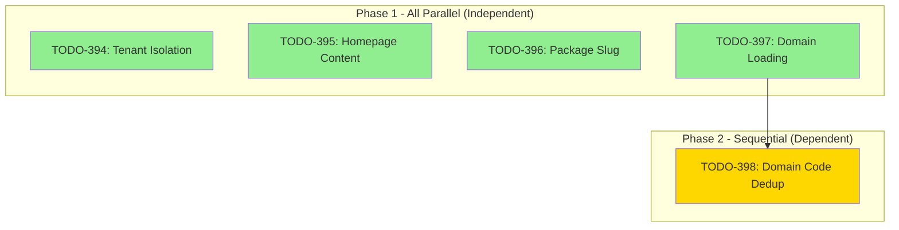

# Multi-Agent Code Review Workflow: Prevention Strategies

## Overview

This document provides prevention strategies and best practices for the multi-agent code review workflow. It addresses common issues with agent coordination, triage processes, fix verification, and performance optimization.

**Target Audience:** Engineers using `/workflows:review`, `/resolve_parallel`, `/triage`, and similar multi-agent tools.

---

## 1. Agent Coordination Issues

### Problem

When multiple agents run in parallel without proper coordination:
- Agents may conflict by modifying the same files
- Results are lost when agents complete before TaskOutput collection
- Dependent tasks run in parallel, causing cascading failures
- Agent outputs are never collected, leaving work incomplete

### Prevention Strategies

#### 1.1 Always Use `run_in_background` for Parallel Agents

```typescript
// CORRECT: Launch agents in background
Task('Fix TODO-123: Add tenant validation', {
  subagent_type: 'general-purpose',
  run_in_background: true,  // REQUIRED for parallel execution
});

Task('Fix TODO-124: Add input sanitization', {
  subagent_type: 'general-purpose',
  run_in_background: true,  // Each agent runs independently
});

// WRONG: Missing run_in_background
Task('Fix TODO-123', {}); // Blocks until complete
Task('Fix TODO-124', {}); // Never starts until 123 finishes
```

#### 1.2 Use TaskOutput to Collect Results After Completion

```typescript
// Launch all agents first
const agent1 = Task('TODO-123: ...', { run_in_background: true });
const agent2 = Task('TODO-124: ...', { run_in_background: true });
const agent3 = Task('TODO-125: ...', { run_in_background: true });

// Wait and collect all results
const results = await Promise.all([
  TaskOutput(agent1.id, { block: true, timeout: 300000 }),
  TaskOutput(agent2.id, { block: true, timeout: 300000 }),
  TaskOutput(agent3.id, { block: true, timeout: 300000 }),
]);

// Summarize results
const summary = results.map((r, i) => ({
  todoId: [123, 124, 125][i],
  status: r.success ? 'complete' : 'failed',
  error: r.error,
}));
```

#### 1.3 Never Launch Dependent Tasks in Parallel



**Decision Tree for Parallel vs Sequential:**

```
Does this task depend on output from another task?
├─ YES → Run SEQUENTIALLY (wait for dependency)
│        - Task modifies files created by prior task
│        - Task uses variables/state from prior task
│        - Task requires build/typecheck from prior task
└─ NO → Run in PARALLEL
         - Task operates on independent files
         - Task has no shared state
         - Task doesn't need prior task's output
```

#### 1.4 File Conflict Prevention

Before launching parallel agents, verify no file conflicts:

```bash
# Check which files each TODO affects
grep -h "Files to Modify" todos/123-*.md todos/124-*.md todos/125-*.md

# If files overlap, run those TODOs sequentially
# If files are independent, safe to run in parallel
```

**Pattern: Agent Isolation Boundaries**

```yaml
# Each agent should have clear boundaries
Agent 1 Scope:
  - server/src/services/booking.service.ts
  - server/test/services/booking.test.ts

Agent 2 Scope:
  - server/src/services/catalog.service.ts
  - server/test/services/catalog.test.ts

# NEVER overlap scopes - creates merge conflicts
```

---

## 2. Triage Best Practices

### Problem

Poor triage leads to:
- Unclear items consuming agent time
- Incorrect priority assignments
- Missing tracking for deferred items
- No visibility into progress

### Prevention Strategies

#### 2.1 Use AskUserQuestion for Unclear Items

```typescript
// When an item's category or priority is unclear
const decision = await AskUserQuestion({
  question: `TODO-285 "SMS reminders" - should this be:
    A) P1 Critical - Required for launch
    B) P2 Important - Needed within 30 days
    C) P3 Nice-to-have - Add to backlog
    D) DEFER - Customer request triggers activation`,
  context: `Current SMS infrastructure: None
            Customer requests: 0
            Estimated effort: 2-3 days`,
});

// Use response to set priority
if (decision === 'A') {
  updateTodoStatus(285, { priority: 'p1', status: 'pending' });
} else if (decision === 'D') {
  updateTodoStatus(285, { priority: 'p3', status: 'deferred', trigger: '3+ customer requests' });
}
```

**When to Ask:**

| Scenario | Action |
|----------|--------|
| Business impact unclear | Ask about customer value |
| Technical approach debatable | Ask about preferred pattern |
| Effort estimate varies widely | Ask about acceptable complexity |
| Multiple solutions possible | Ask about constraints |
| External dependency involved | Ask about timeline |

#### 2.2 Priority Classification (P1/P2/P3)

```yaml
P1 (Critical) - Blocks launch, security vulnerability, data corruption risk
  - Examples: Multi-tenant isolation gap, authentication bypass, data loss
  - Action: Resolve immediately, blocks all other work
  - SLA: < 4 hours

P2 (Important) - Significant user impact, performance issues, UX gaps
  - Examples: N+1 queries, missing error handling, incomplete features
  - Action: Resolve in current sprint
  - SLA: < 1 week

P3 (Nice-to-have) - Code quality, minor optimizations, future-proofing
  - Examples: Console.log cleanup, unused imports, React.memo optimization
  - Action: Batch into cleanup passes
  - SLA: Next quarter
```

**Priority Decision Matrix:**

```
Is it a security vulnerability?
├─ YES → P1
└─ NO → Does it cause data loss or corruption?
         ├─ YES → P1
         └─ NO → Does it block core functionality?
                  ├─ YES → P2
                  └─ NO → Does it affect user experience?
                           ├─ YES → P2
                           └─ NO → P3
```

#### 2.3 Create File-Based TODOs for Tracking

**Standard TODO Template:**

```markdown
---
status: pending | in_progress | complete | deferred | wontfix
priority: p1 | p2 | p3
issue_id: "XXX"
tags: [security, performance, multi-tenant, react, etc.]
dependencies: []
blocking: []
created_at: 2025-12-25
---

# Issue Title

## Problem Statement
Clear description of the issue and why it matters.

## Findings
- File: `path/to/file.ts`
- Line: 123
- Evidence: Code snippet or behavior observed

## Proposed Solution
Concrete implementation steps with code examples.

## Acceptance Criteria
- [ ] Criterion 1
- [ ] Criterion 2
- [ ] Tests pass
- [ ] Typecheck passes

## Work Log
| Date | Status | Notes |
|------|--------|-------|
| 2025-12-25 | Created | Initial triage |
```

**File Naming Convention:**

```
todos/{id}-{status}-{priority}-{short-description}.md

Examples:
- todos/348-pending-p1-packageid-naming-confusion.md
- todos/349-complete-p2-generic-error-message.md
- todos/350-deferred-p3-daypicker-styles.md
```

#### 2.4 Triage Checklist

Before finalizing triage:

```markdown
## Pre-Triage Verification

- [ ] Searched codebase for existing implementation (glob/grep)
- [ ] Checked git log for recent related commits
- [ ] Verified TODO not already addressed elsewhere
- [ ] Confirmed issue still exists in current code
- [ ] Identified affected files and estimated scope

## Priority Assignment

- [ ] Applied P1/P2/P3 decision matrix
- [ ] Documented rationale for priority choice
- [ ] Set appropriate status (pending/deferred/wontfix)
- [ ] Added relevant tags for categorization
- [ ] Identified dependencies if any

## Documentation

- [ ] Created/updated TODO file in todos/ directory
- [ ] Added work log entry with decision
- [ ] Set revisit trigger for deferred items
- [ ] Linked related documentation
```

---

## 3. Fix Verification

### Problem

Without proper verification:
- Fixes may introduce new issues
- TypeScript errors go unnoticed
- TODOs marked complete but work is incomplete
- Changes don't match acceptance criteria

### Prevention Strategies

#### 3.1 Run Typecheck After Parallel Fixes

```bash
# After all parallel agents complete, run comprehensive checks
npm run typecheck          # TypeScript validation across all workspaces
npm run lint               # ESLint validation
npm test                   # Run test suite
npm run build              # Verify build succeeds
```

**Verification Script Pattern:**

```bash
#!/bin/bash
# scripts/verify-parallel-fixes.sh

echo "=== Running Post-Fix Verification ==="

# Step 1: TypeScript check
echo "Checking TypeScript..."
npm run typecheck
if [ $? -ne 0 ]; then
  echo "ERROR: TypeScript check failed"
  exit 1
fi

# Step 2: Lint check
echo "Checking ESLint..."
npm run lint
if [ $? -ne 0 ]; then
  echo "WARNING: ESLint issues found"
  # Continue but flag for review
fi

# Step 3: Run tests
echo "Running tests..."
npm test
if [ $? -ne 0 ]; then
  echo "ERROR: Tests failed"
  exit 1
fi

echo "=== Verification Complete ==="
```

#### 3.2 Update TODO Files to Mark Complete

```typescript
// After verifying fix, update TODO file
const todoFile = `todos/${todoId}-pending-${priority}-${description}.md`;

// Update frontmatter
const updatedFrontmatter = {
  status: 'complete',
  resolved_at: new Date().toISOString(),
  resolved_by: 'Multi-agent parallel resolution',
  resolution: 'Implemented as specified',
};

// Rename file to reflect new status
const newFilename = todoFile.replace('pending', 'complete');
fs.renameSync(todoFile, newFilename);

// Update work log
appendToFile(newFilename, `
| ${new Date().toISOString()} | complete | Fix verified, typecheck passed |
`);
```

#### 3.3 Summarize Changes for User

After all fixes complete, generate summary:

```markdown
## Fix Summary

### Completed (3 TODOs)

| ID | Priority | Description | Files Modified |
|----|----------|-------------|----------------|
| 348 | P1 | packageId naming confusion | booking.service.ts |
| 349 | P2 | Generic error message | booking.service.ts |
| 350 | P2 | DayPicker styles | DateSelectionStep.tsx |

### Verification Results

- TypeScript: PASS
- ESLint: PASS (2 warnings)
- Tests: 771 passing, 0 failing
- Build: SUCCESS

### Files Changed

```
server/src/services/booking.service.ts (+12 -8)
client/src/features/storefront/date-booking/DateSelectionStep.tsx (+15 -20)
server/test/services/booking.service.test.ts (+5 -2)
```

### Next Steps

1. Review changes in PR
2. Run E2E tests
3. Deploy to staging for QA
```

#### 3.4 Playwright Verification for UI Changes

```typescript
// After UI-related fixes, verify with Playwright
await mcp__playwright__browser_navigate({ url: 'http://localhost:3000/t/demo' });
await mcp__playwright__browser_snapshot({});

// Check expected elements exist
await mcp__playwright__browser_click({
  element: 'Book Package button',
  ref: 'button[data-testid="book-package"]',
});

// Verify booking flow works
await mcp__playwright__browser_wait_for({
  text: 'Confirm Your Selection',
});
```

---

## 4. Performance Optimization

### Problem

Inefficient agent usage leads to:
- Long resolution times
- Wasted compute resources
- Unnecessary costs
- Context window exhaustion

### Prevention Strategies

#### 4.1 Group Related Fixes into Single Agents

```typescript
// WRONG: One agent per tiny fix
Task('TODO-352: Remove unused import', { run_in_background: true });
Task('TODO-353: Add useMemo to steps', { run_in_background: true });
Task('TODO-354: Memoize localStorage', { run_in_background: true });

// CORRECT: Group related fixes into single agent
Task('Performance Optimizations - TODOs 352-354', {
  run_in_background: true,
  prompt: `
    Fix these related P3 performance issues in DateBookingWizard:

    1. TODO-352: Remove unused CustomerDetails import
       File: CustomerDetailsStep.tsx

    2. TODO-353: Wrap steps array in useMemo
       File: DateBookingWizard.tsx

    3. TODO-354: Memoize localStorage.getItem call
       File: DateBookingWizard.tsx

    All changes are in the same feature area and can be done together.
  `,
});
```

**Grouping Guidelines:**

| Group Together | Keep Separate |
|----------------|---------------|
| Same file modifications | Different features |
| Related dependencies | Conflicting changes |
| Same category (all P3s) | Different risk levels |
| Same codebase area | Backend vs Frontend |
| Similar skill required | Specialized knowledge |

#### 4.2 Launch Maximum Parallelism (8+ Agents)

```typescript
// Optimal: Launch 8-12 independent agents simultaneously
const independentTodos = analyzeDependencies(pendingTodos);

// Split into waves of 8-10 agents
const waves = chunk(independentTodos, 10);

for (const wave of waves) {
  // Launch entire wave in parallel
  const agents = wave.map(todo =>
    Task(`Fix ${todo.id}: ${todo.title}`, {
      run_in_background: true,
      subagent_type: 'general-purpose',
    })
  );

  // Wait for wave to complete before next wave
  await Promise.all(agents.map(a =>
    TaskOutput(a.id, { block: true, timeout: 300000 })
  ));

  // Run verification between waves
  await runTypecheck();
}
```

**Parallelism Decision Table:**

| Scenario | Recommended Parallelism |
|----------|------------------------|
| Independent P3 fixes | 10-12 agents |
| Mixed P2/P3 fixes | 8-10 agents |
| P1 critical fixes | 4-6 agents (more careful) |
| Complex refactoring | 2-3 agents (high coordination) |
| Single file focus | 1 agent (avoid conflicts) |

#### 4.3 Use Haiku Model for Simple Tasks

```typescript
// Simple tasks: Use haiku (faster, cheaper)
Task('Remove unused import from CustomerDetailsStep.tsx', {
  subagent_type: 'haiku',  // Fast, low-cost model
  run_in_background: true,
});

// Complex tasks: Use opus/sonnet (better reasoning)
Task('Refactor BookingService to extract PaymentProcessor', {
  subagent_type: 'opus',  // Full reasoning capability
  run_in_background: true,
});
```

**Model Selection Guidelines:**

| Task Type | Recommended Model | Reasoning |
|-----------|------------------|-----------|
| Remove unused imports | Haiku | Mechanical, no judgment |
| Add missing types | Haiku | Pattern matching |
| Fix typos/formatting | Haiku | Simple text replacement |
| Security fixes | Sonnet/Opus | Requires understanding |
| Architecture refactors | Opus | Complex reasoning |
| API contract changes | Sonnet | Moderate complexity |
| Multi-file refactoring | Opus | Coordination needed |

#### 4.4 Batch Operations for Efficiency

```typescript
// Instead of separate operations for each TODO
// Batch common operations together

// Batch 1: Read all affected files at once
const filesToRead = [
  'server/src/services/booking.service.ts',
  'client/src/features/storefront/DateBookingWizard.tsx',
  'client/src/features/storefront/date-booking/CustomerDetailsStep.tsx',
];

const fileContents = await Promise.all(
  filesToRead.map(f => Read({ file_path: f }))
);

// Batch 2: Make all edits
const edits = [
  { file: 'booking.service.ts', old: 'packageId', new: 'packageSlug' },
  { file: 'DateBookingWizard.tsx', old: 'const steps = [', new: 'const steps = useMemo(() => [' },
];

await Promise.all(edits.map(e => Edit(e)));

// Batch 3: Verify all changes
await Bash({ command: 'npm run typecheck && npm test' });
```

---

## 5. Common Pitfalls and Solutions

### 5.1 Stale TODO Detection

**Problem:** Creating TODOs for already-implemented features.

**Solution:** Always verify before creating:

```bash
# Before creating TODO for "Add tenant isolation"
glob '**/*tenant*isolation*'
grep -r 'tenantId' server/src/services/
git log -p -S 'tenantId' --since="1 week ago"

# If code exists, skip TODO creation
```

### 5.2 Agent Timeout Handling

**Problem:** Agents timing out on complex tasks.

**Solution:** Set appropriate timeouts and chunk large tasks:

```typescript
// Long-running tasks: Increase timeout
TaskOutput(agentId, {
  block: true,
  timeout: 600000  // 10 minutes for complex refactors
});

// Very large tasks: Split into smaller subtasks
const largeTask = 'Refactor entire service layer';
const subtasks = [
  'Extract BookingService validation logic',
  'Extract BookingService payment logic',
  'Extract BookingService notification logic',
];

// Run subtasks sequentially with dependencies
for (const subtask of subtasks) {
  const agent = Task(subtask, { run_in_background: true });
  await TaskOutput(agent.id, { block: true, timeout: 300000 });
  await runTypecheck(); // Verify before continuing
}
```

### 5.3 Context Window Management

**Problem:** Agents running out of context with large codebases.

**Solution:** Provide focused context:

```typescript
// WRONG: Asking agent to read entire codebase
Task('Fix all tenant isolation issues', {
  prompt: 'Read all files in server/src and fix tenant isolation...'
});

// CORRECT: Provide specific files and patterns
Task('Fix tenant isolation in BookingService', {
  prompt: `
    Focus on: server/src/services/booking.service.ts

    Pattern to apply:
    - All queries must include tenantId filter
    - Use: await prisma.booking.findMany({ where: { tenantId, ... } })
    - Never: await prisma.booking.findMany({ where: { ... } })

    Search for findMany/findFirst without tenantId and add it.
  `,
});
```

### 5.4 Merge Conflict Prevention

**Problem:** Parallel agents create conflicting changes.

**Solution:** File-level isolation:

```typescript
// Analyze file dependencies before parallel execution
const todoFileMapping = analyzeTodoFiles(pendingTodos);

// Group TODOs by file to avoid conflicts
const groupedByFile = groupBy(todoFileMapping, 'file');

// Run one agent per file group
for (const [file, todos] of Object.entries(groupedByFile)) {
  Task(`Fix todos in ${file}: ${todos.map(t => t.id).join(', ')}`, {
    run_in_background: true,
    prompt: `Fix these issues in ${file}:\n${todos.map(t => t.description).join('\n')}`,
  });
}
```

---

## 6. Quick Reference Checklist

### Before Launching Parallel Agents

- [ ] Identified all independent TODOs (no dependencies)
- [ ] Verified no file conflicts between agents
- [ ] Set appropriate model (haiku for simple, opus for complex)
- [ ] Configured timeouts for expected complexity
- [ ] Grouped related fixes into single agents

### During Agent Execution

- [ ] All agents launched with `run_in_background: true`
- [ ] Agent IDs tracked for TaskOutput collection
- [ ] Progress monitored for early failure detection
- [ ] Resources available for parallel execution

### After Agent Completion

- [ ] All TaskOutput results collected
- [ ] TypeScript check passed
- [ ] Tests passed
- [ ] TODO files updated to reflect completion
- [ ] Summary provided to user
- [ ] Changes committed with descriptive message

### Triage Quality

- [ ] Used AskUserQuestion for unclear items
- [ ] Applied P1/P2/P3 decision matrix
- [ ] Documented rationale in TODO files
- [ ] Set revisit triggers for deferred items
- [ ] Verified no duplicate TODOs

---

## 7. Metrics and Success Indicators

### Performance Metrics

| Metric | Target | Measurement |
|--------|--------|-------------|
| Parallel agent utilization | 8+ agents | Agents launched per wave |
| Resolution time per TODO | < 5 min | End-to-end per TODO |
| Stale TODO rate | < 5% | TODOs closed as "already done" |
| Typecheck pass rate | 100% | Post-fix verification |
| Merge conflict rate | 0% | Conflicts during parallel work |

### Quality Metrics

| Metric | Target | Measurement |
|--------|--------|-------------|
| P1 resolution time | < 4 hours | Time from creation to complete |
| Triage clarity | 100% | TODOs with clear priority/status |
| Work log completeness | 100% | TODOs with documented decisions |
| Test coverage maintained | No regression | Coverage before/after |

---

## 8. Related Documentation

- [Multi-Agent Code Review Process](/docs/solutions/methodology/multi-agent-code-review-process.md)
- [Parallel TODO Resolution Workflow](/docs/solutions/methodology/parallel-todo-resolution-workflow.md)
- [Parallel Agent Workflow Best Practices](/docs/solutions/PARALLEL-AGENT-WORKFLOW-BEST-PRACTICES.md)
- [Multi-Agent Code Review Workflow: Systematic Triage](/docs/solutions/code-review-patterns/multi-agent-code-review-workflow-systematic-triage-MAIS-20251224.md)
- [Prevention Strategies Index](/docs/solutions/PREVENTION-STRATEGIES-INDEX.md)

---

**Last Updated:** 2025-12-25
**Author:** Multi-Agent Workflow Team
**Status:** Active
