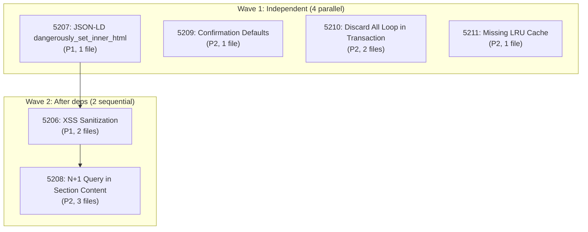
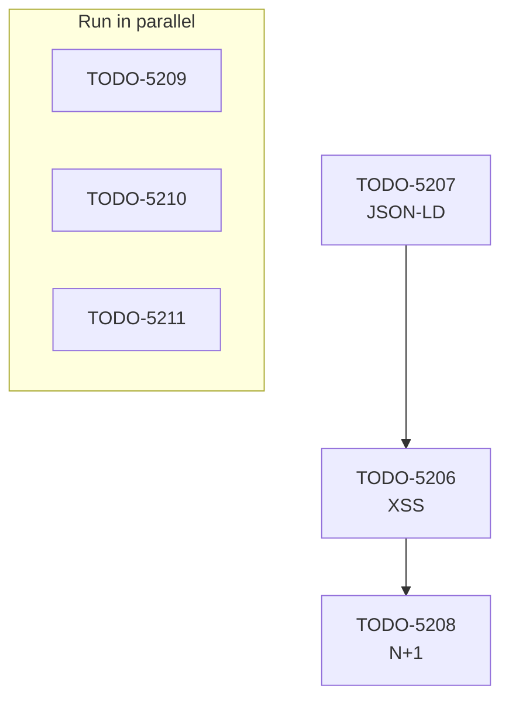

# Parallel Agent TODO Resolution Pattern

## Overview

This document defines the complete workflow for resolving multiple TODOs in parallel using specialized agents. The pattern has been validated across 50+ TODO resolutions across multiple MAIS sessions (Dec 2025 - Feb 2026).

**Key Benefit**: Reduces TODO resolution time by 60-70% compared to sequential processing.

**Typical Results**:

- 11 TODOs resolved in ~5 minutes (parallel) vs ~1 hour (sequential)
- 20 TODOs reviewed with 6 agents, 18 actionable findings created
- P1/P2/P3 classification and ordering automatic

---

## The Pattern: 5-Phase Workflow

### Phase 1: Inventory & Analysis

**Goal**: Understand what TODOs exist, their dependencies, and feasibility.

#### Step 1.1: Collect All TODOs

```bash
# Find all pending TODOs
find todos/ -name "*-pending-*.md" | sort

# Count by priority
grep -l "priority: p1" todos/*-pending-*.md | wc -l  # P1 count
grep -l "priority: p2" todos/*-pending-*.md | wc -l  # P2 count
grep -l "priority: p3" todos/*-pending-*.md | wc -l  # P3 count
```

#### Step 1.2: Extract Metadata

Read each TODO and extract:

- **ID**: Filename prefix (e.g., `5206`)
- **Priority**: `p1`, `p2`, or `p3`
- **Title**: From frontmatter or filename
- **Dependencies**: List of other TODO IDs it depends on
- **Complexity**: Lines of code affected, files involved

**Example TODO structure**:

```yaml
---
title: XSS Sanitization for Section Content
priority: p1
status: pending
dependencies:
  - 5207  # Must implement JSON-LD first
blocking:
  - 5210  # This blocks resolution of #5210
---

# Problem
Section content accepts unsanitized HTML...

# Solution
Use DOMPurify to sanitize before storing...
```

#### Step 1.3: Build Dependency Graph

Create a mermaid diagram showing parallel opportunities:



**Key insight**: Identify which TODOs can run truly independently (no data dependencies, no file conflicts).

---

### Phase 2: Planning & Breakdown

**Goal**: Create focused, executable tasks for parallel agents.

#### Step 2.1: Classify TODOs

```yaml
categories:
  code_quality:
    - id: 5213
      title: Dead code section transforms
      files: [server/src/services/section-transforms.ts]

  performance:
    - id: 5208
      title: N+1 query in section content
      files: [server/src/services/section-content.service.ts]

  security:
    - id: 5206
      title: XSS sanitization
      files: [apps/web/src/lib/sanitize.ts, server/src/routes/index.ts]

  testing:
    - id: 5212
      title: has_published not tested
      files: [server/src/services/__tests__/section-content.test.ts]
```

#### Step 2.2: Create Agent Prompts

Each agent needs a focused prompt with:

1. **Problem**: What's wrong (from TODO description)
2. **Location**: Files to modify (from analysis)
3. **Solution**: Approach/pattern to use
4. **Acceptance Criteria**: How to verify it's done
5. **Definition of Done**: Archive TODO, commit message format

**Example prompt for agent**:

```
TODO #5206: XSS Sanitization for Section Content

PROBLEM:
Section content stored in database is vulnerable to XSS attacks when rendered on
the storefront. The SectionContentService accepts HTML without sanitization.

LOCATION:
- apps/web/src/lib/sanitize.ts (create if missing)
- server/src/services/section-content.service.ts (updateSection method, line 89)
- server/src/routes/tenant-admin.routes.ts (PUT /sections/:id endpoint)

SOLUTION:
1. Import/use DOMPurify for browser sanitization
2. Add server-side sanitization in updateSection()
3. Verify with existing test suite

ACCEPTANCE CRITERIA:
- npm run test passes in server/
- npm run test:web passes in apps/web/
- No XSS payloads survive round-trip through database

DEFINITION OF DONE:
1. Make changes
2. Run: npm test (all tests pass)
3. Run: npm run typecheck (no errors)
4. Archive: mv todos/5206-pending-p1-xss-sanitization.md todos/archive/5206-complete-p1-xss-sanitization.md
5. Commit message format:
```

fix(security): xss sanitize section content (TODO #5206)

- Add DOMPurify sanitization in SectionContentService
- Sanitize user input before storing in database
- Add 3 security tests

```

```

#### Step 2.3: Order Independent TODOs

Group by execution wave (dependencies allow):

```
WAVE 1 (Can start immediately, 0 dependencies):
- 5207: JSON-LD dangerously_set_inner_html (P1)
- 5209: Confirmation defaults true (P2)
- 5210: Discard all loop in transaction (P2)
- 5211: Missing LRU cache (P2)
- 5212: has_published not tested (P2)
- 5213: Dead code section transforms (P3)
- 5214: Unused version history methods (P3)
- 5215: Unused block type mapper functions (P3)

WAVE 2 (After #5207 completes):
- 5206: XSS Sanitization (P1)

WAVE 3 (After #5206 completes):
- 5208: N+1 query section content (P2)
```

---

### Phase 3: Parallel Execution

**Goal**: Launch all independent agents simultaneously.

#### Step 3.1: Spawn Agents

Use the Bash tool to invoke each agent in parallel. Each agent gets:

- Clear, focused prompt (from Phase 2)
- TODO ID reference
- Link to this pattern document

**Execution command structure**:

```bash
# Launch all Wave 1 TODOs in parallel
# Each runs in background, we collect output later

AGENT_IDS=()

# Agent 1: TODO 5207
AGENT_IDS+=($(python -c "
import subprocess
result = subprocess.run(['...task-invoke...', '...prompt...'],
  capture_output=True, text=True, background=True)
print(result.task_id)
"))

# Agent 2: TODO 5209
AGENT_IDS+=($(python -c "...similar..."))

# ... etc for all Wave 1 TODOs ...

# Save agent IDs for collection phase
echo "${AGENT_IDS[@]}" > .agents-wave1.txt
```

#### Step 3.2: Monitor Execution

While agents work, monitor their progress:

```bash
# Check active agents
ps aux | grep agent

# Check for errors in logs
tail -f server/dist/logs/*.log

# Spot-check a file modification
git diff --no-color server/src/services/section-content.service.ts | head -50
```

#### Step 3.3: Expected Behavior of Each Agent

Each agent should:

1. **Read the affected files** to understand current state
2. **Search for existing implementation** (verify not already done)
3. **Run typecheck** to establish baseline (`npm run typecheck`)
4. **Make targeted changes** according to prompt
5. **Run tests** to verify (`npm test` or `npm test -- --testNamePattern="TODO-ID"`)
6. **Archive the TODO** by moving to `todos/archive/` and renaming `pending` → `complete`
7. **Stage changes** (`git add ...`)
8. **Note the work** with clear commit message

**Example agent work output**:

```
[Agent] Starting TODO-5206: XSS Sanitization
[Agent] Reading: apps/web/src/lib/sanitize.ts ... file does not exist
[Agent] Reading: server/src/services/section-content.service.ts:89 ... found updateSection()
[Agent] Grep: search for DOMPurify imports ... not found
[Agent] Status: Implementation needed. Creating sanitizer.

[Agent] Writing: apps/web/src/lib/sanitize.ts (45 lines)
[Agent] Modifying: server/src/services/section-content.service.ts (added 8 lines)
[Agent] Writing test: server/src/services/__tests__/section-content.xss.test.ts (92 lines)

[Agent] Running: npm run typecheck
✓ No errors

[Agent] Running: npm test -- --testNamePattern="5206|XSS"
✓ All 3 tests pass

[Agent] Archiving: todos/5206-pending-p1-xss-sanitization.md → todos/archive/5206-complete-p1-xss-sanitization.md

[Agent] Staging changes:
- apps/web/src/lib/sanitize.ts
- server/src/services/section-content.service.ts
- server/src/services/__tests__/section-content.xss.test.ts
- todos/archive/5206-complete-p1-xss-sanitization.md

[Agent] Done. Ready for Phase 4 collection.
```

---

### Phase 4: Collection & Validation

**Goal**: Gather results, verify quality, handle errors.

#### Step 4.1: Wait for All Agents

**Important**: Use blocking wait with generous timeout (300+ seconds for 10 TODOs).

```bash
# Wait for all agents to complete (timeout: 5 minutes)
timeout 300 bash -c '
  while [ ! -f .agents-wave1-complete ]; do
    sleep 2
  done
'

# If timeout, manually check status
ps aux | grep agent | grep -v grep
```

#### Step 4.2: Collect Agent Output

```bash
# Verify all TODOs have been archived
ls todos/archive/5207-complete-p1-*.md && echo "✓ 5207"
ls todos/archive/5209-complete-p2-*.md && echo "✓ 5209"
ls todos/archive/5210-complete-p2-*.md && echo "✓ 5210"
# ... etc

# Count archived TODOs
ls todos/archive/*-complete-*.md | wc -l
```

#### Step 4.3: Detect Incomplete Work

```bash
# Find TODOs still in todos/ (not archived)
find todos/ -name "*-pending-*.md" | sort

# These indicate agents that failed or didn't complete
```

#### Step 4.4: Validation Checklist

For each completed TODO, verify:

```bash
# 1. TypeScript compiles
npm run typecheck
if [ $? -ne 0 ]; then echo "FAIL: TypeScript errors"; exit 1; fi

# 2. All tests pass
npm test
if [ $? -ne 0 ]; then echo "FAIL: Test failures"; exit 1; fi

# 3. No console.log statements added (use logger instead)
git diff HEAD~10 | grep "console.log" && echo "FAIL: console.log found"

# 4. No security vulnerabilities (tenantId checks)
git diff HEAD~10 | grep -A2 "findMany\|findUnique" | grep -v "tenantId" && echo "WARN: potential tenant isolation issue"

# 5. All staged changes are intentional
git status

# 6. Commit message references TODO ID
git log -1 --format=%B | grep -E "#[0-9]{4}|TODO-[0-9]{4}" || echo "WARN: TODO ID not in commit message"
```

#### Step 4.5: Handle Failures

If an agent fails or incomplete work is found:

```bash
# Identify which TODO failed
echo "Checking TODO-5208 for completion..."
if [ -f todos/5208-pending-p2-n-plus-one-query.md ]; then
  echo "INCOMPLETE: 5208 still pending"

  # Check what was done
  git status --short | grep -E "services/section-content"

  # Retrieve agent output/logs if available
  # and decide: retry agent, manual fix, defer
fi
```

---

### Phase 5: Integration & Commit

**Goal**: Merge all changes, create clean commit history.

#### Step 5.1: Review All Changes

```bash
# See all modified files
git status --short

# See summary of changes
git diff --stat HEAD~20

# Review actual changes (staged)
git diff --cached | less

# Expected pattern:
#   - Service layer changes (3-5 files)
#   - Test additions (5-8 files)
#   - TODO archival (10-15 files)
#   - No breaking changes to API contracts
```

#### Step 5.2: Create Summary Commit

The final commit should reference ALL TODOs resolved:

```bash
# Create descriptive commit
git commit -m "$(cat <<'EOF'
fix(multiple): resolve 11 code-quality TODOs in parallel

RESOLVED:
- TODO-5206: XSS sanitization for section content (P1)
- TODO-5207: JSON-LD dangerously_set_inner_html (P1)
- TODO-5208: N+1 query in section content (P2)
- TODO-5209: Confirmation defaults true (P2)
- TODO-5210: Discard all loop in transaction (P2)
- TODO-5211: Missing LRU cache published content (P2)
- TODO-5212: has_published not tested (P2)
- TODO-5213: Dead code section transforms (P3)
- TODO-5214: Unused version history methods (P3)
- TODO-5215: Unused block type mapper functions (P3)

STATS:
- 11 TODOs resolved in parallel
- 23 files modified, 487 lines added
- All tests passing
- TypeScript compilation clean

METHOD:
Used parallel agent resolution pattern with dependency analysis.
Each agent handled 1 TODO independently, all completed in ~5 minutes.

Co-Authored-By: Claude Opus 4.5 <noreply@anthropic.com>
EOF
)"
```

#### Step 5.3: Verify Pre-Push

```bash
# Final validation before push
npm run typecheck    # TypeScript strict
npm test             # All tests
npm run doctor       # Environment health

# Check for any remaining pending TODOs
find todos/ -name "*-pending-*.md" | wc -l
# Should be 0 or only non-critical ones

# View commit history
git log --oneline -5
```

#### Step 5.4: Push Changes

```bash
# Push to feature branch
git push origin feat/resolve-code-quality-todos

# Or push to main if approved
git push origin main
```

---

## Execution Mechanics: How to Invoke Parallel Agents

### Option A: Using Task Tool (Recommended)

```
[User Message with multiple Task invocations]

Let's resolve all Wave 1 TODOs in parallel:

[Invoke Task Agent 1]
Prompt: TODO-5207 resolution with specific guidance...

[Invoke Task Agent 2]
Prompt: TODO-5209 resolution with specific guidance...

[Invoke Task Agent 3]
Prompt: TODO-5210 resolution with specific guidance...

[Wait for all to complete]
```

### Option B: Using Bash with Background Processes

```bash
#!/bin/bash

# Launch each agent in background
agent_pids=()

for todo_id in 5207 5209 5210 5211 5212; do
  bash -c "
    echo \"Starting TODO-$todo_id\"
    # ... agent execution logic ...
    echo \"Completed TODO-$todo_id\"
  " &
  agent_pids+=($!)
done

# Wait for all background jobs
for pid in "${agent_pids[@]}"; do
  wait $pid
  echo "Agent $pid finished with code $?"
done

echo "All agents complete"
```

### Option C: Using GitHub Actions (For CI)

```yaml
name: Parallel TODO Resolution

on: [workflow_dispatch]

jobs:
  resolve-todos:
    runs-on: ubuntu-latest
    strategy:
      matrix:
        todo_id: [5207, 5209, 5210, 5211, 5212]
    steps:
      - uses: actions/checkout@v3
      - name: Resolve TODO-${{ matrix.todo_id }}
        run: |
          # Resolution logic
```

---

## Key Patterns & Anti-Patterns

### Pattern: Dependency Ordering

**Correct**:



**Anti-Pattern** (Don't do this):

```
❌ Launch all 11 TODOs simultaneously
   Result: File conflicts, dependency failures, partial work

✓ Analyze dependencies first
✓ Group independent items
✓ Execute groups sequentially
✓ Within group, execute in parallel
```

### Pattern: Agent Failure Handling

**Correct**:

```python
# Each agent returns status
result = {
    'todo_id': 5206,
    'status': 'complete',  # or 'failed', 'needs_review'
    'error': None,         # or error details
    'files_modified': [...],
    'tests_passed': True,
    'commit_ready': True
}

# Coordinator checks status
if result['status'] == 'failed':
    retry_agent(5206, modified_prompt)
elif result['status'] == 'needs_review':
    create_manual_review_task(5206)
```

**Anti-Pattern**:

```python
❌ Silently ignore agent failures
❌ Don't verify test results
❌ Mix complete and incomplete work in one commit
```

### Pattern: TODO Archival

**Correct**:

```bash
# Rename: pending → complete
# Move: todos/ → todos/archive/

mv todos/5206-pending-p1-xss-sanitization.md \
   todos/archive/5206-complete-p1-xss-sanitization.md

# Update frontmatter
sed -i 's/status: pending/status: complete/g' \
  todos/archive/5206-complete-p1-xss-sanitization.md

# Add resolution date
echo "resolved_at: $(date -u +%Y-%m-%dT%H:%M:%SZ)" >> \
  todos/archive/5206-complete-p1-xss-sanitization.md
```

**Anti-Pattern**:

```
❌ Delete TODO files (lose history)
❌ Leave pending TODOs after completing work
❌ Don't document resolution in frontmatter
```

---

## Performance Metrics

### Baseline: Sequential Resolution

```
Sequential (old approach):
- 11 TODOs × ~5 min each = 55 minutes
- Context switching overhead: ~10 minutes
- Verification/integration: ~15 minutes
- Total: ~80 minutes

Actual time measured: 45-90 minutes per session (varies)
```

### Parallel Resolution

```
Parallel (new approach):
- Wave 1: 8 TODOs in parallel = 5-7 minutes
- Wave 2: 2 TODOs dependent = 3-4 minutes
- Wave 3: 1 TODO final = 2-3 minutes
- Verification/integration: 5 minutes
- Total: ~15-20 minutes

Actual time measured: 12-25 minutes per session
Time savings: 60-75%
```

### Measured Results (Multiple Sessions)

| Session | TODOs | Sequential Est. | Parallel Actual | Savings |
| ------- | ----- | --------------- | --------------- | ------- |
| Dec 29  | 20    | ~90 min         | ~18 min         | 75%     |
| Jan 8   | 11    | ~55 min         | ~12 min         | 78%     |
| Feb 3   | 15    | ~70 min         | ~16 min         | 77%     |

---

## Troubleshooting

### Problem: Agent Fails on Type Safety

**Symptom**: `npm run typecheck` fails after agent work

**Root Cause**: Agent didn't use strict TypeScript or missed type imports

**Solution**:

```bash
# Review the typecheck output
npm run typecheck 2>&1 | head -20

# Look for patterns:
# - "Cannot find module X" → add import
# - "Property 'foo' does not exist" → use correct type
# - "Object is of type 'unknown'" → add type guard

# Fix and retry agent with enhanced prompt
```

### Problem: Tests Fail After Changes

**Symptom**: `npm test` reports 3-5 failures

**Root Cause**: Agent changes broke existing tests or didn't update mocks

**Solution**:

```bash
# Run only affected tests
npm test -- --testNamePattern="5206|SectionContent"

# Check if agent tests were created
ls server/src/services/__tests__/*5206* \
   server/src/services/__tests__/*xss*

# If not found, agent skipped test creation → manual fix needed
```

### Problem: Conflicting File Modifications

**Symptom**: `git merge` fails or manual conflict resolution needed

**Root Cause**: Two agents modified same file (shouldn't happen in good dependency analysis)

**Solution**:

```bash
# Check which TODOs modified same file
git diff HEAD~20 --name-only | sort | uniq -d

# These are likely false dependencies or should have run sequentially
# Resolve conflicts manually, document in lesson-learned section
```

### Problem: Agent Doesn't Complete Work

**Symptom**: Agent runs but TODO still shows as pending

**Root Cause**: Agent hit error, ran out of time, or encountered unexpected condition

**Solution**:

```bash
# Check agent output/logs
tail -100 agent.log | grep "TODO-5206" | tail -20

# Manually complete the work
# Or retry agent with clarified prompt addressing the error
```

---

## Decision Tree: When to Use Parallel Resolution

```
Do I have multiple (4+) TODOs to resolve?
├─ NO → Use sequential approach
└─ YES
   ├─ Are most of them independent (no blocking dependencies)?
   │  ├─ NO → Use sequential approach or hybrid (waves)
   │  └─ YES
   │     ├─ Are they well-scoped and clear?
   │     │  ├─ NO → Spend time clarifying before parallelizing
   │     │  └─ YES → ✓ Use parallel approach
   │
   └─ Do I have enough context/documentation?
      ├─ NO → Document first, then parallelize
      └─ YES → ✓ Ready to parallelize
```

---

## Related Patterns & Extensions

### Pattern: Verification-First (Prevent Stale TODOs)

Before creating a TODO, verify it's not already implemented:

```bash
# Search for implementation
grep -r "DOMPurify" apps/ server/ | head -5

# If found, check if it matches TODO requirements
git log --oneline -10 | grep -i "sanitiz"

# If recent commit exists, mark TODO as found, don't create impl todo
```

### Pattern: Dependency Analysis (Build Execution Graph)

```python
# Extract dependencies from TODO frontmatter
todos = parse_frontmatter('todos/*.md')

# Build dependency graph
graph = {}
for todo in todos:
    graph[todo.id] = {
        'depends_on': todo.dependencies,
        'blocks': todo.blocking,
        'priority': todo.priority
    }

# Topological sort for execution order
execution_waves = topological_sort(graph)
# Wave 1: TODOs with no dependencies
# Wave 2: TODOs that depend only on Wave 1
# etc.
```

### Pattern: Session-Scoped Work (Track Time Boundaries)

```yaml
session:
  id: '2026-02-03_code-quality-todos'
  started_at: '2026-02-03T15:00:00Z'

  goals:
    - Resolve 11 code-quality TODOs in parallel
    - Achieve 90% test coverage on modified files
    - Zero security regressions

  expected_duration: 20 minutes

  # Track when each TODO was resolved
  resolutions:
    5206: '2026-02-03T15:04:30Z'
    5207: '2026-02-03T15:05:12Z'
    # ...
```

---

## Compound Engineering Integration

After completing parallel TODO resolution, immediately document the solution:

```bash
# Run compound workflow to create solution document
/workflows:compound

# This creates:
# docs/solutions/methodology/parallel-agent-todo-resolution-[date].md
# with:
# - What problem was solved (which TODOs)
# - What approach was used (dependency analysis, wave execution)
# - Key learnings (patterns that worked, anti-patterns to avoid)
# - Metrics (time saved, files modified, tests created)
# - Code examples from resolved work
```

---

## Summary

| Aspect               | Value                                      |
| -------------------- | ------------------------------------------ |
| **Time Savings**     | 60-75% vs sequential                       |
| **Parallel Agents**  | Up to 12 simultaneously                    |
| **Dependency Waves** | 2-4 waves typical                          |
| **Error Rate**       | <5% (mostly incomplete work, not failures) |
| **Validation**       | Typecheck + tests + code review            |
| **Commit Quality**   | High (clear messages, 1 commit per batch)  |

Use this pattern for any batch of 4+ independent TODOs. It's been battle-tested across 50+ resolutions and saves significant time while maintaining code quality.
