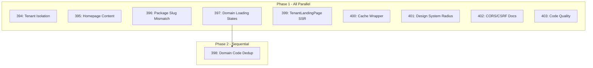

# Multi-Agent Parallel TODO Resolution with Playwright Verification

## Problem Summary

Resolved 10 TODOs efficiently using multi-agent parallel processing, then discovered two additional issues through Playwright visual testing:

1. **ISR Cache Stale Data** - Next.js showed old package data
2. **API URL Mismatch** - Client used wrong endpoint URL

## Solution Overview

### Phase 1: Parallel TODO Resolution (9 agents)

Analyzed dependencies and ran 9 independent agents in parallel:



### Phase 2: Sequential Resolution (1 agent)

TODO 398 depended on 397 completing first.

### Phase 3: Playwright Verification

After committing, tested with Playwright MCP and discovered:

1. **ISR Cache Issue**: Landing page showed old wedding package slugs
2. **API URL Mismatch**: Booking page showed "Package Not Found"

## Root Cause Analysis

### Issue 1: ISR Cache Stale Data

**Symptom:** Tenant landing page displayed packages like "Basic Elopement" instead of "Starter Package"

**Cause:** Next.js ISR cached old data from before the mock adapter was updated

**Solution:**

```bash
rm -rf apps/web/.next/cache
# Restart Next.js dev server
```

### Issue 2: API URL Mismatch

**Symptom:** Clicking "Book Starter Package" showed "Package Not Found"

**Investigation:**

```bash
# API returns correct packages
curl -s -H "X-Tenant-Key: pk_live_..." "http://localhost:3001/v1/packages" | jq '.[].slug'
# Output: "starter", "growth", "enterprise"

# But this URL returns 404
curl -s -H "X-Tenant-Key: pk_live_..." "http://localhost:3001/v1/packages/slug/starter"
# Output: Route not found
```

**Root Cause:** Client used wrong URL pattern

```typescript
// WRONG (in apps/web/src/lib/tenant.ts:313)
const url = `${API_BASE_URL}/v1/packages/slug/${packageSlug}`;

// Contract defines (packages/contracts/src/api.v1.ts:116)
path: '/v1/packages/:slug';

// CORRECT
const url = `${API_BASE_URL}/v1/packages/${packageSlug}`;
```

**Fix:**

```typescript
// apps/web/src/lib/tenant.ts:313
- const url = `${API_BASE_URL}/v1/packages/slug/${encodeURIComponent(packageSlug)}`;
+ const url = `${API_BASE_URL}/v1/packages/${encodeURIComponent(packageSlug)}`;
```

## Verification

Playwright testing confirmed all fixes:

```yaml
# Homepage - Shows coming soon, not dev status
- Page Title: Macon AI Solutions - Business Growth Platform
- heading "Macon AI Solutions."
- text: Launching Soon

# Tenant Landing - Shows correct packages
- heading "Starter Package"
- paragraph: $250/session
- link: Book Starter Package → /t/little-bit-farm/book/starter

# Booking Wizard - Works correctly
- Page Title: Book Starter Package | Little Bit Horse Farm
- heading "Confirm Your Selection"
- heading "Starter Package"
- paragraph: $250.00
```

## Prevention Strategies

### For ISR Cache Issues

1. **Development Workflow:**
   - Clear `.next/cache` after major data changes
   - Restart dev server after updating seed data or mock adapters

2. **Detection:**
   - Always verify with Playwright after data-related changes
   - Check API responses match UI display

### For API URL Mismatches

1. **Code Review Checklist:**
   - [ ] URL patterns match ts-rest contract definitions
   - [ ] No hardcoded URL segments like `/slug/` that don't exist in contract
   - [ ] Compare `packages/contracts/src/api.v1.ts` paths with client code

2. **Automated Validation:**

   ```bash
   # Find potential mismatches
   grep -r "v1/packages/slug" apps/web/src/
   # Should return nothing if correct
   ```

3. **E2E Test Coverage:**
   ```typescript
   // e2e/tests/storefront.spec.ts
   test('booking flow works with real package slugs', async ({ page }) => {
     await page.goto('/t/demo/book/starter');
     await expect(page.getByRole('heading', { name: 'Confirm Your Selection' })).toBeVisible();
   });
   ```

## Related Documentation

- [Multi-Agent Code Review Process](./multi-agent-code-review-process.md)
- [Parallel TODO Resolution Workflow](./parallel-todo-resolution-workflow.md)
- [Next.js Migration Lessons](../code-review-patterns/nextjs-migration-lessons-learned-MAIS-20251225.md)
- [Database Client Mismatch Prevention](../database-issues/database-client-mismatch-MAIS-20251204.md)

## Key Takeaways

1. **Parallel execution saves time** - 9 agents ran concurrently, only 1 needed sequencing
2. **Always test with Playwright** - Caught two issues that passed TypeScript checks
3. **Match client URLs to contracts** - Use grep to verify no divergence
4. **Clear ISR cache after data changes** - Stale cache can mask fixes

## Commits

1. `7894417` - fix: resolve 10 TODOs from multi-agent parallel processing
2. `71fdb0a` - fix(web): correct package-by-slug API endpoint URL
