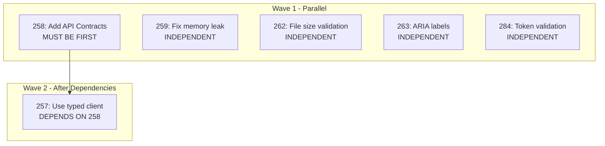

# Parallel TODO Resolution Workflow Pattern

## Problem Statement

When many TODOs accumulate in the `/todos/*.md` directory, resolving them manually one-by-one is:

- **Slow**: Sequential resolution wastes time on context switching
- **Error-prone**: Dependencies between TODOs can cause failed resolutions
- **Inefficient**: Many TODOs are already implemented but not marked resolved

## Solution: Parallel Resolution Workflow

### Phase 1: Analyze

```bash
# Find all pending TODOs
grep -l "^status: pending" todos/*.md

# Count total
grep -l "^status: pending" todos/*.md | wc -l

# Categorize by priority (P1 first)
grep -l "^status: pending" todos/*-p1-*.md
grep -l "^status: pending" todos/*-p2-*.md
```

### Phase 2: Plan Dependencies

Create a mermaid diagram showing which TODOs can run in parallel:



**Key Insight**: TODOs with `dependencies: []` in frontmatter can run in parallel.

### Phase 3: Spawn Parallel Agents

Launch independent TODOs in a **single message** with multiple Task calls:

```typescript
// Launch all independent agents at once
Task('TODO-262: Add file upload size validation', {
  subagent_type: 'general-purpose',
  run_in_background: true,
});
Task('TODO-263: Add ARIA labels', {
  subagent_type: 'general-purpose',
  run_in_background: true,
});
Task('TODO-284: Add token validation', {
  subagent_type: 'general-purpose',
  run_in_background: true,
});
```

### Phase 4: Wait and Collect Results

```typescript
// Wait for all agents to complete
TaskOutput(agent1_id, { block: true, timeout: 300000 });
TaskOutput(agent2_id, { block: true, timeout: 300000 });
TaskOutput(agent3_id, { block: true, timeout: 300000 });
```

### Phase 5: Update TODO Status

```yaml
# Before
---
status: pending
priority: p2
---
# After
---
status: resolved
priority: p2
resolved_at: '2025-12-23'
resolved_by: 'description of what was done'
---
```

### Phase 6: Commit and Push

```bash
# Stage all changes
git add server/src/... todos/*.md

# Commit with descriptive message
git commit -m "fix(security): resolve 3 P2 todos - file upload, ARIA, token validation

TODO-262: Add backend 50KB file size validation
TODO-263: ARIA labels already fixed
TODO-284: Add pay_balance state validation with 9 tests"

# Push
git push
```

## Key Findings

### Many TODOs Already Resolved

During our session, we found:

| TODO     | Expected Work         | Actual State               |
| -------- | --------------------- | -------------------------- |
| TODO-257 | Refactor to typed API | Already done - using hooks |
| TODO-259 | Fix setTimeout leak   | Already fixed in hook      |
| TODO-263 | Add ARIA labels       | Already present in code    |

**Lesson**: Always verify implementation state before coding.

### Verification-First Approach

Before implementing, each agent should:

1. Read the affected files
2. Search for existing implementation
3. Run typecheck to verify current state
4. Only implement if actually missing

### Session Metrics

| Metric               | Value       |
| -------------------- | ----------- |
| TODOs Reviewed       | 6           |
| Already Complete     | 3 (50%)     |
| Actually Implemented | 3           |
| Time Invested        | ~45 minutes |
| Agents Used          | 6 parallel  |

## Prevention Strategies

### 1. Regular TODO Audits

```bash
# Weekly check
pending_count=$(grep -l "^status: pending" todos/*.md | wc -l)
if [ "$pending_count" -gt 20 ]; then
  echo "Alert: $pending_count pending TODOs"
fi
```

### 2. Verify Before Implementing

```typescript
// Agent prompt should include
"First, read the affected files and verify the TODO
is not already implemented. If already done, report
'Already Complete' with file:line evidence."
```

### 3. Dependency Check First

- Read TODO frontmatter for `dependencies: []`
- Create dependency graph before parallel execution
- Resolve dependencies in order, independents in parallel

### 4. Batch by Priority

1. Resolve all P1 TODOs first
2. Then P2 in parallel batches of 3-5
3. Skip "deferred" and "ready" (feature requests)

### 5. Descriptive Commits

```bash
# Good: Lists all TODOs and what was done
git commit -m "fix(security): resolve 3 P2 todos

TODO-262: Backend validation
TODO-263: Already fixed
TODO-284: State validation + 9 tests"

# Bad: Vague
git commit -m "fix todos"
```

## Code Patterns Used

### Pattern 1: Backend Size Validation

```typescript
// tenant-admin-calendar.routes.ts
const MAX_JSON_SIZE = 50 * 1024; // 50KB

if (serviceAccountJson.length > MAX_JSON_SIZE) {
  return res.status(400).json({
    error: 'Service account JSON too large. Maximum size is 50KB.',
  });
}
```

### Pattern 2: Token State Validation

```typescript
// booking-tokens.ts
if (payload.action === 'pay_balance') {
  if (booking.status !== 'DEPOSIT_PAID') {
    return {
      valid: false,
      error: 'booking_completed',
      message: 'The balance has already been paid',
    };
  }
}
```

### Pattern 3: API Contract Updates

```typescript
// api.v1.ts - Add missing 404 responses
responses: {
  200: DepositSettingsDtoSchema,
  401: UnauthorizedErrorSchema,
  403: ForbiddenErrorSchema,
  404: NotFoundErrorSchema,  // Added
  500: InternalServerErrorSchema,
}
```

## Related Documentation

- [TODO-RESOLUTION-INDEX.md](../TODO-RESOLUTION-INDEX.md) - Master index
- [TODO-RESOLUTION-QUICK-REFERENCE.md](../TODO-RESOLUTION-QUICK-REFERENCE.md) - Quick reference
- [TODO-PARALLEL-RESOLUTION-PATTERN.md](../workflow/TODO-PARALLEL-RESOLUTION-PATTERN.md) - Earlier pattern
- [PARALLEL-AGENT-WORKFLOW-BEST-PRACTICES.md](../PARALLEL-AGENT-WORKFLOW-BEST-PRACTICES.md) - Agent coordination

## Commits from This Session

```
f7b4152 chore(todos): mark 3 P1 todos as resolved + fix API contract error responses
482a2e7 fix(security): resolve 3 P2 todos - file upload size, ARIA labels, token validation
```

## Next Steps

1. Continue using this pattern for batch TODO resolution
2. Consider automated verification on TODO creation
3. Track TODO count trends over time (currently 343 total)
4. Set up weekly audit reminder
