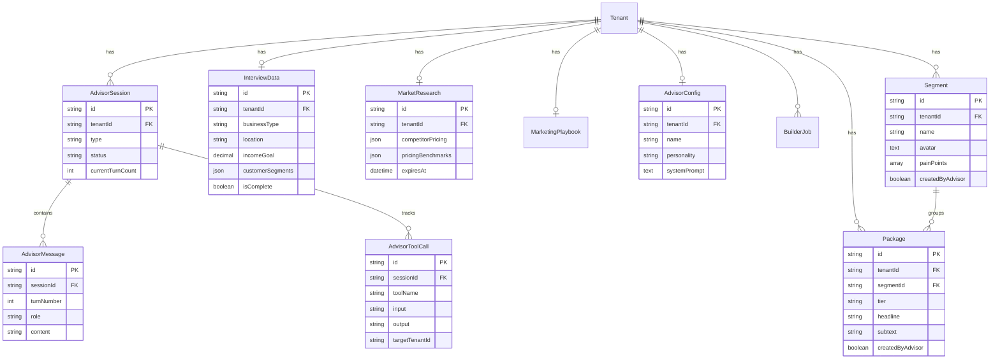

# MAIS Business Advisor System - Full Architecture Plan

> **Feature Type:** Major Platform Feature (Multi-Agent AI System)
> **Complexity:** A LOT (Comprehensive Issue)
> **Author:** Claude Code + Human Review
> **Status:** ✅ APPROVED - Ready for Implementation
> **Approved:** 2025-12-26

---

## Final Decisions (Approved 2025-12-26)

The following decisions were made after multi-agent review with quality-first mandate:

| Decision                 | Options Considered                                        | Final Choice               | Rationale                                                                     |
| ------------------------ | --------------------------------------------------------- | -------------------------- | ----------------------------------------------------------------------------- |
| **Web Search Scope**     | (A) Open search (B) Curated sources only                  | **(B) Curated Sources**    | Domain allowlist prevents injection/SSRF, ensures quality research data       |
| **Token Budget**         | (A) Hard limits (B) Soft warnings at 80%                  | **(B) Soft Warnings**      | Alerts allow graceful handling without abrupt conversation cuts               |
| **Approval Granularity** | (A) Binary approve/reject (B) Approve with edits          | **(B) Approve with Edits** | Tenants can refine AI proposals, reducing back-and-forth cycles               |
| **Observability**        | (A) Basic logging (B) Structured logging (C) Full tracing | **(B) Structured Logging** | JSON logs with correlation IDs; OpenTelemetry tracing deferred to Phase 5     |
| **Test Coverage**        | (A) 70% (B) 80% (C) 90%+                                  | **(B) 80% Coverage**       | Balances quality with velocity; critical paths (security, isolation) get 95%+ |

### Reviewer Consensus

All three reviewers (DHH Rails, Kieran TypeScript, Simplicity) agreed after quality-focused re-review:

- ✅ **Three-agent pipeline is ESSENTIAL** - Not premature abstraction
- ✅ **All 9 models are ESSENTIAL** - Each serves a distinct purpose
- ✅ **Approval workflow is CRITICAL** - Quality gate for AI-generated content
- ✅ **Audit trails are NON-NEGOTIABLE** - Every agent mutation tracked
- ✅ **State machine is REQUIRED** - Explicit state transitions prevent bugs
- ✅ **Error recovery is ESSENTIAL** - Graceful degradation for production quality

---

## Executive Summary

Build an AI system that transforms MAIS onboarding into a **storefront architect**. This three-agent system interviews tenants, researches their market, defines ideal customers, and builds three-tier service packages - complete with pricing, copy, and marketing strategy.

**Core Value Proposition:**

| Traditional Onboarding   | MAIS Advisor System                  |
| ------------------------ | ------------------------------------ |
| Form fields              | Deep conversation                    |
| Generic templates        | Researched, specific packages        |
| User figures out pricing | Agent calculates from goals + market |
| User writes copy         | Agent generates conversion copy      |
| User picks segments      | Agent defines precise avatars        |
| One-time setup           | Ongoing advisory relationship        |
| Recommends               | Actually creates in the system       |

**The agent doesn't just advise - it builds their business in MAIS.**

---

## Table of Contents

1. [Final Decisions](#final-decisions-approved-2025-12-26)
2. [Problem Statement](#problem-statement)
3. [Proposed Solution](#proposed-solution)
4. [Agent-Native Architecture](#agent-native-architecture)
5. [Three-Agent System Design](#three-agent-system-design)
6. [Technical Architecture](#technical-architecture)
7. [Data Model](#data-model)
8. [Type Safety & Error Handling](#type-safety--error-handling)
9. [Tool Specifications](#tool-specifications)
10. [Implementation Phases](#implementation-phases)
11. [Acceptance Criteria](#acceptance-criteria)
12. [Risk Analysis](#risk-analysis)
13. [SpecFlow Analysis Findings](#specflow-analysis-findings)
14. [Alternative Approaches Considered](#alternative-approaches-considered)
15. [References](#references)

---

## Problem Statement

### Current State

Small business owners joining MAIS face a "blank canvas" problem:

- They must define their own customer segments
- They guess at pricing without market research
- They write their own marketing copy (often poorly)
- Package configuration is manual and tedious
- No ongoing guidance after initial setup

### Impact

- **Onboarding friction:** Users abandon during package setup
- **Suboptimal pricing:** Revenue lost to underpricing or overpricing
- **Generic positioning:** Packages don't differentiate from competitors
- **Missed opportunities:** No guidance on market gaps
- **Churn risk:** Users feel unsupported after initial setup

### Opportunity

An AI advisor that:

1. Conducts deep discovery conversations (like a consultant)
2. Researches their specific market and competition
3. Designs optimal customer segments and pricing tiers
4. Creates conversion-focused copy and marketing guidance
5. Maintains an ongoing coaching relationship

---

## Proposed Solution

### The MAIS Three-Tier Model

```
CUSTOMER SEGMENTS (0-10, recommend 3)
  Who are you serving? Define the avatar.

  Example: Headshot Photographer
  Segment 1: "Corporate Climbers"
    LinkedIn professionals, $100k+, bad profile pic
  Segment 2: "Entrepreneurs"
    Founders needing brand imagery
  Segment 3: "Actors/Models"
    Portfolio shots for auditions

THREE TIERS PER SEGMENT (0-10, recommend 3)
  Low Tier: Entry point, builds trust
  Mid Tier: "Popular" - where most buy
  Luxury Tier: Premium experience, highest margin

Each package includes:
  - What's offered (specifics, not vague)
  - Price (researched, goal-aligned)
  - Copy/subtext (conversion-focused)
  - Image guidance (what visual to use)
```

### Example Output (Headshot Photographer in Pittsburgh)

**Segment: "Corporate Climbers"**
Avatar: LinkedIn professionals, $100k+ roles, currently have bad profile photo, career-focused

```
Entry Tier ($150): "LinkedIn Quick Shot"
  - 15-minute session
  - 2 retouched images
  - Subtext: "Your next job is one photo away"

Popular Tier ($350): "Executive Presence" [MOST POPULAR]
  - 45-minute session
  - 5 retouched images + LinkedIn banner
  - Outfit consultation
  - Subtext: "Look like the leader you are"

Luxury Tier ($750): "Full Brand Suite"
  - 2-hour session, 2 locations
  - 15 retouched images
  - Personal brand consultation
  - Subtext: "Your image, elevated everywhere"
```

---

## Agent-Native Architecture

### Guiding Principles (from `agent-native-architecture` skill)

> **The Foundational Principle:** Whatever the user can do, the agent can do. Many things the developer can do, the agent can do.

| Principle                | Application                                                                                   |
| ------------------------ | --------------------------------------------------------------------------------------------- |
| **Features Are Prompts** | Interview flow, pricing logic, copy generation - all defined in system prompts, not hardcoded |
| **Tools Are Primitives** | `create_package`, `store_item`, `web_search` - primitives, not workflow tools                 |
| **Action Parity**        | If a user can create packages in the UI, the agent gets `create_package` tool                 |
| **Dynamic Context**      | System prompt includes tenant's current segments, packages, market data                       |
| **Trust Intelligence**   | Define WHAT to achieve ("create compelling packages"), not micromanage HOW                    |

### Anti-Patterns to Avoid

```typescript
// BAD: Workflow tool encodes business logic
tool('process_onboarding', async ({ answers }) => {
  const segments = categorize(answers); // Logic in tool
  const packages = createTiers(segments); // Logic in tool
  const pricing = calculatePricing(answers); // Logic in tool
  return { segments, packages, pricing };
});

// GOOD: Primitives let agent figure it out
tool('store_interview_data', { key, value });
tool('create_customer_segment', { tenantId, name, avatar });
tool('create_package', { segmentId, tier, name, price, description });
// Prompt says: "Based on the interview, create segments and packages..."
```

### Action Parity Map

| UI Action       | Agent Tool                 | Status           |
| --------------- | -------------------------- | ---------------- |
| Create package  | `create_package`           | New              |
| Update package  | `update_package`           | New              |
| Delete package  | `delete_package`           | Existing (admin) |
| Create segment  | `create_customer_segment`  | New              |
| Update segment  | `update_customer_segment`  | New              |
| Delete segment  | `delete_customer_segment`  | New              |
| Update branding | `update_branding`          | Existing         |
| View packages   | `read_tenant_packages`     | New              |
| View analytics  | `read_segment_performance` | Future           |

---

## Three-Agent System Design

### Agent 1: Onboarding Interviewer

**Purpose:** Deep discovery conversation with new tenants

**Personality:** Warm, curious, non-judgmental business consultant

**Interview Framework:**

```yaml
Phase 1: Business Basics
  - What do you do? (photographer, consultant, trainer, etc.)
  - Where are you located? (city/region)
  - How long have you been in business?
  - What's your current setup? (solo, team, studio, mobile)

Phase 2: Financial Context
  - What's your income goal? (monthly/yearly)
  - What are you earning now?
  - How many hours/week do you want to work?
  - What's your average project size currently?

Phase 3: Service Exploration
  - What services do you currently offer?
  - What services do you WANT to offer?
  - What's your signature offering?
  - What makes you different from competitors?

Phase 4: Customer Discovery (CRITICAL)
  For each potential segment, probe:
  - Demographics: age, income, profession
  - Psychographics: pain points, desires, objections
  - Specificity goal: "LinkedIn hungry, $100k+, bad photo" level
  - Why do they buy from you vs competitors?

Phase 5: Preferences
  - Agent name preference? (or auto-generate)
  - Agent personality style? (professional, friendly, expert)
```

**Completeness Criteria:**

```typescript
interface InterviewCompleteness {
  businessType: boolean; // What do they do
  location: boolean; // Where they operate
  incomeGoal: boolean; // Financial target
  currentServices: boolean; // What they offer now
  segments: {
    count: number; // At least 1, ideally 3
    hasAvatar: boolean[]; // Each segment has avatar details
    specificity: number[]; // Rating 1-5 per segment
  };
  differentiator: boolean; // What makes them unique
}
```

**Tools:**

- `store_interview_data(key, value)` - Store interview answers
- `check_interview_completeness()` - Verify all required info collected
- `trigger_research_pipeline(tenantId)` - Hand off to Builder

**System Prompt Structure:**

```markdown
# Onboarding Interviewer

You are helping a new MAIS member design their business storefront.

## Your Goals

1. Understand their business deeply
2. Identify 2-3 distinct customer segments with specific avatars
3. Understand their income goals and work preferences
4. Discover what makes them unique

## Interview Approach

- Start casual, build rapport
- Ask follow-up questions for specificity
- When they say "professionals", ask "what kind?"
- When they say "people who need X", ask "describe the perfect one"
- Goal: Get to avatar specificity like "LinkedIn hungry, $100k+, bad photo"

## When You Have Enough

- At least 1 customer segment with specific avatar
- Clear income goal
- Understanding of current services
- Their differentiator

Then use `trigger_research_pipeline` to hand off.
```

---

### Agent 2: Builder Pipeline

**Purpose:** Research market, architect storefront, create packages

**Mode:** Async background pipeline (not real-time chat)

**Pipeline Stages:**

```yaml
Stage 1: Market Research
  Tasks:
    - Web search: "[business type] [city] pricing"
    - Web search: "[business type] marketing strategies"
    - Web search: "how to price [business type] services"
    - Competitor analysis: what do local competitors offer?
    - Industry best practices: what do experts recommend?

  Output: MarketResearchReport
    - Competitor pricing ranges
    - Common package structures
    - Marketing channels used
    - Industry trends

Stage 2: Segment Architecture
  Tasks:
    - Define 2-3 customer segments from interview data
    - Create specific avatar for each
    - Validate segments against market research

  Output: CustomerSegments[]
    - name: "Corporate Climbers"
    - avatar: "LinkedIn professionals, $100k+ roles..."
    - pain_points: ["outdated profile photo", "not projecting success"]
    - buying_triggers: ["new job search", "promotion", "LinkedIn update"]

Stage 3: Package Design
  Tasks:
    - Design 3 tiers per segment
    - Calculate pricing based on:
      - Income goal / realistic monthly clients
      - Competitor pricing (position strategically)
      - Value ladder (clear upgrade path)
    - Write conversion-focused copy
    - Provide image guidance

  Output: Package[] (9 packages for 3 segments)
    - segment: "Corporate Climbers"
    - tier: "entry" | "popular" | "luxury"
    - name: "LinkedIn Quick Shot"
    - price: 150
    - features: ["15-minute session", "2 retouched images"]
    - headline: "Your next job is one photo away"
    - subtext: "First impressions matter. Make yours count."
    - image_guidance: "Professional in modern office, confident smile"

Stage 4: Marketing Playbook
  Tasks:
    - Social media strategy per segment
    - Content ideas (posts, stories, reels)
    - Customer acquisition funnel

  Output: MarketingPlaybook
    - platforms: ["instagram", "linkedin"]
    - content_calendar: ContentIdea[]
    - funnel_strategy: "awareness -> engagement -> booking"

Stage 5: Advisor Configuration
  Tasks:
    - Generate custom advisor prompt
    - Include business context, segments, packages
    - Set personality based on preferences

  Output: AdvisorConfig
    - system_prompt: "You are [Name], advisor to [Business]..."
    - context: { segments, packages, marketing, goals }
```

**Tools:**

- `web_search(query)` - Search internet for research
- `create_customer_segment(tenantId, name, avatar, painPoints)` - Create segment in MAIS
- `create_package(segmentId, tier, name, price, description, features)` - Create package
- `set_package_copy(packageId, headline, subtext, imageGuidance)` - Set marketing copy
- `generate_advisor_prompt(tenantData, researchData)` - Create custom advisor
- `store_advisor_config(tenantId, config)` - Store advisor setup
- `notify_tenant(tenantId, message)` - Notify tenant of completion

**Pricing Calculation Logic (in system prompt, not code):**

```markdown
## Pricing Strategy

Calculate pricing using this framework:

1. **Income-Based Floor**
   - Income goal: $10,000/month
   - Realistic clients: 20/month
   - Minimum average: $500/client

2. **Market Positioning**
   - Below market: Risky, signals low quality
   - At market: Commodity, compete on features
   - Above market: Premium positioning, need to justify

3. **Tier Ratios**
   - Entry: Accessible, low commitment (1x baseline)
   - Popular: Best value perception (2-3x entry)
   - Luxury: Premium experience (4-6x entry)

4. **Psychology**
   - Anchor with luxury tier (makes popular look reasonable)
   - Mark middle tier "Most Popular"
   - Use odd pricing ($350 not $400) for mid-tier
   - Round numbers ($750) for luxury (signals premium)
```

---

### Agent 3: Custom Advisor

**Purpose:** Ongoing coaching relationship after onboarding

**Knows:**

- Business deeply (from interview)
- Market research (from Builder)
- Segments and packages (created during onboarding)
- Goals and constraints

**Capabilities:**

```yaml
Package Management:
  - Refine packages based on feedback
  - Adjust pricing with market context
  - Update copy for better conversion
  - Add/remove package features

Marketing Guidance:
  - Social media content strategy
  - Ideal customer targeting advice
  - Campaign ideas for each segment
  - Content calendar suggestions

Accountability:
  - Weekly check-ins on goals
  - Progress tracking
  - Celebrate wins
  - Course-correct problems

Analytics (Future):
  - Segment performance review
  - Pricing optimization suggestions
  - Conversion analysis
```

**Tools:**

- `read_tenant_packages()` - View current packages
- `update_package(packageId, updates)` - Modify package
- `draft_social_post(platform, topic)` - Generate social content
- `analyze_segment_performance(segmentId)` - Review performance (future)
- `create_action_plan(goals, timeframe)` - Generate action items

**Dynamic Context Injection:**

```typescript
async function buildAdvisorSystemPrompt(tenantId: string) {
  const tenant = await getTenant(tenantId);
  const segments = await getSegments(tenantId);
  const packages = await getPackages(tenantId);
  const recentActivity = await getActivity(tenantId, 30);

  return `
# ${tenant.advisorName || 'Business Advisor'} - ${tenant.name}

You are the dedicated business advisor for ${tenant.name}, a ${tenant.businessType}
based in ${tenant.location}.

## Business Context
- Income Goal: ${tenant.incomeGoal}/month
- Current Monthly: ${tenant.currentRevenue || 'Not tracking'}
- Business Model: ${tenant.businessModel}

## Customer Segments
${segments
  .map(
    (s) => `
### ${s.name}
Avatar: ${s.avatar}
Pain Points: ${s.painPoints.join(', ')}
`
  )
  .join('')}

## Current Packages
${packages
  .map(
    (p) => `
- ${p.name} (${p.segment.name} - ${p.tier}): $${p.price}
  ${p.features.join(', ')}
`
  )
  .join('')}

## Recent Activity
${recentActivity.map((a) => `- ${a.date}: ${a.description}`).join('\n')}

## Your Role
1. Help refine packages based on market feedback
2. Provide marketing guidance for each segment
3. Keep them accountable to their ${tenant.incomeGoal}/month goal
4. Celebrate wins, course-correct problems
`;
}
```

---

## Technical Architecture

### System Diagram

```
┌──────────────────────────────────────────────────────────────────────┐
│                         MAIS Business Advisor                        │
├──────────────────────────────────────────────────────────────────────┤
│                                                                       │
│  ┌─────────────────┐    ┌─────────────────┐    ┌─────────────────┐  │
│  │  1. Onboarding  │───▶│  2. Builder     │───▶│  3. Custom      │  │
│  │   Interviewer   │    │   Pipeline      │    │   Advisor       │  │
│  │                 │    │                 │    │                 │  │
│  │  Real-time      │    │  Async          │    │  Real-time      │  │
│  │  Conversation   │    │  Background     │    │  Ongoing        │  │
│  └────────┬────────┘    └────────┬────────┘    └────────┬────────┘  │
│           │                      │                      │            │
│           ▼                      ▼                      ▼            │
│  ┌─────────────────────────────────────────────────────────────────┐│
│  │                     MAIS Express Backend                        ││
│  │                                                                  ││
│  │  ┌───────────────┐  ┌───────────────┐  ┌───────────────┐       ││
│  │  │ AdvisorService│  │ CatalogService│  │ SegmentService│       ││
│  │  └───────────────┘  └───────────────┘  └───────────────┘       ││
│  │                                                                  ││
│  │  ┌───────────────┐  ┌───────────────┐  ┌───────────────┐       ││
│  │  │ BullMQ Queue  │  │ Claude API    │  │ Playwright MCP│       ││
│  │  │ (Background)  │  │ (Tool Use)    │  │ (Web Research)│       ││
│  │  └───────────────┘  └───────────────┘  └───────────────┘       ││
│  │                                                                  ││
│  │  ┌─────────────────────────────────────────────────────────┐    ││
│  │  │                    Prisma + PostgreSQL                   │    ││
│  │  │  AdvisorSession | AdvisorMessage | AdvisorToolCall |...  │    ││
│  │  └─────────────────────────────────────────────────────────┘    ││
│  └──────────────────────────────────────────────────────────────────┘│
│                                                                       │
│  ┌─────────────────────────────────────────────────────────────────┐│
│  │                    Next.js Frontend (apps/web)                   ││
│  │                                                                  ││
│  │  /onboarding     → OnboardingChat.tsx (Interviewer)             ││
│  │  /onboarding/building → BuildingProgress.tsx (Pipeline status)  ││
│  │  /advisor        → AdvisorChat.tsx (Custom Advisor)              ││
│  │  /tenant/dashboard → Dashboard + Advisor sidebar               ││
│  │                                                                  ││
│  │  NextAuth.js v5 → Session + tenantId + backendToken             ││
│  └──────────────────────────────────────────────────────────────────┘│
│                                                                       │
└──────────────────────────────────────────────────────────────────────┘
```

### Integration with Existing MAIS Patterns

| Component         | Existing Pattern                  | Advisor Integration                     |
| ----------------- | --------------------------------- | --------------------------------------- |
| **Multi-Tenant**  | `req.tenantId` + scoped queries   | All agent tools validate `tenantId`     |
| **DI Container**  | `server/src/di.ts`                | Add `advisorService`, `advisorQueue`    |
| **Event System**  | `BookingEvents`, `emitter.emit()` | Add `AdvisorEvents.ONBOARDING_COMPLETE` |
| **BullMQ Queue**  | `webhook-queue.ts`                | Add `advisor-queue.ts` for Builder      |
| **Prisma Schema** | `server/prisma/schema.prisma`     | Add `AdvisorSession`, `AdvisorMessage`  |
| **ts-rest**       | `packages/contracts/`             | Add `advisor.contract.ts`               |
| **Audit Trail**   | `ConfigChangeLog` with `agentId`  | Track all agent mutations               |
| **NextAuth**      | Session + HTTP-only token         | Pass context to agent backend           |

### Request Flow: Onboarding Chat

```typescript
// 1. User sends message (Next.js client)
POST /api/advisor/sessions/:sessionId/messages
{ "content": "I'm a photographer in Pittsburgh" }

// 2. Next.js API route (apps/web)
const session = await auth();
const backendToken = await getBackendToken();
const res = await fetch(`${API_URL}/v1/advisor/sessions/${sessionId}/messages`, {
  headers: {
    'Authorization': `Bearer ${backendToken}`,
    'X-Tenant-Id': session.user.tenantId
  },
  body: JSON.stringify({ content })
});

// 3. Express route (server/src/routes/advisor.routes.ts)
const response = await advisorService.processMessage(
  req.tenantId,
  sessionId,
  content
);

// 4. AdvisorService executes Claude with tools
const claudeResponse = await anthropic.messages.create({
  model: "claude-opus-4-5-20251101",
  system: onboardingSystemPrompt,
  tools: onboardingTools,
  messages: [...history, { role: "user", content }]
});

// 5. If Claude calls tools, execute them
for (const toolCall of claudeResponse.content.filter(c => c.type === 'tool_use')) {
  const result = await executeToolCall(req.tenantId, toolCall);
  // ... continue conversation with tool results
}

// 6. Return assistant response
return { status: 200, body: { response: assistantMessage } };
```

### Request Flow: Builder Pipeline (Async)

```typescript
// 1. Onboarding agent triggers pipeline
await builderQueue.add('build-storefront', {
  tenantId: context.tenantId,
  interviewData: collectedData,
  requestedAt: new Date()
});

// 2. Worker picks up job (server/src/workers/builder.worker.ts)
const worker = new Worker('builder-pipeline', async (job) => {
  const { tenantId, interviewData } = job.data;

  // Stage 1: Market Research
  await job.updateProgress(10);
  const research = await researchService.conductResearch(tenantId, interviewData);

  // Stage 2: Segment Architecture
  await job.updateProgress(30);
  const segments = await architectSegments(tenantId, interviewData, research);

  // Stage 3: Package Design
  await job.updateProgress(50);
  const packages = await createPackages(tenantId, segments, research);

  // Stage 4: Marketing Playbook
  await job.updateProgress(70);
  const playbook = await generatePlaybook(tenantId, segments, packages);

  // Stage 5: Advisor Configuration
  await job.updateProgress(90);
  await createAdvisorConfig(tenantId, interviewData, research, segments, packages);

  // Notify tenant
  await notifyTenant(tenantId, 'Your storefront is ready!');

  return { success: true };
});

// 3. Client polls for progress (or WebSocket)
GET /api/advisor/builder-status?tenantId=xxx
{ "progress": 70, "stage": "Creating packages..." }
```

---

## Data Model

### Prisma Schema Extensions

```prisma
// server/prisma/schema.prisma

// ============================================================================
// AI Advisor System - Business Advisor Architecture
// ============================================================================

/**
 * Advisor Session - Conversation container
 * One per user per advisor start (onboarding or ongoing)
 */
model AdvisorSession {
  id                String   @id @default(cuid())
  tenantId          String
  tenant            Tenant   @relation(fields: [tenantId], references: [id], onDelete: Cascade)

  // Session type
  type              String   // "onboarding" | "advisor" | "builder"

  // User context
  userId            String
  userRole          String   // 'TENANT_ADMIN'

  // Session state
  status            String   @default("active") // active, completed, error, timeout
  createdAt         DateTime @default(now())
  updatedAt         DateTime @updatedAt
  completedAt       DateTime?

  // Configuration
  model             String   @default("claude-opus-4-5-20251101")
  systemPromptId    String?  // Reference to custom prompt

  // State tracking
  currentTurnCount  Int      @default(0)
  lastActivityAt    DateTime @default(now())
  errorMessage      String?

  // Relationships
  messages          AdvisorMessage[]
  toolCalls         AdvisorToolCall[]

  @@index([tenantId])
  @@index([type])
  @@index([status])
}

/**
 * Advisor Message - Each turn in conversation
 */
model AdvisorMessage {
  id                String   @id @default(cuid())

  sessionId         String
  session           AdvisorSession @relation(fields: [sessionId], references: [id], onDelete: Cascade)

  // Message sequence
  turnNumber        Int
  role              String   // "user" | "assistant" | "system"

  // Content
  content           String   @db.Text

  // Token tracking
  inputTokens       Int?
  outputTokens      Int?

  // Timing
  createdAt         DateTime @default(now())
  processingTimeMs  Int?

  // User feedback
  rating            Int?     // 1-5 stars
  feedback          String?

  @@index([sessionId])
  @@index([turnNumber])
}

/**
 * Tool Calls - Audit trail of every agent action
 */
model AdvisorToolCall {
  id                String   @id @default(cuid())

  sessionId         String
  session           AdvisorSession @relation(fields: [sessionId], references: [id], onDelete: Cascade)

  // Tool metadata
  toolName          String
  toolVersion       String   @default("1.0")

  // Input/Output
  input             String   @db.Text // JSON
  output            String?  @db.Text // JSON
  error             String?

  // Status
  status            String   // "pending", "executed", "error"
  executionTimeMs   Int?

  // Multi-tenant isolation audit
  targetTenantId    String

  createdAt         DateTime @default(now())
  executedAt        DateTime?

  @@index([sessionId])
  @@index([toolName])
  @@index([targetTenantId])
}

/**
 * Interview Data - Collected during onboarding
 */
model InterviewData {
  id                String   @id @default(cuid())
  tenantId          String   @unique
  tenant            Tenant   @relation(fields: [tenantId], references: [id], onDelete: Cascade)

  // Business basics
  businessType      String?
  location          String?
  yearsInBusiness   Int?
  teamSize          Int?

  // Financial
  incomeGoal        Decimal? @db.Money
  currentRevenue    Decimal? @db.Money
  hoursPerWeek      Int?

  // Services
  currentServices   String[] // Array of service names
  desiredServices   String[]
  signatureOffering String?
  differentiator    String?  @db.Text

  // Customer segments (JSON for flexibility)
  customerSegments  Json?    // Array of segment drafts

  // Agent preferences
  advisorName       String?
  advisorPersonality String? // "professional", "friendly", "expert"

  // Completeness
  isComplete        Boolean  @default(false)
  completedAt       DateTime?

  createdAt         DateTime @default(now())
  updatedAt         DateTime @updatedAt

  @@index([tenantId])
}

/**
 * Market Research - Results from Builder pipeline
 */
model MarketResearch {
  id                String   @id @default(cuid())
  tenantId          String   @unique
  tenant            Tenant   @relation(fields: [tenantId], references: [id], onDelete: Cascade)

  // Research results
  competitorPricing Json?    // Array of competitor data
  industryTrends    String?  @db.Text
  marketingChannels String[] // Recommended channels
  pricingBenchmarks Json?    // Low/mid/high ranges

  // Research metadata
  searchQueries     String[] // Queries used
  sourceUrls        String[] // URLs referenced
  researchedAt      DateTime @default(now())

  // Validity
  expiresAt         DateTime // Research gets stale
  isValid           Boolean  @default(true)

  @@index([tenantId])
}

/**
 * Marketing Playbook - Generated recommendations
 */
model MarketingPlaybook {
  id                String   @id @default(cuid())
  tenantId          String   @unique
  tenant            Tenant   @relation(fields: [tenantId], references: [id], onDelete: Cascade)

  // Strategy
  platforms         String[] // ["instagram", "linkedin"]
  contentCalendar   Json?    // Array of content ideas
  funnelStrategy    String?  @db.Text

  // Per-segment guidance
  segmentStrategies Json?    // { segmentId: { ... } }

  createdAt         DateTime @default(now())
  updatedAt         DateTime @updatedAt

  @@index([tenantId])
}

/**
 * Advisor Configuration - Custom advisor per tenant
 */
model AdvisorConfig {
  id                String   @id @default(cuid())
  tenantId          String   @unique
  tenant            Tenant   @relation(fields: [tenantId], references: [id], onDelete: Cascade)

  // Advisor identity
  name              String   @default("Business Advisor")
  personality       String   @default("friendly") // professional, friendly, expert

  // Generated prompt
  systemPrompt      String   @db.Text

  // Enabled tools
  enabledTools      String[] // Tool names this advisor can use

  // Behavioral settings
  maxTurnsPerSession Int     @default(50)
  contextWindowDays  Int     @default(30)

  createdAt         DateTime @default(now())
  updatedAt         DateTime @updatedAt

  @@index([tenantId])
}

/**
 * Builder Job - Track async pipeline progress
 */
model BuilderJob {
  id                String   @id @default(cuid())
  tenantId          String
  tenant            Tenant   @relation(fields: [tenantId], references: [id], onDelete: Cascade)

  // Job state
  status            String   @default("queued") // queued, running, completed, failed
  progress          Int      @default(0) // 0-100
  currentStage      String?  // "market_research", "segments", etc.

  // Results
  error             String?
  completedAt       DateTime?

  // BullMQ reference
  bullMQJobId       String?

  createdAt         DateTime @default(now())
  updatedAt         DateTime @updatedAt

  @@index([tenantId])
  @@index([status])
}

// ============================================================================
// Extend existing models
// ============================================================================

/**
 * Extend Segment model with avatar details
 */
model Segment {
  // ... existing fields ...

  // Customer avatar (enhanced for advisor)
  avatar            String?  @db.Text // Detailed avatar description
  painPoints        String[] // Array of pain points
  buyingTriggers    String[] // What triggers purchase
  objections        String[] // Common objections

  // Advisor metadata
  createdByAdvisor  Boolean  @default(false)
  advisorSessionId  String?  // Which session created this
}

/**
 * Extend Package model with marketing copy
 */
model Package {
  // ... existing fields ...

  // Marketing copy (enhanced for advisor)
  headline          String?  // Punchy headline
  subtext           String?  // Conversion-focused subtext
  imageGuidance     String?  @db.Text // What image to use

  // Tier designation
  tier              String?  // "entry", "popular", "luxury"
  isRecommended     Boolean  @default(false) // "Most Popular" badge

  // Advisor metadata
  createdByAdvisor  Boolean  @default(false)
  advisorSessionId  String?
}

/**
 * Extend Tenant with advisor settings
 */
model Tenant {
  // ... existing fields ...

  // Advisor feature flag
  advisorEnabled    Boolean  @default(true)
  onboardingComplete Boolean @default(false)

  // Relationships
  advisorSessions   AdvisorSession[]
  interviewData     InterviewData?
  marketResearch    MarketResearch?
  marketingPlaybook MarketingPlaybook?
  advisorConfig     AdvisorConfig?
  builderJobs       BuilderJob[]
}
```

### Entity Relationship Diagram



---

## Type Safety & Error Handling

### Branded Types (Nominal Typing)

Prevent ID confusion at compile time using branded types:

```typescript
// server/src/agents/types/branded.ts

// Branded type pattern - prevents mixing IDs
type Brand<K, T> = K & { readonly __brand: T };

export type TenantId = Brand<string, 'TenantId'>;
export type SessionId = Brand<string, 'SessionId'>;
export type SegmentId = Brand<string, 'SegmentId'>;
export type PackageId = Brand<string, 'PackageId'>;
export type ProposalId = Brand<string, 'ProposalId'>;

// Type guards for runtime validation
export function isTenantId(value: string): value is TenantId {
  return typeof value === 'string' && value.length > 0;
}

// Factory functions
export const TenantId = {
  from: (value: string): TenantId => {
    if (!isTenantId(value)) throw new InvalidIdError('TenantId', value);
    return value as TenantId;
  },
  unsafe: (value: string): TenantId => value as TenantId, // For tests only
};

// Usage prevents ID confusion at compile time:
function createPackage(tenantId: TenantId, segmentId: SegmentId): Promise<Package>;
// createPackage(segmentId, tenantId) // ❌ Compile error!
```

### Discriminated Union Error Types

Explicit error handling with type-safe error discrimination:

```typescript
// server/src/agents/types/errors.ts

export type AdvisorError =
  | { type: 'TENANT_ISOLATION_VIOLATION'; attemptedTenantId: string; sessionTenantId: string }
  | { type: 'SESSION_NOT_FOUND'; sessionId: string }
  | { type: 'SESSION_EXPIRED'; sessionId: string; expiredAt: Date }
  | { type: 'INTERVIEW_INCOMPLETE'; missing: string[]; completeness: number }
  | { type: 'TOOL_EXECUTION_FAILED'; toolName: string; input: unknown; cause: Error }
  | { type: 'CLAUDE_API_ERROR'; status: number; message: string; retryable: boolean }
  | { type: 'WEB_SEARCH_BLOCKED'; domain: string; reason: string }
  | { type: 'TOKEN_BUDGET_EXCEEDED'; used: number; limit: number; session: string }
  | { type: 'PROPOSAL_ALREADY_PROCESSED'; proposalId: string; status: string }
  | { type: 'INVALID_STATE_TRANSITION'; from: string; to: string; allowed: string[] };

// Result type for operations
export type Result<T, E = AdvisorError> = { success: true; data: T } | { success: false; error: E };

// Usage with exhaustive checking
function handleError(error: AdvisorError): Response {
  switch (error.type) {
    case 'TENANT_ISOLATION_VIOLATION':
      logger.security('Tenant isolation violation', { error });
      return { status: 403, body: { error: 'Access denied' } };
    case 'SESSION_NOT_FOUND':
      return { status: 404, body: { error: 'Session not found' } };
    case 'CLAUDE_API_ERROR':
      if (error.retryable) {
        // Queue for retry
      }
      return { status: 502, body: { error: 'AI service unavailable' } };
    // ... exhaustive handling
    default:
      const _exhaustive: never = error;
      throw new Error(`Unhandled error type: ${_exhaustive}`);
  }
}
```

### Token Budget Service

Soft warnings at 80% with graceful handling:

```typescript
// server/src/agents/services/token-budget.service.ts

export interface TokenBudgetConfig {
  maxInputTokens: number; // Per message
  maxOutputTokens: number; // Per message
  maxSessionTokens: number; // Total session
  warningThreshold: number; // 0.8 = 80%
}

export interface TokenUsage {
  inputTokens: number;
  outputTokens: number;
  totalTokens: number;
  percentUsed: number;
  warning: boolean;
  nearLimit: boolean;
}

export class TokenBudgetService {
  constructor(private readonly config: TokenBudgetConfig) {}

  async trackUsage(
    sessionId: SessionId,
    usage: { input: number; output: number }
  ): Promise<TokenUsage> {
    const session = await this.getSessionUsage(sessionId);
    const newTotal = session.total + usage.input + usage.output;
    const percentUsed = newTotal / this.config.maxSessionTokens;

    if (percentUsed >= this.config.warningThreshold) {
      logger.warn('Token budget warning', {
        sessionId,
        percentUsed: Math.round(percentUsed * 100),
        remaining: this.config.maxSessionTokens - newTotal,
      });
    }

    return {
      inputTokens: usage.input,
      outputTokens: usage.output,
      totalTokens: newTotal,
      percentUsed,
      warning: percentUsed >= this.config.warningThreshold,
      nearLimit: percentUsed >= 0.95,
    };
  }

  // Inject budget status into agent context
  getContextSuffix(usage: TokenUsage): string {
    if (usage.nearLimit) {
      return '\n\n[SYSTEM: Approaching token limit. Please wrap up the conversation gracefully.]';
    }
    if (usage.warning) {
      return '\n\n[SYSTEM: Token budget at 80%. Be concise in remaining responses.]';
    }
    return '';
  }
}
```

### Structured Logging with Correlation

JSON logging with request tracing:

```typescript
// server/src/agents/lib/logger.ts

export interface AgentLogContext {
  correlationId: string; // Request trace ID
  tenantId: TenantId;
  sessionId?: SessionId;
  agentType?: 'onboarding' | 'builder' | 'advisor';
  toolName?: string;
}

export const agentLogger = {
  info: (message: string, context: AgentLogContext, data?: Record<string, unknown>) => {
    logger.info(message, {
      ...context,
      ...data,
      timestamp: new Date().toISOString(),
      service: 'advisor-system',
    });
  },

  toolCall: (
    context: AgentLogContext,
    tool: string,
    input: unknown,
    result: unknown,
    durationMs: number
  ) => {
    logger.info('Agent tool call', {
      ...context,
      toolName: tool,
      input: sanitizeForLog(input),
      resultSummary: summarizeResult(result),
      durationMs,
    });
  },

  security: (message: string, context: AgentLogContext, details: Record<string, unknown>) => {
    logger.warn(`SECURITY: ${message}`, {
      ...context,
      ...details,
      severity: 'SECURITY',
    });
  },
};

// Correlation ID middleware
export function correlationMiddleware(req: Request, res: Response, next: NextFunction) {
  const correlationId = (req.headers['x-correlation-id'] as string) || cuid();
  req.correlationId = correlationId;
  res.setHeader('x-correlation-id', correlationId);
  next();
}
```

### Web Search Domain Allowlist

Curated sources for quality research data:

```typescript
// server/src/agents/config/search-allowlist.ts

export const SEARCH_DOMAIN_ALLOWLIST = [
  // Business & Pricing Research
  'thumbtack.com',
  'yelp.com',
  'google.com/business',
  'bbb.org',

  // Industry Publications
  'forbes.com',
  'entrepreneur.com',
  'inc.com',
  'businessinsider.com',

  // Professional Services
  'honeybook.com',
  'dubsado.com',
  '17hats.com',

  // Photography Specific (example vertical)
  'ppa.com', // Professional Photographers of America
  'rangefinder.com',
  'fstoppers.com',

  // Marketing & Strategy
  'hubspot.com',
  'neilpatel.com',
  'copyblogger.com',
] as const;

export function isAllowedDomain(url: string): boolean {
  try {
    const { hostname } = new URL(url);
    return SEARCH_DOMAIN_ALLOWLIST.some(
      (domain) => hostname === domain || hostname.endsWith(`.${domain}`)
    );
  } catch {
    return false;
  }
}

// Extend allowlist per business vertical
export const VERTICAL_ALLOWLISTS: Record<string, string[]> = {
  photography: ['ppa.com', 'rangefinder.com', 'fstoppers.com', 'shotkit.com'],
  fitness: ['acefitness.org', 'nasm.org', 'ideafit.com'],
  consulting: ['consultingsuccess.com', 'consulting.com'],
  // Add more verticals as needed
};
```

---

## Tool Specifications

### Onboarding Agent Tools

```typescript
// server/src/agents/onboarding/tools.ts

export const onboardingTools: Tool[] = [
  {
    name: 'store_interview_data',
    description: 'Store a piece of interview data collected from the tenant',
    input_schema: {
      type: 'object',
      properties: {
        key: {
          type: 'string',
          enum: [
            'businessType',
            'location',
            'yearsInBusiness',
            'teamSize',
            'incomeGoal',
            'currentRevenue',
            'hoursPerWeek',
            'currentServices',
            'desiredServices',
            'signatureOffering',
            'differentiator',
            'customerSegment',
            'advisorName',
            'advisorPersonality',
          ],
          description: 'The data field to store',
        },
        value: {
          type: ['string', 'number', 'array', 'object'],
          description: 'The value to store',
        },
      },
      required: ['key', 'value'],
    },
  },

  {
    name: 'check_interview_completeness',
    description: 'Check if the interview has collected all required information',
    input_schema: {
      type: 'object',
      properties: {},
      required: [],
    },
  },

  {
    name: 'trigger_research_pipeline',
    description: 'Hand off to the Builder pipeline when interview is complete',
    input_schema: {
      type: 'object',
      properties: {
        message: {
          type: 'string',
          description: 'Message to show tenant while building',
        },
      },
      required: [],
    },
  },
];
```

### Builder Pipeline Tools

```typescript
// server/src/agents/builder/tools.ts

export const builderTools: Tool[] = [
  {
    name: 'web_search',
    description: 'Search the internet for market research',
    input_schema: {
      type: 'object',
      properties: {
        query: {
          type: 'string',
          description: 'Search query',
        },
        purpose: {
          type: 'string',
          enum: ['pricing', 'competition', 'marketing', 'trends'],
          description: 'What this search is for',
        },
      },
      required: ['query', 'purpose'],
    },
  },

  {
    name: 'create_customer_segment',
    description: 'Create a customer segment in MAIS',
    input_schema: {
      type: 'object',
      properties: {
        tenantId: { type: 'string' },
        name: { type: 'string', description: "Segment name (e.g., 'Corporate Climbers')" },
        avatar: { type: 'string', description: 'Detailed avatar description' },
        painPoints: {
          type: 'array',
          items: { type: 'string' },
          description: 'List of customer pain points',
        },
        buyingTriggers: {
          type: 'array',
          items: { type: 'string' },
          description: 'What triggers a purchase',
        },
      },
      required: ['tenantId', 'name', 'avatar'],
    },
  },

  {
    name: 'create_package',
    description: 'Create a service package in MAIS',
    input_schema: {
      type: 'object',
      properties: {
        tenantId: { type: 'string' },
        segmentId: { type: 'string' },
        tier: { type: 'string', enum: ['entry', 'popular', 'luxury'] },
        name: { type: 'string' },
        slug: { type: 'string' },
        price: { type: 'number' },
        description: { type: 'string' },
        features: { type: 'array', items: { type: 'string' } },
        bookingType: { type: 'string', enum: ['DATE', 'TIMESLOT'] },
      },
      required: ['tenantId', 'segmentId', 'tier', 'name', 'slug', 'price', 'features'],
    },
  },

  {
    name: 'set_package_copy',
    description: 'Set marketing copy for a package',
    input_schema: {
      type: 'object',
      properties: {
        packageId: { type: 'string' },
        headline: { type: 'string', description: 'Punchy headline for the package' },
        subtext: { type: 'string', description: 'Conversion-focused subtext' },
        imageGuidance: { type: 'string', description: 'Guidance for what image to use' },
      },
      required: ['packageId', 'headline'],
    },
  },

  {
    name: 'store_market_research',
    description: 'Store market research results',
    input_schema: {
      type: 'object',
      properties: {
        tenantId: { type: 'string' },
        competitorPricing: { type: 'object' },
        pricingBenchmarks: { type: 'object' },
        industryTrends: { type: 'string' },
        marketingChannels: { type: 'array', items: { type: 'string' } },
      },
      required: ['tenantId'],
    },
  },

  {
    name: 'create_marketing_playbook',
    description: 'Create marketing playbook for tenant',
    input_schema: {
      type: 'object',
      properties: {
        tenantId: { type: 'string' },
        platforms: { type: 'array', items: { type: 'string' } },
        contentIdeas: { type: 'array', items: { type: 'object' } },
        funnelStrategy: { type: 'string' },
      },
      required: ['tenantId', 'platforms'],
    },
  },

  {
    name: 'generate_advisor_config',
    description: 'Generate and store custom advisor configuration',
    input_schema: {
      type: 'object',
      properties: {
        tenantId: { type: 'string' },
        name: { type: 'string' },
        personality: { type: 'string', enum: ['professional', 'friendly', 'expert'] },
      },
      required: ['tenantId'],
    },
  },

  {
    name: 'notify_tenant',
    description: 'Send notification to tenant',
    input_schema: {
      type: 'object',
      properties: {
        tenantId: { type: 'string' },
        message: { type: 'string' },
        type: { type: 'string', enum: ['info', 'success', 'warning'] },
      },
      required: ['tenantId', 'message'],
    },
  },
];
```

### Custom Advisor Tools

```typescript
// server/src/agents/advisor/tools.ts

export const advisorTools: Tool[] = [
  {
    name: 'read_tenant_packages',
    description: 'Get all packages for the current tenant',
    input_schema: {
      type: 'object',
      properties: {
        segmentId: { type: 'string', description: 'Optional: filter by segment' },
        includeInactive: { type: 'boolean', default: false },
      },
    },
  },

  {
    name: 'update_package',
    description: "Update a package's details",
    input_schema: {
      type: 'object',
      properties: {
        packageId: { type: 'string' },
        updates: {
          type: 'object',
          properties: {
            name: { type: 'string' },
            price: { type: 'number' },
            description: { type: 'string' },
            features: { type: 'array', items: { type: 'string' } },
            headline: { type: 'string' },
            subtext: { type: 'string' },
          },
        },
      },
      required: ['packageId', 'updates'],
    },
  },

  {
    name: 'draft_social_post',
    description: 'Generate a social media post draft',
    input_schema: {
      type: 'object',
      properties: {
        platform: { type: 'string', enum: ['instagram', 'linkedin', 'facebook', 'twitter'] },
        topic: { type: 'string' },
        segment: { type: 'string', description: 'Optional: target segment' },
        style: { type: 'string', enum: ['promotional', 'educational', 'engaging', 'testimonial'] },
      },
      required: ['platform', 'topic'],
    },
  },

  {
    name: 'read_tenant_analytics',
    description: "Get analytics for tenant's packages/segments",
    input_schema: {
      type: 'object',
      properties: {
        metric: { type: 'string', enum: ['bookings', 'revenue', 'conversion'] },
        segmentId: { type: 'string' },
        dateRange: { type: 'string', enum: ['week', 'month', 'quarter', 'year'] },
      },
    },
  },

  {
    name: 'create_action_plan',
    description: 'Create an action plan for achieving goals',
    input_schema: {
      type: 'object',
      properties: {
        goal: { type: 'string' },
        timeframe: { type: 'string', enum: ['week', 'month', 'quarter'] },
        currentState: { type: 'string' },
      },
      required: ['goal', 'timeframe'],
    },
  },

  {
    name: 'read_marketing_playbook',
    description: "Get the tenant's marketing playbook",
    input_schema: {
      type: 'object',
      properties: {},
    },
  },
];
```

---

## Implementation Phases

### Phase 1: Foundation (Week 1-2)

**Goal:** Data models, DI integration, basic session management

**Tasks:**

1. **Schema Migration**
   - [ ] Add `AdvisorSession`, `AdvisorMessage`, `AdvisorToolCall` models
   - [ ] Add `InterviewData`, `MarketResearch` models
   - [ ] Extend `Segment` and `Package` with advisor fields
   - File: `server/prisma/schema.prisma`

2. **Repository Layer**
   - [ ] Create `advisor.repository.ts`
   - [ ] Implement CRUD for sessions, messages, tool calls
   - File: `server/src/adapters/prisma/advisor.repository.ts`

3. **Service Layer**
   - [ ] Create `advisor.service.ts` with session management
   - [ ] Create `interview.service.ts` for interview data
   - Files: `server/src/services/advisor.service.ts`

4. **DI Integration**
   - [ ] Add advisor services to container
   - [ ] Add event subscriptions
   - File: `server/src/di.ts`

5. **API Contracts**
   - [ ] Create `advisor.contract.ts`
   - [ ] Define routes for sessions, messages
   - File: `packages/contracts/src/advisor.contract.ts`

**Deliverables:**

- Working session creation/management
- Message storage with audit trail
- TypeScript types for all new models

---

### Phase 2: Onboarding Agent (Week 3-4)

**Goal:** Fully functional interview agent

**Tasks:**

1. **Claude Integration**
   - [ ] Create `claude.adapter.ts` for API calls
   - [ ] Implement tool execution framework
   - [ ] Handle multi-turn conversations
   - File: `server/src/adapters/claude.adapter.ts`

2. **Onboarding Tools**
   - [ ] Implement `store_interview_data`
   - [ ] Implement `check_interview_completeness`
   - [ ] Implement `trigger_research_pipeline`
   - File: `server/src/agents/onboarding/tools.ts`

3. **Onboarding System Prompt**
   - [ ] Write interview framework prompt
   - [ ] Test avatar elicitation techniques
   - File: `server/src/agents/onboarding/system-prompt.md`

4. **Frontend: Onboarding Chat**
   - [ ] Create `OnboardingChat.tsx` component
   - [ ] Add real-time message streaming
   - [ ] Progress indicators
   - File: `apps/web/src/components/advisor/OnboardingChat.tsx`

5. **Route: /onboarding**
   - [ ] Create onboarding page
   - [ ] Session management
   - [ ] Redirect to builder status on completion
   - File: `apps/web/src/app/(protected)/onboarding/page.tsx`

**Deliverables:**

- Working interview chat experience
- Interview data captured and stored
- Handoff to Builder pipeline

---

### Phase 3: Builder Pipeline (Week 5-6)

**Goal:** Async background pipeline for storefront creation

**Tasks:**

1. **BullMQ Queue**
   - [ ] Create `builder-queue.ts`
   - [ ] Implement worker process
   - [ ] Progress tracking
   - File: `server/src/jobs/builder-queue.ts`

2. **Web Research Integration**
   - [ ] Integrate Playwright MCP for web search
   - [ ] Research query templates
   - [ ] Rate limiting for searches
   - File: `server/src/agents/builder/research.service.ts`

3. **Builder Tools**
   - [ ] Implement `web_search`
   - [ ] Implement `create_customer_segment`
   - [ ] Implement `create_package`
   - [ ] Implement `set_package_copy`
   - File: `server/src/agents/builder/tools.ts`

4. **Builder System Prompt**
   - [ ] Write pricing calculation framework
   - [ ] Write copy generation guidelines
   - [ ] Segment architecture logic
   - File: `server/src/agents/builder/system-prompt.md`

5. **Frontend: Building Progress**
   - [ ] Create `BuildingProgress.tsx`
   - [ ] Real-time progress updates
   - [ ] Stage descriptions
   - File: `apps/web/src/app/(protected)/onboarding/building/page.tsx`

**Deliverables:**

- Working async pipeline
- Segments and packages created automatically
- Marketing copy generated

---

### Phase 4: Custom Advisor (Week 7-8)

**Goal:** Ongoing coaching relationship

**Tasks:**

1. **Dynamic Context Injection**
   - [ ] Build advisor prompt generator
   - [ ] Include segments, packages, activity
   - File: `server/src/agents/advisor/context-builder.ts`

2. **Advisor Tools**
   - [ ] Implement `read_tenant_packages`
   - [ ] Implement `update_package`
   - [ ] Implement `draft_social_post`
   - File: `server/src/agents/advisor/tools.ts`

3. **Frontend: Advisor Chat**
   - [ ] Create `AdvisorChat.tsx`
   - [ ] Sidebar integration on dashboard
   - [ ] Context-aware suggestions
   - File: `apps/web/src/components/advisor/AdvisorChat.tsx`

4. **Route: /advisor**
   - [ ] Create advisor page
   - [ ] Session persistence
   - File: `apps/web/src/app/(protected)/advisor/page.tsx`

5. **Dashboard Integration**
   - [ ] Advisor sidebar on dashboard
   - [ ] Quick action buttons
   - File: `apps/web/src/app/(protected)/tenant/dashboard/page.tsx`

**Deliverables:**

- Working advisor chat
- Package management via conversation
- Social media content generation

---

### Phase 5: Polish & Testing (Week 9-10)

**Goal:** Production-ready quality

**Tasks:**

1. **Testing**
   - [ ] Unit tests for all tools
   - [ ] Integration tests for flows
   - [ ] E2E tests for chat experiences
   - Files: `server/test/agents/`, `e2e/tests/advisor/`

2. **Audit Trail**
   - [ ] Verify all mutations logged to `ConfigChangeLog`
   - [ ] `agentId` tracking
   - [ ] Rollback capability

3. **Error Handling**
   - [ ] Graceful degradation
   - [ ] Retry logic for Claude API
   - [ ] User-friendly error messages

4. **Performance**
   - [ ] Caching for context injection
   - [ ] Streaming responses
   - [ ] Background job optimization

5. **Documentation**
   - [ ] Update CLAUDE.md with advisor patterns
   - [ ] API documentation
   - [ ] User guide

---

## Acceptance Criteria

### Functional Requirements

**Onboarding Agent:**

- [ ] Can conduct discovery conversation with new tenant
- [ ] Collects all required interview data
- [ ] Achieves avatar specificity goal ("LinkedIn hungry, $100k+")
- [ ] Triggers Builder pipeline on completion
- [ ] Stores all data with tenantId isolation

**Builder Pipeline:**

- [ ] Performs web research for market context
- [ ] Creates 2-3 customer segments with avatars
- [ ] Creates 3-tier packages per segment
- [ ] Generates conversion-focused copy
- [ ] Provides image guidance
- [ ] Creates marketing playbook
- [ ] Configures custom advisor

**Custom Advisor:**

- [ ] Knows business context from onboarding
- [ ] Can read and update packages
- [ ] Generates social media content
- [ ] Provides ongoing coaching
- [ ] Maintains conversation history

### Non-Functional Requirements

**Security:**

- [ ] All queries scoped by tenantId
- [ ] Tool calls validated for tenant ownership
- [ ] Audit trail for all mutations
- [ ] Rate limiting on Claude API calls

**Performance:**

- [ ] Chat response < 3s (streaming)
- [ ] Builder pipeline < 10 min total
- [ ] Context injection < 500ms

**Reliability:**

- [ ] Graceful handling of Claude API errors
- [ ] BullMQ job retries with backoff
- [ ] Session recovery on reconnection

### Quality Gates

- [ ] **80% overall test coverage** on advisor services
- [ ] **95%+ coverage on critical paths:**
  - Tenant isolation validation
  - Tool execution with tenantId enforcement
  - State machine transitions
  - Approval workflow
- [ ] All linting passes
- [ ] TypeScript strict mode compliance
- [ ] Security review completed
- [ ] Load testing passed (100 concurrent users)

### Test Suite Structure

```
server/test/agents/
├── unit/
│   ├── onboarding/
│   │   ├── interview-completeness.test.ts    # Completeness scoring
│   │   ├── store-interview-data.test.ts      # Data storage
│   │   └── trigger-pipeline.test.ts          # Handoff logic
│   ├── builder/
│   │   ├── search-allowlist.test.ts          # Domain validation
│   │   ├── pricing-calculation.test.ts       # Tier pricing
│   │   ├── segment-architecture.test.ts      # Segment creation
│   │   └── package-design.test.ts            # Package creation
│   ├── advisor/
│   │   ├── context-injection.test.ts         # Dynamic prompts
│   │   ├── package-updates.test.ts           # CRUD operations
│   │   └── social-content.test.ts            # Content generation
│   └── shared/
│       ├── tenant-isolation.test.ts          # CRITICAL: Isolation tests
│       ├── token-budget.test.ts              # Budget tracking
│       ├── error-handling.test.ts            # Error types
│       └── state-machine.test.ts             # State transitions
│
├── integration/
│   ├── onboarding-flow.test.ts               # Full interview flow
│   ├── builder-pipeline.test.ts              # Async pipeline
│   ├── advisor-session.test.ts               # Chat sessions
│   ├── proposal-workflow.test.ts             # Approval flow
│   └── claude-api.test.ts                    # API integration (mocked)
│
└── fixtures/
    ├── interview-data.ts                     # Sample interviews
    ├── research-results.ts                   # Sample research
    └── tenant-context.ts                     # Sample tenant data

e2e/tests/advisor/
├── onboarding-chat.spec.ts                   # Interview E2E
├── building-progress.spec.ts                 # Pipeline UI
├── proposal-review.spec.ts                   # Approval UI
└── advisor-chat.spec.ts                      # Ongoing advisor E2E
```

**Critical Test Scenarios:**

```typescript
// Tenant isolation - MUST have 100% path coverage
describe('Tenant Isolation', () => {
  it('rejects tool calls with mismatched tenantId', async () => {
    const session = await createSession({ tenantId: 'tenant-a' });
    const result = await executeToolCall(session, {
      name: 'create_package',
      input: { tenantId: 'tenant-b', ... }, // Wrong tenant!
    });
    expect(result.error.type).toBe('TENANT_ISOLATION_VIOLATION');
  });

  it('all repository calls include tenantId', async () => {
    // Verify every query has WHERE tenantId = ?
  });

  it('audit log captures all mutations with tenantId', async () => {
    // Verify ConfigChangeLog entries
  });
});

// State machine transitions
describe('State Machine', () => {
  it('only allows valid transitions', async () => {
    const session = await createSession({ status: 'INTERVIEWING' });
    await expect(transition(session, 'ACTIVE')).rejects.toThrow();
    await expect(transition(session, 'RESEARCHING')).resolves.toBeDefined();
  });
});
```

---

## Risk Analysis

| Risk                             | Likelihood | Impact   | Mitigation                                     |
| -------------------------------- | ---------- | -------- | ---------------------------------------------- |
| Claude API rate limits           | Medium     | High     | Token budgeting, caching, graceful degradation |
| Web research returning poor data | High       | Medium   | Fallback prompts, manual research option       |
| Multi-tenant data leakage        | Low        | Critical | Strict tenantId validation, audit logging      |
| Long onboarding conversations    | Medium     | Medium   | Completeness checks, gentle nudges             |
| Generated packages not useful    | Medium     | High     | Human review step, easy editing                |
| High API costs                   | Medium     | Medium   | Token tracking, model tiering                  |
| Builder pipeline failures        | Medium     | Medium   | Retry logic, partial progress saving           |

### Mitigation Strategies

**Claude API Costs:**

- Use Claude Haiku for simple tools
- Use Claude Sonnet for research
- Use Claude Opus for complex reasoning only
- Cache repeated context injections

**Research Quality:**

- Curated research query templates
- Multiple search refinements
- Human review option before package creation
- Easy editing after creation

**Security:**

- Defensive programming in all tool implementations
- Every tool validates tenantId before execution
- ConfigChangeLog tracks all agent mutations
- Regular security audits

---

## SpecFlow Analysis Findings

> **CRITICAL:** These gaps were identified by automated analysis and must be addressed before implementation.

### P0 - Critical Security & Isolation Issues

#### Multi-Tenant Isolation Enforcement

**Gap:** Agent tools must enforce `tenantId` at every operation.

**Resolution:**

```typescript
// Every tool implementation must:
async executeToolCall(context: AgentContext, toolCall: ToolCall) {
  // 1. Validate tenantId matches session
  if (toolCall.input.tenantId !== context.tenantId) {
    throw new SecurityError('Tool call violates tenant isolation');
  }

  // 2. Pass tenantId to all downstream calls
  const result = await this.service.method(context.tenantId, toolCall.input);

  // 3. Audit the call
  await this.auditService.trackChange({
    tenantId: context.tenantId,
    changeType: 'agent_action',
    agentId: context.agentId,
    ...
  });
}
```

#### Web Search Safety

**Gap:** No validation of search results, potential for injection/SSRF.

**Resolution:**

- Allowlist search domains (trustworthy industry sources)
- Validate content type (HTML only)
- Sanitize parsed data before storage
- Add confidence scores to research findings

### P1 - Important Specification Gaps

#### Interview Completeness Criteria

**Gap:** "Check completeness" is undefined.

**Resolution:** Add explicit completeness schema:

```typescript
interface CompletenessResult {
  isComplete: boolean;
  completenessPercent: number;
  completedFields: string[];
  missingFields: {
    fieldName: string;
    why: 'required' | 'recommended';
    suggestedQuestion: string;
  }[];
}
```

**Minimum Requirements:**

- Business type + location (required)
- Income goal (required)
- At least 1 customer segment with avatar (required)
- Services offered (required)
- Differentiator (recommended)

#### Pricing Strategy Definition

**Gap:** No formula for tier pricing.

**Resolution:** Define pricing calculation in system prompt:

```markdown
## Pricing Calculation Framework

1. Income-Based Floor:
   - Monthly goal / realistic clients = minimum avg transaction

2. Market Research Validation:
   - Research shows competitors at $X-$Y
   - Position at: below market (risky), at market, above (premium)

3. Tier Ratios:
   - Entry: 1x baseline (accessible)
   - Popular: 2-3x entry (best value)
   - Luxury: 4-6x entry (premium)

4. Confidence Score:
   - High (80%+): 3+ sources agree on pricing
   - Medium (60-79%): 2 sources, some variation
   - Low (<60%): Limited data, needs human review
```

#### Customer Avatar Schema

**Gap:** Avatar structure not defined.

**Resolution:** Add to Segment model:

```prisma
model CustomerSegment {
  // ... existing fields

  avatarDemographics Json? // {ageRange, jobTitles, incomeRange, industries}
  avatarPsychographics Json? // {painPoints, desiredOutcome, whereFound, objections}

  marketSize String? // TAM/SAM/SOM estimates
  competitivePosition String? // vs competitors
}
```

#### Approval Workflow

**Gap:** No tenant review step between Builder and Advisor.

**Resolution:** Add proposal model:

```prisma
model AgentProposal {
  id String @id @default(cuid())
  tenantId String
  status String @default("pending") // pending, approved, rejected, modified

  proposedSegments Json // Array of segment proposals
  proposedPackages Json // Array of package proposals

  tenantFeedback String?
  approvedAt DateTime?
  approvedByUserId String?
}
```

**Flow Update:**

```
Builder Pipeline completes
    ↓
AgentProposal created (status: "pending")
    ↓
Tenant notified: "Review your packages"
    ↓
Tenant approves/rejects/modifies
    ↓
If approved: Create actual Segments + Packages
    ↓
Custom Advisor unlocked
```

### P2 - Implementation Details

#### State Machine Diagram

```
┌─────────────────────────────────────────────────────────────────────┐
│                     ADVISOR SYSTEM STATE MACHINE                    │
├─────────────────────────────────────────────────────────────────────┤
│                                                                      │
│  [signup]                                                            │
│      ↓                                                               │
│  ┌────────────────┐                                                 │
│  │  INTERVIEWING  │ ←─┐                                             │
│  │                │   │ completeness < 80%                          │
│  │  store_data()  │   │                                             │
│  │  check_completeness()                                            │
│  └───────┬────────┘   │                                             │
│          │            │                                             │
│          ▼ completeness >= 80%                                      │
│  ┌────────────────┐                                                 │
│  │  RESEARCHING   │ trigger_research_pipeline()                     │
│  │                │                                                 │
│  │  web_search()  │                                                 │
│  │  analyze()     │                                                 │
│  └───────┬────────┘                                                 │
│          │                                                          │
│          ▼                                                          │
│  ┌────────────────┐                                                 │
│  │  BUILDING      │                                                 │
│  │                │                                                 │
│  │  create_segment()  │                                             │
│  │  create_package()  │                                             │
│  │  set_copy()        │                                             │
│  └───────┬────────┘                                                 │
│          │                                                          │
│          ▼                                                          │
│  ┌────────────────┐                                                 │
│  │  PENDING_REVIEW│ AgentProposal created                           │
│  │                │                                                 │
│  │  notify_tenant()   │                                             │
│  └───────┬────────┘                                                 │
│          │                                                          │
│    ┌─────┴─────┐                                                    │
│    ▼           ▼                                                    │
│ [APPROVED] [REJECTED]                                               │
│    │           │                                                    │
│    ▼           └──→ Return to INTERVIEWING                          │
│  ┌────────────────┐                                                 │
│  │  ACTIVE        │ Custom Advisor enabled                          │
│  │                │                                                 │
│  │  update_package()  │                                             │
│  │  draft_social()    │                                             │
│  └────────────────┘                                                 │
│                                                                      │
└─────────────────────────────────────────────────────────────────────┘
```

#### Tool Contract Definitions

All agent tools must be defined as ts-rest contracts:

```
packages/contracts/src/agents/
├── onboarding.contract.ts    # store_interview_data, check_completeness, trigger_pipeline
├── builder.contract.ts       # web_search, create_segment, create_package, set_copy
├── advisor.contract.ts       # read_packages, update_package, draft_social
└── shared.types.ts           # Shared Zod schemas
```

#### Error Recovery Guide

| Error                      | Agent      | Recovery                                                |
| -------------------------- | ---------- | ------------------------------------------------------- |
| Web search timeout         | Builder    | Retry 3x with backoff, fallback to cached industry data |
| Web search returns nothing | Builder    | Notify tenant, request manual market info               |
| Claude API rate limit      | All        | Queue with exponential backoff                          |
| Interview session expired  | Onboarding | Offer to resume or start fresh                          |
| Package creation fails     | Builder    | Save proposal as draft, alert admin                     |
| Tenant never approves      | Builder    | Send reminder at 24h, 72h, then archive                 |

### Summary Table

| Gap                    | Priority | Status    | Resolution                          |
| ---------------------- | -------- | --------- | ----------------------------------- |
| Multi-tenant isolation | P0       | Addressed | Validate tenantId in all tools      |
| Web search safety      | P0       | Addressed | Allowlist domains, sanitize results |
| Interview completeness | P1       | Addressed | Explicit criteria + scoring         |
| Pricing strategy       | P1       | Addressed | Framework in system prompt          |
| Avatar schema          | P1       | Addressed | Extended Segment model              |
| Approval workflow      | P1       | Addressed | AgentProposal model + flow          |
| State machine          | P2       | Addressed | Documented above                    |
| Tool contracts         | P2       | Addressed | ts-rest contract structure          |
| Error recovery         | P2       | Addressed | Recovery table above                |

---

## Alternative Approaches Considered

### Option 1: Single Mega-Agent

**Approach:** One agent handles interview, research, and creation
**Rejected because:** Context window limitations, harder to debug, less specialization

### Option 2: Human-in-the-Loop Research

**Approach:** Agent collects interview data, human does research, agent creates packages
**Rejected because:** Adds friction, defeats automation purpose, doesn't scale

### Option 3: Template-Based Packages

**Approach:** Pre-built package templates user selects from
**Rejected because:** Not personalized, doesn't leverage AI, generic results

### Option 4: External Research Service

**Approach:** Use third-party API for market research (Crunchbase, SEMrush)
**Rejected because:** Cost, API dependencies, less flexible than web search

### Chosen Approach: Three-Agent Pipeline

**Rationale:**

- Clear separation of concerns
- Each agent optimized for its task
- Async pipeline allows background processing
- Easy to test and debug individual agents
- Scales well with tenant growth

---

## Future Considerations (Out of Scope)

> **Note:** Phases 6-9 are explicitly OUT OF SCOPE for the current implementation.
> They are documented here for future reference but should NOT be implemented in this phase.
> Focus on Phases 1-5 to deliver a production-quality system.

### Phase 6 (Future): Analytics Integration

- Segment performance tracking
- Pricing optimization suggestions
- A/B testing recommendations

### Phase 7 (Future): Multi-Language Support

- Interview in tenant's preferred language
- Localized copy generation
- Market research for different regions

### Phase 8 (Future): Agent Collaboration

- Multiple advisors for different domains
- Specialist agents (pricing, marketing, operations)
- Agent handoff protocols

### Phase 9 (Future): Self-Improvement

- Learning from successful tenants
- Package performance feedback loops
- Continuous prompt optimization

**Why these are deferred:**

- Phases 1-5 deliver complete, production-ready functionality
- Adding more complexity before validating core system increases risk
- Analytics requires booking data to be meaningful
- Multi-language and collaboration add significant scope without proportional value initially

---

## References

### Internal References

- `server/prisma/schema.prisma` - Existing models (Segment, Package, Tenant)
- `server/src/di.ts` - Dependency injection patterns
- `server/src/lib/ports.ts` - Repository interfaces
- `server/src/jobs/webhook-queue.ts` - BullMQ patterns
- `server/src/services/catalog.service.ts` - Service patterns
- `apps/web/src/lib/auth.ts` - NextAuth configuration

### External References

- [Claude API Tool Use](https://platform.claude.com/docs/en/agents-and-tools/tool-use/overview)
- [Model Context Protocol](https://modelcontextprotocol.io/docs/develop/build-server)
- [BullMQ Documentation](https://bullmq.io/)
- [Anthropic Multi-Agent Research](https://www.anthropic.com/engineering/multi-agent-research-system)

### Skill References

- `/Users/mikeyoung/.claude/plugins/every-marketplace/plugins/compound-engineering/skills/agent-native-architecture/SKILL.md`
- `references/action-parity-discipline.md`
- `references/mcp-tool-design.md`
- `references/dynamic-context-injection.md`
- `references/system-prompt-design.md`

---

## Appendix A: System Prompt Templates

### Onboarding Interviewer System Prompt

```markdown
# Onboarding Interviewer

You are helping a new MAIS member design their business storefront. Your role is to understand their business deeply through conversation, so you can help create the perfect package structure.

## Your Approach

Be warm, curious, and supportive. You're like a business consultant meeting a new client. Ask open-ended questions and follow up for specificity.

## What You Need to Learn

### 1. Business Basics

- What do they do? (be specific - "photographer" isn't enough)
- Where are they located? (city/region matters for pricing)
- How long have they been in business?
- What's their current setup? (solo, team, studio, mobile)

### 2. Financial Context

- What's their income goal? (monthly or yearly)
- What are they earning now? (if they're comfortable sharing)
- How many hours/week do they want to work?
- What's their average project size currently?

### 3. Services

- What services do they currently offer?
- What services do they WANT to offer?
- What's their signature offering?
- What makes them different from competitors?

### 4. Customers (MOST IMPORTANT)

For each customer type they serve, get specific:

- Demographics: age range, income level, profession
- Psychographics: pain points, desires, objections
- Specificity goal: "LinkedIn hungry, $100k+, bad photo" level

Ask follow-up questions like:

- "When you say professionals, what kind?"
- "Describe your ideal client walking through the door"
- "Why do they choose you over others?"

### 5. Preferences

- Do they have a preference for their advisor's name?
- What personality style do they prefer? (professional, friendly, expert)

## Your Tools

- `store_interview_data(key, value)` - Save what you learn
- `check_interview_completeness()` - See what's still needed
- `trigger_research_pipeline()` - Hand off when ready

## When You're Done

You have enough when:

- You understand at least 1-2 distinct customer segments
- Each segment has a specific avatar (not generic)
- You know their income goal
- You understand their services and differentiator

Don't rush, but also don't drag it out. Most interviews should take 10-15 exchanges.
```

### Builder Pipeline System Prompt

```markdown
# Builder Pipeline

You are architecting a storefront for a MAIS member based on their interview data and market research.

## Your Mission

1. Research their market
2. Define 2-3 customer segments with specific avatars
3. Create 3-tier packages for each segment
4. Write compelling marketing copy
5. Generate a marketing playbook

## Research Protocol

Search for:

- "[business type] [city] pricing" - understand local rates
- "[business type] packages examples" - see package structures
- "[business type] marketing strategies" - learn what works
- "how to price [business type] services" - pricing frameworks

## Segment Architecture

For each segment:

- Name: Short, memorable (e.g., "Corporate Climbers")
- Avatar: Specific description with demographics + psychographics
- Pain points: 3-5 specific problems they have
- Buying triggers: What makes them ready to buy

## Package Design

For each segment, create 3 tiers:

### Entry Tier

- Price: Accessible, low commitment
- Goal: Build trust, get them in the door
- Features: Core deliverable, minimal
- Copy: Emphasize low barrier to entry

### Popular Tier (Mark as "Most Popular")

- Price: 2-3x entry
- Goal: Best value perception, most should buy this
- Features: Full service, good value
- Copy: Emphasize comprehensiveness

### Luxury Tier

- Price: 4-6x entry
- Goal: Premium positioning, highest margin
- Features: VIP experience, extras
- Copy: Emphasize exclusivity and premium

## Pricing Calculation

1. Take their income goal
2. Estimate realistic monthly clients (be conservative)
3. Calculate minimum average transaction
4. Position against market research
5. Build tier ratios (1x, 2.5x, 5x typical)

## Copy Guidelines

Headlines should:

- Lead with transformation, not features
- Speak to identity ("Look like the leader you are")
- Be specific when possible
- Under 10 words

Subtext should:

- Support the headline
- Address an objection
- Create urgency or exclusivity
- 1-2 sentences max

## Your Tools

Use these in order:

1. `web_search(query, purpose)` - Research the market
2. `store_market_research(...)` - Save research findings
3. `create_customer_segment(...)` - Create segments
4. `create_package(...)` - Create packages
5. `set_package_copy(...)` - Add marketing copy
6. `create_marketing_playbook(...)` - Create playbook
7. `generate_advisor_config(...)` - Set up their advisor
8. `notify_tenant(...)` - Let them know you're done
```

---

## Appendix B: Frontend Component Structure

```
apps/web/src/
├── app/
│   └── (protected)/
│       ├── onboarding/
│       │   ├── page.tsx              # Interview chat
│       │   └── building/
│       │       └── page.tsx          # Pipeline progress
│       ├── advisor/
│       │   └── page.tsx              # Ongoing advisor chat
│       └── tenant/
│           └── dashboard/
│               └── page.tsx          # Dashboard + advisor sidebar
├── components/
│   └── advisor/
│       ├── OnboardingChat.tsx        # Interview UI
│       ├── BuildingProgress.tsx      # Pipeline status
│       ├── AdvisorChat.tsx           # Ongoing advisor
│       ├── AdvisorSidebar.tsx        # Dashboard sidebar
│       ├── MessageBubble.tsx         # Chat message
│       ├── TypingIndicator.tsx       # "Thinking..." state
│       └── QuickActions.tsx          # Advisor suggestions
└── lib/
    └── advisor/
        ├── api.ts                    # Advisor API client
        ├── types.ts                  # TypeScript types
        └── hooks.ts                  # React hooks
```

---

---

_Generated with Claude Code - ✅ Approved 2025-12-26_

_Reviewed by: DHH Rails Reviewer, Kieran TypeScript Reviewer, Code Simplicity Reviewer_
