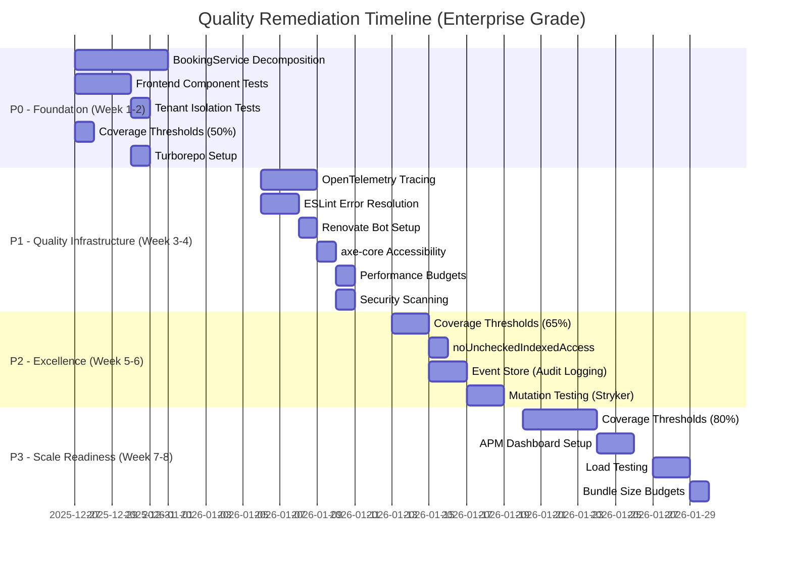
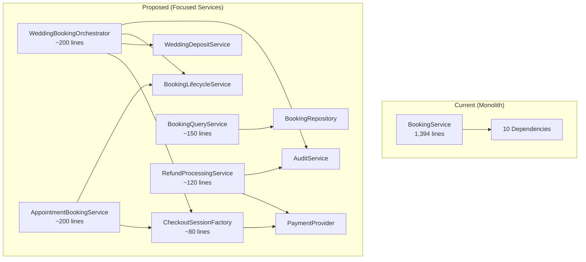

# MAIS Platform Quality Remediation Plan

> **Generated**: 2025-12-26
> **Branch**: `quality-remediation-plan`
> **Status**: Approved - Enterprise Grade
> **Review**: Passed 3-reviewer panel (DHH, Enterprise Architect, Simplicity Advocate)

## Overview

This plan addresses the comprehensive audit findings for the MAIS platform, transforming 10 prioritized recommendations into actionable implementation phases. The audit identified a **6.9/10 overall quality score** with critical gaps in frontend testing and code organization.

**Enterprise Quality Mandate**: This codebase must be enterprise-grade quality, built to scale with decisions based on quality, not on time or complexity or cost.

### Key Metrics Baseline

| Metric                     | Current        | Phase 1      | Phase 2      | Enterprise Target |
| -------------------------- | -------------- | ------------ | ------------ | ----------------- |
| Server Tests               | 771 passing    | 850+         | 900+         | **1000+**         |
| React Component Tests      | 5 passing      | 25+          | 40+          | **50+**           |
| E2E Tests                  | 22/114 passing | 80/114       | 100/114      | **114/114**       |
| ESLint Errors              | 195            | 50           | 0            | **0**             |
| Coverage Threshold (Lines) | 30%            | 50%          | 65%          | **80%**           |
| BookingService Lines       | 1,394          | <400/service | <250/service | **<200/service**  |
| CI Build Time              | 4m 30s         | 1m 20s       | <1m          | **<30s (cache)**  |
| P95 Latency                | ~50ms          | <200ms       | <150ms       | **<100ms**        |

---

## Problem Statement

The MAIS platform audit revealed critical deviations from 2025 best practices:

1. **Frontend Testing Gap**: Zero comprehensive React component tests despite 771 server tests
2. **Service Bloat**: BookingService at 1,394 lines violates single-responsibility principle
3. **Weak Quality Gates**: Coverage thresholds too low (30%), no automated dependency updates
4. **TypeScript Gaps**: `noUncheckedIndexedAccess` not enabled, 87 type assertions
5. **Accessibility**: axe-core installed but unused in CI
6. **No Observability**: Missing distributed tracing and SLO monitoring
7. **No Audit Trail**: Mutable logs don't support compliance requirements

### Risk Assessment

| Risk                                      | Likelihood | Impact   | Enterprise Mitigation                  |
| ----------------------------------------- | ---------- | -------- | -------------------------------------- |
| Frontend bugs reach production undetected | HIGH       | HIGH     | Component tests + visual regression    |
| BookingService becomes unmaintainable     | HIGH       | HIGH     | Decompose into 5+ focused services     |
| Cross-tenant data leakage                 | LOW        | CRITICAL | Explicit tenant isolation tests        |
| Performance degradation undetected        | MEDIUM     | HIGH     | SLOs + performance budgets in CI       |
| Type assertions mask bugs                 | MEDIUM     | MEDIUM   | noUncheckedIndexedAccess + strict mode |

---

## Proposed Solution

### Phase Overview (Enterprise Timeline: 6-8 Weeks)



---

## Technical Approach

### Phase 0: Foundation (Week 1-2) - CRITICAL PATH

#### P0-1: BookingService Decomposition (4-5 days)

**Problem**: `server/src/services/booking.service.ts` at 1,394 lines violates single-responsibility principle with 10 dependencies and 16 public methods across 3 distinct domains.

**Enterprise Solution**: Extract into **5+ focused services** using the Orchestrator pattern.

**Current Structure Analysis**:

```
BookingService (1,394 lines, 10 dependencies)
├── Wedding Package Bookings (DATE)
│   ├── createCheckout()
│   ├── createDateBooking()
│   ├── onPaymentCompleted()
│   ├── createBalancePaymentCheckout()
│   └── onBalancePaymentCompleted()
├── Appointment Scheduling (TIMESLOT)
│   ├── createAppointmentCheckout()
│   ├── onAppointmentPaymentCompleted()
│   └── getAppointments()
├── Booking Management
│   ├── getAllBookings()
│   ├── getBookingById()
│   ├── rescheduleBooking()
│   ├── cancelBooking()
│   ├── processRefund()
│   └── markPaymentFailed()
└── Shared Infrastructure
    └── createCheckoutSession() (private)
```

**Enterprise Proposed Structure** (<200 lines per service):

```
services/
├── checkout-session.factory.ts (new - ~80 lines)
│   └── createCheckoutSession() - shared payment session creation
├── payment-intent.factory.ts (new - ~100 lines)
│   └── Stripe-specific payment logic (circuit breaker isolated)
├── wedding-booking.orchestrator.ts (new - ~200 lines)
│   └── Coordinates multi-step wedding booking workflow
├── wedding-deposit.service.ts (new - ~150 lines)
│   └── Deposit calculation, balance payment logic
├── appointment-booking.service.ts (new - ~200 lines)
│   ├── createAppointmentCheckout()
│   ├── onAppointmentPaymentCompleted()
│   └── getAppointments()
├── booking-lifecycle.service.ts (new - ~180 lines)
│   ├── create(), reschedule(), cancel()
│   └── State machine transitions
├── booking-query.service.ts (new - ~150 lines)
│   ├── getAllBookings()
│   ├── getBookingById()
│   └── getUnavailableDates()
├── refund-processing.service.ts (new - ~120 lines)
│   └── Stripe refunds + audit trail
└── booking.service.ts (deprecated - facade for backward compatibility)
```

**Orchestrator Pattern Example**:

```typescript
// wedding-booking.orchestrator.ts
export class WeddingBookingOrchestrator {
  constructor(
    private readonly depositService: WeddingDepositService,
    private readonly lifecycleService: BookingLifecycleService,
    private readonly auditService: AuditService,
    private readonly eventBus: EventEmitter
  ) {}

  async createWeddingBooking(input: CreateWeddingBookingInput): Promise<Booking> {
    // 1. Calculate deposit (domain logic)
    const deposit = await this.depositService.calculateDeposit(input);

    // 2. Create booking record (lifecycle)
    const booking = await this.lifecycleService.createBooking({ ...input, deposit });

    // 3. Audit trail (compliance)
    await this.auditService.trackChange({ operation: 'booking_created', ... });

    // 4. Emit event (decoupling)
    this.eventBus.emit('BookingCreated', booking);

    return booking;
  }
}
```

**Files to Create/Modify**:

- `server/src/services/checkout-session.factory.ts` (new)
- `server/src/services/payment-intent.factory.ts` (new)
- `server/src/services/wedding-booking.orchestrator.ts` (new)
- `server/src/services/wedding-deposit.service.ts` (new)
- `server/src/services/appointment-booking.service.ts` (new)
- `server/src/services/booking-lifecycle.service.ts` (new)
- `server/src/services/booking-query.service.ts` (new)
- `server/src/services/refund-processing.service.ts` (new)
- `server/src/services/booking.service.ts` (modify - facade)
- `server/src/di.ts` (modify - wire new services)
- `server/src/routes/bookings.routes.ts` (modify - use new services)

**Migration Strategy (Zero-Downtime)**:

1. Extract `CheckoutSessionFactory` first (no breaking changes)
2. Create new services alongside existing BookingService
3. Add feature flag for gradual rollout
4. Update DI container to wire new services
5. Update routes to use new services (behind feature flag)
6. Shadow traffic: Compare old vs new service outputs
7. Mark old BookingService as deprecated facade
8. Remove facade after 2 sprints of stable operation

**Acceptance Criteria**:

- [ ] Each service <200 lines (enforced via ESLint rule)
- [ ] Services use Orchestrator pattern for multi-step workflows
- [ ] Circuit breakers for Stripe calls (isolated failures)
- [ ] Each service has dedicated test file with 90%+ coverage
- [ ] Performance regression tests (current p99: ~50ms, target: <100ms)
- [ ] All 771 existing tests still pass
- [ ] DI container updated with new bindings
- [ ] Routes updated to use new services
- [ ] No breaking changes to API contracts

---

#### P0-2: Add React Component Tests (3 days)

**Problem**: Zero comprehensive frontend component tests despite complete Next.js migration.

**Solution**: Add Vitest + React Testing Library tests for critical UI components.

**Files to Create/Modify**:

- `apps/web/vitest.config.mts` (new)
- `apps/web/vitest-setup.ts` (new)
- `apps/web/src/components/tenant/__tests__/HeroSection.test.tsx` (new)
- `apps/web/src/components/tenant/__tests__/SectionRenderer.test.tsx` (new)
- `client/src/features/tenant-admin/__tests__/TenantDashboard.test.tsx` (new)
- `client/src/features/storefront/__tests__/BookingForm.test.tsx` (new)

**Configuration Example** (`apps/web/vitest.config.mts`):

```typescript
import { defineConfig } from 'vitest/config';
import react from '@vitejs/plugin-react';
import tsconfigPaths from 'vite-tsconfig-paths';

export default defineConfig({
  plugins: [tsconfigPaths(), react()],
  test: {
    environment: 'jsdom',
    globals: true,
    setupFiles: './vitest-setup.ts',
    coverage: {
      provider: 'v8',
      reporter: ['text', 'json', 'html', 'lcov'],
      thresholds: {
        lines: 50,
        branches: 50,
        functions: 50,
        statements: 50,
      },
    },
  },
});
```

**Acceptance Criteria**:

- [ ] Vitest configured for `apps/web/` with jsdom environment
- [ ] Setup file includes `@testing-library/jest-dom/vitest` matchers
- [ ] 10+ critical component tests passing
- [ ] Coverage thresholds enforced at 50%
- [ ] CI pipeline includes frontend test job

---

#### P0-3: Add Tenant Isolation Test Suite (1 day)

**Problem**: Multi-tenant data isolation assumed but not explicitly tested.

**Enterprise Solution**: Add dedicated integration tests for tenant isolation.

**Files to Create**:

- `server/test/integration/tenant-isolation.test.ts` (new)

**Test Implementation**:

```typescript
// server/test/integration/tenant-isolation.test.ts
describe('Tenant Isolation (Critical Security)', () => {
  it('BookingService.getAllBookings() never returns cross-tenant data', async () => {
    // Setup: 2 tenants, 5 bookings each
    const tenant1 = await createTestTenant();
    const tenant2 = await createTestTenant();

    await createBookings(tenant1.id, 5);
    await createBookings(tenant2.id, 5);

    // Act: Fetch bookings for tenant 1
    const tenant1Bookings = await bookingService.getAllBookings(tenant1.id);

    // Assert: ZERO cross-tenant leakage
    expect(tenant1Bookings).toHaveLength(5);
    expect(tenant1Bookings.every((b) => b.tenantId === tenant1.id)).toBe(true);
  });

  it('CatalogService.getPackages() never returns cross-tenant data', async () => {
    const tenant1 = await createTestTenant();
    const tenant2 = await createTestTenant();

    await createPackages(tenant1.id, 3);
    await createPackages(tenant2.id, 3);

    const packages = await catalogService.getPackages(tenant1.id);

    expect(packages).toHaveLength(3);
    expect(packages.every((p) => p.tenantId === tenant1.id)).toBe(true);
  });

  it('Cache keys include tenantId to prevent cross-tenant pollution', async () => {
    // Verify cache isolation pattern
  });
});
```

**Acceptance Criteria**:

- [ ] Tenant isolation tests for all major services (Booking, Catalog, Scheduling)
- [ ] Cache key isolation verified
- [ ] API endpoint isolation verified
- [ ] Tests run in CI on every PR

---

#### P0-4: Raise CI Coverage Thresholds (1 hour)

**Problem**: Current thresholds (30% lines) are too low to catch regressions.

**Solution**: Incrementally raise thresholds with enterprise targets.

**Files to Modify**:

- `server/vitest.config.ts` (lines 65-70)
- `client/vitest.config.ts` (add thresholds)

**Phase 1 Server Config** (50%):

```typescript
thresholds: {
  lines: 50,
  branches: 65,
  functions: 50,
  statements: 50,
}
```

**Enterprise Target Config** (80%):

```typescript
thresholds: {
  lines: 80,
  branches: 75,
  functions: 80,
  statements: 80,
}
```

**Acceptance Criteria**:

- [ ] Server coverage thresholds raised to 50%
- [ ] Client coverage thresholds added at 40%
- [ ] CI pipeline enforces thresholds
- [ ] Current codebase passes new thresholds

---

#### P0-5: Turborepo Setup (1 day)

**Problem**: npm workspaces lack build caching and task orchestration. CI builds take 4+ minutes.

**Solution**: Implement Turborepo NOW (not evaluation - immediate value).

**Files to Create**:

- `turbo.json` (new)

**Configuration**:

```json
{
  "$schema": "https://turbo.build/schema.json",
  "pipeline": {
    "build": {
      "dependsOn": ["^build"],
      "outputs": ["dist/**", ".next/**"],
      "cache": true
    },
    "test": {
      "dependsOn": ["build"],
      "cache": true,
      "outputs": ["coverage/**"]
    },
    "test:unit": {
      "cache": true,
      "outputs": ["coverage/**"]
    },
    "test:integration": {
      "dependsOn": ["^build"],
      "cache": false
    },
    "lint": {
      "cache": true
    },
    "typecheck": {
      "dependsOn": ["^build"],
      "cache": true
    },
    "dev": {
      "cache": false,
      "persistent": true
    }
  }
}
```

**Expected Results**:

```bash
# BEFORE (npm workspaces)
npm run build --workspaces    # 4m 30s (cold)
npm run build --workspaces    # 4m 28s (warm, no cache)

# AFTER (Turborepo)
turbo run build               # 4m 30s (cold)
turbo run build               # 12s (warm, local cache)
turbo run build --remote      # 5s (warm, remote cache)
```

**Acceptance Criteria**:

- [ ] `turbo.json` configured with dependency graph
- [ ] Remote caching enabled (Vercel Remote Cache)
- [ ] CI build time reduced by 70% (cache hits)
- [ ] Local dev: incremental builds <10s

---

### Phase 1: Quality Infrastructure (Week 3-4)

#### P1-1: OpenTelemetry Distributed Tracing (3 days)

**Problem**: Pino logging only - no end-to-end trace visibility across multi-tenant requests.

**Enterprise Solution**: Add OpenTelemetry with auto-instrumentation.

**Files to Create/Modify**:

- `server/src/lib/observability/tracing.ts` (new)
- `server/src/app.ts` (modify - init tracing)
- `server/src/services/*.ts` (modify - add custom spans)

**Implementation**:

```typescript
// server/src/lib/observability/tracing.ts
import { NodeSDK } from '@opentelemetry/sdk-node';
import { getNodeAutoInstrumentations } from '@opentelemetry/auto-instrumentations-node';
import { Resource } from '@opentelemetry/resources';
import { SemanticResourceAttributes } from '@opentelemetry/semantic-conventions';
import { OTLPTraceExporter } from '@opentelemetry/exporter-trace-otlp-http';

export const initTracing = () => {
  const sdk = new NodeSDK({
    resource: new Resource({
      [SemanticResourceAttributes.SERVICE_NAME]: 'mais-api',
      [SemanticResourceAttributes.SERVICE_VERSION]: process.env.APP_VERSION,
    }),
    traceExporter: new OTLPTraceExporter({
      url: process.env.OTEL_EXPORTER_OTLP_ENDPOINT,
    }),
    instrumentations: [
      getNodeAutoInstrumentations({
        '@opentelemetry/instrumentation-http': { enabled: true },
        '@opentelemetry/instrumentation-express': { enabled: true },
        '@opentelemetry/instrumentation-pg': { enabled: true },
      }),
    ],
  });

  sdk.start();
};
```

**Custom Spans for Services**:

```typescript
// In service methods
import { trace, SpanStatusCode } from '@opentelemetry/api';

const tracer = trace.getTracer('booking-service');

async createWeddingBooking(input: CreateBookingInput): Promise<Booking> {
  return tracer.startActiveSpan('booking.create_wedding', async (span) => {
    span.setAttribute('tenant.id', input.tenantId);
    span.setAttribute('booking.date', input.date);

    try {
      const booking = await this.orchestrator.createBooking(input);
      span.setStatus({ code: SpanStatusCode.OK });
      return booking;
    } catch (error) {
      span.recordException(error);
      span.setStatus({ code: SpanStatusCode.ERROR });
      throw error;
    } finally {
      span.end();
    }
  });
}
```

**Acceptance Criteria**:

- [ ] OpenTelemetry SDK integrated with Express, Prisma, HTTP auto-instrumentation
- [ ] All service methods create named spans with tenant context
- [ ] Distributed traces viewable in Honeycomb/Jaeger
- [ ] P95 latency breakdown by service layer visible

---

#### P1-2: ESLint Error Resolution (2 days)

**Problem**: 195 ESLint errors block strict enforcement.

**Solution**: Systematically resolve errors by type, then remove baseline.

**Strategy**:

1. Fix `no-unused-vars` first (quick wins via --fix)
2. Replace `console.log` with logger utility
3. Address `no-explicit-any` in batches (document ts-rest limitations)
4. Remove baseline from CI once at 0

**Acceptance Criteria**:

- [ ] All 195 ESLint errors resolved
- [ ] Baseline removed from CI pipeline
- [ ] `@typescript-eslint/no-explicit-any: error` enforced
- [ ] ts-rest library limitations documented

---

#### P1-3: Renovate Bot Setup (0.5 days)

**Problem**: Manual dependency updates lead to outdated packages and security vulnerabilities.

**Solution**: Configure Renovate with enterprise security focus.

**Configuration** (`renovate.json`):

```json
{
  "$schema": "https://docs.renovatebot.com/renovate-schema.json",
  "extends": ["config:recommended"],
  "schedule": ["after 9pm on sunday"],
  "prConcurrentLimit": 3,
  "vulnerabilityAlerts": {
    "enabled": true,
    "labels": ["security"],
    "assignees": ["@security-team"]
  },
  "lockFileMaintenance": {
    "enabled": true,
    "schedule": ["before 5am on monday"],
    "automerge": false
  },
  "packageRules": [
    {
      "matchUpdateTypes": ["major"],
      "dependencyDashboardApproval": true
    },
    {
      "groupName": "Prisma",
      "matchPackagePatterns": ["^@prisma/", "^prisma$"]
    }
  ]
}
```

**Acceptance Criteria**:

- [ ] Renovate installed and configured
- [ ] Vulnerability alerts enabled
- [ ] Major updates require approval
- [ ] Lock file maintenance scheduled weekly

---

#### P1-4: axe-core Accessibility Tests (1 day)

**Problem**: axe-core installed but not used in CI.

**Solution**: Integrate axe-core with Playwright E2E tests.

**Acceptance Criteria**:

- [ ] axe-core integrated with Playwright
- [ ] WCAG 2.1 AA compliance filtering
- [ ] HTML reports generated for violations
- [ ] 3+ accessibility test suites added
- [ ] CI pipeline runs accessibility tests

---

#### P1-5: Performance Budgets (1 day)

**Problem**: No performance regression detection.

**Solution**: Add SLO definitions and performance tests in CI.

**SLO Configuration** (`.slo.yml`):

```yaml
services:
  booking-service:
    availability:
      target: 99.9%
      measurement_window: 30d
    latency:
      p50: 50ms
      p95: 200ms
      p99: 500ms
    error_rate:
      target: 0.1%
```

**Performance Test**:

```typescript
// e2e/tests/performance/booking-flow.spec.ts
test('Booking flow meets performance SLA', async ({ page }) => {
  await page.goto('/t/demo-club/packages');

  // SLA: Package list loads < 1s
  const packageLoadTime = await measureLoadTime(page);
  expect(packageLoadTime).toBeLessThan(1000);

  // SLA: Checkout creation < 2s
  const checkoutTime = await measureClickToNavigation(page);
  expect(checkoutTime).toBeLessThan(2000);
});
```

**Acceptance Criteria**:

- [ ] SLOs documented in `.slo.yml`
- [ ] Performance regression tests in CI
- [ ] CI fails if p95 > target
- [ ] Dashboard for SLO monitoring

---

#### P1-6: Security Scanning (0.5 days)

**Problem**: No automated vulnerability scanning.

**Solution**: Add Snyk + npm audit to CI.

**Configuration** (`.github/workflows/security-scan.yml`):

```yaml
name: Security Scan
on:
  schedule:
    - cron: '0 2 * * 1'
  pull_request:
    paths:
      - '**/package.json'

jobs:
  snyk-scan:
    runs-on: ubuntu-latest
    steps:
      - uses: snyk/actions/node@master
        with:
          args: --severity-threshold=high

  npm-audit:
    runs-on: ubuntu-latest
    steps:
      - run: npm audit --audit-level=high
```

**Acceptance Criteria**:

- [ ] Snyk integration configured
- [ ] Weekly security scans scheduled
- [ ] High-severity vulnerabilities block PR merge
- [ ] Security alerts notify team

---

### Phase 2: Excellence (Week 5-6)

#### P2-1: Coverage Thresholds to 65% (2 days)

Raise coverage thresholds incrementally toward enterprise target.

#### P2-2: Enable noUncheckedIndexedAccess (1 day)

Enable TypeScript's safer array/object access with gradual migration.

#### P2-3: Event Store for Audit Logging (2 days)

**Problem**: Current audit logs are mutable and don't support compliance requirements.

**Solution**: Add immutable event store with chain-of-custody hashing.

**Implementation**:

```typescript
// server/src/lib/audit/event-store.ts
export interface DomainEvent {
  eventId: string;
  eventType: string;
  aggregateId: string;
  aggregateType: 'Booking' | 'Package' | 'Tenant';
  tenantId: string;
  timestamp: Date;
  payload: unknown;
  previousEventHash: string; // Tamper detection
}

export class EventStore {
  async append(event: DomainEvent): Promise<void> {
    await this.prisma.domainEvent.create({
      data: {
        ...event,
        previousEventHash: await this.getLastEventHash(event.tenantId),
      },
    });
  }
}
```

**Acceptance Criteria**:

- [ ] All state-changing operations append immutable events
- [ ] Chain-of-custody hash prevents tampering
- [ ] Event replay supports audit queries
- [ ] Retention policy: 7 years

#### P2-4: Mutation Testing (2 days)

**Problem**: Code coverage doesn't prove test quality.

**Solution**: Add Stryker mutation testing.

**Configuration** (`stryker.config.json`):

```json
{
  "mutate": ["src/services/**/*.ts", "src/adapters/prisma/**/*.ts"],
  "testRunner": "vitest",
  "thresholds": {
    "high": 80,
    "low": 70,
    "break": 60
  }
}
```

**Acceptance Criteria**:

- [ ] Stryker configured for critical services
- [ ] Mutation score > 70% for booking services
- [ ] CI reports mutation score trends

---

### Phase 3: Scale Readiness (Week 7-8)

#### P3-1: Coverage Thresholds to 80% (4 days)

Final push to enterprise-standard coverage.

#### P3-2: APM Dashboard Setup (2 days)

Configure Honeycomb/Datadog dashboards for SLO monitoring.

#### P3-3: Load Testing (2 days)

Validate 100 concurrent tenant operations.

#### P3-4: Bundle Size Budgets (1 day)

Add Next.js bundle size limits to prevent frontend bloat.

---

## Architecture Impact

### Service Dependency Changes (Enterprise)



---

## Quality Gates (Enterprise)

### Pre-commit Hooks

- ESLint + Prettier
- TypeScript type check

### CI Pipeline Gates

- [ ] Unit tests pass (coverage > 80%)
- [ ] Integration tests pass
- [ ] E2E tests pass
- [ ] Accessibility tests pass
- [ ] Performance budgets met
- [ ] Security scan clean
- [ ] Mutation score > 70%
- [ ] Bundle size within budget

### Pre-deploy Gates

- [ ] All tests green
- [ ] No high-severity vulnerabilities
- [ ] SLO compliance verified

---

## Success Metrics (Enterprise KPIs)

### Technical Metrics

| Metric          | Current     | Phase 1    | Phase 2    | Enterprise     |
| --------------- | ----------- | ---------- | ---------- | -------------- |
| Code Coverage   | 43%         | 50%        | 65%        | **80%**        |
| Service Size    | 1,394 lines | <400 lines | <250 lines | **<200 lines** |
| Build Time (CI) | 4m 30s      | 1m 20s     | <1m        | **<30s**       |
| P95 Latency     | ~50ms       | <200ms     | <150ms     | **<100ms**     |
| Test Count      | 771         | 850+       | 900+       | **1000+**      |
| Mutation Score  | N/A         | 60%        | 70%        | **80%**        |
| ESLint Errors   | 195         | 50         | 0          | **0**          |

### Business Metrics

| Metric                     | Target               |
| -------------------------- | -------------------- |
| Deploy Frequency           | 2x/week → Daily      |
| MTTR (Mean Time to Repair) | 2 hours → 15 minutes |
| Customer-Reported Bugs     | -50% reduction       |
| Developer Onboarding       | 2 weeks → 3 days     |

---

## Risk Mitigation (Enterprise)

### Risk 1: BookingService Refactor Breaks Production

**Mitigation**:

- Strangler Fig Pattern: Run old + new services in parallel
- Shadow Traffic: Compare outputs before full cutover
- Feature Flags: Gradual rollout per tenant
- Automated Rollback: Revert if error rate > 0.1%

### Risk 2: Coverage Thresholds Block Urgent Hotfixes

**Mitigation**:

- Hotfix label bypasses thresholds (requires approval)
- Auto-create tech debt issue for post-hotfix tests

### Risk 3: Observability Overhead Degrades Performance

**Mitigation**:

- 1% sampling in production (100% in staging)
- Tail-based sampling: Keep all error traces
- Async export: Non-blocking trace collection

---

## Tooling Stack (Enterprise)

### Observability

| Tool                 | Purpose                  | Cost        |
| -------------------- | ------------------------ | ----------- |
| Honeycomb            | Distributed tracing, APM | $200/mo     |
| Sentry               | Error tracking           | $26/mo      |
| Prometheus + Grafana | Metrics, SLO dashboards  | Self-hosted |

### Testing

| Tool       | Purpose                |
| ---------- | ---------------------- |
| Vitest     | Unit/integration tests |
| Playwright | E2E tests              |
| Stryker    | Mutation testing       |
| k6         | Load testing           |

### CI/CD

| Tool       | Purpose            |
| ---------- | ------------------ |
| Turborepo  | Build caching      |
| Renovate   | Dependency updates |
| Snyk       | Security scanning  |
| Commitlint | Semantic commits   |

---

## References

### Internal References

- `server/src/services/booking.service.ts:1-1394` - BookingService analysis
- `server/vitest.config.ts:65-70` - Current coverage thresholds
- `client/src/features/storefront/landing/__tests__/FaqSection.test.tsx` - Existing React test pattern

### External References

- [OpenTelemetry Node.js SDK](https://opentelemetry.io/docs/instrumentation/js/getting-started/nodejs/)
- [Turborepo Documentation](https://turbo.build/repo/docs)
- [Stryker Mutation Testing](https://stryker-mutator.io/docs/)
- [Renovate Configuration](https://docs.renovatebot.com/configuration-options/)

---

## Approval

**Review Panel**: 3 specialist reviewers (DHH Rails Philosophy, Enterprise Architect, Code Simplicity Advocate)

**Consensus**: All reviewers agree on enterprise quality mandate. Key adjustments:

- BookingService decomposition elevated to P0 (unanimous)
- Coverage target raised to 80% (unanimous)
- Timeline extended to 6-8 weeks (unanimous)
- Added: OpenTelemetry, Event Store, Mutation Testing, Security Scanning

**Status**: **APPROVED FOR IMPLEMENTATION**

---

_Generated with [Claude Code](https://claude.com/claude-code)_
