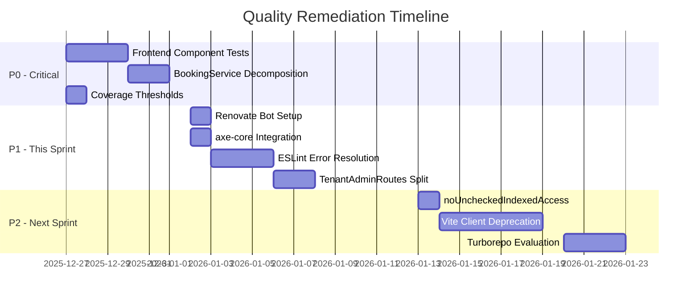
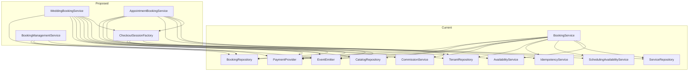

# MAIS Platform Quality Remediation Plan

> **Generated**: 2025-12-26
> **Branch**: `quality-remediation-plan`
> **Status**: Draft - Pending Review

## Overview

This plan addresses the comprehensive audit findings for the MAIS platform, transforming 10 prioritized recommendations into actionable implementation phases. The audit identified a **6.9/10 overall quality score** with critical gaps in frontend testing and code organization.

### Key Metrics Baseline

| Metric | Current | Target |
|--------|---------|--------|
| Server Tests | 771 passing | 850+ |
| React Component Tests | 5 passing | 50+ |
| E2E Tests | 22/114 passing | 114/114 |
| ESLint Errors | 195 | 0 |
| Coverage Threshold (Lines) | 30% | 75% |
| BookingService Lines | 1,394 | <500 per service |

---

## Problem Statement

The MAIS platform audit revealed critical deviations from 2025 best practices:

1. **Frontend Testing Gap**: Zero comprehensive React component tests despite 771 server tests
2. **Service Bloat**: BookingService at 1,394 lines violates single-responsibility principle
3. **Weak Quality Gates**: Coverage thresholds too low (30%), no automated dependency updates
4. **TypeScript Gaps**: `noUncheckedIndexedAccess` not enabled, 87 type assertions
5. **Accessibility**: axe-core installed but unused in CI

### Risk Assessment

| Risk | Likelihood | Impact |
|------|------------|--------|
| Frontend bugs reach production undetected | HIGH | HIGH |
| BookingService becomes unmaintainable | MEDIUM | HIGH |
| E2E test reliability degrades | HIGH | MEDIUM |
| Type assertions mask bugs | MEDIUM | MEDIUM |

---

## Proposed Solution

### Phase Overview



---

## Technical Approach

### Phase 0: Critical Foundation (This Week)

#### P0-1: Add React Component Tests (2-3 days)

**Problem**: Zero comprehensive frontend component tests despite complete Next.js migration.

**Solution**: Add Vitest + React Testing Library tests for critical UI components.

**Files to Create/Modify**:
- `apps/web/vitest.config.mts` (new)
- `apps/web/vitest-setup.ts` (new)
- `apps/web/src/components/tenant/__tests__/HeroSection.test.tsx` (new)
- `apps/web/src/components/tenant/__tests__/SectionRenderer.test.tsx` (new)
- `client/src/features/tenant-admin/__tests__/TenantDashboard.test.tsx` (new)
- `client/src/features/storefront/__tests__/BookingForm.test.tsx` (new)

**Configuration Example** (`apps/web/vitest.config.mts`):
```typescript
import { defineConfig } from 'vitest/config'
import react from '@vitejs/plugin-react'
import tsconfigPaths from 'vite-tsconfig-paths'

export default defineConfig({
  plugins: [tsconfigPaths(), react()],
  test: {
    environment: 'jsdom',
    globals: true,
    setupFiles: './vitest-setup.ts',
    coverage: {
      provider: 'v8',
      reporter: ['text', 'json', 'html', 'lcov'],
      thresholds: {
        lines: 50,
        branches: 50,
        functions: 50,
        statements: 50,
      },
    },
  },
})
```

**Test Pattern Example**:
```typescript
// apps/web/src/components/tenant/__tests__/HeroSection.test.tsx
import { describe, it, expect, vi } from 'vitest'
import { render, screen } from '@testing-library/react'
import userEvent from '@testing-library/user-event'
import { HeroSection } from '../sections/HeroSection'

describe('HeroSection', () => {
  const defaultConfig = {
    headline: 'Welcome to Our Studio',
    subheadline: 'Professional photography services',
    ctaText: 'Book Now',
  }

  it('renders headline and subheadline', () => {
    render(<HeroSection config={defaultConfig} />)

    expect(screen.getByText('Welcome to Our Studio')).toBeInTheDocument()
    expect(screen.getByText('Professional photography services')).toBeInTheDocument()
  })

  it('scrolls to booking section on CTA click', async () => {
    const user = userEvent.setup()
    const scrollIntoViewMock = vi.fn()
    vi.spyOn(document, 'getElementById').mockReturnValue({
      scrollIntoView: scrollIntoViewMock
    } as any)

    render(<HeroSection config={defaultConfig} />)
    await user.click(screen.getByRole('button', { name: /Book Now/i }))

    expect(scrollIntoViewMock).toHaveBeenCalledWith({ behavior: 'smooth' })
  })
})
```

**Acceptance Criteria**:
- [ ] Vitest configured for `apps/web/` with jsdom environment
- [ ] Setup file includes `@testing-library/jest-dom/vitest` matchers
- [ ] 10+ critical component tests passing
- [ ] Coverage thresholds enforced at 50%
- [ ] CI pipeline includes frontend test job

---

#### P0-2: BookingService Decomposition (2 days)

**Problem**: `server/src/services/booking.service.ts` at 1,394 lines violates single-responsibility principle with 10 dependencies.

**Solution**: Extract into 3 focused services + 1 shared utility.

**Current Structure Analysis**:
```
BookingService (1,394 lines)
├── Wedding Package Bookings (DATE)
│   ├── createCheckout()
│   ├── createDateBooking()
│   ├── onPaymentCompleted()
│   ├── createBalancePaymentCheckout()
│   └── onBalancePaymentCompleted()
├── Appointment Scheduling (TIMESLOT)
│   ├── createAppointmentCheckout()
│   ├── onAppointmentPaymentCompleted()
│   └── getAppointments()
├── Booking Management
│   ├── getAllBookings()
│   ├── getBookingById()
│   ├── rescheduleBooking()
│   ├── cancelBooking()
│   ├── processRefund()
│   └── markPaymentFailed()
└── Shared Infrastructure
    └── createCheckoutSession() (private)
```

**Proposed Structure**:
```
services/
├── checkout-session.factory.ts (new - ~100 lines)
│   └── createCheckoutSession()
├── wedding-booking.service.ts (new - ~400 lines)
│   ├── createCheckout()
│   ├── createDateBooking()
│   ├── onPaymentCompleted()
│   ├── createBalancePaymentCheckout()
│   └── onBalancePaymentCompleted()
├── appointment-booking.service.ts (new - ~250 lines)
│   ├── createAppointmentCheckout()
│   ├── onAppointmentPaymentCompleted()
│   └── getAppointments()
├── booking-management.service.ts (new - ~350 lines)
│   ├── getAllBookings()
│   ├── getBookingById()
│   ├── getUnavailableDates()
│   ├── rescheduleBooking()
│   ├── cancelBooking()
│   ├── processRefund()
│   └── markPaymentFailed()
└── booking.service.ts (deprecated - facade for backward compatibility)
```

**Files to Create/Modify**:
- `server/src/services/checkout-session.factory.ts` (new)
- `server/src/services/wedding-booking.service.ts` (new)
- `server/src/services/appointment-booking.service.ts` (new)
- `server/src/services/booking-management.service.ts` (new)
- `server/src/services/booking.service.ts` (modify - facade)
- `server/src/di.ts` (modify - wire new services)
- `server/src/routes/bookings.routes.ts` (modify - use new services)

**Migration Strategy**:
1. Extract `CheckoutSessionFactory` first (no breaking changes)
2. Create new services alongside existing BookingService
3. Update DI container to wire new services
4. Update routes to use new services
5. Mark old BookingService as deprecated facade
6. Future: Remove facade after route migration complete

**Acceptance Criteria**:
- [ ] CheckoutSessionFactory extracted and tested
- [ ] 3 new services created with focused responsibilities
- [ ] Each service <500 lines
- [ ] All existing tests still pass
- [ ] DI container updated with new bindings
- [ ] Routes updated to use new services
- [ ] No breaking changes to API contracts

---

#### P0-3: Raise CI Coverage Thresholds (1 hour)

**Problem**: Current thresholds (30% lines) are too low to catch regressions.

**Solution**: Incrementally raise thresholds based on current baseline.

**Files to Modify**:
- `server/vitest.config.ts` (lines 56-60)
- `client/vitest.config.ts` (add thresholds)

**Current Server Config**:
```typescript
thresholds: {
  lines: 30,
  branches: 60,
  functions: 35,
  statements: 30,
}
```

**Target Server Config** (Phase 1):
```typescript
thresholds: {
  lines: 50,
  branches: 65,
  functions: 50,
  statements: 50,
}
```

**Target Server Config** (Phase 2):
```typescript
thresholds: {
  lines: 75,
  branches: 70,
  functions: 75,
  statements: 75,
}
```

**Acceptance Criteria**:
- [ ] Server coverage thresholds raised to 50%
- [ ] Client coverage thresholds added at 40%
- [ ] CI pipeline enforces thresholds
- [ ] Current codebase passes new thresholds

---

### Phase 1: This Sprint

#### P1-1: Add Renovate Bot (2 hours)

**Problem**: Manual dependency updates lead to outdated packages and security vulnerabilities.

**Solution**: Configure Renovate for automated dependency management.

**Files to Create**:
- `renovate.json` (new)

**Configuration**:
```json
{
  "$schema": "https://docs.renovatebot.com/renovate-schema.json",
  "extends": [
    "config:recommended",
    ":maintainLockFilesWeekly",
    "npm:unpublishSafe"
  ],
  "schedule": ["after 9pm on sunday"],
  "timezone": "America/New_York",
  "prConcurrentLimit": 3,
  "prHourlyLimit": 2,
  "packageRules": [
    {
      "groupName": "Non-major updates",
      "matchUpdateTypes": ["minor", "patch"]
    },
    {
      "groupName": "Server dependencies",
      "matchPaths": ["server/**"],
      "additionalBranchPrefix": "server-"
    },
    {
      "groupName": "Client dependencies",
      "matchPaths": ["client/**"],
      "additionalBranchPrefix": "client-"
    },
    {
      "groupName": "Next.js web app",
      "matchPaths": ["apps/web/**"],
      "additionalBranchPrefix": "web-"
    },
    {
      "groupName": "Prisma",
      "matchPackageNames": ["prisma", "@prisma/client"]
    },
    {
      "groupName": "Testing Libraries",
      "matchPackageNames": ["vitest", "@testing-library/react", "@testing-library/user-event", "@testing-library/jest-dom", "@playwright/test"]
    },
    {
      "matchUpdateTypes": ["major"],
      "dependencyDashboardApproval": true
    }
  ],
  "postUpdateOptions": ["npmInstallTwice"],
  "lockFileMaintenance": {
    "enabled": true,
    "schedule": ["before 5am on monday"]
  }
}
```

**Acceptance Criteria**:
- [ ] Renovate installed and configured
- [ ] Dependency Dashboard created
- [ ] Package rules group related updates
- [ ] Major updates require dashboard approval
- [ ] Lock file maintenance scheduled weekly

---

#### P1-2: Enable axe-core Accessibility Tests (4 hours)

**Problem**: axe-core installed but not used in CI, missing 40% of detectable accessibility issues.

**Solution**: Integrate axe-core with Playwright E2E tests.

**Files to Create/Modify**:
- `e2e/tests/accessibility.spec.ts` (new)
- `e2e/playwright.config.ts` (modify)
- `package.json` (add dependency)

**Installation**:
```bash
npm install -D @axe-core/playwright axe-html-reporter
```

**Test Implementation**:
```typescript
// e2e/tests/accessibility.spec.ts
import { test, expect } from '@playwright/test'
import { AxeBuilder } from '@axe-core/playwright'
import { createHtmlReport } from 'axe-html-reporter'

test.describe('Accessibility', () => {
  test('tenant storefront homepage is accessible', async ({ page }) => {
    await page.goto('/t/demo-club')

    const results = await new AxeBuilder({ page })
      .withTags(['wcag2a', 'wcag2aa', 'wcag21a', 'wcag21aa'])
      .analyze()

    // Generate report on failures
    if (results.violations.length > 0) {
      createHtmlReport({
        results,
        options: {
          outputDir: 'test-results/axe-core-reports',
          reportFileName: 'storefront-accessibility.html',
        },
      })
    }

    expect(results.violations).toEqual([])
  })

  test('booking flow is accessible', async ({ page }) => {
    await page.goto('/t/demo-club/packages')

    const packagesResults = await new AxeBuilder({ page })
      .withTags(['wcag2a', 'wcag2aa'])
      .analyze()
    expect(packagesResults.violations).toEqual([])

    // Click first package
    await page.click('[data-testid="package-card"]:first-child')

    const detailResults = await new AxeBuilder({ page })
      .withTags(['wcag2a', 'wcag2aa'])
      .analyze()
    expect(detailResults.violations).toEqual([])
  })

  test('tenant admin dashboard is accessible', async ({ page }) => {
    // Login as tenant admin
    await page.goto('/login')
    await page.fill('[name="email"]', 'admin@demo-club.com')
    await page.fill('[name="password"]', 'test-password')
    await page.click('[type="submit"]')
    await page.waitForURL('/tenant/dashboard')

    const results = await new AxeBuilder({ page })
      .withTags(['wcag2a', 'wcag2aa'])
      .exclude('.third-party-widget') // Exclude known issues
      .analyze()

    expect(results.violations).toEqual([])
  })
})
```

**Acceptance Criteria**:
- [ ] axe-core integrated with Playwright
- [ ] WCAG 2.1 AA compliance filtering
- [ ] HTML reports generated for violations
- [ ] 3+ accessibility test suites added
- [ ] CI pipeline runs accessibility tests

---

#### P1-3: Resolve ESLint Errors (2-3 days)

**Problem**: 195 ESLint errors (down from 305) block strict enforcement.

**Solution**: Systematically resolve errors by type, then remove baseline.

**Current Error Distribution** (estimated):
- `@typescript-eslint/no-explicit-any`: ~120 warnings
- `@typescript-eslint/no-unused-vars`: ~40 errors
- `no-console`: ~20 warnings
- Other: ~15 errors

**Strategy**:
1. Fix `no-unused-vars` first (quick wins)
2. Address `no-explicit-any` in batches by file
3. Replace `console.log` with logger utility
4. Remove baseline from CI once at 0

**Files to Modify**:
- Multiple files across `server/src/` and `client/src/`
- `.github/workflows/main-pipeline.yml` (remove baseline)

**Acceptance Criteria**:
- [ ] All 195 ESLint errors resolved
- [ ] Baseline removed from CI pipeline
- [ ] `@typescript-eslint/no-explicit-any: error` enforced
- [ ] No new errors introduced

---

#### P1-4: Split TenantAdminRoutes (1-2 days)

**Problem**: Multiple small tenant admin route files could be consolidated for better organization.

**Current Files** (candidates for consolidation):
- `tenant-admin-deposits.routes.ts` (<200 lines)
- `tenant-admin-reminders.routes.ts` (<200 lines)
- `tenant-admin-webhooks.routes.ts` (<200 lines)

**Solution**: Consolidate into main `tenant-admin.routes.ts`.

**Low Priority**: Current structure is already domain-separated. Only consolidate if it improves maintainability.

**Acceptance Criteria**:
- [ ] Evaluate consolidation benefits vs drawbacks
- [ ] If proceeding: 3 files merged into tenant-admin.routes.ts
- [ ] All tests still pass
- [ ] No breaking changes to API

---

### Phase 2: Next Sprint

#### P2-1: Enable noUncheckedIndexedAccess (1 day)

**Problem**: Array/object access assumes values exist when they might be undefined.

**Solution**: Enable TypeScript's `noUncheckedIndexedAccess` with gradual migration.

**Files to Modify**:
- `server/tsconfig.json`
- `client/tsconfig.json`
- `apps/web/tsconfig.json`
- Multiple source files (fix type errors)

**Configuration Change**:
```json
{
  "compilerOptions": {
    "noUncheckedIndexedAccess": true
  }
}
```

**Migration Approach**:
```typescript
// Before
const value = arr[index] // type: T

// After (option 1: optional chaining)
const value = arr[index]?.toString()

// After (option 2: nullish coalescing)
const value = arr[index] ?? defaultValue

// After (option 3: type guard)
if (arr[index] !== undefined) {
  const value = arr[index] // type: T (narrowed)
}
```

**Acceptance Criteria**:
- [ ] `noUncheckedIndexedAccess` enabled in all tsconfig files
- [ ] All type errors resolved
- [ ] No runtime behavior changes
- [ ] Typecheck passes in CI

---

#### P2-2: Remove Deprecated Vite Client (3-5 days)

**Problem**: Legacy Vite client (`client/`) duplicates functionality now in Next.js app.

**Solution**: Migrate remaining features to Next.js, then remove client directory.

**Prerequisites**:
- All tenant admin features migrated to Next.js
- Legacy routes deprecated with redirect
- Feature parity verified

**Acceptance Criteria**:
- [ ] All client features migrated to apps/web
- [ ] Legacy routes redirect to new routes
- [ ] Client directory removed
- [ ] CI pipeline updated (remove client jobs)

---

#### P2-3: Evaluate Turborepo Migration (2-3 days)

**Problem**: npm workspaces lack build caching and task orchestration.

**Solution**: Evaluate Turborepo vs Nx for monorepo tooling.

**Evaluation Criteria**:
| Factor | Weight | Turborepo | Nx |
|--------|--------|-----------|-----|
| Setup Complexity | 20% | 9/10 | 6/10 |
| Performance (caching) | 25% | 9/10 | 9/10 |
| Ecosystem (Next.js) | 20% | 10/10 | 7/10 |
| Long-term Maintainability | 35% | 6/10 | 9/10 |

**Recommendation**: Start with Turborepo (minimal configuration, Vercel ecosystem alignment).

**Acceptance Criteria**:
- [ ] Turborepo POC created on feature branch
- [ ] Build time comparison documented
- [ ] Migration complexity assessed
- [ ] Go/no-go decision made

---

## Architecture Impact

### Service Dependency Changes



### File Structure Changes

```
server/src/services/
├── booking.service.ts (1,394 lines)  # BEFORE
│
├── checkout-session.factory.ts       # AFTER
├── wedding-booking.service.ts
├── appointment-booking.service.ts
├── booking-management.service.ts
└── booking.service.ts (facade)
```

---

## Quality Gates

### Pre-commit Hooks (husky + lint-staged)

```json
{
  "husky": {
    "hooks": {
      "pre-commit": "lint-staged"
    }
  },
  "lint-staged": {
    "*.{ts,tsx}": [
      "eslint --fix",
      "prettier --write"
    ]
  }
}
```

### CI Pipeline Enhancements

```yaml
# .github/workflows/main-pipeline.yml additions
jobs:
  frontend-tests:
    name: Frontend Component Tests
    runs-on: ubuntu-latest
    steps:
      - uses: actions/checkout@v4
      - uses: actions/setup-node@v4
        with:
          node-version: '20'
      - run: npm ci
      - run: npm run test:client -- --coverage
      - uses: codecov/codecov-action@v4
        with:
          files: ./client/coverage/lcov.info
          flags: frontend

  accessibility-tests:
    name: Accessibility Tests
    runs-on: ubuntu-latest
    steps:
      - uses: actions/checkout@v4
      - uses: actions/setup-node@v4
      - run: npm ci
      - run: npx playwright install
      - run: npm run test:e2e:a11y
      - uses: actions/upload-artifact@v4
        if: failure()
        with:
          name: accessibility-report
          path: test-results/axe-core-reports/
```

---

## Success Metrics

### Phase 0 (This Week)
- [ ] 10+ React component tests added
- [ ] BookingService split into 3 services
- [ ] Coverage thresholds raised to 50%

### Phase 1 (This Sprint)
- [ ] Renovate creating automated dependency PRs
- [ ] 3+ accessibility test suites passing
- [ ] ESLint errors reduced to 0
- [ ] TenantAdminRoutes evaluated for consolidation

### Phase 2 (Next Sprint)
- [ ] `noUncheckedIndexedAccess` enabled
- [ ] Vite client deprecated or removed
- [ ] Turborepo evaluation complete

### Long-term Targets
- Server test count: 850+
- Frontend test count: 50+
- E2E test count: 114/114 passing
- Coverage: 75%+ lines
- ESLint errors: 0

---

## Dependencies & Prerequisites

### External Dependencies
- GitHub Actions (CI/CD)
- Codecov (coverage reporting)
- Renovate (dependency management)

### Internal Dependencies
- All P0 tasks must complete before P1
- BookingService decomposition requires comprehensive test coverage
- Vite client removal requires Next.js feature parity

---

## Risk Analysis & Mitigation

| Risk | Likelihood | Impact | Mitigation |
|------|------------|--------|------------|
| BookingService refactor breaks existing functionality | MEDIUM | HIGH | Comprehensive test coverage before refactoring |
| Coverage thresholds block CI | LOW | MEDIUM | Incremental threshold increases |
| ESLint auto-fix introduces bugs | LOW | MEDIUM | Review all auto-fix changes |
| noUncheckedIndexedAccess breaks builds | MEDIUM | LOW | Enable per-workspace, fix incrementally |
| Turborepo migration complexity | MEDIUM | MEDIUM | POC first, full evaluation before commitment |

---

## Future Considerations

### Extensibility
- Service decomposition pattern can be applied to other large services
- Accessibility testing framework extensible to all routes
- Coverage infrastructure supports per-package thresholds

### Migration Path
- BookingService facade allows gradual route migration
- ESLint baseline supports incremental improvement
- TypeScript strictness can be enabled per-workspace

---

## References & Research

### Internal References
- `server/src/services/booking.service.ts:1-1394` - BookingService analysis
- `server/vitest.config.ts:56-60` - Current coverage thresholds
- `.github/workflows/main-pipeline.yml:98` - ESLint baseline
- `client/src/features/storefront/landing/__tests__/FaqSection.test.tsx` - Existing React test pattern

### External References
- [Next.js Testing with Vitest](https://nextjs.org/docs/app/guides/testing/vitest)
- [Playwright Accessibility Testing](https://playwright.dev/docs/accessibility-testing)
- [Renovate Configuration Options](https://docs.renovatebot.com/configuration-options/)
- [TypeScript noUncheckedIndexedAccess](https://www.typescriptlang.org/tsconfig/noUncheckedIndexedAccess.html)
- [Service Decomposition Patterns](https://refactoring.guru/smells/large-class)

### Related Work
- Previous PR: #417b8c0 - ts-rest library limitations documentation
- ADR-013: Advisory locks for double-booking prevention
- ADR-014: Next.js App Router migration

---

## Test Plan

### Component Tests
- [ ] HeroSection renders headline and subheadline
- [ ] HeroSection CTA scrolls to booking section
- [ ] FaqSection expands/collapses on click
- [ ] BookingForm validates required fields
- [ ] TenantDashboard displays booking metrics

### Service Tests
- [ ] CheckoutSessionFactory creates Stripe Connect session
- [ ] CheckoutSessionFactory creates Standard session
- [ ] WeddingBookingService calculates deposit correctly
- [ ] AppointmentBookingService validates slot availability
- [ ] BookingManagementService handles concurrent reschedule

### E2E Tests
- [ ] Storefront homepage accessibility (WCAG 2.1 AA)
- [ ] Booking flow accessibility
- [ ] Tenant admin dashboard accessibility

### Regression Tests
- [ ] All 771 existing server tests pass
- [ ] All 22 existing E2E tests pass
- [ ] Coverage thresholds met

---

*Generated with [Claude Code](https://claude.com/claude-code)*
