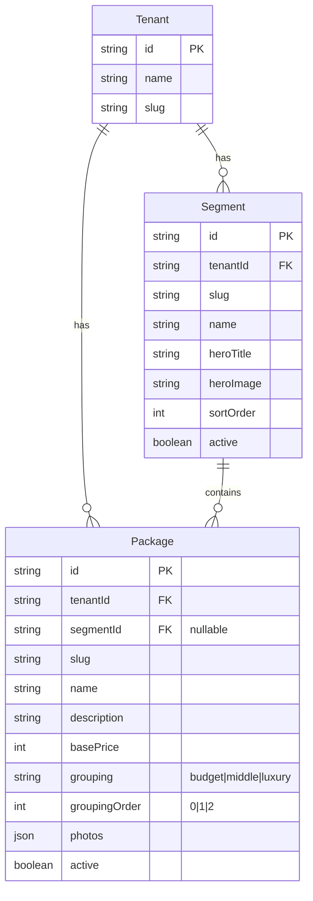

# Segment & Tier Storefront Redesign (Simplified)

## Overview

Transform the current package-browsing storefront into a guided sales funnel with optional segment selection followed by a 3-tier pricing model (Budget/Middle/Luxury). This follows proven sales psychology principles and simplifies the customer decision journey.

**Plan Version**: v2 (Simplified based on reviewer feedback)
**Estimated Effort**: 2 days (down from 4 weeks)

## Problem Statement

The current storefront shows packages in a catalog-style grid, which:

- Requires customers to browse and compare many options
- Lacks clear pricing psychology (good/better/best)
- Doesn't guide customers through a decision funnel
- Has inconsistent tier organization across tenants

## Proposed Solution

### Customer Journey

```
┌─────────────────────────────────────────────────────────────────────┐
│ TENANT HAS SEGMENTS (1-3 customer types)                            │
│                                                                     │
│ Step 1: Segment Selection                                           │
│ "What type of service are you looking for?"                         │
│ ┌──────────┐  ┌──────────┐  ┌──────────┐                           │
│ │ Segment1 │  │ Segment2 │  │ Segment3 │                           │
│ └──────────┘  └──────────┘  └──────────┘                           │
│                              ↓                                      │
│ Step 2: Tier Selection (3 options)                                  │
│ ┌──────────┐  ┌──────────┐  ┌──────────┐                           │
│ │  Budget  │  │  Middle  │  │  Luxury  │                           │
│ │  $500    │  │  $1000   │  │  $2000   │                           │
│ └──────────┘  └──────────┘  └──────────┘                           │
└─────────────────────────────────────────────────────────────────────┘

┌─────────────────────────────────────────────────────────────────────┐
│ TENANT HAS NO SEGMENTS (0 segments)                                 │
│                                                                     │
│ Step 1: Tier Selection (skip directly to 3 options)                 │
│ ┌──────────┐  ┌──────────┐  ┌──────────┐                           │
│ │  Budget  │  │  Middle  │  │  Luxury  │                           │
│ │  $500    │  │  $1000   │  │  $2000   │                           │
│ └──────────┘  └──────────┘  └──────────┘                           │
└─────────────────────────────────────────────────────────────────────┘

                              ↓

┌─────────────────────────────────────────────────────────────────────┐
│ TIER DETAIL PAGE (zoomed in view)                                   │
│ ┌─────────────────────────────────────────────────────────────────┐ │
│ │ [Large Hero Photo/Gallery]                                      │ │
│ ├─────────────────────────────────────────────────────────────────┤ │
│ │ "Middle Tier" - $1,000                                          │ │
│ │                                                                 │ │
│ │ Full description of what's included in this tier...             │ │
│ │ • Feature 1                                                     │ │
│ │ • Feature 2                                                     │ │
│ │ • Feature 3                                                     │ │
│ │                                                                 │ │
│ │ ┌─────────────────────────────────────────────────────────────┐ │ │
│ │ │ ← Budget ($500)    [BOOK NOW]    Luxury ($2000) →           │ │ │
│ │ │   (navigate)                        (navigate)              │ │ │
│ │ └─────────────────────────────────────────────────────────────┘ │ │
│ └─────────────────────────────────────────────────────────────────┘ │
└─────────────────────────────────────────────────────────────────────┘

                              ↓

┌─────────────────────────────────────────────────────────────────────┐
│ BOOKING FLOW                                                        │
│ • Date selection                                                    │
│ • Customer details (name, email)                                    │
│ • (Future: Add-on selection)                                        │
│ • Stripe checkout                                                   │
└─────────────────────────────────────────────────────────────────────┘
```

## Technical Approach (Simplified)

### Key Insight: Use Existing Fields

The Package model ALREADY has the fields we need:

- `segmentId` - Links package to a segment (nullable for root tiers)
- `grouping` - String field, use as tier level: "budget" | "middle" | "luxury"
- `groupingOrder` - Integer for display order: 0, 1, 2

**NO SCHEMA CHANGES REQUIRED.**

### Convention Over Configuration

| Field           | Value    | Purpose                  |
| --------------- | -------- | ------------------------ |
| `grouping`      | "budget" | Budget tier              |
| `grouping`      | "middle" | Middle tier              |
| `grouping`      | "luxury" | Luxury tier              |
| `groupingOrder` | 0        | First position (Budget)  |
| `groupingOrder` | 1        | Second position (Middle) |
| `groupingOrder` | 2        | Third position (Luxury)  |

### API Changes

**No new endpoints needed.** Use existing endpoints with query parameters:

```typescript
// Get packages for a segment (already exists)
GET /v1/packages?segmentId={id}

// Get root packages (no segment)
GET /v1/packages?segmentId=null

// Storefront config can be derived from:
GET /v1/segments  // Returns segments (0-3)
GET /v1/packages  // Returns all packages, client filters by grouping
```

### Validation (Service Layer)

Add soft validation in the admin flow:

```typescript
// In package service - warn (don't block) if tier config incomplete
function validateTierConfig(tenantId: string, segmentId: string | null): TierStatus {
  const packages = await getPackagesBySegment(tenantId, segmentId);
  const tiers = packages.filter((p) => ['budget', 'middle', 'luxury'].includes(p.grouping));

  return {
    complete: tiers.length === 3,
    configured: tiers.map((t) => t.grouping),
    missing: ['budget', 'middle', 'luxury'].filter((t) => !tiers.find((p) => p.grouping === t)),
  };
}
```

### Frontend Changes

#### New Pages (Customer-Facing)

| Route            | Component        | Purpose                          |
| ---------------- | ---------------- | -------------------------------- |
| `/`              | `StorefrontHome` | Smart routing: segments or tiers |
| `/s/:slug`       | `SegmentTiers`   | Show 3 tier cards for segment    |
| `/s/:slug/:tier` | `TierDetail`     | Zoomed tier view with nav        |
| `/tiers`         | `RootTiers`      | 3 tier cards (no segments)       |
| `/tiers/:tier`   | `TierDetail`     | Zoomed tier view (no segments)   |

#### Components to Create

```
client/src/features/storefront/
├── StorefrontHome.tsx       # Smart router (segments vs tiers)
├── TierSelector.tsx         # Always 3 tier cards, filters by grouping
├── TierCard.tsx             # Individual tier card
└── TierDetail.tsx           # Zoomed view with prev/next nav
```

#### Admin Changes (Minimal)

Update existing PackageForm to:

1. Show dropdown for `grouping`: "budget" | "middle" | "luxury" | (custom)
2. Auto-set `groupingOrder` based on tier selection
3. Show warning badge if segment doesn't have all 3 tiers

### Implementation Tasks

#### Day 1: Frontend Storefront

- [ ] Create `StorefrontHome.tsx` - checks segments, routes appropriately
- [ ] Create `TierSelector.tsx` - displays 3 cards filtered by grouping
- [ ] Create `TierCard.tsx` - card with photo, name, price, description preview
- [ ] Create `TierDetail.tsx` - full detail view with prev/next navigation
- [ ] Add routes to `router.tsx`

#### Day 2: Admin Polish + Testing

- [ ] Update `OrganizationSection.tsx` - tier dropdown instead of free text
- [ ] Add tier status indicator to segment list
- [ ] E2E tests for storefront flow
- [ ] Manual testing with real tenant data

## Acceptance Criteria

### Functional Requirements

- [ ] Tenants can configure 0-3 segments (existing)
- [ ] Each segment (or root) can have up to 3 tiers
- [ ] Tier levels are: budget, middle, luxury (stored in `grouping` field)
- [ ] Each tier has: name, price, description, photo (existing Package fields)
- [ ] Customers see segment selection first (if segments exist)
- [ ] Customers see tier cards filtered by segment
- [ ] Tier detail page shows full info + prev/next navigation
- [ ] Booking flow unchanged (date, details, Stripe)

### Non-Functional Requirements

- [ ] All queries tenant-scoped (existing)
- [ ] Responsive design (mobile-first)
- [ ] Page load < 2s

### Admin Requirements

- [ ] Admin can set tier level via dropdown in package form
- [ ] Admin sees warning if segment missing tiers (soft validation)

## Files to Create/Modify

### Frontend Only (No Backend Changes)

| File                                                                            | Action | Purpose              |
| ------------------------------------------------------------------------------- | ------ | -------------------- |
| `client/src/pages/StorefrontHome.tsx`                                           | Create | Smart routing page   |
| `client/src/features/storefront/TierSelector.tsx`                               | Create | 3 tier cards         |
| `client/src/features/storefront/TierCard.tsx`                                   | Create | Individual tier card |
| `client/src/features/storefront/TierDetail.tsx`                                 | Create | Zoomed tier view     |
| `client/src/features/tenant-admin/packages/PackageForm/OrganizationSection.tsx` | Modify | Tier dropdown        |
| `client/src/router.tsx`                                                         | Modify | Add new routes       |

## ERD Diagram (No Changes)



## Why This Approach

### Reviewer Consensus

Three independent reviewers all recommended:

1. **Use existing fields** - `grouping` and `groupingOrder` already exist
2. **No schema migration** - Avoids database risk and deployment complexity
3. **No new endpoints** - Reuse existing `/packages` and `/segments`
4. **Convention over configuration** - Document that "budget"/"middle"/"luxury" are the expected values
5. **Frontend-first** - All new work is in React components

### Trade-offs Accepted

| Trade-off                              | Mitigation                       |
| -------------------------------------- | -------------------------------- |
| No DB constraint for "exactly 3 tiers" | Soft validation + admin warning  |
| Free-text `grouping` field             | Dropdown UI constrains input     |
| Grouping values are convention         | Document clearly, validate in UI |

## Future Considerations

### Add-ons (Post-MVP)

Can be added later by:

1. Creating add-on selection step between tier detail and checkout
2. Linking add-ons to packages via existing `PackageAddOn` join table

### Tier Templates (Future)

Pre-configured tier templates for common industries:

- Photography: Mini Session / Standard / Premium
- Consulting: Starter / Professional / Enterprise
- Events: Basic / Enhanced / Luxury

## References

- Current Package model: `server/prisma/schema.prisma`
- Current Segment model: `server/prisma/schema.prisma`
- Package form: `client/src/features/tenant-admin/packages/PackageForm/`
- Organization section: `client/src/features/tenant-admin/packages/PackageForm/OrganizationSection.tsx`
- Storefront pages: `client/src/pages/Home/`, `client/src/pages/PackageCatalog.tsx`

---

**Status**: Ready for Implementation
**Created**: 2025-11-27
**Updated**: 2025-11-27 (Simplified based on reviewer feedback)
**Author**: Claude Code
