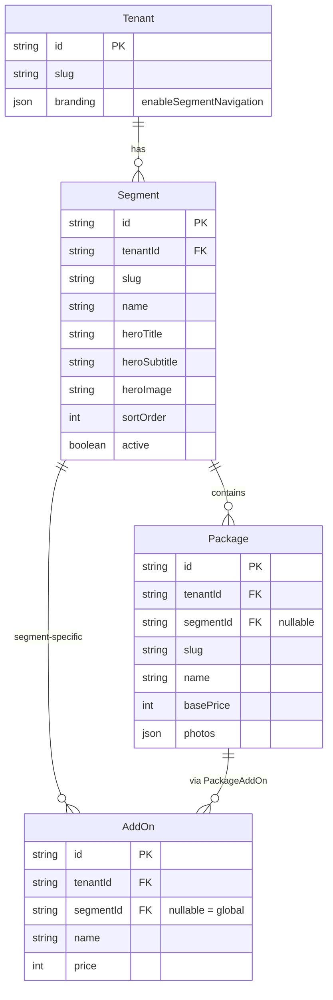

# feat: Segmented Customer Journey Storefront

> **REVISED PLAN** - Simplified based on DHH/Architecture/Simplicity reviews
>
> - Removed feature flag (data-driven instead)
> - Reduced from 8h to 3h
> - Minimal components, maximum reuse

## Overview

Surface existing backend segment functionality in the customer-facing storefront. If tenant has segments, show them on the home page. Simple, data-driven, no configuration needed.

## Problem Statement / Motivation

**Current State:**

- Segments are fully implemented in the backend (schema, CRUD, API routes)
- Tenant admins can create/manage segments with hero content and SEO metadata
- Packages can be assigned to segments via `segmentId` field
- **BUT**: Customer-facing storefront ignores segments entirely
- `/packages` shows ALL packages without any segmentation

**Business Need:**

- Little Bit Farm wants to organize offerings by customer type
- Segment landing pages create better first impressions
- Guided journey reduces decision fatigue

## Research Summary

### Existing Infrastructure (Ready to Use)

| Component                 | Status      | Location                                            |
| ------------------------- | ----------- | --------------------------------------------------- |
| Segment Schema            | ✅ Complete | `server/prisma/schema.prisma:132-171`               |
| Segment Service           | ✅ Complete | `server/src/services/segment.service.ts`            |
| Segment Repository        | ✅ Complete | `server/src/adapters/prisma/segment.repository.ts`  |
| Public Segment Routes     | ✅ Complete | `server/src/routes/segments.routes.ts`              |
| Tenant Admin Segment CRUD | ✅ Complete | `server/src/routes/tenant-admin-segments.routes.ts` |
| Segment Admin UI          | ✅ Complete | `client/src/features/admin/segments/`               |

### Missing Pieces (To Build)

| Component                  | Status     | Description                               |
| -------------------------- | ---------- | ----------------------------------------- |
| Tenant Config Flag         | ❌ Missing | `enableSegmentNavigation` setting         |
| ts-rest Contracts          | ❌ Missing | Public segment endpoints not in contracts |
| Client Routes              | ❌ Missing | `/segments/:slug` routes                  |
| Segment Landing Page       | ❌ Missing | Hero + filtered packages                  |
| Home Page Segment Selector | ❌ Missing | Cards to choose segment                   |
| Package Photos             | ❌ Missing | Little Bit Farm needs placeholder images  |

## Proposed Solution

### Architecture Overview

```
┌─────────────────────────────────────────────────────────────────┐
│                 SEGMENTED CUSTOMER FLOW                          │
└─────────────────────────────────────────────────────────────────┘

When enableSegmentNavigation = true:

  Home (/)
    │
    ├─→ Segment Selector Cards
    │   ├─ [Elopements] ────→ /segments/elopements
    │   ├─ [Intimate]   ────→ /segments/intimate-weddings
    │   └─ [Full]       ────→ /segments/full-celebrations
    │
    └─→ Segment Landing (/segments/:slug)
        ├─ Hero Section (title, subtitle, image)
        ├─ Filtered Package Grid
        └─ Package Detail (/package/:slug)
            └─ Booking Flow

When enableSegmentNavigation = false:
  (Existing behavior - /packages shows all)
```

### Data Model Changes

```prisma
// Option A: Add to branding JSON (no migration needed)
model Tenant {
  branding Json @default("{}")
  // branding: { fontFamily, logo, enableSegmentNavigation: boolean }
}

// Option B: Dedicated field (cleaner, requires migration)
model Tenant {
  enableSegmentNavigation Boolean @default(false)
}
```

**Recommendation:** Use Option A initially (branding JSON) for rapid iteration, migrate to Option B once stable.

### New Client Routes

```typescript
// client/src/router.tsx additions
{ path: "segments/:slug", element: <SegmentLanding /> },
```

### New Components

```
client/src/
├── pages/
│   └── SegmentLanding.tsx         # New: Hero + filtered packages
├── features/
│   └── segments/
│       ├── SegmentSelector.tsx    # New: Card grid for home page
│       ├── SegmentHero.tsx        # New: Hero section component
│       └── hooks/
│           └── useSegments.ts     # New: Fetch public segments
```

## Technical Approach

### Phase 1: Backend Configuration (1-2 hours)

**Tasks:**

1. Add `enableSegmentNavigation` to branding JSON schema
2. Update `TenantBrandingDto` to include the flag
3. Add ts-rest contracts for public segment endpoints:
   - `GET /v1/segments` - List active segments
   - `GET /v1/segments/:slug` - Segment metadata
   - `GET /v1/segments/:slug/packages` - Segment with packages

**Files to modify:**

- `packages/contracts/src/dto.ts` - Add SegmentDto, extend BrandingDto
- `packages/contracts/src/api.v1.ts` - Add public segment contracts
- `server/src/routes/tenant.routes.ts` - Include enableSegmentNavigation in branding response

### Phase 2: Client Hooks & API (1-2 hours)

**Tasks:**

1. Create `useSegments()` hook for fetching public segments
2. Extend `useBranding()` to return `enableSegmentNavigation`
3. Add segment API methods to client

**Files to create:**

- `client/src/features/segments/hooks/useSegments.ts`

**Files to modify:**

- `client/src/hooks/useBranding.ts` - Add enableSegmentNavigation
- `client/src/lib/api.ts` - Add segment API methods (or use ts-rest)

### Phase 3: Segment Landing Page (2-3 hours)

**Tasks:**

1. Create `SegmentLanding` page component
2. Create `SegmentHero` component (title, subtitle, image with fallback)
3. Reuse `CatalogGrid` for filtered packages
4. Handle edge cases (empty segment, missing image)

**Files to create:**

- `client/src/pages/SegmentLanding.tsx`
- `client/src/features/segments/SegmentHero.tsx`

### Phase 4: Home Page Integration (1-2 hours)

**Tasks:**

1. Create `SegmentSelector` component (3-6 cards)
2. Conditionally render on Home page based on `enableSegmentNavigation`
3. Mobile-responsive grid (1 col mobile, 3 col desktop)

**Files to create:**

- `client/src/features/segments/SegmentSelector.tsx`

**Files to modify:**

- `client/src/pages/Home/index.tsx` - Conditional rendering

### Phase 5: Router & Redirects (1 hour)

**Tasks:**

1. Add `/segments/:slug` route
2. Implement redirect when segments disabled
3. Handle 404 for inactive/missing segments

**Files to modify:**

- `client/src/router.tsx`

### Phase 6: Little Bit Farm Setup (Manual/Content)

**Tasks:**

1. Create 3 segments via tenant admin:
   - "Elopements" - Intimate, quick ceremonies
   - "Intimate Weddings" - Small gatherings up to 30
   - "Full Celebrations" - Large events up to 100
2. Assign existing packages to segments
3. Upload hero images for each segment
4. Upload package photos (placeholder or stock)

## Acceptance Criteria

### Tenant Configuration

- [ ] Tenant branding includes `enableSegmentNavigation` boolean (default: false)
- [ ] Platform admin can toggle via tenant management
- [ ] Tenant admin can toggle via settings

### Customer Flow - Segments Enabled

- [ ] Home page displays segment cards (ordered by `sortOrder`)
- [ ] Clicking card navigates to `/segments/:slug`
- [ ] Segment page shows hero (title, subtitle, image)
- [ ] Segment page shows only packages with matching `segmentId`
- [ ] Empty segment shows "No packages available" message
- [ ] URLs are bookmarkable

### Customer Flow - Segments Disabled

- [ ] Home page shows existing "Browse Packages" CTA
- [ ] `/packages` shows all active packages
- [ ] `/segments/:slug` redirects to `/packages`

### Add-On Handling

- [ ] Global add-ons (`segmentId = null`) appear in all segments
- [ ] Segment-specific add-ons only appear in their segment

### Fallbacks

- [ ] Missing hero image shows gradient with segment title
- [ ] Inactive segment returns 404 or redirects

### Performance

- [ ] Segment list cached (15 min, already implemented)
- [ ] Hero images lazy-loaded

## Edge Cases

| Scenario                                    | Expected Behavior                                |
| ------------------------------------------- | ------------------------------------------------ |
| Tenant has 0 segments but flag enabled      | Show "Browse Packages" fallback                  |
| All segments inactive                       | Behave as if flag disabled                       |
| Segment has 0 packages                      | Show empty state with back link                  |
| User bookmarks segment URL, tenant disables | Redirect to `/packages`                          |
| Package has `segmentId = null`              | Not shown in segment views (only in `/packages`) |
| 10+ segments                                | Horizontal scroll or "View All" link             |

## Success Metrics

- Customer can navigate from Home → Segment → Package → Checkout
- Zero console errors in segment flow
- Page load < 1s for segment landing (cached)
- Mobile-responsive at all breakpoints

## Dependencies

- Existing segment backend (✅ Ready)
- Existing segment admin UI (✅ Ready)
- ts-rest contract updates (needed)

## Risks & Mitigations

| Risk                                      | Mitigation                               |
| ----------------------------------------- | ---------------------------------------- |
| ts-rest contract changes break client     | Add new contracts, don't modify existing |
| Caching inconsistency when config changes | Use short stale time for tenant config   |
| SEO duplicate content                     | Canonical URL points to `/package/:slug` |

## Out of Scope

- A/B testing framework
- Custom segment templates
- Segment-specific pricing
- Auto-generated placeholder images (manual content task)

## Testing Plan

### Unit Tests

- `useSegments` hook returns correct data structure
- `SegmentSelector` renders correct number of cards

### Integration Tests

- Public segment endpoints return filtered packages
- `enableSegmentNavigation` flag honored

### E2E Tests

- Full flow: Home → Segment → Package → Checkout
- Redirect when segments disabled
- Empty segment handling

## References

### Internal Files

- `server/prisma/schema.prisma:132-171` - Segment model definition
- `server/src/services/segment.service.ts` - Business logic
- `server/src/routes/segments.routes.ts` - Public API routes
- `client/src/features/admin/segments/` - Admin UI patterns to follow

### Related Work

- Sprint 10 Phase 3 - God component refactoring (complete)
- Impersonation feature - Recently fixed tenant dashboard

---

## ERD: Segment Relationships



## Implementation Checklist

- [ ] Phase 1: Backend configuration
- [ ] Phase 2: Client hooks & API
- [ ] Phase 3: Segment landing page
- [ ] Phase 4: Home page integration
- [ ] Phase 5: Router & redirects
- [ ] Phase 6: Little Bit Farm content setup
- [ ] Testing: Unit, integration, E2E
