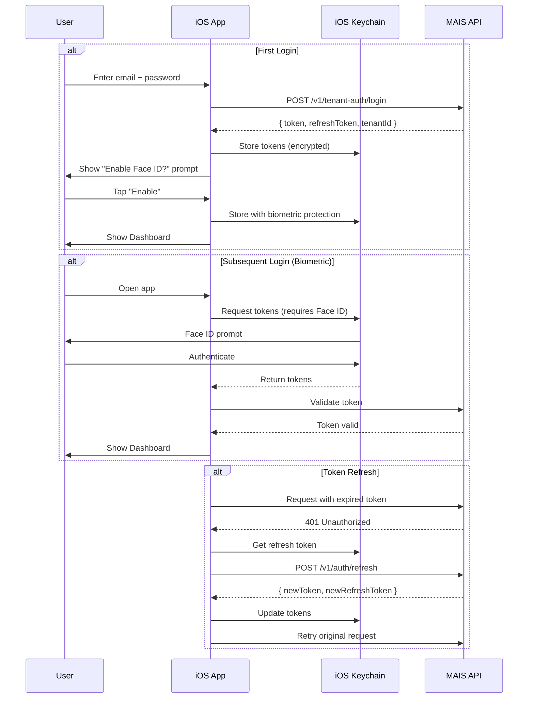
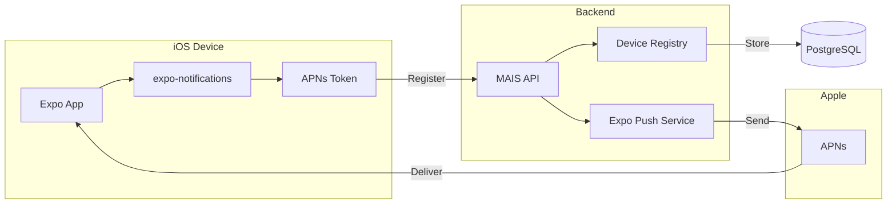
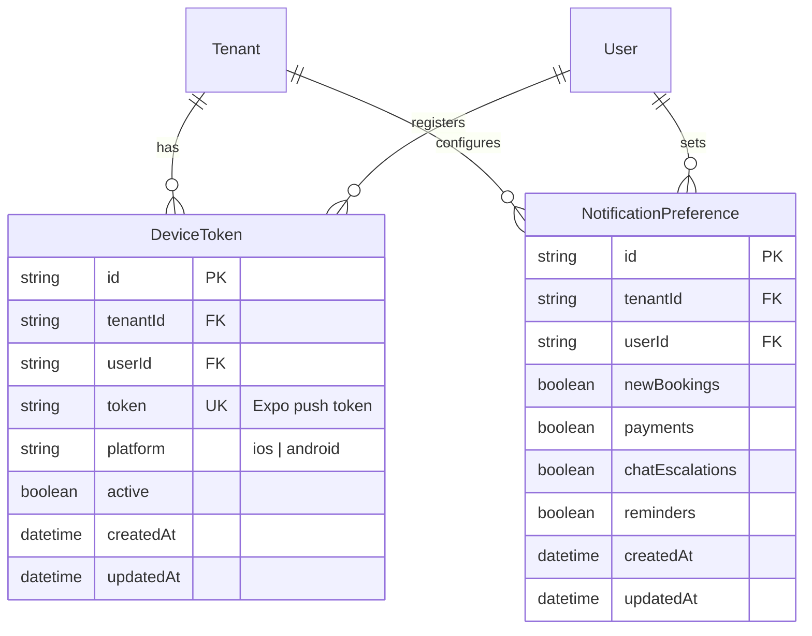

# feat: Migrate MAIS Web App to iOS Native App

> ⚠️ **STATUS: FUTURE RESEARCH ONLY - NOT SCHEDULED**
>
> This document is exploratory research for potential future development. It is **NOT** an active project, sprint item, or approved initiative. Do not begin implementation without explicit approval and scheduling.
>
> **Purpose:** Strategic planning and feasibility study for when/if iOS expansion becomes a priority.
>
> **Do NOT:**
>
> - Create tasks or todos from this document
> - Begin any implementation work
> - Include in sprint planning
> - Run `/resolve_todo_parallel` or similar automation against this plan
>
> **Last Updated:** December 2025
> **Review Date:** TBD (when iOS becomes a strategic priority)

---

## Overview

Transform the MAIS/HANDLED membership platform from a web-only application into a native iOS app, enabling tenant admins to manage their businesses from their phones. This migration leverages the existing Express API backend while building a new React Native (Expo) frontend optimized for mobile.

**Key Decision:** After extensive research comparing Capacitor, Expo/React Native, and native SwiftUI, **Expo with React Native** is the recommended approach. It offers the best balance of code reuse (90%+ shared logic with web), native performance, and developer experience for a team already familiar with React/TypeScript.

**Estimated Timeline:** 20-24 weeks (5-6 months) — _Revised based on expert review_
**Team Size:** 2-3 developers
**Risk Level:** Medium (well-documented path, existing API contracts)

> 📝 **Review Status:** This plan has been reviewed by DHH (Architecture), Kieran (TypeScript/Security), and Code Simplicity reviewers. Key feedback has been incorporated. See [Review Feedback Summary](#review-feedback-summary) section.

---

## Problem Statement

### Current State

MAIS is a fully functional web platform built with Next.js 14 (App Router) for tenant storefronts and a React SPA for the admin dashboard. While the web app is responsive, it lacks:

- **Native mobile experience** - No push notifications, biometrics, or offline support
- **App Store presence** - Missing discoverability in the iOS ecosystem
- **Mobile-first UX** - Web patterns don't translate well to touch interactions
- **Quick access** - Tenants must open browser, navigate to URL, log in each time

### Why This Matters

Service professionals (photographers, coaches, wedding planners) are constantly on-the-go. They need to:

- Respond to booking inquiries quickly (within minutes)
- Check availability while meeting with clients
- Monitor AI chatbot conversations for escalations
- Receive instant notifications for new bookings/payments

A native iOS app with push notifications and biometric login removes friction from these critical workflows.

### Success Metrics

| Metric             | Target                | Measurement              |
| ------------------ | --------------------- | ------------------------ |
| App Store approval | First submission      | Apple review process     |
| Crash-free rate    | >99.5%                | Xcode Organizer / Sentry |
| API response time  | <3s on 3G             | Performance monitoring   |
| User adoption      | 50% of active tenants | Analytics                |
| App Store rating   | >4.0 stars            | App Store reviews        |

---

## Proposed Solution

### Architecture Overview

```
┌─────────────────────────────────────────────────────────────────┐
│                        MAIS Platform                            │
├─────────────────────────────────────────────────────────────────┤
│                                                                 │
│  ┌──────────────┐  ┌──────────────┐  ┌──────────────────────┐  │
│  │   Next.js    │  │    Expo      │  │   Legacy React SPA   │  │
│  │   Web App    │  │   iOS App    │  │   (Admin Dashboard)  │  │
│  │  (Port 3000) │  │   (Native)   │  │    (Port 5173)       │  │
│  └──────┬───────┘  └──────┬───────┘  └──────────┬───────────┘  │
│         │                 │                      │              │
│         └────────────┬────┴──────────────────────┘              │
│                      │                                          │
│                      ▼                                          │
│         ┌────────────────────────┐                              │
│         │   Express API Server   │                              │
│         │      (Port 3001)       │                              │
│         │  ┌──────────────────┐  │                              │
│         │  │  ts-rest + Zod   │  │  ◄── Type-safe contracts    │
│         │  │    Contracts     │  │      shared across all      │
│         │  └──────────────────┘  │      clients                │
│         └───────────┬────────────┘                              │
│                     │                                           │
│         ┌───────────┴───────────┐                               │
│         ▼                       ▼                               │
│  ┌─────────────┐        ┌─────────────┐                         │
│  │ PostgreSQL  │        │   Stripe    │                         │
│  │  (Prisma)   │        │   Connect   │                         │
│  └─────────────┘        └─────────────┘                         │
│                                                                 │
└─────────────────────────────────────────────────────────────────┘
```

### Technology Stack

| Layer            | Technology                  | Rationale                                                                    |
| ---------------- | --------------------------- | ---------------------------------------------------------------------------- |
| **Framework**    | Expo SDK 54+                | File-based routing (like Next.js), EAS Build, first-party modules            |
| **Language**     | TypeScript 5.x              | Strict mode, shared types with `@macon/contracts`                            |
| **Navigation**   | Expo Router                 | Familiar patterns for Next.js developers                                     |
| **State**        | TanStack Query              | Already used in web app, consistent patterns                                 |
| **Styling**      | StyleSheet.create()         | Native approach, less abstraction for first RN project (NativeWind deferred) |
| **Auth Storage** | expo-secure-store           | iOS Keychain wrapper, biometric protection                                   |
| **Biometrics**   | expo-local-authentication   | Face ID / Touch ID                                                           |
| **Payments**     | @stripe/stripe-react-native | Official Stripe SDK, Apple Pay support                                       |
| **Push**         | expo-notifications          | APNs integration via Expo Push Service                                       |
| **Build/Deploy** | EAS Build + Submit          | Cloud builds, App Store submission                                           |

### What's Reusable from Web

| Asset              | Reuse Level | Notes                                          |
| ------------------ | ----------- | ---------------------------------------------- |
| `@macon/contracts` | 100%        | All API types, Zod schemas                     |
| API endpoints      | 100%        | Same REST API, same contracts                  |
| Business logic     | 100%        | All server-side                                |
| Validation schemas | 90%         | Zod schemas work in React Native               |
| UI components      | 0%          | Must rebuild for native (different primitives) |
| Styling            | 30%         | StyleSheet.create() is different paradigm      |

---

## Technical Approach

### Project Structure

```
apps/
  web/                    # Existing Next.js (unchanged)
  ios/                    # NEW: Expo iOS app (iOS-only for v1, not cross-platform)
    app/                  # Expo Router (file-based)
      (auth)/             # Auth group (login, signup, forgot-password)
        login.tsx
        signup.tsx
        forgot-password.tsx
        _layout.tsx
      (tabs)/             # Main tab navigation
        index.tsx         # Dashboard
        bookings.tsx      # Bookings list
        packages.tsx      # Packages list
        chat.tsx          # Chat sessions
        settings.tsx      # Account settings
        _layout.tsx       # Tab bar configuration
      booking/
        [id].tsx          # Booking detail
        create.tsx        # New booking form
      package/
        [id].tsx          # Package detail
        edit.tsx          # Edit package
      stripe/
        onboarding.tsx    # Stripe Connect OAuth
        callback.tsx      # OAuth callback handler
      _layout.tsx         # Root layout
    components/
      ui/                 # Shared UI components
        Button.tsx
        Card.tsx
        Input.tsx
        LoadingSpinner.tsx
      booking/
        BookingCard.tsx
        BookingWizard.tsx
        DatePicker.tsx
      dashboard/
        MetricCard.tsx
        RecentActivity.tsx
      chat/
        ChatBubble.tsx
        ChatInput.tsx
    lib/
      api.ts              # API client (wraps ts-rest)
      auth.ts             # Auth context + Keychain storage
      biometrics.ts       # Face ID / Touch ID helpers
      notifications.ts    # Push notification handlers
      storage.ts          # Secure storage wrapper
      tenant.ts           # Tenant context + header injection
    hooks/
      useAuth.ts          # Authentication hook
      useBiometrics.ts    # Biometric authentication
      useBookings.ts      # Booking queries
      useDashboard.ts     # Dashboard data
      usePushNotifications.ts
    constants/
      colors.ts           # Theme colors
      config.ts           # API URLs, feature flags
    types/
      index.ts            # Re-export from @macon/contracts
    app.json              # Expo configuration
    eas.json              # EAS Build configuration
    tailwind.config.js    # NativeWind configuration
```

### Authentication Flow



### Multi-Tenant Header Injection

Every API request must include the tenant context:

```typescript
// lib/api.ts
import { initClient } from '@ts-rest/core';
import { contract } from '@macon/contracts';
import * as SecureStore from 'expo-secure-store';

const TENANT_KEY_STORAGE = 'tenant_api_key';
const AUTH_TOKEN_STORAGE = 'auth_token';

export const createApiClient = async () => {
  const tenantKey = await SecureStore.getItemAsync(TENANT_KEY_STORAGE);
  const authToken = await SecureStore.getItemAsync(AUTH_TOKEN_STORAGE);

  return initClient(contract, {
    baseUrl: process.env.EXPO_PUBLIC_API_URL,
    baseHeaders: {
      'X-Tenant-Key': tenantKey ?? '',
      Authorization: authToken ? `Bearer ${authToken}` : '',
      'Content-Type': 'application/json',
    },
  });
};
```

### Push Notification Architecture



**Required Backend Changes:**

```typescript
// NEW: server/prisma/schema.prisma addition
model DeviceToken {
  id        String   @id @default(cuid())
  tenantId  String
  userId    String
  token     String   @unique  // Expo push token
  platform  String   // "ios" | "android"
  createdAt DateTime @default(now())
  updatedAt DateTime @updatedAt

  tenant    Tenant   @relation(fields: [tenantId], references: [id])
  @@index([tenantId])
  @@index([userId])
}

// NEW: server/src/routes/device-tokens.routes.ts
POST /v1/device-tokens          // Register device token
DELETE /v1/device-tokens/:token // Unregister on logout
```

### Offline Support Strategy

> ⚠️ **Reviewer Consensus:** Offline sync (queue & sync) is YAGNI for this use case. Service professionals have connectivity. Focus on graceful degradation only.

**MVP Approach:** Graceful degradation only

- Show cached data when offline
- Disable write operations
- Display "Offline" banner

```typescript
// lib/offline.ts - Simple graceful degradation
import NetInfo from '@react-native-community/netinfo';
import { useQuery } from '@tanstack/react-query';

export function useOfflineAwareQuery<T>(
  queryKey: string[],
  queryFn: () => Promise<T>,
  options?: { staleTime?: number }
) {
  const { isConnected } = useNetworkStatus();

  return useQuery({
    queryKey,
    queryFn,
    enabled: isConnected,
    staleTime: options?.staleTime ?? 5 * 60 * 1000, // 5 min cache
    placeholderData: (previousData) => previousData,
  });
}
```

**Deferred (v2.0+ only if user feedback demands it):** Queue & sync with conflict resolution

---

## Critical Enterprise Patterns (Added per Reviewer Feedback)

### API Versioning Strategy

> ⚠️ **DHH Feedback:** "You have no plan for what happens when v1.1 of the API breaks v1.0 of the app."

**Approach: Minimum App Version Enforcement**

```typescript
// Backend: Add version check middleware
// server/src/middleware/app-version.ts
const MIN_IOS_VERSION = '1.0.0';

export function checkAppVersion(req: Request, res: Response, next: NextFunction) {
  const appVersion = req.headers['x-app-version'];
  const platform = req.headers['x-platform'];

  if (platform === 'ios' && appVersion && semver.lt(appVersion, MIN_IOS_VERSION)) {
    return res.status(426).json({
      error: 'App update required',
      minVersion: MIN_IOS_VERSION,
      updateUrl: 'https://apps.apple.com/app/id...',
    });
  }
  next();
}
```

```typescript
// Mobile: Handle forced update response
// lib/api.ts
if (response.status === 426) {
  const { updateUrl } = await response.json();
  Alert.alert('Update Required', 'Please update to the latest version to continue.', [
    { text: 'Update Now', onPress: () => Linking.openURL(updateUrl) },
  ]);
  return;
}
```

**Version Header Convention:**

- `X-App-Version: 1.0.0` — Semantic version of iOS app
- `X-Platform: ios` — Platform identifier
- `X-Build-Number: 42` — Build number for debugging

---

### Token Refresh Mutex Pattern

> ⚠️ **Kieran Feedback:** "Multiple concurrent requests may all try to refresh simultaneously."

```typescript
// lib/auth.ts - Token refresh with mutex to prevent race conditions
let refreshPromise: Promise<string> | null = null;

export async function refreshTokenWithMutex(): Promise<string> {
  // If refresh already in progress, wait for it
  if (refreshPromise) {
    return refreshPromise;
  }

  refreshPromise = (async () => {
    try {
      const refreshToken = await SecureStore.getItemAsync('refresh_token');
      if (!refreshToken) throw new AuthError('No refresh token');

      const response = await fetch(`${config.apiUrl}/v1/auth/refresh`, {
        method: 'POST',
        headers: { 'Content-Type': 'application/json' },
        body: JSON.stringify({ refreshToken }),
      });

      if (!response.ok) {
        // Refresh failed - force re-login
        await clearTokens();
        throw new AuthError('Session expired');
      }

      const { token, refreshToken: newRefresh } = await response.json();
      await SecureStore.setItemAsync('auth_token', token);
      await SecureStore.setItemAsync('refresh_token', newRefresh);
      return token;
    } finally {
      refreshPromise = null; // Clear mutex
    }
  })();

  return refreshPromise;
}
```

---

### Keychain Access Control Levels

> ⚠️ **Kieran Feedback:** "Must specify iOS Keychain access control flags."

```typescript
// lib/storage.ts - Explicit Keychain access control
import * as SecureStore from 'expo-secure-store';

export const SecureStorage = {
  // Auth tokens - require device to be unlocked, this device only
  async setAuthToken(token: string): Promise<void> {
    await SecureStore.setItemAsync('auth_token', token, {
      keychainAccessible: SecureStore.WHEN_UNLOCKED_THIS_DEVICE_ONLY,
    });
  },

  // Biometric-protected items - require authentication on each access
  async setBiometricProtectedToken(token: string): Promise<void> {
    await SecureStore.setItemAsync('biometric_auth_token', token, {
      keychainAccessible: SecureStore.WHEN_PASSCODE_SET_THIS_DEVICE_ONLY,
      requireAuthentication: true,
      authenticationPrompt: 'Authenticate to access MAIS',
    });
  },

  // Tenant key - less sensitive, persist across restarts
  async setTenantKey(key: string): Promise<void> {
    await SecureStore.setItemAsync('tenant_key', key, {
      keychainAccessible: SecureStore.AFTER_FIRST_UNLOCK_THIS_DEVICE_ONLY,
    });
  },
};
```

**Access Control Reference:**
| Level | Use Case | Persistence |
|-------|----------|-------------|
| `WHEN_UNLOCKED_THIS_DEVICE_ONLY` | Auth tokens | Device only, requires unlock |
| `WHEN_PASSCODE_SET_THIS_DEVICE_ONLY` | Biometric-protected | Device only, requires passcode set |
| `AFTER_FIRST_UNLOCK_THIS_DEVICE_ONLY` | Tenant key | Device only, survives reboot |

---

### Runtime Response Validation

> ⚠️ **Kieran Feedback:** "Add runtime validation at API boundaries to catch backend/contract drift."

```typescript
// hooks/usePackages.ts - With runtime validation
import { z } from 'zod';
import { PackageDtoSchema } from '@macon/contracts';

export function usePackages() {
  return useQuery({
    queryKey: ['packages'],
    queryFn: async () => {
      const client = await getApiClient();
      const response = await client.getPackages();

      if (response.status !== 200) {
        throw new ApiError(response.status, response.body);
      }

      // Runtime validation - catches contract drift
      const parsed = z.array(PackageDtoSchema).safeParse(response.body);
      if (!parsed.success) {
        console.error('Response validation failed', parsed.error.flatten());
        // In production: report to Sentry, show graceful error
        throw new SchemaValidationError('getPackages', parsed.error);
      }

      return parsed.data;
    },
  });
}
```

---

### Deep Link OAuth State Validation

> ⚠️ **Kieran Feedback:** "Deep links can be spoofed - validate state parameter for CSRF protection."

```typescript
// app/stripe/callback.tsx - With state validation
import * as SecureStore from 'expo-secure-store';
import { useLocalSearchParams, router } from 'expo-router';

export default function StripeCallback() {
  const { code, state } = useLocalSearchParams<{ code: string; state: string }>();

  useEffect(() => {
    async function handleCallback() {
      // Retrieve stored state from secure storage
      const storedState = await SecureStore.getItemAsync('stripe_oauth_state');

      if (!state || state !== storedState) {
        Alert.alert('Security Error', 'Invalid OAuth state. Please try again.');
        router.replace('/settings');
        return;
      }

      // Clear used state
      await SecureStore.deleteItemAsync('stripe_oauth_state');

      // Proceed with code exchange
      await completeStripeOAuth(code);
      router.replace('/payments');
    }

    handleCallback();
  }, [code, state]);

  return <LoadingScreen message="Completing Stripe setup..." />;
}

// Before starting OAuth, generate and store state
export async function startStripeOAuth() {
  const state = generateSecureRandom(32); // crypto.getRandomValues
  await SecureStore.setItemAsync('stripe_oauth_state', state);

  const authUrl = `https://connect.stripe.com/oauth/authorize?state=${state}&...`;
  await Linking.openURL(authUrl);
}
```

---

### TanStack Query Error Handling & Retry

> ⚠️ **Kieran Feedback:** "No retry strategy definition."

```typescript
// lib/queryClient.ts - Typed retry configuration
import { QueryClient } from '@tanstack/react-query';

export const queryClient = new QueryClient({
  defaultOptions: {
    queries: {
      retry: (failureCount, error) => {
        // Don't retry auth errors - require re-login
        if (error instanceof AuthError) return false;
        // Don't retry validation errors - bug in app
        if (error instanceof SchemaValidationError) return false;
        // Don't retry 4xx client errors
        if (error instanceof ApiError && error.status >= 400 && error.status < 500) {
          return false;
        }
        // Retry network/server errors up to 3 times
        return failureCount < 3;
      },
      retryDelay: (attemptIndex) => Math.min(1000 * 2 ** attemptIndex, 30000),
      staleTime: 5 * 60 * 1000, // 5 minutes
    },
    mutations: {
      retry: false, // Don't auto-retry mutations
    },
  },
});
```

---

### Device Token Contract Types

> ⚠️ **Kieran Feedback:** "Device token endpoint not in contracts package."

**Required addition to `packages/contracts/src/dto.ts`:**

```typescript
// ADD TO: packages/contracts/src/dto.ts
export const DeviceTokenDtoSchema = z.object({
  token: z.string().min(1),
  platform: z.enum(['ios']), // iOS-only for v1
});

export const DeviceTokenResponseSchema = z.object({
  id: z.string(),
  active: z.boolean(),
});

export type DeviceTokenDto = z.infer<typeof DeviceTokenDtoSchema>;
```

**Required addition to `packages/contracts/src/api.v1.ts`:**

```typescript
// ADD TO: packages/contracts/src/api.v1.ts
registerDeviceToken: {
  method: 'POST',
  path: '/v1/device-tokens',
  body: DeviceTokenDtoSchema,
  responses: {
    201: DeviceTokenResponseSchema,
    400: BadRequestErrorSchema,
    401: UnauthorizedErrorSchema,
  },
},

unregisterDeviceToken: {
  method: 'DELETE',
  path: '/v1/device-tokens/:token',
  responses: {
    204: z.undefined(),
    401: UnauthorizedErrorSchema,
    404: NotFoundErrorSchema,
  },
},
```

---

## Implementation Phases

> ⛔ **REMINDER: These phases are NOT active work items.**
>
> The checkboxes below are for future reference only. Do not convert these to todos, GitHub issues, or sprint tasks without explicit project approval and scheduling.

### Phase 0: Foundation & Validation (Weeks 1-2)

**Objective:** Validate technical approach, set up infrastructure

**Tasks:**

- [ ] Initialize Expo project with TypeScript strict mode
- [ ] Configure EAS Build for iOS simulator builds
- [ ] Set up NativeWind (Tailwind for React Native)
- [ ] Create API client wrapper using `@macon/contracts`
- [ ] **SPIKE:** Validate JWT token from NextAuth works with iOS
- [ ] **SPIKE:** Test Keychain storage with expo-secure-store
- [ ] Set up Apple Developer account (if not existing)
- [ ] Configure ESLint + Prettier matching web config

**Success Criteria:**

- [ ] `eas build --platform ios --profile development` succeeds
- [ ] Can make authenticated API call to MAIS backend
- [ ] JWT token stored/retrieved from Keychain
- [ ] Basic tab navigation working in simulator

**Deliverables:**

```
apps/mobile/
  app/
    (tabs)/
      index.tsx       # Placeholder dashboard
      _layout.tsx     # Tab bar setup
    _layout.tsx       # Root layout
  lib/
    api.ts           # ts-rest client wrapper
    storage.ts       # Keychain wrapper
  app.json           # Expo config
  eas.json           # EAS config
```

---

### Phase 1: Authentication (Weeks 3-4)

**Objective:** Complete, secure authentication flow

**Tasks:**

- [ ] Build login screen with email/password form
- [ ] Implement token storage in iOS Keychain
- [ ] Add token refresh interceptor to API client
- [ ] Build signup flow (tenant self-registration)
- [ ] Build forgot password flow
- [ ] Implement Face ID / Touch ID enrollment
- [ ] Implement biometric login flow
- [ ] Handle session expiry gracefully
- [ ] Add "Remember me" functionality
- [ ] Security audit of credential storage

**Key Files:**

```
apps/mobile/
  app/
    (auth)/
      login.tsx              # Email/password login
      signup.tsx             # Tenant registration
      forgot-password.tsx    # Password reset request
      reset-password.tsx     # Password reset form
      _layout.tsx            # Auth flow layout
  lib/
    auth.ts                  # AuthContext provider
    biometrics.ts            # Face ID helpers
  hooks/
    useAuth.ts               # Auth state hook
    useBiometrics.ts         # Biometric helpers
```

**Acceptance Criteria:**

```gherkin
Scenario: Login with email/password
  Given I am on the login screen
  When I enter valid credentials
  And tap "Sign In"
  Then I should see the dashboard
  And my token should be stored in Keychain

Scenario: Enable Face ID
  Given I just logged in successfully
  When I see the Face ID prompt
  And tap "Enable"
  Then Face ID should be enrolled
  And subsequent logins use biometrics

Scenario: Token refresh
  Given my token expires in 5 minutes
  When the app detects expiry approaching
  Then it should silently refresh
  And I should not be logged out
```

---

### Phase 2: Dashboard & Read Operations (Weeks 5-6)

**Objective:** Tenant can view all their data

**Tasks:**

- [ ] Build dashboard with metric cards
- [ ] Implement bookings list with filtering/sorting
- [ ] Build booking detail screen
- [ ] Implement packages list
- [ ] Build package detail screen
- [ ] Implement customers list
- [ ] Add pull-to-refresh on all lists
- [ ] Implement loading skeletons
- [ ] Add empty states for new tenants
- [ ] Implement basic offline caching (read-only)

**Key Files:**

```
apps/mobile/
  app/
    (tabs)/
      index.tsx              # Dashboard
      bookings.tsx           # Bookings list
      packages.tsx           # Packages list
    booking/
      [id].tsx               # Booking detail
    package/
      [id].tsx               # Package detail
  components/
    dashboard/
      MetricCard.tsx
      RecentActivity.tsx
    booking/
      BookingCard.tsx
      BookingStatusBadge.tsx
    package/
      PackageCard.tsx
  hooks/
    useDashboard.ts
    useBookings.ts
    usePackages.ts
```

**Acceptance Criteria:**

```gherkin
Scenario: View dashboard metrics
  Given I am logged in
  When I navigate to the dashboard
  Then I should see:
    | Metric              |
    | Upcoming Bookings   |
    | Revenue This Month  |
    | New Leads           |
  And all data should be tenant-scoped

Scenario: Pull to refresh
  Given I am on the bookings list
  When I pull down to refresh
  Then I should see a loading indicator
  And the data should refresh
```

---

### Phase 3: Write Operations (Weeks 7-8)

**Objective:** Tenant can modify data from mobile

**Tasks:**

- [ ] Build booking creation wizard
- [ ] Implement booking status updates
- [ ] Build booking cancellation flow
- [ ] Implement package editing
- [ ] Build availability calendar view
- [ ] Add optimistic updates with rollback
- [ ] Implement form validation (reuse Zod schemas)
- [ ] Add confirmation dialogs for destructive actions
- [ ] Handle conflict errors (HTTP 409)

**Key Files:**

```
apps/mobile/
  app/
    booking/
      create.tsx             # Multi-step booking wizard
    package/
      edit.tsx               # Package edit form
  components/
    booking/
      BookingWizard.tsx      # Step-based form
      DatePicker.tsx         # Native date picker
      CustomerForm.tsx       # Customer info form
    forms/
      FormField.tsx          # Reusable form field
      ValidationError.tsx    # Error display
  hooks/
    useBookingMutations.ts
    usePackageMutations.ts
```

**Acceptance Criteria:**

```gherkin
Scenario: Create new booking
  Given I am on the bookings list
  When I tap "New Booking"
  And complete the booking wizard
  Then the booking should appear in my list
  And the customer should receive confirmation

Scenario: Handle booking conflict
  Given another user books the same date
  When I try to create a conflicting booking
  Then I should see "Date already booked"
  And I should be prompted to select another date
```

---

### Phase 4: Stripe Payments (Weeks 9-10)

**Objective:** Payment functionality complete

**Tasks:**

- [ ] Build Stripe Connect status display
- [ ] Implement Stripe Connect onboarding OAuth flow
- [ ] Handle OAuth callback via deep links
- [ ] Build transactions list view
- [ ] Implement refund flow
- [ ] Add payment status indicators on bookings
- [ ] **Optional:** Apple Pay integration

**Key Files:**

```
apps/mobile/
  app/
    stripe/
      onboarding.tsx         # Stripe Connect setup
      callback.tsx           # OAuth callback
    (tabs)/
      payments.tsx           # Payment dashboard
  components/
    payments/
      StripeStatusCard.tsx
      TransactionList.tsx
      RefundModal.tsx
  lib/
    stripe.ts                # Stripe helpers
```

**Deep Link Configuration:**

```json
// app.json
{
  "expo": {
    "scheme": "maisapp",
    "ios": {
      "associatedDomains": ["applinks:gethandled.ai", "applinks:api.gethandled.ai"]
    }
  }
}
```

**Acceptance Criteria:**

```gherkin
Scenario: Complete Stripe Connect onboarding
  Given I haven't connected Stripe
  When I tap "Connect Stripe"
  And complete the Stripe OAuth flow
  Then I should return to the app
  And my Stripe status should show "Connected"

Scenario: View transactions
  Given I have Stripe connected
  And I have received payments
  When I navigate to Payments
  Then I should see my transaction history
  And each transaction should show amount and date
```

---

### Phase 5: Push Notifications (Weeks 11-12)

**Objective:** Real-time notifications working

**Tasks:**

- [ ] **Backend:** Add DeviceToken model to Prisma schema
- [ ] **Backend:** Create device token registration endpoint
- [ ] **Backend:** Integrate Expo Push Service for sending
- [ ] Request notification permissions on iOS
- [ ] Register device token with backend
- [ ] Handle notification tap (deep linking)
- [ ] Build notification preferences screen
- [ ] Implement notification types:
  - [ ] New booking
  - [ ] Payment received
  - [ ] Chat escalation
  - [ ] Booking reminder

**Key Files:**

```
# Backend additions
server/
  prisma/schema.prisma       # Add DeviceToken model
  src/routes/device-tokens.routes.ts
  src/services/push-notification.service.ts
  src/adapters/expo-push.adapter.ts

# Mobile
apps/mobile/
  lib/
    notifications.ts         # Permission + registration
  hooks/
    usePushNotifications.ts
  app/
    (tabs)/
      settings.tsx           # Notification preferences
```

**Acceptance Criteria:**

```gherkin
Scenario: Receive new booking notification
  Given I have notifications enabled
  When a customer completes a booking
  Then I should receive a push notification
  And tapping it should open the booking detail

Scenario: Handle notification permission denied
  Given I denied notification permissions
  When I navigate to Settings
  Then I should see "Notifications disabled"
  And a button to open iOS Settings
```

---

### Phase 6: Polish & App Store Prep (Weeks 13-14)

**Objective:** Production-ready for App Store

**Tasks:**

- [ ] Accessibility audit (VoiceOver, Dynamic Type)
- [ ] Performance optimization (list virtualization, image caching)
- [ ] Error boundary implementation
- [ ] Crash reporting setup (Sentry)
- [ ] Analytics integration
- [ ] App icon and splash screen design
- [ ] Screenshot capture for all required sizes
- [ ] Write App Store description and keywords
- [ ] Create privacy policy page
- [ ] Complete App Store Connect metadata
- [ ] TestFlight beta distribution (10+ testers)
- [ ] Address beta feedback

**App Store Requirements Checklist:**

- [ ] Screenshots (6.7", 6.5", 5.5" iPhone + iPad)
- [ ] App icon (1024x1024)
- [ ] Privacy policy URL
- [ ] Support URL
- [ ] App description (4000 chars max)
- [ ] Keywords (100 chars max)
- [ ] Age rating questionnaire
- [ ] Privacy nutrition labels

**Key Metrics to Verify:**
| Metric | Target | Tool |
|--------|--------|------|
| Cold start time | <2s | Xcode Instruments |
| Memory usage | <150MB | Xcode Instruments |
| Crash-free rate | >99.5% | Sentry |
| API error rate | <1% | Backend monitoring |

---

### Phase 7: Launch & Monitor (Weeks 15-16)

**Objective:** Successful App Store launch

**Tasks:**

- [ ] Submit for App Store review
- [ ] Address any review feedback
- [ ] Prepare rollout strategy (phased release)
- [ ] Set up monitoring dashboards
- [ ] Create incident response runbook
- [ ] Plan post-launch feature roadmap

**Post-Launch Monitoring:**

- [ ] Crash reports (Xcode Organizer + Sentry)
- [ ] API latency (backend monitoring)
- [ ] App Store reviews
- [ ] User feedback channels

---

## Alternative Approaches Considered

### 1. Capacitor (Web Wrapper)

**Pros:**

- 95%+ code reuse from existing Next.js
- Minimal learning curve
- Single codebase maintenance

**Cons:**

- WebView performance limitations
- Harder to achieve native feel
- App Store rejection risk ("not enough native value")
- Limited access to latest iOS APIs

**Decision:** Rejected due to performance concerns and App Store risk. Apple may reject apps that are "just a website in a wrapper."

### 2. Native SwiftUI

**Pros:**

- Best possible performance
- Full access to iOS APIs
- Optimal App Store approval

**Cons:**

- 0% code reuse
- Team would need to learn Swift/SwiftUI
- Longer development timeline (24+ weeks)
- Separate maintenance burden

**Decision:** Rejected due to timeline and team expertise constraints.

### 3. React Native (bare workflow)

**Pros:**

- Full control over native code
- Same React patterns as web

**Cons:**

- More complex setup than Expo
- Manual native module management
- Harder CI/CD configuration

**Decision:** Expo managed workflow chosen instead for faster development and simpler build process.

---

## Acceptance Criteria

### Functional Requirements

- [ ] Tenant admins can log in with email/password
- [ ] Biometric authentication (Face ID/Touch ID) works
- [ ] Dashboard displays accurate, tenant-scoped metrics
- [ ] All CRUD operations for bookings work correctly
- [ ] All CRUD operations for packages work correctly
- [ ] Stripe Connect onboarding completes successfully
- [ ] Push notifications delivered within 30 seconds
- [ ] Deep links from notifications open correct screens
- [ ] App works gracefully when offline (cached data)

### Non-Functional Requirements

- [ ] Cold start time <2 seconds
- [ ] API requests complete <3 seconds on 3G
- [ ] Memory usage <150MB under normal use
- [ ] Crash-free rate >99.5%
- [ ] VoiceOver accessibility audit passed
- [ ] Dynamic Type scaling works correctly
- [ ] All touch targets minimum 44x44 points

### Security Requirements

- [ ] Tokens stored in iOS Keychain (never UserDefaults) — **P0**
- [ ] Explicit Keychain access control flags per token type — **P0**
- [ ] Biometric protection for sensitive Keychain items — **P0**
- [ ] Token refresh mutex to prevent race conditions — **P0**
- [ ] OAuth state validation for deep links (CSRF protection) — **P0**
- [ ] No sensitive data in app logs — **P0**
- [ ] Session timeout after 24 hours of inactivity — **P1**
- [ ] ~~Certificate pinning~~ — Deferred unless security audit mandates
- [ ] ~~Screen content hidden in app switcher~~ — Deferred (gold-plating)

### Quality Gates

- [ ] All E2E test scenarios passing
- [ ] Security audit completed
- [ ] Performance benchmarks met
- [ ] Accessibility audit passed
- [ ] TestFlight beta with 10+ users, no critical bugs
- [ ] App Store submission requirements complete

---

## Dependencies & Prerequisites

### Technical Dependencies

| Dependency                  | Version | Purpose            |
| --------------------------- | ------- | ------------------ |
| Expo SDK                    | 54+     | Framework          |
| React Native                | 0.76+   | Runtime            |
| TypeScript                  | 5.x     | Language           |
| expo-secure-store           | Latest  | Keychain access    |
| expo-local-authentication   | Latest  | Biometrics         |
| @stripe/stripe-react-native | Latest  | Payments           |
| expo-notifications          | Latest  | Push notifications |
| @tanstack/react-query       | 5.x     | Data fetching      |
| nativewind                  | 4.x     | Styling            |

### Infrastructure Dependencies

- [ ] Apple Developer Account ($99/year)
- [ ] EAS Build subscription (free tier sufficient for start)
- [ ] Push notification service (Expo Push Service - free)
- [ ] Crash reporting (Sentry - free tier)

### Backend Changes Required

1. **Device Token Model** - Store APNs tokens per user
2. **Push Notification Service** - Send via Expo Push API
3. **Deep Link Handlers** - Universal links for OAuth callbacks

---

## Risk Analysis & Mitigation

### High Risk

| Risk                | Impact         | Likelihood | Mitigation                                                         |
| ------------------- | -------------- | ---------- | ------------------------------------------------------------------ |
| App Store rejection | 1-2 week delay | Medium     | Pre-submission review, TestFlight testing, ensure native value-add |
| JWT incompatibility | Auth rewrite   | Low        | Early spike in Phase 0 to validate                                 |

### Medium Risk

| Risk                         | Impact          | Likelihood | Mitigation                                    |
| ---------------------------- | --------------- | ---------- | --------------------------------------------- |
| Stripe OAuth complexity      | 1 week delay    | Medium     | Early prototype in Phase 1                    |
| Push notification issues     | Feature delay   | Medium     | Use Expo Push Service (simpler than raw APNs) |
| Performance on older devices | User experience | Medium     | Test on iPhone SE, optimize lists             |

### Low Risk

| Risk                      | Impact         | Likelihood | Mitigation                    |
| ------------------------- | -------------- | ---------- | ----------------------------- |
| Expo SDK breaking changes | Minor refactor | Low        | Pin versions, test upgrades   |
| Team learning curve       | Slight delay   | Low        | React Native similar to React |

---

## Resource Requirements

### Team

- 1-2 React Native developers (can be existing React devs)
- 1 backend developer (part-time for push notifications)
- 1 designer (part-time for mobile-specific UI)
- QA support for TestFlight testing

### Timeline

- **Total:** 16 weeks (4 months)
- **MVP (auth + dashboard + bookings):** 8 weeks
- **Full feature parity:** 14 weeks
- **App Store launch:** 16 weeks

### Budget Considerations

- Apple Developer Program: $99/year
- EAS Build: Free tier (up to 30 builds/month)
- Expo Push: Free (included with Expo)
- Sentry: Free tier (10K events/month)

---

## Future Considerations

> ⚠️ **Reviewer Note:** Features below are explicitly NOT in v1.0 scope. Only pursue based on actual user feedback post-launch.

### v1.1 Candidates (Evaluate Based on User Feedback)

- [ ] Push notifications (if users request real-time alerts)
- [ ] Stripe OAuth on mobile (tenants can complete on web)
- [ ] Package editing (likely read-only is sufficient)

### v2.0+ (Only If Strong User Demand)

- [ ] Offline queue & sync
- [ ] iPad-optimized layout
- [ ] Sign in with Apple

### Removed from Scope (Per Reviewer Feedback)

The following were removed as premature or YAGNI:

- ~~Apple Watch companion~~ — No evidence of demand
- ~~Widgets for dashboard~~ — Premature optimization
- ~~Certificate pinning~~ — Standard HTTPS sufficient unless security audit mandates
- ~~Screen hiding in app switcher~~ — Gold-plating

### Technical Improvements (Post-Launch)

- [ ] Share more code between web and mobile via packages
- [ ] Evaluate CodePush for OTA updates (after stability proven)

---

## Documentation Plan

### Required Documentation

- [ ] iOS app README in `apps/mobile/README.md`
- [ ] Authentication flow diagram
- [ ] Push notification setup guide
- [ ] App Store submission checklist
- [ ] Incident response runbook

### ADRs to Create

- [ ] ADR-018: iOS App Framework Selection (Expo)
- [ ] ADR-019: Mobile Authentication Strategy
- [ ] ADR-020: Push Notification Architecture

---

## References & Research

### Internal References

- `packages/contracts/src/api.v1.ts` - API contracts (1,954 lines)
- `packages/contracts/src/dto.ts` - Type definitions (~3,000 lines)
- `apps/web/src/lib/auth.ts` - NextAuth configuration
- `server/prisma/schema.prisma` - Data models (904 lines)
- `server/src/routes/public-customer-chat.routes.ts` - Chat API

### External References

- [Expo Documentation](https://docs.expo.dev)
- [React Native Documentation](https://reactnative.dev)
- [Apple Human Interface Guidelines](https://developer.apple.com/design/human-interface-guidelines/)
- [App Store Review Guidelines](https://developer.apple.com/app-store/review/guidelines/)
- [Stripe React Native SDK](https://stripe.com/docs/payments/accept-a-payment?platform=react-native)
- [Expo Push Notifications](https://docs.expo.dev/push-notifications/overview/)

### Related Work

- Next.js migration (completed): ADR-014
- Multi-tenant architecture: `docs/multi-tenant/`
- Authentication patterns: `docs/security/`

---

## ERD: New Models for iOS Support



---

## Quick Start for Developers

```bash
# 1. Install Expo CLI
npm install -g eas-cli

# 2. Navigate to mobile app
cd apps/mobile

# 3. Install dependencies
npm install

# 4. Start development server
npx expo start

# 5. Press 'i' to open iOS Simulator

# 6. For device testing (requires EAS):
eas build --platform ios --profile development
```

---

---

## Review Feedback Summary

This plan was reviewed by three expert reviewers on December 31, 2025. Key feedback has been incorporated throughout the document.

### DHH (Architecture & Pragmatism) — Grade: B+

**Approved:**

- Expo/React Native framework choice (pragmatic, not cargo-culting)
- Reusing `@macon/contracts` as single source of truth
- Phase 0 validation spikes (experienced approach)
- Core security architecture

**Key Changes Made:**

- ✅ Renamed project to `apps/ios/` (iOS-only, not cross-platform for v1)
- ✅ Replaced NativeWind with `StyleSheet.create()` (less abstraction)
- ✅ Removed offline Phase 2 (queue & sync) — YAGNI
- ✅ Extended timeline to 20-24 weeks (realistic)
- ✅ Added API versioning strategy
- ✅ Removed Apple Watch from post-launch

**Quote:** _"The best plan is the one that ships. Strip this down to the minimum viable product, launch it, and let actual user feedback drive what comes next."_

---

### Kieran (TypeScript & Security) — Grade: B-

**Approved:**

- ts-rest contract reuse approach
- TanStack Query adoption
- Zod schema sharing

**Key Changes Made:**

- ✅ Added token refresh mutex pattern (race condition fix)
- ✅ Specified Keychain access control flags
- ✅ Added runtime response validation pattern
- ✅ Added deep link OAuth state validation (CSRF protection)
- ✅ Added TanStack Query retry configuration
- ✅ Added device token types to contracts checklist

**Critical Security Gaps Addressed:**

- Token refresh race conditions → Mutex pattern
- Keychain access levels → Explicit flags documented
- Deep link spoofing → State parameter validation

---

### Code Simplicity Reviewer — Grade: B

**YAGNI Items Removed/Deferred:**

- ❌ Offline Phase 2 (queue & sync) → v2.0+ only if demanded
- ❌ NotificationPreference model → Embed in DeviceToken
- ❌ Apple Watch → Removed entirely
- ❌ iPad optimization → v2.0+
- ❌ Certificate pinning → Unless audit mandates
- ❌ Screen hiding in app switcher → Gold-plating

**Recommended Scope for v1.0 MVP:**

1. Authentication (login, biometrics, token refresh)
2. Dashboard (read-only metrics)
3. Bookings (list, detail, status update, cancel)
4. Packages (list, detail — read-only)
5. Basic error handling & accessibility

**Deferred to v1.1:** Push notifications, Stripe mobile OAuth, package editing

**Quote:** _"The plan is well-researched but over-scoped for an initial release... The main risk is not technical but scope creep."_

---

### Consensus Recommendations (All 3 Reviewers Agreed)

| Item                               | Status                            |
| ---------------------------------- | --------------------------------- |
| Remove offline queue & sync        | ✅ Done                           |
| Add API versioning strategy        | ✅ Done                           |
| Fix token refresh race condition   | ✅ Done                           |
| Extend timeline (16 → 20-24 weeks) | ✅ Done                           |
| Remove Apple Watch                 | ✅ Done                           |
| Defer push notifications to v1.1   | ✅ Noted in Future Considerations |

---

🤖 Generated with [Claude Code](https://claude.com/claude-code)

Co-Authored-By: Claude Opus 4.5 <noreply@anthropic.com>
