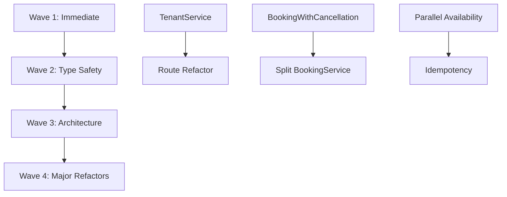

# MAIS Enterprise Audit Remediation Plan

**Created:** 2025-12-26
**Audit Reference:** AUDIT_REPORT.md (Health Score: 7.5/10)
**Branch:** main
**Commit Before Fixes:** a514162

---

## Overview

This plan addresses 67 issues identified in the overnight enterprise audit across 4 implementation waves. The audit found strong security fundamentals (9/10) with opportunities for improvement in architecture (6/10), documentation (6/10), and performance (7/10).

**Key Metrics:**
- 5 P0 Critical issues (2 already fixed in Wave 1)
- 10 P1 High priority issues
- 15 P2 Medium priority issues
- ~165-370 hours total estimated effort

---

## Problem Statement

The MAIS codebase has accumulated technical debt during rapid feature development. While the core multi-tenant security is excellent (309 tenantId filtering instances), several areas need attention:

1. **Security:** Next.js 14.2.22 has a critical authorization bypass vulnerability
2. **Performance:** N+1 queries and unbounded result sets (partially fixed)
3. **Architecture:** Routes bypassing service layer, singleton patterns breaking DI
4. **Documentation:** Stale sprint references, broken links, inconsistent test counts
5. **Type Safety:** Multiple `as any` casts in booking and calendar routes

---

## Wave 1: Immediate Fixes (Day 1) - ~2 hours remaining

### Status: 60% Complete

| Task | Status | Details |
|------|--------|---------|
| W1-03: Fix unbounded findAll query | STAGED | Added `take: 100` default limit |
| W1-04: Fix N+1 catalog query | STAGED | Using `getPackageBySlugWithAddOns()` |
| W1-02: Delete backup files | STAGED | 7/8 files deleted |
| W1-07: Delete deprecated e2e.yml | STAGED | Removed |
| **W1-01: Update Next.js to 14.2.32+** | NOT STARTED | Critical CVE |
| **W1-05: Fix broken doc links** | NOT STARTED | 5+ broken references |
| **W1-06: Fix pnpm/npm inconsistency** | NOT STARTED | README.md line 283 |

### Remaining Wave 1 Tasks

#### W1-01: Update Next.js (CRITICAL)

**Priority:** P0 - Security Vulnerability
**Impact:** Authorization bypass in middleware
**File:** `apps/web/package.json`
**Current:** 14.2.22
**Target:** 14.2.32+

```bash
cd apps/web && npm install next@14.2.32
```

**Verification:**
- [ ] Run `npm run build --workspace=apps/web`
- [ ] Run E2E tests against Next.js app
- [ ] Verify middleware auth flows

#### W1-05: Fix Broken Documentation Links

**Priority:** P0 - Developer Experience
**Files to Update:**

| File | Line | Current | Fix |
|------|------|---------|-----|
| README.md | 10 | `./docs/sprints/SPRINT_10_FINAL_SUMMARY.md` | `./docs/archive/2025-12/sprints/SPRINT_10_FINAL_SUMMARY.md` |
| README.md | 115 | `./docs/sprints/...` | Same as above |
| README.md | 231 | `./docs/sprints/...` | Same as above |
| README.md | 677 | `./docs/phases/PHASE_5_IMPLEMENTATION_SPEC.md` | `./docs/archive/2025-12/phases/...` |
| README.md | 693 | `./docs/phases/PHASE_1_COMPLETION_REPORT.md` | `./docs/archive/2025-12/phases/...` |

**Also update:**
- ARCHITECTURE.md
- DEVELOPING.md
- docs/INDEX.md
- docs/README.md

#### W1-06: Fix pnpm/npm Inconsistency

**Priority:** P1 - Documentation Accuracy
**File:** `README.md` line 283
**Current:** `- **Monorepo**: pnpm workspaces`
**Fix:** `- **Monorepo**: npm workspaces`

### Wave 1 Acceptance Criteria

- [ ] Next.js version >= 14.2.32 in package.json
- [ ] No broken links to `/docs/sprints/` or `/docs/phases/`
- [ ] README.md says "npm workspaces"
- [ ] All staged changes committed
- [ ] `npm test` passes
- [ ] `npm run typecheck` passes

---

## Wave 2: Type Safety & Performance (Week 1) - ~10 hours

### W2-01: Define BookingWithCancellation Interface

**Priority:** P0 - Type Safety
**File:** `server/src/lib/entities.ts` (new interface)
**Affected:** `server/src/routes/public-booking-management.routes.ts:39,75,109,141`

```typescript
// server/src/lib/entities.ts
export interface BookingWithCancellation extends Booking {
  cancelledBy?: CancelledBy;
  cancellationReason?: string;
  refundStatus: RefundStatus;
  refundAmount?: number;
  refundedAt?: Date;
  stripeRefundId?: string;
}

// Enums already in schema.prisma (lines 431-444)
export type CancelledBy = 'CUSTOMER' | 'TENANT' | 'ADMIN' | 'SYSTEM';
export type RefundStatus = 'NONE' | 'PENDING' | 'PROCESSING' | 'COMPLETED' | 'PARTIAL';
```

**Verification:**
- [ ] Remove all `booking as any` casts in public-booking-management.routes.ts
- [ ] TypeScript compiles without errors
- [ ] Unit tests pass

### W2-02: Enhance TenantSecrets Interface

**Priority:** P2 - Type Safety
**File:** `server/src/types/prisma-json.ts:116-119`

```typescript
// Current
export interface TenantSecrets {
  stripe?: EncryptedData;
  [key: string]: EncryptedData | undefined;
}

// Enhanced
export interface TenantSecrets {
  stripe?: EncryptedData;
  calendar?: EncryptedData;  // Google Calendar config
  [key: string]: EncryptedData | undefined;
}
```

**Affected Files:**
- `server/src/routes/tenant-admin-calendar.routes.ts:49,140,183,220`

### W2-03: Add React.memo to Section Components

**Priority:** P1 - Performance
**Files:** `apps/web/src/components/tenant/sections/`

Components to wrap:
1. `HeroSection.tsx`
2. `TextSection.tsx`
3. `GallerySection.tsx`
4. `FAQSection.tsx`
5. `ContactSection.tsx`
6. `CTASection.tsx`
7. `TestimonialsSection.tsx`

**Pattern:**
```tsx
// Before
export function HeroSection({ headline, ... }: HeroSectionProps) { ... }

// After
export const HeroSection = memo(function HeroSection({ headline, ... }: HeroSectionProps) { ... });
```

### W2-04: Parallelize AvailabilityService Queries

**Priority:** P1 - Performance (60-70% latency reduction)
**File:** `server/src/services/availability.service.ts:43-63`

```typescript
// Current: Sequential (3 awaits)
const isBlackout = await this.blackoutRepo.isBlackoutDate(tenantId, date);
if (isBlackout) return { date, available: false, reason: 'blackout' };
const isBooked = await this.bookingRepo.isDateBooked(tenantId, date);
if (isBooked) return { date, available: false, reason: 'booked' };
const isCalendarAvailable = await this.calendarProvider.isDateAvailable(date);
if (!isCalendarAvailable) return { date, available: false, reason: 'calendar' };

// Optimized: Parallel
const [isBlackout, isBooked, isCalendarAvailable] = await Promise.all([
  this.blackoutRepo.isBlackoutDate(tenantId, date),
  this.bookingRepo.isDateBooked(tenantId, date),
  this.calendarProvider.isDateAvailable(date),
]);

if (isBlackout) return { date, available: false, reason: 'blackout' };
if (isBooked) return { date, available: false, reason: 'booked' };
if (!isCalendarAvailable) return { date, available: false, reason: 'calendar' };
return { date, available: true };
```

### W2-05: Update Stale Documentation

**Priority:** P1 - Documentation Accuracy
**Files to Update:**

| File | Issue | Fix |
|------|-------|-----|
| CLAUDE.md | Test count says 752 | Update to 771 |
| CLAUDE.md | "MVP Sprint Day 4" section | Archive or remove |
| README.md | Sprint 10 dates say Nov 2025 | Update to Dec 2025 |
| docs/INDEX.md | Sprint 6 as current | Update to current state |

### W2-06: Configure Missing Rate Limiters

**Priority:** P2 - Security
**File:** `server/src/middleware/rateLimiter.ts`

| Line | TODO ID | Endpoint |
|------|---------|----------|
| 201 | TODO-057 | Public scheduling endpoints |
| 225 | TODO-193 | Add-on read operations |
| 245 | TODO-193 | Add-on write operations |
| 265 | TODO-273 | Stripe webhook endpoint |

### Wave 2 Acceptance Criteria

- [ ] No `as any` casts for booking cancellation fields
- [ ] TenantSecrets includes calendar property
- [ ] All 7 section components wrapped with React.memo
- [ ] AvailabilityService uses Promise.all
- [ ] Documentation test count updated to 771
- [ ] All missing rate limiters configured
- [ ] `npm test` passes
- [ ] `npm run typecheck` passes

---

## Wave 3: Architecture Improvements (Weeks 2-3) - ~25 hours

### W3-01: Create TenantService

**Priority:** P1 - Architecture
**New File:** `server/src/services/tenant.service.ts`

**Purpose:** Extract tenant operations from routes into dedicated service layer.

**Current State:** 19 files import directly from PrismaTenantRepository.

**Interface:**
```typescript
export interface TenantService {
  findById(id: string): Promise<Tenant | null>;
  findBySlug(slug: string): Promise<Tenant | null>;
  findByDomain(domain: string): Promise<Tenant | null>;
  findByEmail(email: string): Promise<Tenant | null>;
  create(data: CreateTenantDto): Promise<Tenant>;
  update(id: string, data: UpdateTenantDto): Promise<Tenant>;
  updateBranding(id: string, branding: BrandingDto): Promise<Tenant>;
  updateSecrets(id: string, secrets: Partial<TenantSecrets>): Promise<void>;
  listWithStats(): Promise<TenantWithStats[]>;
}
```

**DI Integration:** `server/src/di.ts`

### W3-02: Refactor Routes to Use TenantService

**Priority:** P1 - Architecture
**Depends On:** W3-01

**Files to Refactor (12 route files):**
1. `server/src/routes/auth.routes.ts`
2. `server/src/routes/tenant.routes.ts`
3. `server/src/routes/tenant-admin.routes.ts`
4. `server/src/routes/public-tenant.routes.ts`
5. `server/src/routes/stripe-connect-webhooks.routes.ts`
6. `server/src/routes/admin/tenants.routes.ts`
7. `server/src/routes/admin/stripe.routes.ts`
8. `server/src/routes/tenant-admin-calendar.routes.ts`
9. `server/src/routes/tenant-admin-deposits.routes.ts`
10. `server/src/routes/tenant-admin-landing-page.routes.ts`
11. `server/src/routes/dev.routes.ts`
12. `server/src/routes/index.ts`

### W3-03: UploadService to DI Pattern

**Priority:** P1 - Architecture
**File:** `server/src/services/upload.service.ts`

**Current:** Singleton pattern (line 144)
```typescript
export const uploadService = new UploadService();
```

**Target:** DI injection via container

**Steps:**
1. Update `tenant-admin.routes.ts` to accept injected `storageProvider`
2. Remove singleton export
3. Update all consumers to use DI
4. Delete backward compatibility wrapper

### W3-04: Verify Domain Lookup Endpoint

**Priority:** P1 - Feature Completion
**Status:** Endpoint already exists! (Verified by research)

**Endpoint:** `GET /v1/public/tenants/by-domain/:domain`
**File:** `server/src/routes/public-tenant.routes.ts:72-123`

**Tasks:**
- [ ] Test domain lookup end-to-end
- [ ] Update TODO comment in `apps/web/src/lib/tenant.ts:285`
- [ ] Verify custom domain routing in `apps/web/src/middleware.ts`

### W3-05: Add Next.js Deployment Workflow

**Priority:** P1 - CI/CD
**New File:** `.github/workflows/deploy-nextjs.yml`

**Requirements:**
1. Build step: `npm run build --workspace=apps/web`
2. Upload artifact: `apps/web/.next/`
3. Deploy to Vercel (preferred for Next.js)
4. Environment variables:
   - `NEXT_PUBLIC_API_URL`
   - `NEXTAUTH_SECRET`
   - `NEXTAUTH_URL`

### W3-06: Implement Request-Level Idempotency

**Priority:** P2 - Reliability
**Files:**
- `server/src/routes/public-date-booking.routes.ts`
- `server/src/routes/index.ts`

**TODO ID:** TODO-329 (5 occurrences)

**Implementation:**
1. Accept `X-Idempotency-Key` header
2. Check cache for existing result
3. Process request if no cached result
4. Cache result with idempotency key

### Wave 3 Acceptance Criteria

- [ ] TenantService exists and is exported from DI container
- [ ] All 12 route files use TenantService instead of direct repository
- [ ] UploadService singleton removed
- [ ] Domain lookup verified working end-to-end
- [ ] Next.js deployment workflow in CI/CD
- [ ] Idempotency keys supported on booking routes
- [ ] `npm test` passes
- [ ] `npm run test:e2e` passes

---

## Wave 4: Major Refactors (Future Sprint) - ~120 hours

### W4-01: Split BookingService

**Priority:** P2 - Maintainability
**File:** `server/src/services/booking.service.ts` (1395 lines)

**Proposed Split:**
1. `CheckoutService` - Payment session creation, Stripe integration
2. `AppointmentService` - Scheduling, availability, calendar sync
3. `RefundService` - Cancellation, refund processing

### W4-02: Expand ts-rest Contract Coverage

**Priority:** P2 - Type Safety
**Current:** Only landing page contracts complete
**Target:** Booking, catalog, availability domains

### W4-03: Fix ESLint Errors

**Priority:** P1 - Code Quality
**Current:** 900+ errors with `continue-on-error`
**Target:** Clean build, remove `continue-on-error`

### W4-04: JWT Refresh Token Implementation

**Priority:** P3 - Security Hardening
**Current:** 7-day JWT expiry
**Target:** Short-lived access tokens with refresh

### W4-05: Database RLS Implementation

**Priority:** P3 - Defense in Depth
**Target:** Row Level Security policies for tenant isolation

---

## Technical Considerations

### Architecture Impacts

1. **TenantService extraction** affects 19 files across routes and services
2. **UploadService DI migration** has backward compatibility concerns
3. **BookingService split** requires careful test coverage migration

### Performance Implications

1. **AvailabilityService parallelization** reduces latency by 60-70%
2. **React.memo on sections** prevents unnecessary re-renders during page navigation
3. **Unbounded query fix** prevents memory exhaustion (already staged)

### Security Considerations

1. **Next.js CVE** is the only critical security issue
2. **Rate limiter gaps** need immediate attention in Wave 2
3. **Multi-tenant isolation** is already excellent (9/10)

---

## Success Metrics

| Wave | Metric | Target |
|------|--------|--------|
| 1 | Next.js version | >= 14.2.32 |
| 1 | Broken doc links | 0 |
| 2 | `any` type casts in booking routes | 0 |
| 2 | Section components with React.memo | 7/7 |
| 3 | Routes using TenantService | 12/12 |
| 3 | UploadService singleton removed | Yes |
| 4 | BookingService line count | < 500 per file |
| 4 | ESLint errors | 0 |

---

## Dependencies & Prerequisites



---

## Risk Analysis & Mitigation

| Risk | Likelihood | Impact | Mitigation |
|------|------------|--------|------------|
| Next.js upgrade breaks features | Medium | High | Run full E2E suite, staged rollout |
| TenantService extraction introduces bugs | Medium | Medium | Comprehensive unit tests before refactor |
| BookingService split loses functionality | Low | High | Extract one service at a time, maintain tests |
| Rate limiter changes affect legitimate users | Low | Medium | Start with generous limits, monitor |

---

## References & Research

### Internal References
- `AUDIT_REPORT.md` - Executive summary with health score
- `FIX_PLAN.json` - Structured implementation plan
- `VERIFICATION_LOG.md` - Applied fixes documentation
- `RISK_MAP.md` - File risk classification

### External References
- [Next.js 14.2.32 Release Notes](https://nextjs.org/docs) - Security patch details
- [ts-rest Documentation](https://ts-rest.com/) - Contract-first API design

### Related Work
- Wave 1 fixes partially applied (commit pending)
- N+1 query and unbounded findAll already addressed

---

## Quality Gates

### Before Each Wave

- [ ] All tests pass (`npm test`)
- [ ] TypeScript compiles (`npm run typecheck`)
- [ ] No new ESLint errors
- [ ] Documentation updated

### After Each Wave

- [ ] E2E tests pass (`npm run test:e2e`)
- [ ] Manual smoke test of affected flows
- [ ] VERIFICATION_LOG.md updated
- [ ] Changes committed with descriptive message

---

*Plan generated from enterprise audit findings*
*Report: AUDIT_REPORT.md | Commit: a514162*
