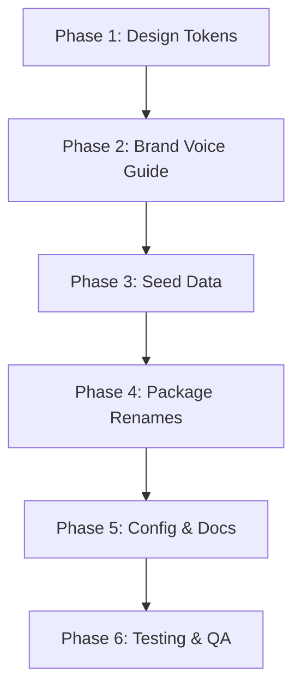

# HANDLED Rebrand: UI/UX Implementation Plan

**Date:** December 27, 2025
**Type:** Enhancement - Brand Identity Overhaul
**Scope:** UI/UX focused rebrand from MAIS to HANDLED
**Status:** Ready for Implementation

---

## Overview

Transform the MAIS (Macon AI Solutions) platform to **HANDLED** - a done-for-you tech platform for service businesses. This rebrand shifts positioning from "AI solutions for photographers" to "Your tech. Handled." - emphasizing relief and completion over features.

### Key Brand Changes

| Aspect     | Old (MAIS)                                        | New (HANDLED)                          |
| ---------- | ------------------------------------------------- | -------------------------------------- |
| Name       | Macon AI Solutions                                | HANDLED                                |
| Tagline    | "Book more clients. Build your business."         | "Your tech. Handled."                  |
| Hero       | "The booking platform for creative professionals" | "Finally. Your tech is handled."       |
| Voice      | Feature-focused, transformation                   | Relief-focused, completion             |
| Tier Names | Starter/Growth/Pro                                | Handled Lite/Fully Handled/White Glove |

---

## Problem Statement

The current MAIS branding has several issues:

1. "Macon AI Solutions" sounds like a 2008 regional IT consultancy
2. "Solutions" is a credibility killer with modern audiences
3. Geographic tie (Macon) limits national ambitions
4. Leading with "AI" puts us in a crowded, often-mocked category
5. Current copy focuses on photographers/booking, but offering is broader

---

## Implementation Phases

### Phase 1: Design Tokens & Color System

**Goal:** Update CSS variables and Tailwind config to reflect new brand

**Files to modify:**

1. `apps/web/src/styles/design-tokens.css:1-240`
   - Rename `--macon-*` variables to `--handled-*`
   - Keep sage green as primary (it's neutral, works for HANDLED)
   - Update comments from "MAIS DESIGN SYSTEM" to "HANDLED DESIGN SYSTEM"

2. `apps/web/tailwind.config.js:19-64`
   - Rename `macon-navy`, `macon-orange`, `macon-teal` to semantic names
   - Simplify to: `primary`, `accent`, `surface` palette
   - Remove "Macon Brand Colors" comment

**Token renaming strategy:**

```css
/* Current → New */
--macon-navy → --handled-primary (keep navy, it's professional)
--macon-orange → --handled-accent (keep orange for CTAs)
--macon-teal → --handled-success (use for positive states)
```

**Deliverables:**

- [ ] Update `design-tokens.css` header comments
- [ ] Rename `--macon-*` → `--handled-*` in CSS variables
- [ ] Update `tailwind.config.js` color names
- [ ] Verify no hardcoded hex values reference old names
- [ ] Run typecheck to catch any broken references

---

### Phase 2: Typography & Voice Updates

**Goal:** Update font choices and copy patterns for "relief-focused" voice

**Brand Voice Shift:**

| Current (MAIS)          | New (HANDLED)                      |
| ----------------------- | ---------------------------------- |
| "Book more clients."    | "Your tech. Handled."              |
| Transformation promise  | Relief/completion promise          |
| Photographer-specific   | Service business universal         |
| "You're a photographer" | "You do the work. We do the rest." |

**Files to modify:**

1. `docs/design/BRAND_VOICE_GUIDE.md` - **Complete rewrite**
   - Update brand positioning (line 8-13)
   - New voice principles (lines 17-67)
   - New word choices table (lines 136-154)
   - New landing page examples (lines 395-434)

**Key copy changes:**

```markdown
## Words to Use

| Use          | Instead of             |
| ------------ | ---------------------- |
| handled      | managed, automated     |
| tech         | software, platform     |
| craft        | work, job              |
| service pros | creative professionals |
| done-for-you | automated, self-serve  |
| relief       | efficiency             |

## Words to Avoid

- Revolutionary, game-changing
- AI-powered (as headline)
- Solutions, synergy
- Seamless, frictionless
```

**Deliverables:**

- [ ] Rewrite `BRAND_VOICE_GUIDE.md` header and positioning
- [ ] Update voice principles with "relief-focused" examples
- [ ] New copy patterns for headlines/CTAs
- [ ] Update words to use/avoid tables
- [ ] New landing page copy examples

---

### Phase 3: Seed Data & Tenant Configuration

**Goal:** Update "Tenant Zero" (dogfooding tenant) from MAIS to HANDLED

**Files to modify:**

1. `server/prisma/seeds/mais.ts` → **Rename to** `server/prisma/seeds/handled.ts`
   - Update `MAIS_SLUG = 'mais'` → `HANDLED_SLUG = 'handled'` (line 16)
   - Update `MAIS_EMAIL = 'hello@maconaisolutions.com'` → TBD (line 17)
   - Update tenant name (line 58): `'Macon AI Solutions'` → `'Handled'`
   - **Complete rewrite of landing page content** (lines 76-149):
     - Hero headline: "Finally. Your tech is handled."
     - Hero subhead: "Websites, booking, payments, and AI—built and managed for service businesses who'd rather focus on their craft."
     - Update all features, pricing sections
     - New tier names: "Handled Lite", "Fully Handled", "White Glove"

2. `server/prisma/seeds/e2e.ts`
   - Update `E2E_TENANT_SLUG = 'mais-e2e'` → `'handled-e2e'` (line 19)
   - Update public/secret key prefixes (lines 20-21)
   - Update tenant name (line 42)

3. `apps/web/src/app/page.tsx`
   - Update redirect from `/t/mais` → `/t/handled` (line 15)
   - Update comments about "Tenant Zero"

**Landing page content structure (new):**

```typescript
landingPageConfig: {
  hero: {
    headline: "Finally. Your tech is handled.",
    subheadline: "Websites, booking, payments, and AI—built and managed for service businesses who'd rather focus on their craft.",
    ctaText: "Get Started",
    ctaSecondary: "See How It Works"
  },
  features: [
    {
      title: "Done-For-You Website",
      description: "We build it. We manage it. You just show up."
    },
    {
      title: "Booking & Payments",
      description: "Clients book and pay. You get a text. That's it."
    },
    {
      title: "AI That Actually Helps",
      description: "Answers questions, handles scheduling, works while you sleep."
    }
  ],
  pricing: {
    tiers: [
      { name: "Handled Lite", tagline: "Get started" },
      { name: "Fully Handled", tagline: "Most popular", featured: true },
      { name: "White Glove", tagline: "Concierge service" }
    ]
  }
}
```

**Deliverables:**

- [ ] Rename `mais.ts` → `handled.ts`
- [ ] Update all constants (MAIS*\* → HANDLED*\*)
- [ ] Rewrite landing page content with new voice
- [ ] Update tier names throughout
- [ ] Update e2e.ts with new slug/keys
- [ ] Update homepage redirect
- [ ] Run seed to verify: `npm exec prisma db seed`

---

### Phase 4: Package & Import Path Updates

**Goal:** Rename @macon/_ packages to @handled/_

**This is a significant change requiring coordinated updates across:**

1. **Package.json files** (5 files):
   - `/package.json` - Root workspace
   - `/server/package.json` - `@macon/api` → `@handled/api`
   - `/apps/web/package.json` - `@macon/web-next` → `@handled/web`
   - `/packages/contracts/package.json` - `@macon/contracts` → `@handled/contracts`
   - `/packages/shared/package.json` - `@macon/shared` → `@handled/shared`

2. **Import statements** (40+ files):
   - All files with `from '@macon/contracts'`
   - All files with `from '@macon/shared'`

**Migration strategy:**

```bash
# 1. Update package.json names
# 2. Run find-and-replace across codebase
# 3. Update npm workspace references
# 4. npm install to re-link
# 5. npm run typecheck to verify
```

**Deliverables:**

- [ ] Update all 5 package.json files
- [ ] Global find-replace: `@macon/` → `@handled/`
- [ ] Update workspace references in root package.json
- [ ] Run `npm install` to re-link packages
- [ ] Run `npm run typecheck` to verify
- [ ] Run full test suite

---

### Phase 5: Configuration & Documentation Updates

**Goal:** Update all references to MAIS/Macon in configs and docs

**Files to modify:**

1. `server/src/api-docs.ts`
   - Line 15: `title: 'MAIS API'` → `'HANDLED API'`
   - Line 64: `email: 'support@maconaisolutions.com'` → TBD
   - Line 73: `url: 'https://api.maconaisolutions.com'` → TBD

2. `server/src/app.ts`
   - Lines 121-124: Update CORS allowlist domains
   - Line 236: `customSiteTitle: 'MAIS API Documentation'` → `'HANDLED API Documentation'`

3. `/CLAUDE.md`
   - Line 6: Update project overview
   - All references to "MAIS", "Macon AI Solutions"
   - Update @macon/\* package references

4. `.env.example` files - Check for MAIS references

**Deliverables:**

- [ ] Update API documentation title and contact
- [ ] Update CORS allowlist (after domain decision)
- [ ] Update CLAUDE.md project overview
- [ ] Search for remaining "MAIS" or "Macon" strings
- [ ] Update any environment variable examples

---

### Phase 6: Visual Regression & Testing

**Goal:** Verify rebrand doesn't break anything

**Testing strategy:**

1. **Visual regression with Playwright:**

```typescript
// tests/rebrand.visual.spec.ts
test('homepage brand consistency', async ({ page }) => {
  await page.goto('/t/handled');
  await expect(page).toHaveScreenshot('homepage-rebrand.png');
});

test('pricing section with new tier names', async ({ page }) => {
  await page.goto('/t/handled#pricing');
  await expect(page.locator('[data-testid="pricing-section"]')).toHaveScreenshot(
    'pricing-rebrand.png'
  );
});
```

2. **Copy verification:**

- No remaining "MAIS" on public pages
- No remaining "Macon" on public pages
- New tagline appears correctly
- Tier names display correctly

3. **Technical verification:**

- `npm run typecheck` passes
- `npm test` passes (771 tests)
- `npm run test:e2e` passes (114 tests)
- No console errors on page load

**Deliverables:**

- [ ] Create visual regression baseline screenshots
- [ ] Add rebrand-specific E2E tests
- [ ] Verify all tests pass after changes
- [ ] Manual QA of all public pages
- [ ] Check for hardcoded strings in components

---

## Acceptance Criteria

### Functional Requirements

- [ ] All public-facing pages show "HANDLED" branding
- [ ] No "MAIS" or "Macon" text visible to end users
- [ ] New tagline "Your tech. Handled." appears in hero
- [ ] Tier names updated to "Handled Lite / Fully Handled / White Glove"
- [ ] Color tokens work correctly (no broken references)

### Non-Functional Requirements

- [ ] TypeScript compilation passes (`npm run typecheck`)
- [ ] All 771 server tests pass
- [ ] All 114 E2E tests pass (after updating selectors)
- [ ] WCAG AA color contrast maintained
- [ ] No console errors on any page

### Quality Gates

- [ ] Visual regression baseline captured
- [ ] Manual QA completed on: home, pricing, about, contact pages
- [ ] Documentation updated (CLAUDE.md, BRAND_VOICE_GUIDE.md)
- [ ] Code review approved

---

## Dependencies & Prerequisites

1. **Domain decision** - Need final domain before updating:
   - CORS allowlist
   - API documentation URLs
   - Email addresses

2. **Social handles** - Confirm before updating any marketing copy

3. **No active development conflicts** - Coordinate with any in-flight PRs

---

## Risk Analysis

| Risk                                    | Likelihood | Impact | Mitigation                                          |
| --------------------------------------- | ---------- | ------ | --------------------------------------------------- |
| Broken imports after package rename     | Medium     | High   | Run typecheck after each batch of changes           |
| Missed string references                | Medium     | Medium | Global search for "mais", "macon", case-insensitive |
| Visual regression unnoticed             | Low        | Medium | Capture baseline screenshots first                  |
| E2E tests fail due to changed selectors | High       | Low    | Update test selectors as part of rebrand            |

---

## File Change Summary

| Category          | Files      | Priority |
| ----------------- | ---------- | -------- |
| Design tokens     | 2          | P1       |
| Brand voice doc   | 1          | P1       |
| Seed data         | 3          | P1       |
| Package.json      | 5          | P2       |
| Import statements | 40+        | P2       |
| Config/docs       | 4          | P2       |
| Homepage redirect | 1          | P1       |
| **Total**         | ~56+ files |          |

---

## Implementation Order



**Recommended execution:**

1. Start with Phase 1-2 (design tokens + voice guide) - low risk, high visibility
2. Phase 3 (seed data) - update Tenant Zero content
3. Phase 4 (package renames) - highest risk, do in one batch
4. Phase 5 (configs) - dependent on domain decision
5. Phase 6 (testing) - run after each phase, full suite at end

---

## References

### Internal References

- `docs/REBRAND-SUMMARY.md` - Brand decision document
- `docs/design/BRAND_VOICE_GUIDE.md:1-446` - Current brand guide (to be rewritten)
- `apps/web/src/styles/design-tokens.css:1-240` - CSS design tokens
- `apps/web/tailwind.config.js:1-203` - Tailwind configuration
- `server/prisma/seeds/mais.ts:1-150` - Tenant Zero seed data

### External References

- [Tailwind CSS 4 @theme directive](https://tailwindcss.com/docs/theme)
- [next-themes for theme switching](https://github.com/pacocoursey/next-themes)
- [Visual regression with Playwright](https://playwright.dev/docs/test-snapshots)

### Related Work

- Previous plan: `plans/feat-mais-tenant-zero-dogfooding.md`
- Brand voice guide: `docs/design/BRAND_VOICE_GUIDE.md`

---

## Questions for User

Before proceeding, we need decisions on:

1. **Domain** - Which domain was secured?
   - handled.io (first choice)
   - itshandled.com
   - handled.co

2. **Email** - What email format?
   - hello@[domain].com
   - support@[domain].com
   - team@[domain].com

3. **Package rename scope** - Full rename or partial?
   - Option A: Full rename `@macon/*` → `@handled/*` (recommended for clean break)
   - Option B: Keep internal package names, only update user-facing strings

4. **Tier pricing** - Keep current pricing structure with new names?
   - Handled Lite: $X/mo
   - Fully Handled: $Y/mo
   - White Glove: $Z/mo

---

_Plan prepared December 27, 2025_
_Ready for review and implementation_
