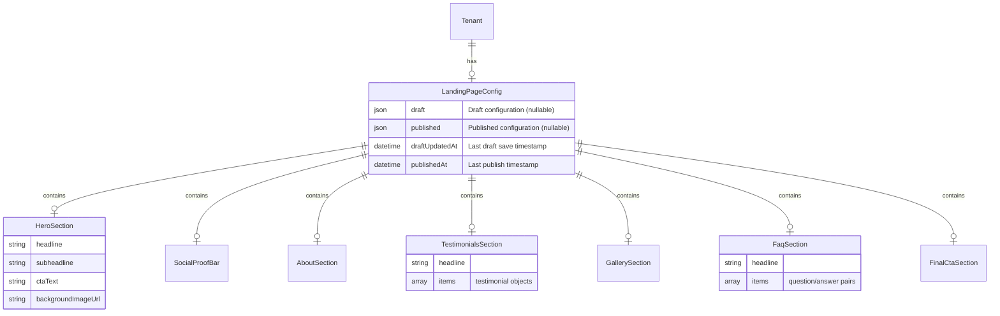

# Feature: Landing Page Visual Editor

## Overview

Build a WYSIWYG visual editor for tenant landing pages that mirrors the existing marketplace visual editor experience. Tenants can opt-in to pre-designed section templates (Hero, Testimonials, About, FAQ, Gallery, Final CTA), edit content inline, and publish changes when ready.

**Key Principles:**

- **Apple-style closed system**: Fixed, polished section layouts (no freeform positioning)
- **Marketplace defaults**: Landing page shows only segment selector by default
- **Progressive opt-in**: Tenants add sections from a sidebar gallery
- **Draft workflow**: Auto-save drafts, explicit publish/discard actions
- **WYSIWYG editing**: Click-to-edit inline, see changes in real-time

## Problem Statement

Currently, tenants cannot customize their landing pages without manual database manipulation. The backend CRUD routes exist (TODO-202 complete), but there's no admin UI. Tenants need a simple, visual way to:

1. Enable optional sections (Hero, About, Testimonials, FAQ, Gallery, Final CTA)
2. Edit section content inline (WYSIWYG)
3. Preview changes before publishing
4. Maintain a clean, professional landing page without design skills

## Technical Approach

### Architecture

The landing page editor will follow the same patterns as the existing `VisualEditorDashboard`:

```
┌─────────────────────────────────────────────────────────────────┐
│                    LandingPageEditor                            │
├─────────────────────────────────────────────────────────────────┤
│  ┌──────────────┐  ┌──────────────────────────────────────────┐ │
│  │   Sidebar    │  │           Live Preview Area              │ │
│  │              │  │                                          │ │
│  │ ┌──────────┐ │  │  ┌────────────────────────────────────┐  │ │
│  │ │ Active   │ │  │  │         HeroSection                │  │ │
│  │ │ Sections │ │  │  │  [Click to edit headline]          │  │ │
│  │ │          │ │  │  │  [Click to edit subheadline]       │  │ │
│  │ │ ☑ Hero   │ │  │  └────────────────────────────────────┘  │ │
│  │ │ ☑ About  │ │  │                                          │ │
│  │ │ ☐ FAQ    │ │  │  ┌────────────────────────────────────┐  │ │
│  │ └──────────┘ │  │  │       SegmentSelector              │  │ │
│  │              │  │  │      (Always visible)              │  │ │
│  │ ┌──────────┐ │  │  └────────────────────────────────────┘  │ │
│  │ │Available │ │  │                                          │ │
│  │ │ Sections │ │  │  ┌────────────────────────────────────┐  │ │
│  │ │          │ │  │  │        AboutSection                │  │ │
│  │ │ [+] FAQ  │ │  │  │   [Click to edit content]          │  │ │
│  │ │ [+]Gallery│ │  │  └────────────────────────────────────┘  │ │
│  │ └──────────┘ │  │                                          │ │
│  └──────────────┘  └──────────────────────────────────────────┘ │
├─────────────────────────────────────────────────────────────────┤
│  [Discard Changes]                              [Publish]       │
└─────────────────────────────────────────────────────────────────┘
```

### State Management

```typescript
// hooks/useLandingPageEditor.ts
interface LandingPageEditorState {
  // Current draft configuration
  draftConfig: LandingPageConfig | null;

  // Published (live) configuration for comparison
  publishedConfig: LandingPageConfig | null;

  // Track if there are unsaved changes
  hasChanges: boolean;

  // Loading/saving states
  isLoading: boolean;
  isSaving: boolean;
  isPublishing: boolean;

  // Error state
  error: string | null;
}

interface LandingPageEditorActions {
  // Load initial config
  loadConfig(): Promise<void>;

  // Toggle section visibility (adds with demo data if new)
  toggleSection(section: SectionType, enabled: boolean): void;

  // Update section content (auto-saves draft)
  updateSectionContent(section: SectionType, content: Partial<SectionConfig>): void;

  // Publish all changes
  publishChanges(): Promise<void>;

  // Discard all changes (revert to published)
  discardChanges(): void;
}
```

### Security & Data Integrity Patterns

> **P1 Findings Implemented:** The following security measures have been implemented based on code review findings (TODOs 227-232).

#### Tenant Isolation (TODO-227)

All draft endpoints verify tenant ownership via `res.locals.tenantAuth`:

```typescript
// Pattern applied to all draft endpoints
router.put('/draft', async (req: Request, res: Response, next: NextFunction) => {
  const tenantAuth = res.locals.tenantAuth;
  if (!tenantAuth) {
    res.status(401).json({ error: 'Unauthorized: No tenant authentication' });
    return;
  }
  const { tenantId } = tenantAuth;
  // ... all repository methods require tenantId as first parameter
});
```

#### Input Sanitization (TODO-228)

All text fields are sanitized before storage to prevent XSS:

```typescript
import { sanitizeObject } from '../lib/sanitization';

// In route handler
const data = LandingPageConfigSchema.parse(req.body);
const sanitizedData = sanitizeObject(data, { allowHtml: [] });
await tenantRepo.saveLandingPageDraft(tenantId, sanitizedData);
```

#### Image URL Validation (TODO-229)

Repository layer re-validates all image URLs against `SafeImageUrlSchema`:

```typescript
// Defense-in-depth: validates even after Zod schema validation
private validateImageUrls(config: LandingPageConfig): void {
  const urlsToValidate = [
    config.hero?.backgroundImageUrl,
    config.about?.imageUrl,
    config.gallery?.images?.map(img => img.url),
    // ... all image fields
  ];

  for (const url of urlsToValidate) {
    SafeImageUrlSchema.parse(url); // Blocks data:, javascript: protocols
  }
}
```

#### Publish Atomicity (TODO-230)

Publish operation uses Prisma transaction for atomicity:

```typescript
async publishLandingPageDraft(tenantId: string) {
  return await this.prisma.$transaction(async (tx) => {
    const tenant = await tx.tenant.findUnique({ where: { id: tenantId } });
    if (!currentWrapper.draft) {
      throw new ValidationError('No draft to publish');
    }
    // Atomically copy draft to published, clear draft
    await tx.tenant.update({
      where: { id: tenantId },
      data: { landingPageConfig: { published: draft, draft: null } },
    });
  });
}
```

#### Auto-Save Race Condition Prevention (TODO-231)

The `useLandingPageEditor` hook must flush pending auto-saves before publish:

```typescript
const publishChanges = useCallback(async () => {
  // CRITICAL: Cancel pending debounce and flush immediately
  cancelDebounce();

  if (hasChanges) {
    await saveDraftImmediate(draftConfig); // Flush without debounce
  }

  // Now safe to publish
  setIsPublishing(true);
  try {
    await apiClient.publishLandingPageDraft();
    setPublishedConfig(draftConfig);
    setDraftConfig(null);
    setHasChanges(false);
  } finally {
    setIsPublishing(false);
  }
}, [draftConfig, hasChanges, cancelDebounce, saveDraftImmediate]);
```

#### API Contract Error Codes (TODO-232)

All draft endpoints include complete error responses:

```typescript
saveDraft: {
  responses: {
    200: SaveDraftResponseSchema,
    400: BadRequestErrorSchema,  // Validation errors
    401: UnauthorizedErrorSchema, // No tenant auth
    404: NotFoundErrorSchema,     // Tenant not found
    500: InternalServerErrorSchema,
  },
}
```

### Implementation Phases

#### Phase 1: Core Infrastructure (1-2 days)

**Files to Create:**

```
client/src/features/tenant-admin/landing-page-editor/
├── LandingPageEditor.tsx              # Main editor container
├── components/
│   ├── EditorSidebar.tsx              # Section toggles + available sections
│   ├── SectionCard.tsx                # Sidebar section card (toggle/add)
│   └── EditorToolbar.tsx              # Publish/Discard buttons
├── hooks/
│   └── useLandingPageEditor.ts        # State management hook
└── index.ts                           # Barrel export
```

**Tasks:**

- [ ] Create `LandingPageEditor.tsx` main container with sidebar + preview layout
- [ ] Create `useLandingPageEditor.ts` hook mirroring `useVisualEditor.ts` patterns
- [ ] Create `EditorSidebar.tsx` with active/available section lists
- [ ] Create `EditorToolbar.tsx` with Publish/Discard buttons
- [ ] Add route `/tenant/landing-page` in `client/src/app/routes.tsx`
- [ ] Add navigation link in tenant admin sidebar

**Acceptance Criteria:**

- [ ] Editor page loads at `/tenant/landing-page`
- [ ] Sidebar shows section toggles
- [ ] Publish/Discard buttons visible in toolbar
- [ ] Basic layout renders correctly

#### Phase 2: Editable Section Components (2-3 days)

**Files to Create/Modify:**

```
client/src/features/tenant-admin/landing-page-editor/
├── sections/
│   ├── EditableHeroSection.tsx        # Hero with inline editing
│   ├── EditableSocialProofBar.tsx     # Social proof with inline editing
│   ├── EditableAboutSection.tsx       # About with inline editing
│   ├── EditableTestimonialsSection.tsx # Testimonials with inline editing
│   ├── EditableGallerySection.tsx     # Gallery with photo management
│   ├── EditableFaqSection.tsx         # FAQ with add/edit/remove
│   └── EditableFinalCtaSection.tsx    # Final CTA with inline editing
├── components/
│   ├── EditableText.tsx               # Reuse from visual-editor (or copy)
│   ├── EditableImage.tsx              # Image upload/change component
│   └── EditableList.tsx               # For testimonials, FAQ items
└── demo-data/
    └── section-defaults.ts            # Demo content for new sections
```

**Demo Data Structure:**

```typescript
// demo-data/section-defaults.ts
export const SECTION_DEFAULTS = {
  hero: {
    headline: 'Welcome to Your Business',
    subheadline: 'Discover our amazing services and experiences',
    ctaText: 'Explore Our Offerings',
    backgroundImageUrl: null, // Placeholder gradient
  },
  about: {
    headline: 'About Us',
    content:
      'Tell your story here. What makes your business special? Share your journey, mission, and values with your customers.',
    imageUrl: null,
    imagePosition: 'right',
  },
  testimonials: {
    headline: 'What Our Customers Say',
    items: [
      {
        quote: 'Amazing experience! Highly recommended.',
        author: 'Happy Customer',
        role: 'Verified Client',
        rating: 5,
      },
    ],
  },
  socialProofBar: {
    items: [
      { icon: 'star', text: '5-Star Rated' },
      { icon: 'users', text: '500+ Happy Clients' },
      { icon: 'calendar', text: 'Easy Booking' },
    ],
  },
  gallery: {
    headline: 'Our Gallery',
    images: [],
    instagramHandle: null,
  },
  faq: {
    headline: 'Frequently Asked Questions',
    items: [
      {
        question: 'How do I book?',
        answer: 'Simply browse our offerings and click "Book Now" on any package.',
      },
      {
        question: 'What is your cancellation policy?',
        answer: 'Contact us at least 48 hours before your appointment for a full refund.',
      },
    ],
  },
  finalCta: {
    headline: 'Ready to Get Started?',
    subheadline: 'Book your experience today',
    ctaText: 'Book Now',
  },
};
```

**Tasks:**

- [ ] Create `EditableHeroSection.tsx` with EditableText for headline/subheadline, image upload
- [ ] Create `EditableSocialProofBar.tsx` with editable stat items
- [ ] Create `EditableAboutSection.tsx` with EditableText and image upload
- [ ] Create `EditableTestimonialsSection.tsx` with add/edit/remove testimonials
- [ ] Create `EditableGallerySection.tsx` with photo upload (reuse PhotoDropZone patterns)
- [ ] Create `EditableFaqSection.tsx` with add/edit/remove FAQ items
- [ ] Create `EditableFinalCtaSection.tsx` with EditableText
- [ ] Create `section-defaults.ts` with demo content
- [ ] Integrate editable sections into LandingPageEditor preview area

**Acceptance Criteria:**

- [ ] Each section renders with demo data when first added
- [ ] Click-to-edit works on all text fields
- [ ] Image upload works on Hero, About, Gallery
- [ ] Add/remove works on Testimonials, FAQ items
- [ ] Changes reflect immediately in preview

#### Phase 3: Draft System & API Integration (1-2 days)

**Files to Modify:**

```
packages/contracts/src/tenant-admin/landing-page.contract.ts  # Add draft endpoints
server/src/routes/tenant-admin-landing-page.routes.ts          # Implement draft routes
server/src/adapters/prisma/tenant.repository.ts               # Add draft methods
```

**New API Endpoints:**

```typescript
// Draft management
GET  /v1/tenant-admin/landing-page/draft     # Get draft config
PUT  /v1/tenant-admin/landing-page/draft     # Save draft (auto-save)
POST /v1/tenant-admin/landing-page/publish   # Publish draft to live
DELETE /v1/tenant-admin/landing-page/draft   # Discard draft
```

**Schema Extension:**

```typescript
// Extend Tenant model or add separate draft storage
interface TenantLandingPageDraft {
  draftConfig: LandingPageConfig | null;
  draftUpdatedAt: Date | null;
  publishedConfig: LandingPageConfig | null;
  publishedAt: Date | null;
}
```

**Tasks:**

- [ ] Add draft endpoints to landing-page.contract.ts
- [ ] Implement draft save/load in tenant.repository.ts
- [ ] Create publish endpoint that copies draft to live config
- [ ] Create discard endpoint that clears draft
- [ ] Integrate API calls in useLandingPageEditor hook
- [ ] Add auto-save with 1s debounce (matching visual editor)
- [ ] Add optimistic updates with rollback on error

**Acceptance Criteria:**

- [ ] Drafts auto-save after 1s of inactivity
- [ ] Publish button copies draft to live
- [ ] Discard button reverts to published state
- [ ] "Unsaved changes" indicator shows when draft differs from published
- [ ] Page reload preserves draft state

#### Phase 4: Polish & Testing (1-2 days)

**Tasks:**

- [ ] Add loading skeletons during initial load
- [ ] Add success/error toast notifications
- [ ] Add confirmation dialog for discard action
- [ ] Add "has changes" indicator in sidebar
- [ ] Add section preview thumbnails in "Available Sections"
- [ ] Write E2E tests for editor workflow
- [ ] Test edge cases (empty config, partial saves, network errors)
- [ ] Mobile-responsive sidebar (collapse to bottom drawer on mobile - future)

**Acceptance Criteria:**

- [ ] All happy paths work smoothly
- [ ] Error states handled gracefully
- [ ] E2E tests pass
- [ ] TypeScript compilation passes

## Component Specifications

### LandingPageEditor.tsx

```typescript
export function LandingPageEditor() {
  const editor = useLandingPageEditor();

  return (
    <div className="flex h-screen">
      {/* Sidebar */}
      <EditorSidebar
        activesSections={editor.activeSections}
        availableSections={editor.availableSections}
        onToggleSection={editor.toggleSection}
        hasChanges={editor.hasChanges}
      />

      {/* Preview Area */}
      <div className="flex-1 overflow-y-auto bg-gray-100">
        <div className="max-w-6xl mx-auto">
          {/* Render enabled sections in order */}
          {editor.draftConfig?.sections?.hero && (
            <EditableHeroSection
              config={editor.draftConfig.hero}
              onUpdate={(updates) => editor.updateSectionContent('hero', updates)}
            />
          )}

          {/* Segment Selector - Always visible */}
          <SegmentSelectorSection />

          {/* ... other sections */}
        </div>
      </div>

      {/* Bottom Toolbar */}
      <EditorToolbar
        hasChanges={editor.hasChanges}
        isPublishing={editor.isPublishing}
        onPublish={editor.publishChanges}
        onDiscard={editor.discardChanges}
      />
    </div>
  );
}
```

### EditorSidebar.tsx

```typescript
interface EditorSidebarProps {
  activeSections: SectionType[];
  availableSections: SectionType[];
  onToggleSection: (section: SectionType, enabled: boolean) => void;
  hasChanges: boolean;
}

export function EditorSidebar({
  activeSections,
  availableSections,
  onToggleSection,
  hasChanges,
}: EditorSidebarProps) {
  return (
    <aside className="w-72 bg-white border-r flex flex-col">
      <div className="p-4 border-b">
        <h2 className="font-semibold text-lg">Landing Page Editor</h2>
        {hasChanges && (
          <span className="text-sm text-amber-600">Unsaved changes</span>
        )}
      </div>

      {/* Active Sections */}
      <div className="p-4">
        <h3 className="text-sm font-medium text-gray-500 mb-2">Active Sections</h3>
        <div className="space-y-2">
          {activeSections.map((section) => (
            <SectionCard
              key={section}
              section={section}
              isActive={true}
              onToggle={() => onToggleSection(section, false)}
            />
          ))}
        </div>
      </div>

      {/* Available Sections */}
      <div className="p-4 border-t">
        <h3 className="text-sm font-medium text-gray-500 mb-2">Add Sections</h3>
        <div className="space-y-2">
          {availableSections.map((section) => (
            <SectionCard
              key={section}
              section={section}
              isActive={false}
              onToggle={() => onToggleSection(section, true)}
            />
          ))}
        </div>
      </div>
    </aside>
  );
}
```

### EditableHeroSection.tsx

```typescript
interface EditableHeroSectionProps {
  config: HeroSectionConfig;
  onUpdate: (updates: Partial<HeroSectionConfig>) => void;
}

export const EditableHeroSection = memo(function EditableHeroSection({
  config,
  onUpdate,
}: EditableHeroSectionProps) {
  return (
    <section
      className="relative min-h-[600px] flex items-center justify-center"
      style={{
        backgroundImage: config.backgroundImageUrl
          ? `url(${config.backgroundImageUrl})`
          : 'linear-gradient(135deg, #1a365d 0%, #2d4a6f 100%)',
        backgroundSize: 'cover',
        backgroundPosition: 'center',
      }}
    >
      {/* Image Upload Overlay (on hover) */}
      <EditableImage
        currentUrl={config.backgroundImageUrl}
        onUpload={(url) => onUpdate({ backgroundImageUrl: url })}
        className="absolute inset-0"
      />

      <div className="relative z-10 text-center text-white max-w-3xl px-4">
        <EditableText
          value={config.headline}
          onChange={(headline) => onUpdate({ headline })}
          className="text-5xl font-bold mb-4"
          placeholder="Your Headline Here"
        />

        {config.subheadline !== undefined && (
          <EditableText
            value={config.subheadline || ''}
            onChange={(subheadline) => onUpdate({ subheadline })}
            className="text-xl mb-8 opacity-90"
            placeholder="Your subheadline here"
            multiline
          />
        )}

        <EditableText
          value={config.ctaText}
          onChange={(ctaText) => onUpdate({ ctaText })}
          className="inline-block bg-white text-gray-900 px-8 py-3 rounded-full font-semibold"
          placeholder="Call to Action"
        />
      </div>
    </section>
  );
});
```

## Database Changes

**Option A: Extend existing `landingPageConfig` field (Recommended)**

Store draft alongside published in the JSON:

```typescript
// Tenant.landingPageConfig structure
{
  draft: LandingPageConfig | null,
  published: LandingPageConfig | null,
  draftUpdatedAt: string | null,
  publishedAt: string | null,
}
```

**Migration:** None needed - JSON field is flexible.

**Option B: Add separate draft column**

```prisma
model Tenant {
  // ... existing fields
  landingPageConfig     Json?  // Published config
  landingPageDraftConfig Json? // Draft config (new)
  landingPageDraftAt    DateTime? // Last draft save (new)
  landingPagePublishedAt DateTime? // Last publish (new)
}
```

**Recommendation:** Option A for simplicity (no migration required).

## API Contract Updates

```typescript
// packages/contracts/src/tenant-admin/landing-page.contract.ts

export const landingPageContract = c.router({
  // Existing endpoints...

  // New draft endpoints
  getDraft: {
    method: 'GET',
    path: '/v1/tenant-admin/landing-page/draft',
    responses: {
      200: LandingPageConfigSchema.nullable(),
    },
  },

  saveDraft: {
    method: 'PUT',
    path: '/v1/tenant-admin/landing-page/draft',
    body: LandingPageConfigSchema,
    responses: {
      200: z.object({
        success: z.boolean(),
        draftUpdatedAt: z.string().datetime(),
      }),
    },
  },

  publishDraft: {
    method: 'POST',
    path: '/v1/tenant-admin/landing-page/publish',
    body: z.object({}), // No body needed
    responses: {
      200: z.object({
        success: z.boolean(),
        publishedAt: z.string().datetime(),
      }),
    },
  },

  discardDraft: {
    method: 'DELETE',
    path: '/v1/tenant-admin/landing-page/draft',
    responses: {
      200: z.object({ success: z.boolean() }),
    },
  },
});
```

## Acceptance Criteria

### Functional Requirements

- [ ] Landing page editor accessible at `/tenant/landing-page`
- [ ] Sidebar shows active sections with ability to remove
- [ ] Sidebar shows available sections with ability to add
- [ ] Adding a section initializes it with demo data
- [ ] Click-to-edit works on all text fields
- [ ] Image upload works on Hero, About, Gallery sections
- [ ] Add/remove items works on Testimonials and FAQ sections
- [ ] Changes auto-save as drafts (1s debounce)
- [ ] Publish button makes draft live
- [ ] Discard button reverts to published state
- [ ] Segment Selector always visible (cannot be removed)

### Non-Functional Requirements

- [ ] Page load under 2 seconds
- [ ] Auto-save completes within 500ms
- [ ] No layout shift during editing
- [ ] TypeScript strict mode compliance
- [ ] All existing tests continue to pass

### Quality Gates

- [ ] E2E tests for complete editor workflow
- [ ] Unit tests for useLandingPageEditor hook
- [ ] Code review approved
- [ ] No TypeScript errors
- [ ] Lighthouse accessibility score > 90

## Dependencies & Prerequisites

**Completed:**

- ✅ TODO-202: Backend landing page CRUD routes
- ✅ Landing page section components (HeroSection, AboutSection, etc.)
- ✅ Visual editor patterns (useVisualEditor, EditableText, etc.)
- ✅ Landing page schema with validation

**Required:**

- Photo upload API (existing - reuse from package photos)
- Toast notification system (existing)
- Confirmation dialog component (existing)

## Risk Analysis & Mitigation

| Risk                             | Impact | Likelihood | Mitigation                               |
| -------------------------------- | ------ | ---------- | ---------------------------------------- |
| Draft data loss on browser crash | Medium | Low        | Auto-save every change with 1s debounce  |
| Concurrent editing conflicts     | Low    | Low        | Single admin per tenant (MVP acceptable) |
| Large image uploads slow editor  | Medium | Medium     | Image compression, loading states        |
| Complex state management         | Medium | Medium     | Follow proven useVisualEditor patterns   |

## File Changes Summary

### New Files (14)

```
client/src/features/tenant-admin/landing-page-editor/
├── LandingPageEditor.tsx
├── components/
│   ├── EditorSidebar.tsx
│   ├── SectionCard.tsx
│   ├── EditorToolbar.tsx
│   ├── EditableImage.tsx
│   └── EditableList.tsx
├── sections/
│   ├── EditableHeroSection.tsx
│   ├── EditableSocialProofBar.tsx
│   ├── EditableAboutSection.tsx
│   ├── EditableTestimonialsSection.tsx
│   ├── EditableGallerySection.tsx
│   ├── EditableFaqSection.tsx
│   └── EditableFinalCtaSection.tsx
├── hooks/
│   └── useLandingPageEditor.ts
├── demo-data/
│   └── section-defaults.ts
└── index.ts
```

### Modified Files (5)

```
client/src/app/routes.tsx                           # Add editor route
client/src/features/tenant-admin/TenantAdminNav.tsx # Add nav link
packages/contracts/src/tenant-admin/landing-page.contract.ts # Draft endpoints
server/src/routes/tenant-admin-landing-page.routes.ts # Implement draft routes
server/src/adapters/prisma/tenant.repository.ts    # Draft repository methods
```

## Estimated Effort

| Phase                        | Duration     | Notes                                       |
| ---------------------------- | ------------ | ------------------------------------------- |
| Phase 1: Core Infrastructure | 1-2 days     | Route, layout, sidebar, toolbar             |
| Phase 2: Editable Sections   | 2-3 days     | 7 section components with inline editing    |
| Phase 3: Draft System        | 1-2 days     | API integration, auto-save, publish/discard |
| Phase 4: Polish & Testing    | 1-2 days     | Edge cases, E2E tests, error handling       |
| **Total**                    | **5-9 days** |                                             |

## References

### Internal References

- Visual Editor Dashboard: `client/src/features/tenant-admin/visual-editor/VisualEditorDashboard.tsx`
- useVisualEditor Hook: `client/src/features/tenant-admin/visual-editor/hooks/useVisualEditor.ts`
- EditableText Component: `client/src/features/tenant-admin/visual-editor/components/EditableText.tsx`
- Landing Page Schema: `packages/contracts/src/landing-page.ts`
- Landing Page Routes: `server/src/routes/tenant-admin-landing-page.routes.ts`
- TODO-205: `todos/205-pending-p1-missing-tenant-admin-landing-page-ui.md`

### External References

- React Intersection Observer: https://github.com/thebuilder/react-intersection-observer
- dnd-kit (if drag-drop reordering added later): https://dndkit.com/

---

## ERD Diagram



---

_Plan created: 2024-12-04_
_Updated: 2025-12-04 - P1 Security Findings Resolved_
_Status: Ready for Implementation - Security patterns implemented in backend_
