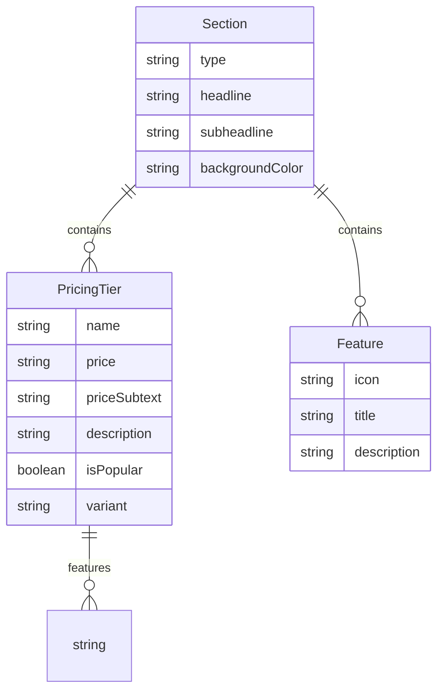

# feat: MAIS becomes Tenant Zero - Eating Our Own Dogfood

> **TL;DR:** MAIS sells optimized AI storefronts but doesn't use its own system. The fix is simple: make MAIS a real tenant (Tenant Zero) using the exact same config-driven architecture we sell to clients.

---

## The Problem

### What We're Selling

```
"We build optimal, research-backed, AI-powered storefronts for small businesses"
```

### What MAIS.com Actually Is

- A hardcoded 479-line React component (`apps/web/src/app/page.tsx`)
- No `/about`, `/services`, `/faq`, `/contact` pages (footer links to 404s)
- Not using the `SectionRenderer`, `normalizeToPages()`, or any config
- Not eating our own dogfood

### Why This Matters

1. **Trust deficit**: Prospects evaluating website builders look at the company's own site first
2. **Proof gap**: "Our system is optimal" is not demonstrated by avoiding our own system
3. **Cognitive dissonance**: We sell multi-page storefronts; we have a single page
4. **Wasted architecture**: `SectionRenderer.tsx` + 7 section types exist but aren't used for MAIS

---

## The Solution: MAIS Becomes Tenant Zero

### Architecture Decision

**MAIS will be a real tenant** in the database with:

- `slug: 'mais'`
- `landingPageConfig` stored in Prisma just like any client
- Routes served from the same `apps/web/src/app/t/[slug]/(site)/*` architecture
- Root `/` redirects to `/t/mais` OR uses custom domain routing to serve MAIS

### Why Full Dogfooding (Not Partial)

| Approach                 | Pros                                                                 | Cons                                                    |
| ------------------------ | -------------------------------------------------------------------- | ------------------------------------------------------- |
| **Tenant Zero (chosen)** | Proves product works, single codebase, catches bugs in our own usage | Need to extend section types                            |
| Enhanced internal        | Could add MAIS-only features                                         | Two codebases to maintain, doesn't prove client product |
| Keep separate            | Fast to ship                                                         | Undermines sales pitch, separate maintenance burden     |

---

## Gap Analysis: What's Missing for MAIS

### Current Section Types (7)

| Type           | Available | MAIS Needs                      |
| -------------- | --------- | ------------------------------- |
| `hero`         | ✅        | ✅ (already used)               |
| `text`         | ✅        | ✅                              |
| `gallery`      | ✅        | ✅ (for portfolio/case studies) |
| `testimonials` | ✅        | ✅                              |
| `faq`          | ✅        | ✅                              |
| `contact`      | ✅        | ✅                              |
| `cta`          | ✅        | ✅                              |

### New Section Types Needed (2)

| Type       | Purpose                                                               | Reusable for Tenants?                                      |
| ---------- | --------------------------------------------------------------------- | ---------------------------------------------------------- |
| `pricing`  | Tier cards with features, "Popular" badge, CTA buttons                | ✅ Yes - restaurants, photographers, coaches all need this |
| `features` | Icon + title + description grid (like current "What you get" section) | ✅ Yes - universal                                         |

### Additional Pages Needed

| Page        | Route                               | Status     | Notes                |
| ----------- | ----------------------------------- | ---------- | -------------------- |
| `/about`    | `t/[slug]/(site)/about/page.tsx`    | ✅ Exists  | Need MAIS config     |
| `/services` | `t/[slug]/(site)/services/page.tsx` | ✅ Exists  | Need MAIS config     |
| `/faq`      | `t/[slug]/(site)/faq/page.tsx`      | ✅ Exists  | Need MAIS config     |
| `/contact`  | `t/[slug]/(site)/contact/page.tsx`  | ✅ Exists  | Need MAIS config     |
| `/pricing`  | 🆕 NEW                              | ❌ Missing | New page type        |
| `/blog`     | 🆕 NEW (future)                     | ❌ Missing | Out of scope for MVP |

---

## Technical Implementation

### Phase 1: New Section Types (Reusable)

#### 1.1 `PricingSection.tsx`

```tsx
// apps/web/src/components/tenant/sections/PricingSection.tsx
interface PricingTier {
  name: string;
  price: string | number; // "$40" or 4000 (cents)
  priceSubtext?: string; // "/month"
  description?: string;
  features: string[];
  ctaText?: string;
  ctaHref?: string;
  isPopular?: boolean;
  variant?: 'standard' | 'enterprise'; // enterprise = "Contact us"
}

interface PricingSectionProps {
  type: 'pricing';
  headline: string;
  subheadline?: string;
  tiers: PricingTier[];
  backgroundColor?: 'white' | 'neutral';
}
```

**Design Pattern** (from BRAND_VOICE_GUIDE.md):

- Cards: `rounded-3xl shadow-lg border border-neutral-100`
- Popular tier: `shadow-2xl border-2 border-sage relative lg:-mt-4 lg:mb-4`
- "Most Popular" badge: `bg-sage text-white text-sm font-medium px-4 py-1 rounded-full`
- Hover: `transition-all duration-300 hover:shadow-xl hover:-translate-y-1`

#### 1.2 `FeaturesSection.tsx`

```tsx
// apps/web/src/components/tenant/sections/FeaturesSection.tsx
interface Feature {
  icon: string; // Lucide icon name: 'Globe', 'Calendar', 'CreditCard'
  title: string;
  description: string;
}

interface FeaturesSectionProps {
  type: 'features';
  headline: string;
  subheadline?: string;
  features: Feature[];
  columns?: 2 | 3 | 4; // Grid columns
  backgroundColor?: 'white' | 'neutral';
}
```

### Phase 2: Contract Schema Updates

```typescript
// packages/contracts/src/schemas/landing-page.schema.ts

// Add to SectionType union
export type SectionType =
  | 'hero'
  | 'text'
  | 'gallery'
  | 'testimonials'
  | 'faq'
  | 'contact'
  | 'cta'
  | 'pricing'
  | 'features'; // NEW

// Add pricing section schema
export const PricingTierSchema = z.object({
  name: z.string(),
  price: z.union([z.string(), z.number()]),
  priceSubtext: z.string().optional(),
  description: z.string().optional(),
  features: z.array(z.string()),
  ctaText: z.string().optional(),
  ctaHref: z.string().optional(),
  isPopular: z.boolean().optional(),
  variant: z.enum(['standard', 'enterprise']).optional(),
});

export const PricingSectionSchema = z.object({
  type: z.literal('pricing'),
  headline: z.string(),
  subheadline: z.string().optional(),
  tiers: z.array(PricingTierSchema),
  backgroundColor: z.enum(['white', 'neutral']).optional(),
});

// Add features section schema
export const FeatureSchema = z.object({
  icon: z.string(),
  title: z.string(),
  description: z.string(),
});

export const FeaturesSectionSchema = z.object({
  type: z.literal('features'),
  headline: z.string(),
  subheadline: z.string().optional(),
  features: z.array(FeatureSchema),
  columns: z.union([z.literal(2), z.literal(3), z.literal(4)]).optional(),
  backgroundColor: z.enum(['white', 'neutral']).optional(),
});
```

### Phase 3: Update SectionRenderer

```typescript
// apps/web/src/components/tenant/SectionRenderer.tsx
import { PricingSection, FeaturesSection } from './sections';

// Add cases in switch statement
case 'pricing':
  return <PricingSection key={`pricing-${index}`} {...section} tenant={tenant} />;
case 'features':
  return <FeaturesSection key={`features-${index}`} {...section} tenant={tenant} />;
```

### Phase 4: Create MAIS Tenant (Seed Data)

```typescript
// server/prisma/seed/mais-tenant.ts

export const maisTenant = {
  slug: 'mais',
  name: 'Macon AI Solutions',
  email: 'hello@maconaisolutions.com',
  branding: {
    primaryColor: '#7B9E87', // sage
    font: 'serif',
    logo: '/images/mais-logo.svg',
  },
  landingPageConfig: {
    pages: [
      {
        type: 'home',
        sections: [
          {
            type: 'hero',
            headline: "You didn't start this to become a tech expert.",
            subheadline:
              'We handle the tech, the marketing, and the AI—so you can focus on what you actually started this for.',
            ctaText: 'Join the Club',
            ctaHref: '/signup',
          },
          {
            type: 'text',
            headline: "Running a business shouldn't require a computer science degree.",
            content:
              "Website builders. Payment processors. Email marketing. Social media schedulers. CRM systems. AI tools. The tech stack keeps growing.\n\nYou didn't sign up to manage subscriptions. You signed up to build something meaningful.",
            backgroundColor: 'neutral',
          },
          {
            type: 'features',
            headline: 'Your growth team. On demand.',
            subheadline:
              'MAIS is a marketing firm, tech consultancy, and AI strategy partner—wrapped into one membership.',
            features: [
              {
                icon: 'Globe',
                title: 'Professional Storefront',
                description:
                  'A beautiful booking site that makes you look as professional as you are.',
              },
              {
                icon: 'Calendar',
                title: 'Booking & Scheduling',
                description: 'Clients pick a time, book, and pay. No back-and-forth.',
              },
              {
                icon: 'CreditCard',
                title: 'Automatic Payments',
                description: 'Deposits, invoices, and payment processing—handled.',
              },
              {
                icon: 'Sparkles',
                title: 'AI Growth Assistant',
                description: 'Get personalized advice on growing your business, powered by AI.',
              },
              {
                icon: 'Users',
                title: 'Monthly AI Masterclass',
                description: 'Group Zoom calls where we share the latest AI tools and strategies.',
              },
              {
                icon: 'Phone',
                title: 'Real Human Support',
                description: 'Questions? We answer them. No chatbots, no tickets—just help.',
              },
            ],
            columns: 3,
          },
          {
            type: 'pricing',
            headline: 'Simple, honest pricing.',
            subheadline: 'No hidden fees. No annual contracts. Cancel anytime.',
            tiers: [
              {
                name: 'Starter',
                price: '$40',
                priceSubtext: '/month',
                description: 'The essentials to get going',
                features: [
                  'Professional storefront',
                  'Online booking & scheduling',
                  'Payment processing',
                  'Email notifications',
                ],
                ctaText: 'Get Started',
                ctaHref: '/signup?tier=starter',
              },
              {
                name: 'Growth Club',
                price: '$99',
                priceSubtext: '/month',
                description: 'Everything + AI community',
                features: [
                  'Everything in Starter',
                  'AI Growth Assistant',
                  'Monthly AI Masterclass (Zoom)',
                  'Custom branding',
                  'Priority support',
                ],
                ctaText: 'Join the Club',
                ctaHref: '/signup?tier=growth',
                isPopular: true,
              },
              {
                name: 'Private Consulting',
                price: 'Custom',
                description: 'Hands-on AI strategy for your business',
                features: [
                  'Everything in Growth Club',
                  '1-on-1 AI consulting sessions',
                  'Custom AI tool development',
                  'Marketing strategy sessions',
                  'Dedicated account manager',
                ],
                ctaText: 'Book a Call',
                ctaHref: '/contact',
                variant: 'enterprise',
              },
            ],
            backgroundColor: 'neutral',
          },
          {
            type: 'cta',
            headline: 'Ready to stop being the IT department?',
            subheadline: "Join business owners who've traded tech headaches for growth.",
            ctaText: 'Join the Club',
            ctaHref: '/signup',
          },
        ],
      },
      {
        type: 'about',
        sections: [
          {
            type: 'hero',
            headline: 'Built by entrepreneurs, for entrepreneurs.',
            subheadline: "We've been in your shoes. That's why we built MAIS.",
          },
          {
            type: 'text',
            headline: 'Our Story',
            content:
              'After years of watching talented business owners drown in tech tools and marketing complexity, we decided to build what we wished existed: a partner, not another platform...',
          },
        ],
      },
      {
        type: 'services',
        // Uses existing ServicesPageContent which renders packages
      },
      {
        type: 'faq',
        sections: [
          {
            type: 'hero',
            headline: 'Questions? We have answers.',
          },
          {
            type: 'faq',
            headline: 'Frequently Asked Questions',
            items: [
              {
                question: 'What if I already have a website?',
                answer:
                  'No problem! We can integrate with your existing site or help you migrate. Most members find our storefront converts better, but we work with what you have.',
              },
              {
                question: 'Can I cancel anytime?',
                answer:
                  'Yes. No contracts, no cancellation fees. We earn your business every month.',
              },
              {
                question: 'What happens in the AI Masterclass?',
                answer:
                  "Monthly 60-minute Zoom sessions where we demo the latest AI tools, share prompts, and answer questions. Recordings available if you can't attend live.",
              },
            ],
          },
        ],
      },
      {
        type: 'contact',
        sections: [
          {
            type: 'hero',
            headline: "Let's talk.",
            subheadline: 'Ready to see how MAIS can help your business grow?',
          },
          {
            type: 'contact',
            headline: 'Get in Touch',
            email: 'hello@maconaisolutions.com',
            phone: '(478) 123-4567',
            showForm: true,
          },
        ],
      },
    ],
  },
};
```

### Phase 5: Root Route Redirect

```typescript
// apps/web/src/app/page.tsx
import { redirect } from 'next/navigation';

export default function HomePage() {
  redirect('/t/mais');
}
```

**Alternative (custom domain):** Configure `maconaisolutions.com` as MAIS tenant's custom domain, handled by existing `_domain` routes.

---

## File Changes Summary

| File                                                          | Action  | Description                                 |
| ------------------------------------------------------------- | ------- | ------------------------------------------- |
| `apps/web/src/components/tenant/sections/PricingSection.tsx`  | CREATE  | New pricing tier cards component            |
| `apps/web/src/components/tenant/sections/FeaturesSection.tsx` | CREATE  | New features grid component                 |
| `apps/web/src/components/tenant/sections/index.ts`            | EDIT    | Export new sections                         |
| `apps/web/src/components/tenant/SectionRenderer.tsx`          | EDIT    | Add pricing + features cases                |
| `packages/contracts/src/schemas/landing-page.schema.ts`       | EDIT    | Add PricingSection, FeaturesSection schemas |
| `server/prisma/seed/mais-tenant.ts`                           | CREATE  | MAIS tenant seed data                       |
| `server/prisma/seed.ts`                                       | EDIT    | Include MAIS tenant in seed                 |
| `apps/web/src/app/page.tsx`                                   | REPLACE | Redirect to /t/mais (479 lines → 6 lines)   |

---

## Acceptance Criteria

### Functional

- [ ] `/` redirects to `/t/mais` or serves MAIS via custom domain routing
- [ ] MAIS homepage renders using `SectionRenderer` with config from database
- [ ] `/about`, `/services`, `/faq`, `/contact` pages all work
- [ ] Pricing section renders 3 tiers correctly with "Most Popular" badge
- [ ] Features section renders 6 features in 3-column grid
- [ ] CTA buttons link to `/signup` correctly
- [ ] Mobile responsive (matches current homepage mobile experience)

### Quality

- [ ] No visual regression from current MAIS homepage
- [ ] Lighthouse score ≥90 (current baseline)
- [ ] All existing E2E tests pass
- [ ] New E2E tests for MAIS tenant pages (3-5 tests)

### Dogfooding Proof

- [ ] MAIS tenant uses ONLY the config-driven system (no hardcoded sections)
- [ ] Any feature MAIS needs gets added to the reusable section library
- [ ] Pricing and Features sections are documented as available for all tenants

---

## What Tenants Get From This

By building these for MAIS, all tenants immediately gain:

1. **`PricingSection`** - Tier-based pricing cards they can configure
2. **`FeaturesSection`** - Icon + text feature grids
3. **Proof the system works** - "We use it too" becomes a sales point
4. **Battle-tested patterns** - MAIS finds edge cases before clients do

---

## Research Findings: Best Practice Validation

### Pricing Page Placement

Research from the agent exploration confirms:

- **SaaS best practice**: Pricing on homepage for simple 3-tier products ✅ (we have this)
- **Alternative**: `/pricing` page with more detail for complex products
- **Recommendation**: Keep pricing on home (current approach) with anchor link `#pricing`

### Dogfooding Importance

From the best practices research:

- **Webflow**: Entire site built with Webflow, explicitly stated "Made in Webflow"
- **Squarespace**: Uses Squarespace for their marketing site
- **Trust signal**: 73% of SMBs evaluate vendor's own site when choosing tools

---

## Risks & Mitigations

| Risk                     | Likelihood | Impact | Mitigation                                        |
| ------------------------ | ---------- | ------ | ------------------------------------------------- |
| Visual regression        | Medium     | High   | Pixel-perfect comparison testing                  |
| SEO impact from redirect | Low        | Medium | Use proper 308 permanent redirect, update sitemap |
| Config complexity        | Low        | Medium | MAIS config is well-defined in seed file          |
| Section type bloat       | Low        | Low    | Limit to proven, reusable patterns only           |

---

## Out of Scope (Future)

- [ ] `/blog` page and BlogSection (mentioned by user, defer to separate feature)
- [ ] MAIS-specific sections that aren't reusable (forbidden by dogfooding principle)
- [ ] Custom domain `maconaisolutions.com` setup (infrastructure, not code)

---

## ERD: New Schema Additions



---

## References

### Internal

- `apps/web/src/components/tenant/SectionRenderer.tsx` - Current section dispatcher
- `apps/web/src/app/page.tsx` - Current hardcoded MAIS homepage (to replace)
- `docs/design/BRAND_VOICE_GUIDE.md` - Design patterns and voice
- `packages/contracts/src/schemas/landing-page.schema.ts` - Current schema

### External

- [Next.js ISR Documentation](https://nextjs.org/docs/app/building-your-application/data-fetching/incremental-static-regeneration)
- [Webflow Made in Webflow](https://webflow.com/made-in-webflow) - Example of dogfooding

---

_Plan created: 2025-12-26_
_Estimated complexity: Medium (2-3 days implementation)_
