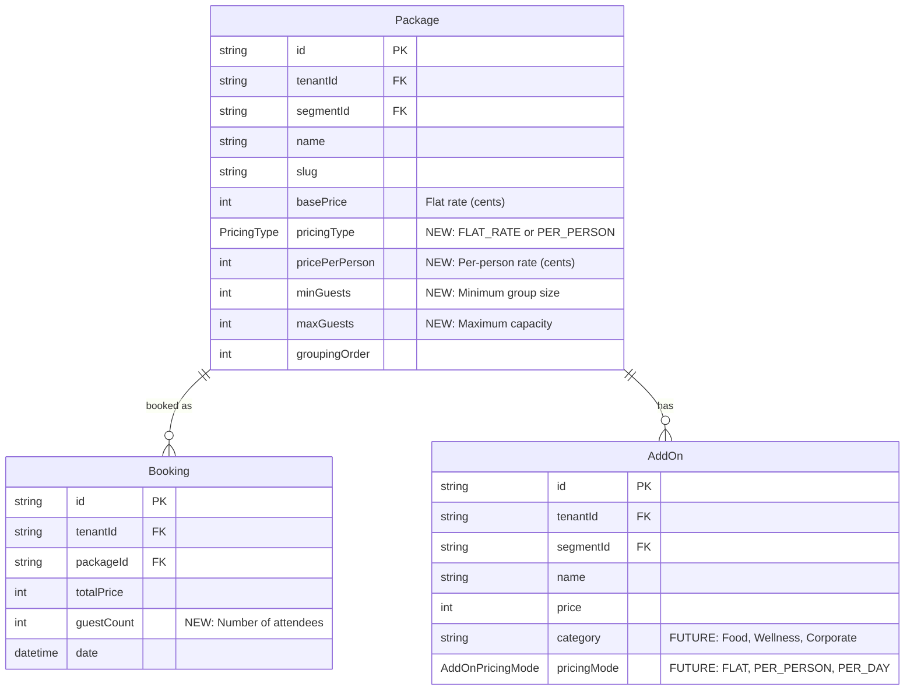

# Little Bit Farm: Corporate Wellness Retreats Tenant Setup

**Created:** 2025-12-29
**Status:** Draft
**Type:** Feature (New Tenant + Schema Enhancement)

## Overview

Set up "Little Bit Farm" as a new tenant offering Corporate Wellness Retreats with per-person pricing. This requires schema enhancements to support per-person pricing models, guest count tracking, and categorized add-ons.

### Business Context

Little Bit Farm offers 3 tiers of corporate wellness retreats:

| Tier | Name                | Price       | Duration                       | Best For                                 |
| ---- | ------------------- | ----------- | ------------------------------ | ---------------------------------------- |
| 1    | The Grounding Reset | $450/person | Half-day (3.5-4 hrs)           | Morale boost, stress reset               |
| 2    | The Team Recharge   | $650/person | Full-day (6-7 hrs)             | **Most Popular** - "real retreat" feel   |
| 3    | The Executive Reset | $950/person | Premium (7-8 hrs + prep/recap) | Leadership teams, Monday-ready decisions |

**Constraints:**

- Group size: 4-10 participants
- Minimum invoice: 6 participants (can host 4, but pricing assumes 6)

---

## Problem Statement

The current MAIS platform uses flat-rate pricing (`Package.basePrice`), but Little Bit Farm requires:

1. **Per-person pricing** - $450/person × 6 guests = $2,700 total
2. **Guest count validation** - Minimum 6, maximum 10
3. **Categorized add-ons** - Food, Wellness, Corporate polish with different pricing modes

### Current Gaps

| Gap                        | Current State           | Required State                  | Priority |
| -------------------------- | ----------------------- | ------------------------------- | -------- |
| No per-person pricing      | `basePrice: Int` (flat) | `pricePerPerson`, `pricingType` | **P0**   |
| No guest count tracking    | Missing on Booking      | `guestCount: Int`               | **P0**   |
| No add-on categories       | Flat list               | `category`, `pricingMode`       | **P1**   |
| No guest count selector UI | Not present             | Stepper with live pricing       | **P1**   |

---

## Proposed Solution

### Phase 1: Schema Enhancement (P0)

Add per-person pricing support to the Package model and guest count to Booking.

```prisma
// server/prisma/schema.prisma

enum PricingType {
  FLAT_RATE     // Default - existing behavior
  PER_PERSON    // Little Bit Farm model
}

model Package {
  // ... existing fields ...

  // NEW: Per-person pricing support
  pricingType    PricingType @default(FLAT_RATE)
  pricePerPerson Int?        // In cents (null for FLAT_RATE)
  minGuests      Int?        // Minimum group size
  maxGuests      Int?        // Maximum capacity
}

model Booking {
  // ... existing fields ...

  // NEW: Guest count tracking
  guestCount     Int?        // Number of attendees
}
```

**Migration Strategy:**

- All new fields are nullable with defaults
- Existing tenants continue using `FLAT_RATE` + `basePrice`
- No breaking changes to existing bookings

### Phase 2: Pricing Logic Updates (P0)

Update price calculation in `server/src/services/commission.service.ts`:

```typescript
function calculatePackagePrice(pkg: Package, guestCount?: number): number {
  if (pkg.pricingType === 'PER_PERSON') {
    if (!guestCount) throw new Error('Guest count required for per-person pricing');
    if (!pkg.pricePerPerson) throw new Error('Per-person price not set');

    const effectiveGuests = Math.max(guestCount, pkg.minGuests ?? 1);
    return pkg.pricePerPerson * effectiveGuests;
  }

  return pkg.basePrice;
}
```

### Phase 3: Chatbot Integration (P0)

Update `server/src/agent/customer/customer-tools.ts`:

1. Add `guestCount` parameter to `book_service` tool
2. Validate guest count against `minGuests`/`maxGuests`
3. Return per-person breakdown in responses

### Phase 4: UI Updates (P1)

Add guest count selector to storefront booking flow:

- Stepper with +/- buttons respecting min/max
- Live price calculation as guest count changes
- Clear breakdown: "$450/person × 6 = $2,700"

### Phase 5: Add-On Categories (P2 - Defer)

For MVP, use price threshold convention:

- Add-ons < $100 are implicitly per-person
- Add-ons ≥ $100 are flat rate

Full schema support (`AddOn.pricingMode`, `AddOn.category`) deferred to v2.

---

## Technical Approach

### Database Migration

**Pattern B (Manual SQL)** for enum creation:

```sql
-- server/prisma/migrations/XX_add_per_person_pricing.sql

-- 1. Create enum
DO $$ BEGIN
  CREATE TYPE "PricingType" AS ENUM ('FLAT_RATE', 'PER_PERSON');
EXCEPTION
  WHEN duplicate_object THEN null;
END $$;

-- 2. Add columns to Package
ALTER TABLE "Package"
  ADD COLUMN IF NOT EXISTS "pricingType" "PricingType" DEFAULT 'FLAT_RATE',
  ADD COLUMN IF NOT EXISTS "pricePerPerson" INTEGER,
  ADD COLUMN IF NOT EXISTS "minGuests" INTEGER,
  ADD COLUMN IF NOT EXISTS "maxGuests" INTEGER;

-- 3. Add guestCount to Booking
ALTER TABLE "Booking"
  ADD COLUMN IF NOT EXISTS "guestCount" INTEGER;
```

Then update `schema.prisma` to match and run `prisma generate`.

### Files to Modify

| File                                                   | Changes                                                        |
| ------------------------------------------------------ | -------------------------------------------------------------- |
| `server/prisma/schema.prisma`                          | Add `PricingType` enum, new Package fields, Booking.guestCount |
| `server/src/services/commission.service.ts`            | Add per-person calculation logic                               |
| `server/src/agent/customer/customer-tools.ts`          | Add guestCount to book_service, update get_services            |
| `packages/contracts/src/dto.ts`                        | Add pricingType, pricePerPerson to PackageDto                  |
| `apps/web/src/components/tenant/TenantLandingPage.tsx` | Display "/person" suffix for PER_PERSON packages               |

### Little Bit Farm Tenant Configuration

```typescript
// Tenant setup
const tenant = {
  name: 'Little Bit Farm',
  slug: 'little-bit-farm',
  businessType: 'WELLNESS',
  tierDisplayNames: {
    tier_1: 'The Grounding Reset',
    tier_2: 'The Team Recharge',
    tier_3: 'The Executive Reset',
  },
};

// Segment
const segment = {
  name: 'Corporate Wellness Retreats',
  slug: 'corporate-wellness',
  heroTitle: 'Reset. Recharge. Return Ready.',
  heroSubtitle: 'Equine-assisted wellness experiences for teams who need air.',
};

// Packages
const packages = [
  {
    name: 'The Grounding Reset',
    slug: 'grounding-reset',
    pricingType: 'PER_PERSON',
    pricePerPerson: 45000, // $450
    minGuests: 6,
    maxGuests: 10,
    groupingOrder: 1,
    description: 'Half-day stress reset with horses, yoga, and PEMF recovery.',
    // Includes: Arrival + Intention Setting, Meet the Horses, Guided Grooming,
    // Private yoga session, PEMF recovery rotations, Rain-plan indoor backup
  },
  {
    name: 'The Team Recharge',
    slug: 'team-recharge',
    pricingType: 'PER_PERSON',
    pricePerPerson: 65000, // $650
    minGuests: 6,
    maxGuests: 10,
    groupingOrder: 2,
    description: 'Full-day retreat with yoga, breathwork, nature reset, and team experience.',
    // Everything in Grounding Reset plus: Yoga + Breathwork (two modalities),
    // Guided Nature Reset, Team Experience choice, Expanded PEMF window
  },
  {
    name: 'The Executive Reset',
    slug: 'executive-reset',
    pricingType: 'PER_PERSON',
    pricePerPerson: 95000, // $950
    minGuests: 6,
    maxGuests: 10,
    groupingOrder: 3,
    description: 'Premium leadership retreat with pre/post support and strategic facilitation.',
    // Everything in Team Recharge plus: Pre-offsite intake (15-20 min call),
    // Leadership in the Herd, Quiet Strategy Block, Post-offsite 1-page recap
  },
];
```

### Add-Ons Configuration

**Food & Hospitality:**
| Add-On | Price | Mode |
|--------|-------|------|
| Arrival Pastry Bar + fruit | $14/person | PER_PERSON |
| Coffee + tea service | $8/person | PER_PERSON |
| Hydration + snack station | $12/person | PER_PERSON |
| Breakfast (continental) | $20/person | PER_PERSON |
| Lunch (boxed) | $28/person | PER_PERSON |
| Lunch (buffet) | $35/person | PER_PERSON |
| Chef-prepared lunch | $55/person | PER_PERSON |
| Private Chef Dinner | From $100/person | PER_PERSON |
| Signature Mocktail Bar | $22/person + $250 setup | HYBRID\* |

**Wellness Upgrades:**
| Add-On | Price | Mode |
|--------|-------|------|
| Extra yoga session | $450 | FLAT |
| Extra breathwork session | $550 | FLAT |
| Guided meditation / sound bath | $650 | FLAT |
| Extended PEMF block | $25/person | PER_PERSON |

**Corporate Polish:**
| Add-On | Price | Mode |
|--------|-------|------|
| Photo recap (30 edited images) | $950 | FLAT |
| Meeting kit | $150 | FLAT |
| Branded welcome gifts (basic) | $35/person | PER_PERSON |
| Branded welcome gifts (premium) | $65/person | PER_PERSON |
| Shuttle coordination | $250 + pass-through | FLAT |

\*HYBRID pricing (per-person + setup) deferred to v2. For MVP, use separate add-ons.

---

## Acceptance Criteria

### P0: MVP for Launch

- [ ] **Schema:** `PricingType` enum added to Prisma schema
- [ ] **Schema:** `Package.pricingType`, `pricePerPerson`, `minGuests`, `maxGuests` fields added
- [ ] **Schema:** `Booking.guestCount` field added
- [ ] **Migration:** Backward-compatible (existing tenants unaffected)
- [ ] **Pricing:** Per-person packages calculate `pricePerPerson × guestCount`
- [ ] **Validation:** Booking fails if `guestCount < minGuests` with clear error
- [ ] **Chatbot:** `book_service` accepts and validates `guestCount` parameter
- [ ] **Chatbot:** `get_services` returns pricing type and guest limits
- [ ] **Tests:** Unit tests for both FLAT_RATE and PER_PERSON calculations
- [ ] **Tenant:** Little Bit Farm created with correct package configuration

### P1: Polish

- [ ] **UI:** Guest count selector on booking flow
- [ ] **UI:** Live price update as guest count changes
- [ ] **UI:** Price display shows "/person" suffix for PER_PERSON packages
- [ ] **Chatbot:** Natural language: "For your group of 6, that would be $2,700 total"

### P2: Future

- [ ] **Schema:** `AddOn.pricingMode` (FLAT, PER_PERSON, PER_DAY)
- [ ] **Schema:** `AddOn.category` for grouping
- [ ] **UI:** Add-ons showcase section type
- [ ] **UI:** Category-grouped add-on selector

---

## Edge Cases

| Scenario                                      | Expected Behavior                             |
| --------------------------------------------- | --------------------------------------------- |
| Book with 4 guests (under 6 minimum)          | Error: "Minimum 6 guests required"            |
| Book with 12 guests (over 10 maximum)         | Error: "Maximum 10 guests allowed"            |
| Guest count changes after quote               | All per-person prices recalculate             |
| Existing FLAT_RATE tenant books               | Works exactly as before (backward compatible) |
| Package has both basePrice and pricePerPerson | Use pricingType to determine which applies    |

---

## Risk Assessment

| Risk                                      | Likelihood | Impact | Mitigation                              |
| ----------------------------------------- | ---------- | ------ | --------------------------------------- |
| Schema migration breaks existing bookings | Low        | High   | All new fields nullable with defaults   |
| Price calculation errors                  | Medium     | High   | Comprehensive unit tests                |
| Chatbot misquotes prices                  | Medium     | Medium | Update prompts, add calculation logging |
| Add-on pricing workaround confuses admins | Medium     | Low    | Document threshold logic, plan v2       |

---

## Implementation Phases

### Phase 1: Schema + Backend (Day 1-2)

1. Create migration SQL for enum and new fields
2. Update Prisma schema
3. Add pricing calculation logic
4. Update customer tools for chatbot
5. Write unit tests

### Phase 2: Tenant Setup (Day 2)

1. Create Little Bit Farm tenant
2. Configure segment and packages
3. Set up add-ons (using workaround pricing)
4. Configure landing page content

### Phase 3: UI Polish (Day 3-4)

1. Add guest count selector component
2. Update price display for per-person
3. Add live pricing calculation
4. E2E test booking flow

### Phase 4: QA + Launch (Day 5)

1. Full booking flow test
2. Chatbot conversation test
3. Edge case validation
4. Go live

---

## Open Questions

1. **Tenant structure:** Should Little Bit Farm be one tenant with multiple segments (Corporate Wellness, [future offerings]), or separate tenants per business line?
   - **Recommendation:** One tenant, multiple segments for simpler management

2. **Minimum vs. invoice minimum:** User said "can host 4, but pricing assumes 6". Should we:
   - Set `minGuests: 4` and calculate based on `max(guestCount, 6)`?
   - Set `minGuests: 6` and reject smaller groups?
   - **Recommendation:** Set `minGuests: 6` for simplicity; they can manually override for special cases

3. **Add-on hybrid pricing:** Mocktail Bar is "$22/person + $250 setup". How to handle?
   - **Recommendation (MVP):** Two separate add-ons: "Mocktail Bar Service ($22/person)" + "Mocktail Bar Setup ($250)"

---

## References

- Current Package model: `server/prisma/schema.prisma:234-286`
- Commission calculation: `server/src/services/commission.service.ts:47-133`
- Customer tools: `server/src/agent/customer/customer-tools.ts`
- Tenant onboarding: `server/src/services/tenant-onboarding.service.ts`
- Landing page schema: `packages/contracts/src/schemas/landing-page.schema.ts`

---

## ERD: Schema Changes



---

🤖 Generated with [Claude Code](https://claude.com/claude-code)
