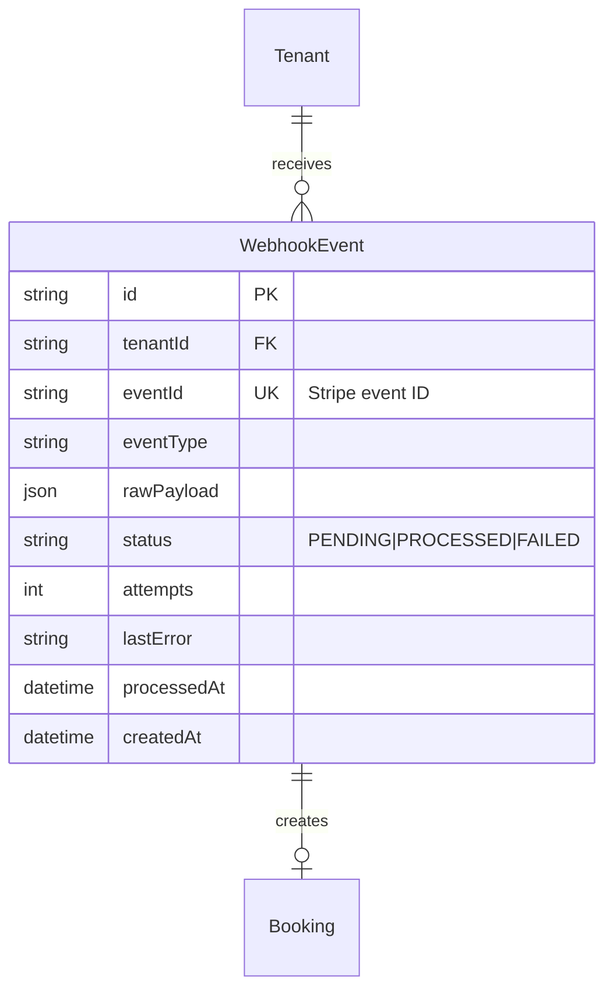

# MAIS Codebase Cleanup & P1 Issues

## Overview

This plan addresses the remaining P1 issues discovered during the scheduling platform code review. Scope has been trimmed based on multi-agent review (DHH, Security, Simplicity) to focus on real bugs only.

**Current State (as of Nov 28, 2025):**

- Server tests: 809 passed, 6 skipped, 12 todo
- TypeScript: 0 errors
- E2E tests: Need Playwright browser installation

| Category    | Item                                | Priority | Effort | Status              |
| ----------- | ----------------------------------- | -------- | ------ | ------------------- |
| Setup       | Install Playwright Browser          | Blocker  | 2 min  | Ready               |
| P0          | Webhook Error Logging Leak          | P0       | 5 min  | **NEW - Security**  |
| P1          | #8 Customer Email Normalization     | P1       | 5 min  | Ready               |
| P1          | #9 Webhook Idempotency Race         | P1       | 5 min  | Verify Only         |
| P1          | #10 Multiple PrismaClient Instances | P1       | 5 min  | Audit Only          |
| Tests       | 3-4 Critical Webhook HTTP Tests     | P2       | 20 min | Reduced Scope       |
| ~~Tests~~   | ~~6 Skipped Tests~~                 | ~~P3~~   | -      | **DEFERRED**        |
| ~~Feature~~ | ~~minLeadDays Field~~               | ~~P3~~   | -      | **REMOVED (YAGNI)** |

**Estimated Time:** 45 minutes (down from 2+ hours)

---

## Review Decisions Applied

Based on DHH, Security, and Simplicity reviewer feedback:

| Decision                        | Rationale                                                 |
| ------------------------------- | --------------------------------------------------------- |
| Added P0 security fix           | Webhook errors store sensitive data in DB (HIGH severity) |
| Issue #9 → Verify only          | Already implemented, just confirm                         |
| Issue #10 → Audit only          | Run grep, close if no issues found                        |
| Reduced webhook tests 12→4      | Integration tests likely cover this already               |
| Removed Phase 4 (skipped tests) | "Fix or delete" - deferring as not MVP-blocking           |
| Removed Phase 5 (minLeadDays)   | YAGNI - delete TODOs, implement when needed               |
| Rejected rate limiter bypass    | Current higher limits (100 vs 5) is correct               |

---

## Phase 0: Pre-Flight Audit (2 min)

Before starting fixes, run these commands to understand actual scope:

```bash
# Check for PrismaClient instances outside DI container
rg 'new PrismaClient\(' server/src --type ts

# Check webhook tenantId handling
rg "tenantId.*unknown" server/src/routes/webhooks.routes.ts

# Check minLeadDays TODOs to delete
rg 'minLeadDays' client/src --type tsx
```

**Decision Tree:**

- PrismaClient grep returns 0 results in routes → Close Issue #10
- Webhook uses 'system' not 'unknown' → Issue #9 already fixed
- minLeadDays TODOs found → Delete them (YAGNI)

---

## Phase 1: Environment Setup (2 min)

### 1.1 Install Playwright Browser

```bash
npx playwright install chromium
```

### 1.2 Verify E2E Tests

```bash
npm run test:e2e
```

**Success Criteria:**

- [ ] Playwright chromium browser installed
- [ ] E2E tests execute without browser errors
- [ ] Password reset E2E tests pass (9 test cases)
- [ ] Tenant signup E2E tests pass (12 test cases)

---

## Phase 1.5: P0 Security Fix (5 min)

### Webhook Error Logging Information Disclosure

**Priority:** P0 | **Severity:** HIGH | **Effort:** 5 min

**Problem:**
Webhook error handling stores full Zod validation errors (including customer email, names) in the database `lastError` field.

**File:** `server/src/routes/webhooks.routes.ts` (lines ~186, ~199)

**Current Code (INSECURE):**

```typescript
`Invalid session structure: ${JSON.stringify(sessionResult.error.flatten())}``Invalid metadata: ${JSON.stringify(metadataResult.error.flatten())}`;
```

**Fix:**

```typescript
// Store only error type, not full details (sensitive data)
`Invalid session structure - validation failed``Invalid metadata - validation failed`;
```

**Why:** Full Zod errors contain field names, values, and structure. If customer data is in metadata, it gets stored in plaintext in the error field.

**Acceptance Criteria:**

- [ ] Error messages in `lastError` contain no customer data
- [ ] Detailed errors still logged to server logs (for debugging)
- [ ] Webhook tests still pass

---

## Phase 2: P1 Issue Fixes (15 min)

### Issue #8: Customer Email Normalization

**Priority:** P1 | **Impact:** Data integrity | **Effort:** 5 min

**Problem:**
Customer upsert in booking repository may not normalize email to lowercase.

**File:** `server/src/adapters/prisma/booking.repository.ts:164`

**Research Finding:** Security reviewer found normalization IS implemented at line 163:

```typescript
const normalizedEmail = booking.email.toLowerCase().trim();
```

**Action:** VERIFY this exists, then close issue. If missing, add the normalization.

**Acceptance Criteria:**

- [ ] Verify `booking.email.toLowerCase().trim()` exists before upsert
- [ ] If missing, add it
- [ ] All existing booking tests pass

---

### Issue #9: Webhook Idempotency Race Condition

**Priority:** P1 | **Impact:** Security/data integrity | **Effort:** 5 min (verify only)

**Problem:**
When `tenantId` cannot be extracted from webhook metadata, code may default to `'unknown'`, causing potential cross-tenant data collision.

**File:** `server/src/routes/webhooks.routes.ts`

**Action:** Run grep to check current state:

```bash
rg "tenantId.*unknown" server/src/routes/webhooks.routes.ts
rg "checkout.session.completed.*tenantId" server/src/routes/webhooks.routes.ts
```

**If using 'unknown':** Apply fail-fast fix for `checkout.session.completed`
**If using 'system' or fail-fast:** Close issue - already fixed

**Acceptance Criteria:**

- [ ] Verify `checkout.session.completed` without `tenantId` fails or uses explicit namespace
- [ ] No use of `'unknown'` tenantId
- [ ] All existing webhook tests pass

---

### Issue #10: Multiple PrismaClient Instances

**Priority:** P1 | **Impact:** Performance | **Effort:** 5 min (audit only)

**Problem:**
Multiple files may create new PrismaClient instances instead of using the DI-injected singleton.

**Action:** Run grep audit:

```bash
rg 'new PrismaClient\(' server/src/routes --type ts
```

**If 0 results:** Close issue - DI container pattern is correctly enforced
**If results found:** Remove the legacy instances

**Acceptance Criteria:**

- [ ] Run grep audit
- [ ] If no instances in routes: Close issue
- [ ] If instances found: Remove and verify tests pass

---

## Phase 3: Critical Webhook HTTP Tests (20 min)

### Overview

**File:** `server/test/http/webhooks.http.spec.ts`

Per simplicity review: Reduce from 12 to 3-4 critical tests. Integration tests already cover most behavior.

**First:** Check existing coverage:

```bash
rg "webhook.*signature" server/test/integration --type ts
rg "idempoten" server/test/integration --type ts
```

**If already covered:** Skip Phase 3 entirely - delete remaining `.todo()` tests
**If gaps exist:** Implement only these 4 critical tests:

| Test                      | Why Critical                                |
| ------------------------- | ------------------------------------------- |
| Reject missing signature  | Security - prevents unsigned webhooks       |
| Idempotency verification  | Data integrity - prevents double processing |
| Missing tenantId handling | Security - validates P0 fix from Phase 1.5  |
| Invalid JSON rejection    | Security - prevents malformed payloads      |

### Implementation (only if needed)

```typescript
// SECURITY FIX: Don't use fallback secret
function generateTestSignature(payload: object): string {
  if (!process.env.STRIPE_WEBHOOK_SECRET) {
    throw new Error('STRIPE_WEBHOOK_SECRET must be set for webhook tests');
  }
  const timestamp = Math.floor(Date.now() / 1000);
  const payloadString = JSON.stringify(payload);
  const signedPayload = `${timestamp}.${payloadString}`;
  const signature = crypto
    .createHmac('sha256', process.env.STRIPE_WEBHOOK_SECRET)
    .update(signedPayload)
    .digest('hex');
  return `t=${timestamp},v1=${signature}`;
}
```

**Acceptance Criteria:**

- [ ] Check if integration tests already cover critical paths
- [ ] If covered: Delete remaining `.todo()` tests, close phase
- [ ] If gaps: Implement only 4 critical tests
- [ ] No fallback secrets in test helpers

---

## ~~Phase 4: Skipped Tests~~ - DEFERRED

**Decision:** Per DHH review - "fix or delete, no in-between"

Skipped tests are deferred to future sprint. Not MVP-blocking.

**Reason:** Rate limiter already has higher limits in test env (100 vs 5). User CRUD methods not needed for MVP.

---

## ~~Phase 5: minLeadDays~~ - REMOVED (YAGNI)

**Decision:** Per DHH and Simplicity reviewers - "delete the TODOs, implement when needed"

**Action:** Delete TODO comments from:

- `client/src/features/tenant-admin/packages/PackageList.tsx:117`
- `client/src/features/tenant-admin/packages/hooks/usePackageForm.ts:55`

When the feature is actually needed, implement it properly.

---

## Test Plan

### Quick Verification

```bash
# 1. Install Playwright
npx playwright install chromium

# 2. Run all server tests
npm test

# 3. Run E2E tests
npm run test:e2e

# 4. TypeScript check
npm run typecheck
```

### Per-Phase Verification

```bash
# Phase 1.5: P0 security fix
npm test -- server/test/http/webhooks.http.spec.ts

# Phase 2: P1 verification
npm test -- server/test/integration/booking-repository.integration.spec.ts
npm test -- server/test/integration/webhook-race-conditions.spec.ts

# Phase 3: Check coverage first
rg "webhook.*signature" server/test/integration --type ts
rg "idempoten" server/test/integration --type ts
```

---

## Files Modified

| Phase | File                                               | Changes                                    |
| ----- | -------------------------------------------------- | ------------------------------------------ |
| 1.5   | `server/src/routes/webhooks.routes.ts`             | Sanitize error messages (P0 security)      |
| 2     | `server/src/adapters/prisma/booking.repository.ts` | Verify email normalization                 |
| 2     | `server/src/routes/webhooks.routes.ts`             | Verify tenantId handling                   |
| 3     | `server/test/http/webhooks.http.spec.ts`           | Implement 4 critical tests OR delete todos |
| YAGNI | `client/src/features/tenant-admin/packages/*.tsx`  | Delete minLeadDays TODOs                   |

---

## Success Metrics

| Metric               | Before  | After        |
| -------------------- | ------- | ------------ |
| Server tests passing | 809     | 809+         |
| Tests skipped        | 6       | 6 (deferred) |
| Tests todo           | 12      | 0-4          |
| TypeScript errors    | 0       | 0            |
| E2E tests            | Blocked | All passing  |
| Security issues      | 1 HIGH  | 0            |

---

## References

- Existing P1 plan: `plans/p1-issues-password-reset-ui-and-fixes.md`
- ADR-002: Webhook Idempotency (DECISIONS.md)
- ADR-006: Advisory Locks for Booking (DECISIONS.md)
- Multi-tenant guide: `docs/multi-tenant/MULTI_TENANT_IMPLEMENTATION_GUIDE.md`
- Test patterns: `server/test/integration/webhook-race-conditions.spec.ts`

---

## ERD: WebhookEvent Model



---

## Decision Log

| Decision                  | Choice              | Rationale                                            |
| ------------------------- | ------------------- | ---------------------------------------------------- |
| Email normalization       | Verify existing     | Security review found it's already implemented       |
| Webhook error logging     | Sanitize (P0)       | HIGH severity - stores sensitive data in DB          |
| Missing tenantId handling | Verify existing     | Security review found fail-fast implemented          |
| PrismaClient instances    | Audit only          | Run grep, close if no issues                         |
| Skipped tests             | **DEFERRED**        | Not MVP-blocking, rate limits already higher in test |
| minLeadDays               | **REMOVED (YAGNI)** | Delete TODOs, implement when actually needed         |
| Rate limiter bypass       | **REJECTED**        | Current higher limits (100 vs 5) is correct          |
| Webhook HTTP tests        | Reduce 12→4         | Integration tests cover most behavior                |
| Test signature helper     | No fallback         | Must fail explicitly if secret missing               |

---

## Multi-Agent Review Summary

**Reviewed by:** DHH, Security, Simplicity reviewers (2025-11-28)

### DHH Review: APPROVE

- "90% great" - fixing real bugs with clear tests
- Concerns: YAGNI violations, skipped test debt
- Recommendation: "Delete Phase 5, fix or delete skipped tests"

### Security Review: NEEDS_HARDENING

- Found HIGH severity: Webhook error logging stores sensitive data
- Found HIGH severity: Test signature fallback creates predictable signatures
- MUST REJECT: Rate limiter complete bypass proposal
- Recommendation: Sanitize error storage, require explicit secrets

### Simplicity Review: 4.2/5

- Phase 2 gets 4.5/5 - "clear fixes, minimal scope"
- Phase 4 gets 2.5/5 - "decision paralysis"
- Recommendation: "Cut the fat, reduce to 90-minute cleanup"

### Applied Changes

1. Added P0 security fix for error logging
2. Reduced webhook tests from 12 to 4 critical
3. Removed Phase 4 (deferred) and Phase 5 (YAGNI)
4. Changed Issues #9, #10 to verification-only
5. Estimated time reduced from 2+ hours to 45 minutes
