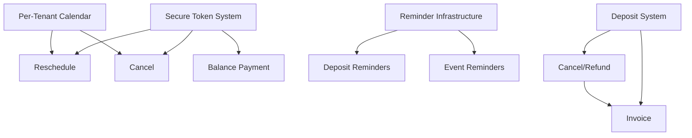

# MVP Gaps Implementation Plan

## Overview

This plan addresses the critical gaps identified in the MAIS MVP Implementation Status Report. The platform is **highly mature** (771+ tests, production-ready architecture) but missing key features required for competitive parity with scheduling platforms like Acuity, Calendly, and HoneyBook.

**Current State:** Multi-tenant booking/scheduling platform with Stripe payments, webhook idempotency, and double-booking prevention fully implemented.

**Gap Summary:**
| Gap | Status | Business Impact | Effort |
|-----|--------|-----------------|--------|
| Invoicing | ❌ MISSING | Can't generate professional invoices | 5-7 days |
| Per-tenant Calendar | ⚠️ PARTIAL | All tenants share one calendar | 3-4 days |
| Deposits/Partial Pay | ❌ MISSING | Full prepay only | 4-5 days |
| Reschedule/Cancel | ❌ MISSING | Customers can't self-manage | 4-5 days |
| Reminder Emails | ❌ MISSING | No automated reminders | 2-3 days |

---

## Problem Statement / Motivation

### Why These Gaps Matter

1. **Invoicing:** Professional services require invoices with line items, invoice numbers, and tax fields. Stripe receipts are insufficient for B2B clients who need invoices for accounting/reimbursement.

2. **Per-tenant Calendar:** Current implementation uses a single `GOOGLE_CALENDAR_ID` environment variable. All tenants share one calendar—a critical security and usability issue.

3. **Deposits:** Wedding/event businesses typically collect 20-50% deposits to secure dates. Full prepay reduces conversion rates for high-value bookings ($1,000+).

4. **Reschedule/Cancel:** Without self-service, customers must contact tenant admins for any booking changes. This increases support burden and reduces customer satisfaction.

5. **Reminders:** No-show rates decrease significantly with automated reminders. Missing this feature puts MAIS at a disadvantage vs. competitors.

---

## Proposed Solution

### Architecture Approach

All features will follow existing MAIS patterns:
- **Multi-tenant isolation:** All queries filtered by `tenantId`
- **Repository pattern:** New repositories implement ports.ts interfaces
- **Transaction safety:** PostgreSQL advisory locks for concurrent operations (ADR-006)
- **Event-driven notifications:** EventEmitter for email triggers
- **Idempotency:** IdempotencyService for payment operations

### Shared Infrastructure (Build First)

Two foundational components enable multiple features:

```
┌─────────────────────────────────────────────────────────────┐
│                    SHARED INFRASTRUCTURE                     │
├─────────────────────────────────────────────────────────────┤
│  Secure Token System          │  Reminder Infrastructure     │
│  ────────────────────         │  ────────────────────────    │
│  • BookingActionToken model   │  • BookingReminder model     │
│  • HMAC-SHA256 token gen      │  • Scheduled job processor   │
│  • Expiry + single-use        │  • Timezone-aware scheduling │
│  • Rate-limited validation    │  • Cancellation handling     │
│                               │                              │
│  Required by:                 │  Required by:                │
│  • Reschedule flow            │  • Deposit balance reminders │
│  • Cancel flow                │  • Event approaching alerts  │
│  • Balance payment links      │  • Balance due notifications │
└─────────────────────────────────────────────────────────────┘
```

---

## Technical Approach

### Phase 1: Foundation (Days 1-5)

#### 1.1 Secure Token System

**New Model:** `server/prisma/schema.prisma`

```prisma
model BookingActionToken {
  id          String   @id @default(cuid())
  tenantId    String
  bookingId   String
  token       String   @unique // SHA-256 hash
  action      String   // 'RESCHEDULE', 'CANCEL', 'PAY_BALANCE'
  expiresAt   DateTime
  usedAt      DateTime?
  ipAddress   String?

  tenant      Tenant   @relation(fields: [tenantId], references: [id], onDelete: Cascade)
  booking     Booking  @relation(fields: [bookingId], references: [id], onDelete: Cascade)

  @@index([token, expiresAt])
  @@index([tenantId, bookingId, action])
}
```

**Service:** `server/src/services/booking-token.service.ts`

```typescript
export class BookingTokenService {
  constructor(
    private readonly prisma: PrismaClient,
    private readonly config: { secretKey: string }
  ) {}

  async generateToken(
    tenantId: string,
    bookingId: string,
    action: 'RESCHEDULE' | 'CANCEL' | 'PAY_BALANCE',
    expiresInDays: number = 7
  ): Promise<string>;

  async validateToken(
    token: string,
    expectedAction: string
  ): Promise<{ tenantId: string; bookingId: string }>;

  async invalidateToken(token: string): Promise<void>;
}
```

#### 1.2 Reminder Infrastructure

**New Model:** `server/prisma/schema.prisma`

```prisma
model BookingReminder {
  id              String    @id @default(cuid())
  tenantId        String
  bookingId       String
  reminderType    ReminderType
  scheduledAt     DateTime
  sentAt          DateTime?
  status          ReminderStatus @default(PENDING)
  failureReason   String?
  recipientEmail  String
  recipientTimezone String?

  tenant          Tenant    @relation(fields: [tenantId], references: [id], onDelete: Cascade)
  booking         Booking   @relation(fields: [bookingId], references: [id], onDelete: Cascade)

  @@index([status, scheduledAt])
  @@index([tenantId, bookingId])
}

enum ReminderType {
  BALANCE_DUE
  EVENT_APPROACHING
  EVENT_DAY
  CONFIRMATION
}

enum ReminderStatus {
  PENDING
  SENT
  FAILED
  CANCELLED
}
```

**Service:** `server/src/services/reminder.service.ts`

```typescript
export class ReminderService {
  async scheduleReminders(tenantId: string, bookingId: string): Promise<void>;
  async cancelReminders(tenantId: string, bookingId: string): Promise<void>;
  async processReminderQueue(): Promise<void>; // Cron job
  async rescheduleReminders(tenantId: string, bookingId: string, newDate: Date): Promise<void>;
}
```

---

### Phase 2: Core Features (Days 6-15)

#### 2.1 Per-Tenant Google Calendar

**Schema Addition:** Reuse existing `Tenant.secrets` JSON field (follows Stripe pattern)

```typescript
// Structure within Tenant.secrets JSON:
{
  "stripe": { "ciphertext": "...", "iv": "...", "authTag": "..." },
  "googleCalendar": {
    "ciphertext": "...",  // Encrypted: { calendarId, serviceAccountJson }
    "iv": "...",
    "authTag": "..."
  }
}
```

**New Repository:** `server/src/adapters/prisma/tenant-calendar.repository.ts`

```typescript
export class TenantCalendarRepository {
  constructor(
    private readonly prisma: PrismaClient,
    private readonly encryptionService: EncryptionService
  ) {}

  async getCalendarConfig(tenantId: string): Promise<{
    calendarId: string;
    serviceAccountJson: Record<string, unknown>;
  } | null>;

  async saveCalendarConfig(tenantId: string, config: CalendarConfig): Promise<void>;
  async hasCalendarConfig(tenantId: string): Promise<boolean>;
}
```

**Modified Adapter:** `server/src/adapters/google-calendar-sync.adapter.ts`

```typescript
// Change constructor to accept per-tenant config loader
constructor(config: {
  // Global fallback (from env vars)
  calendarId?: string;
  serviceAccountJsonBase64?: string;
  // Per-tenant override
  getTenantConfig?: (tenantId: string) => Promise<TenantCalendarConfig | null>;
}) {}
```

**New Routes:** `server/src/routes/tenant-admin-calendar.routes.ts`

- `GET /v1/tenant-admin/calendar/config` - Get config status
- `POST /v1/tenant-admin/calendar/config` - Save calendar config
- `DELETE /v1/tenant-admin/calendar/config` - Remove config

#### 2.2 Deposit System

**New Models:** `server/prisma/schema.prisma`

```prisma
model DepositPolicy {
  id                    String   @id @default(cuid())
  tenantId              String
  name                  String
  depositType           DepositType // PERCENTAGE, FIXED_AMOUNT
  depositAmount         Int?     // For FIXED_AMOUNT (cents)
  depositPercent        Decimal? @db.Decimal(5, 2) // For PERCENTAGE
  balanceDueOffsetDays  Int      @default(30) // Days before event
  isNonRefundable       Boolean  @default(true)
  autoReleaseAfterDays  Int      @default(14) // Grace period after due date

  tenant                Tenant   @relation(fields: [tenantId], references: [id], onDelete: Cascade)
  bookings              Booking[]

  @@unique([tenantId, name])
  @@index([tenantId])
}

enum DepositType {
  PERCENTAGE
  FIXED_AMOUNT
  NONE
}

// Add to existing Booking model:
model Booking {
  // ... existing fields ...

  // Deposit fields
  depositPolicyId       String?
  depositAmount         Int?
  depositPaidAt         DateTime?
  balanceAmount         Int?
  balanceDueDate        DateTime?
  balancePaidAt         DateTime?

  depositPolicy         DepositPolicy? @relation(fields: [depositPolicyId], references: [id])
}
```

**Service:** `server/src/services/deposit.service.ts`

```typescript
export class DepositService {
  async calculateDeposit(
    tenantId: string,
    totalAmount: number,
    policyId?: string
  ): Promise<{ depositAmount: number; balanceAmount: number; balanceDueDate: Date }>;

  async createDepositCheckout(
    tenantId: string,
    bookingId: string
  ): Promise<{ checkoutUrl: string }>;

  async createBalanceCheckout(
    tenantId: string,
    bookingId: string
  ): Promise<{ checkoutUrl: string }>;

  async processOverdueBalances(): Promise<void>; // Cron job
}
```

---

### Phase 3: Self-Service (Days 16-22)

#### 3.1 Cancel/Refund System

**New Model:** `server/prisma/schema.prisma`

```prisma
model BookingCancellation {
  id                String        @id @default(cuid())
  tenantId          String
  bookingId         String        @unique
  cancelledBy       CancelledBy
  cancelledAt       DateTime      @default(now())
  reason            String?

  // Refund tracking
  refundStatus      RefundStatus  @default(PENDING)
  refundAmount      Int           // Amount to refund (may exclude deposit)
  refundedAmount    Int           @default(0)
  refundAttempts    Int           @default(0)
  lastRefundError   String?
  refundCompletedAt DateTime?
  stripeRefundId    String?

  tenant            Tenant        @relation(fields: [tenantId], references: [id], onDelete: Cascade)
  booking           Booking       @relation(fields: [bookingId], references: [id], onDelete: Cascade)

  @@index([refundStatus])
  @@index([tenantId, cancelledAt])
}

enum CancelledBy {
  CUSTOMER
  TENANT
  ADMIN
  SYSTEM
}

enum RefundStatus {
  PENDING
  PROCESSING
  COMPLETED
  PARTIAL
  FAILED
  NOT_REQUIRED
}
```

**Service:** `server/src/services/cancellation.service.ts`

```typescript
export class CancellationService {
  /**
   * 3-phase cancellation for data integrity:
   * 1. Mark booking CANCELED (always succeeds)
   * 2. Create cancellation record
   * 3. Queue refund job (async, retryable)
   */
  async cancelBooking(
    tenantId: string,
    bookingId: string,
    cancelledBy: CancelledBy,
    reason?: string
  ): Promise<BookingCancellation>;

  async processRefundQueue(): Promise<void>; // Cron job

  async calculateRefundAmount(
    tenantId: string,
    bookingId: string
  ): Promise<{ refundAmount: number; retainedAmount: number; reason: string }>;
}
```

#### 3.2 Reschedule System

**Service:** `server/src/services/reschedule.service.ts`

```typescript
export class RescheduleService {
  /**
   * Reschedule with advisory lock (reuses ADR-006 pattern)
   */
  async rescheduleBooking(
    tenantId: string,
    bookingId: string,
    newDate: string,
    token: string
  ): Promise<Booking>;

  async getAvailableDatesForReschedule(
    tenantId: string,
    bookingId: string,
    monthOffset: number
  ): Promise<string[]>;

  async calculateRescheduleFee(
    tenantId: string,
    bookingId: string,
    newDate: string
  ): Promise<{ priceDifference: number; rescheduleFee: number }>;
}
```

**New Routes:** `server/src/routes/public-booking-management.routes.ts`

- `GET /v1/public/bookings/manage?token=xxx` - Get booking for management
- `POST /v1/public/bookings/:id/cancel` - Cancel with token
- `POST /v1/public/bookings/:id/reschedule` - Reschedule with token
- `GET /v1/public/bookings/:id/available-dates` - Get available dates

**Client Pages:**

- `client/src/pages/ManageBooking.tsx` - Booking management dashboard
- `client/src/features/booking/RescheduleFlow.tsx` - Date picker + confirmation
- `client/src/features/booking/CancelFlow.tsx` - Cancellation confirmation

---

### Phase 4: Invoicing (Days 23-29)

#### 4.1 Invoice Model

**New Models:** `server/prisma/schema.prisma`

```prisma
model Invoice {
  id              String        @id @default(cuid())
  tenantId        String
  bookingId       String?       @unique
  customerId      String?

  // Invoice metadata
  invoiceNumber   String        // INV-{tenant}-{YYYYMMDD}-{counter}
  status          InvoiceStatus @default(DRAFT)
  issueDate       DateTime?
  dueDate         DateTime?
  paidDate        DateTime?

  // Amounts (cents)
  subtotal        Int           // Sum of line items
  taxRate         Decimal?      @db.Decimal(5, 2)
  taxAmount       Int           @default(0)
  discountAmount  Int           @default(0)
  commissionAmount Int          // Platform commission
  total           Int           // subtotal + tax - discount

  // Notes
  notes           String?       @db.Text
  termsConditions String?       @db.Text

  createdAt       DateTime      @default(now())
  updatedAt       DateTime      @updatedAt

  tenant          Tenant        @relation(fields: [tenantId], references: [id], onDelete: Cascade)
  booking         Booking?      @relation(fields: [bookingId], references: [id])
  customer        Customer?     @relation(fields: [customerId], references: [id])
  lineItems       InvoiceLineItem[]

  @@unique([tenantId, invoiceNumber])
  @@index([tenantId, status])
  @@index([tenantId, issueDate])
}

model InvoiceLineItem {
  id          String  @id @default(cuid())
  invoiceId   String

  description String
  quantity    Int
  unitPrice   Int     // cents
  amount      Int     // quantity * unitPrice

  invoice     Invoice @relation(fields: [invoiceId], references: [id], onDelete: Cascade)

  @@index([invoiceId])
}

enum InvoiceStatus {
  DRAFT
  ISSUED
  SENT
  PAID
  REFUNDED
  PARTIAL
  VOID
}
```

**Service:** `server/src/services/invoice.service.ts`

```typescript
export class InvoiceService {
  async generateFromBooking(
    tenantId: string,
    bookingId: string
  ): Promise<Invoice>;

  async updateStatus(
    tenantId: string,
    invoiceId: string,
    status: InvoiceStatus
  ): Promise<Invoice>;

  async generatePDF(
    tenantId: string,
    invoiceId: string
  ): Promise<Buffer>;

  async sendInvoiceEmail(
    tenantId: string,
    invoiceId: string
  ): Promise<void>;

  async handleRefund(
    tenantId: string,
    invoiceId: string,
    refundAmount: number
  ): Promise<Invoice>;
}
```

**New Routes:**

- `GET /v1/tenant-admin/invoices` - List invoices
- `GET /v1/tenant-admin/invoices/:id` - Get invoice details
- `POST /v1/tenant-admin/invoices/:bookingId/generate` - Generate invoice
- `GET /v1/tenant-admin/invoices/:id/pdf` - Download PDF
- `POST /v1/tenant-admin/invoices/:id/send` - Send to customer

---

## Acceptance Criteria

### Phase 1: Foundation

- [ ] **Secure Token System**
  - [ ] Token generation with HMAC-SHA256
  - [ ] Token validation with expiry check
  - [ ] Single-use enforcement (mark `usedAt` on validation)
  - [ ] Rate limiting: max 10 validations/minute per IP
  - [ ] Unit tests: token generation, validation, expiry, replay prevention

- [ ] **Reminder Infrastructure**
  - [ ] Schedule reminders on booking confirmation
  - [ ] Process reminder queue (cron job)
  - [ ] Cancel reminders on booking cancellation
  - [ ] Timezone-aware scheduling
  - [ ] Unit tests: scheduling, cancellation, timezone handling

### Phase 2: Core Features

- [ ] **Per-Tenant Calendar**
  - [ ] Save/load encrypted calendar config per tenant
  - [ ] Calendar sync uses tenant-specific credentials
  - [ ] Fallback to global config if tenant config missing
  - [ ] OAuth token refresh on 401
  - [ ] Admin UI for calendar configuration
  - [ ] E2E test: configure calendar, create booking, verify event created

- [ ] **Deposit System**
  - [ ] Create booking with deposit-only checkout
  - [ ] Calculate balance and due date
  - [ ] Send balance due reminder (7 days before)
  - [ ] Process balance payment
  - [ ] Auto-cancel after grace period
  - [ ] E2E test: full deposit-to-balance flow

### Phase 3: Self-Service

- [ ] **Cancel/Refund**
  - [ ] 3-phase cancellation (status → record → refund queue)
  - [ ] Full refund processing
  - [ ] Partial refund (retain deposit)
  - [ ] Refund retry on failure
  - [ ] Cancel reminders on cancellation
  - [ ] Delete calendar event on cancellation
  - [ ] E2E test: cancel booking, verify refund, verify calendar deleted

- [ ] **Reschedule**
  - [ ] Generate secure reschedule token
  - [ ] Validate token and show date picker
  - [ ] Advisory lock on new date (ADR-006)
  - [ ] Update booking date
  - [ ] Sync calendar event to new date
  - [ ] Reschedule reminders
  - [ ] E2E test: reschedule flow, race condition test

### Phase 4: Invoicing

- [ ] **Invoice Generation**
  - [ ] Auto-generate on payment completion
  - [ ] Unique invoice numbers
  - [ ] Line items from booking + add-ons
  - [ ] Tax calculation (if configured)
  - [ ] Commission breakdown

- [ ] **Invoice Management**
  - [ ] Status updates (DRAFT → ISSUED → PAID)
  - [ ] Handle refunds (update status to REFUNDED/PARTIAL)
  - [ ] PDF generation
  - [ ] Email invoice to customer

---

## Dependencies & Prerequisites

### Development Dependencies



### External Dependencies

| Dependency | Purpose | Status |
|------------|---------|--------|
| Stripe SDK | Refunds, checkout sessions | ✅ Installed |
| Postmark | Email delivery | ✅ Configured |
| Google Calendar API | Event sync | ✅ Adapter exists |
| `luxon` | Timezone handling | ❌ Need to install |
| `pdfkit` or `puppeteer` | Invoice PDF generation | ❌ Need to install |
| `node-cron` | Scheduled jobs | ❌ Need to install |

### Database Migrations

Run in order:
1. `20251202_add_booking_action_tokens.sql`
2. `20251202_add_booking_reminders.sql`
3. `20251203_add_deposit_policy.sql`
4. `20251203_add_booking_deposit_fields.sql`
5. `20251204_add_booking_cancellation.sql`
6. `20251205_add_invoice.sql`

---

## Risk Analysis & Mitigation

| Risk | Severity | Mitigation |
|------|----------|------------|
| Refund fails after booking cancelled | CRITICAL | 3-phase cancellation with async refund queue |
| Race condition on reschedule | HIGH | Reuse ADR-006 advisory locks |
| Calendar sync quota exceeded | MEDIUM | Implement sync queue with rate limiting |
| Token replay attack | MEDIUM | Single-use tokens, IP logging |
| Deposit paid, balance never paid | MEDIUM | Auto-cancel after grace period |
| Timezone calculation errors | LOW | Use `luxon` library, store customer timezone |

---

## ERD: New Models

```mermaid
erDiagram
    Tenant ||--o{ BookingActionToken : has
    Tenant ||--o{ BookingReminder : has
    Tenant ||--o{ DepositPolicy : has
    Tenant ||--o{ BookingCancellation : has
    Tenant ||--o{ Invoice : has

    Booking ||--o| BookingActionToken : has
    Booking ||--o{ BookingReminder : has
    Booking ||--o| DepositPolicy : uses
    Booking ||--o| BookingCancellation : has
    Booking ||--o| Invoice : has

    Invoice ||--o{ InvoiceLineItem : contains

    BookingActionToken {
        string id PK
        string tenantId FK
        string bookingId FK
        string token UK
        string action
        datetime expiresAt
        datetime usedAt
    }

    BookingReminder {
        string id PK
        string tenantId FK
        string bookingId FK
        string reminderType
        datetime scheduledAt
        string status
    }

    DepositPolicy {
        string id PK
        string tenantId FK
        string name
        string depositType
        int depositAmount
        decimal depositPercent
        int balanceDueOffsetDays
    }

    BookingCancellation {
        string id PK
        string tenantId FK
        string bookingId FK UK
        string cancelledBy
        string refundStatus
        int refundAmount
        string stripeRefundId
    }

    Invoice {
        string id PK
        string tenantId FK
        string bookingId FK UK
        string invoiceNumber UK
        string status
        int subtotal
        int taxAmount
        int total
    }

    InvoiceLineItem {
        string id PK
        string invoiceId FK
        string description
        int quantity
        int unitPrice
        int amount
    }
```

---

## Success Metrics

| Metric | Target | Measurement |
|--------|--------|-------------|
| Invoice generation | 100% of paid bookings | Count invoices vs. paid bookings |
| Calendar sync success | >95% | Track `calendarSyncStatus` on bookings |
| Self-service cancellation | >80% via link | Track `cancelledBy` = CUSTOMER |
| Reminder delivery | >98% | Track reminder status = SENT |
| Refund completion | <5min average | Time from cancellation to refund |
| Balance collection | >90% before due date | Track `balancePaidAt` vs. `balanceDueDate` |

---

## References & Research

### Internal References

- `server/src/services/booking.service.ts` - Existing booking patterns
- `server/src/adapters/stripe.adapter.ts:187-225` - Refund implementation
- `server/src/adapters/postmark.adapter.ts` - Email patterns
- `server/src/adapters/google-calendar-sync.adapter.ts` - Calendar sync
- `server/src/lib/encryption.service.ts` - Secrets encryption
- `ARCHITECTURE.md:144-210` - Advisory lock documentation (ADR-006)
- `DECISIONS.md` - Architectural decision records

### External References

- [Stripe Refunds API](https://stripe.com/docs/api/refunds)
- [Google Calendar API v3](https://developers.google.com/calendar/api/v3/reference)
- [Luxon Timezone Handling](https://moment.github.io/luxon/#/zones)
- [PDFKit Documentation](https://pdfkit.org/)

### Related Issues

- MVP Implementation Status Report (this plan)
- `plans/scheduling-platform-acuity-alternative.md` - Original scheduling spec

---

## Timeline Estimate

| Phase | Duration | Team |
|-------|----------|------|
| Phase 1: Foundation | 5 days | 1 engineer |
| Phase 2: Core Features | 10 days | 2 engineers (parallel) |
| Phase 3: Self-Service | 7 days | 1 engineer |
| Phase 4: Invoicing | 7 days | 1 engineer |
| **Total** | **~29 days** | **2 engineers** |

Add 30% buffer for testing and iteration: **~38 days total**

---

🤖 Generated with [Claude Code](https://claude.ai/code)
