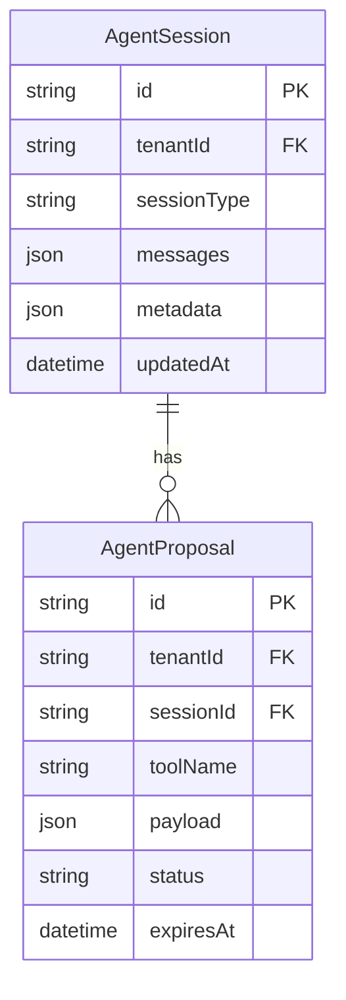

# PR #23 Customer Chatbot Code Review Fixes

## Overview

This plan addresses issues identified in the multi-agent code review of the customer chatbot implementation. After review by DHH, Kieran (TypeScript), and Code Simplicity reviewers, we've adopted a **minimal approach** that focuses on real problems with proven impact.

**Branch:** `feat/customer-chatbot`
**Overall Assessment:** B+ (Strong with Actionable Improvements)
**Approach:** Minimal - Ship only proven fixes, defer theoretical improvements

---

## Review Synthesis

Three reviewers analyzed the original plan:

| Reviewer       | Verdict              | Key Insight                                    |
| -------------- | -------------------- | ---------------------------------------------- |
| **DHH**        | APPROVE WITH CHANGES | "The executor already prevents double-booking" |
| **Kieran**     | APPROVE WITH CHANGES | Type safety improvements needed                |
| **Simplicity** | REQUEST CHANGES      | 426 lines unnecessary, -16 lines achievable    |

### Key Decision: TOCTOU Locks Deferred

The original plan proposed adding advisory locks in the tool phase (P1-1, P1-2). All three reviewers challenged this:

- **DHH:** "The executor already has the lock. This is double-locking."
- **Simplicity:** "The 'race' is actually correct behavior - dates can legitimately change during user interaction."
- **Consensus:** The current architecture is correct. If a customer sees "available" but the date gets booked before confirmation, "Sorry, just booked" is appropriate UX.

---

## Proposed Solution (Minimal)

Fix only issues with proven impact. Net result: **-16 lines of code, +50ms faster responses**.

| Fix                      | Lines   | Impact                    |
| ------------------------ | ------- | ------------------------- |
| P1-3: API Key Validation | +8      | Prevents cryptic failures |
| P1-4: Cleanup Scheduler  | +3      | Prevents DB bloat         |
| P2-8→P1: Remove Helpers  | -20     | Reduces indirection       |
| P2-1: Parallel Queries   | -2      | +30-50ms faster           |
| P2-2: Join Optimization  | -5      | +10-30ms faster           |
| **Total**                | **-16** | **Simpler + Faster**      |

---

## Technical Approach

### Architecture Context

The customer chatbot uses a **Proposal/Executor Pattern**:

1. **Phase 1 (Tools):** AI tools propose actions (e.g., `book_service` creates a proposal)
2. **Phase 2 (Executor):** Customer confirms → executor validates and executes with advisory lock

**Key Files:**

- `server/src/agent/customer/customer-orchestrator.ts` - Session management, AI orchestration
- `server/src/agent/customer/customer-tools.ts` - 4 tools: check_availability, get_packages, book_service, get_business_info
- `server/src/agent/customer/customer-booking-executor.ts` - Booking execution with advisory locks (line 109)
- `server/src/routes/public-customer-chat.routes.ts` - API routes
- `server/src/jobs/cleanup.ts` - Session cleanup scheduler

**Why Executor Lock is Sufficient:** The executor at `customer-booking-executor.ts:109` already acquires an advisory lock before creating bookings. This prevents double-booking at the critical moment. Adding locks in the tool phase would be redundant.

---

## Implementation Phases

### Phase 1: Critical Fixes (Ship Immediately)

#### P1-1: Add API Key Validation

**File:** `server/src/agent/customer/customer-orchestrator.ts:137-139`

**Problem:** No validation if `ANTHROPIC_API_KEY` is missing. Cryptic errors occur on first API call.

**Solution:** Validate API key in constructor with clear error message.

```typescript
// customer-orchestrator.ts - constructor

constructor(private readonly prisma: PrismaClient) {
  const apiKey = process.env.ANTHROPIC_API_KEY;

  if (!apiKey) {
    throw new Error(
      'ANTHROPIC_API_KEY is required for customer chat. ' +
      'Set it in your environment or disable customer chat.'
    );
  }

  if (!apiKey.startsWith('sk-ant-')) {
    logger.warn(
      { keyPrefix: apiKey.substring(0, 10) },
      'ANTHROPIC_API_KEY has unexpected format (expected sk-ant-...)'
    );
  }

  this.anthropic = new Anthropic({
    apiKey,
    timeout: 30 * 1000, // 30 second timeout (P3-3 fix)
    maxRetries: 2,
  });
}
```

**Acceptance Criteria:**

- [ ] Server fails to start with clear error if `ANTHROPIC_API_KEY` missing
- [ ] Warning logged if API key format is unexpected
- [ ] Timeout configured to 30 seconds

---

#### P1-2: Start Cleanup Scheduler

**File:** `server/src/routes/index.ts` (around line 691)

**Problem:** `startCleanupScheduler()` from `server/src/jobs/cleanup.ts` is never called. Sessions will accumulate indefinitely.

**Solution:** Add scheduler startup after registering customer chat routes.

```typescript
// routes/index.ts - after customer chat routes registration

import { startCleanupScheduler } from '../jobs/cleanup';

// ... existing route registration ...

// Start cleanup scheduler for customer sessions
const stopCleanup = startCleanupScheduler(prismaClient);
logger.info('✅ Customer session cleanup scheduler started (runs every 24h)');

// Graceful shutdown
process.on('SIGTERM', () => {
  stopCleanup();
  logger.info('Cleanup scheduler stopped');
});
```

**Acceptance Criteria:**

- [ ] Cleanup scheduler starts when server starts
- [ ] Cleanup runs immediately on startup, then every 24 hours
- [ ] Scheduler stops gracefully on SIGTERM

---

#### P1-3: Remove Redundant Helper Functions (Promoted from P2-8)

**File:** `server/src/routes/public-customer-chat.routes.ts:34-48`

**Problem:** Unnecessary abstraction with `getTenantId()` and `isChatEnabled()` wrappers.

**Solution:** Inline simple operations.

```typescript
// BEFORE
const getTenantId = (req: Request): string | null => req.tenantId ?? null;
const tenantId = getTenantId(req);

// AFTER
const tenantId = req.tenantId ?? null;
```

**Acceptance Criteria:**

- [ ] `getTenantId()` wrapper removed (inline `req.tenantId ?? null`)
- [ ] `isChatEnabled()` inlined or simplified
- [ ] ~20 lines of code removed

---

### Phase 2: Performance Optimizations (Fast Follow)

#### P2-1: Parallelize Availability Queries

**File:** `server/src/agent/customer/customer-tools.ts:177-197`

**Problem:** Sequential queries add +20-50ms latency per call.

**Solution:** Use `Promise.all()` for parallel queries.

```typescript
// customer-tools.ts - check_availability tool

// BEFORE (sequential)
const bookedDates = await prisma.booking.findMany({...});
const blackoutDates = await prisma.blackoutDate.findMany({...});

// AFTER (parallel)
const [bookedDates, blackoutDates] = await Promise.all([
  prisma.booking.findMany({
    where: {
      tenantId,
      date: { gte: startDate, lte: endDate },
      status: { notIn: ['CANCELED', 'REFUNDED'] },
    },
    select: { date: true },
  }),
  prisma.blackoutDate.findMany({
    where: {
      tenantId,
      date: { gte: startDate, lte: endDate },
    },
    select: { date: true },
  }),
]);
```

**Acceptance Criteria:**

- [ ] Both queries execute in parallel
- [ ] Response time reduced by 20-50ms

---

#### P2-2: Optimize getSession with Join

**File:** `server/src/agent/customer/customer-orchestrator.ts:208-238`

**Problem:** Duplicate tenant query adds +10-30ms per message.

**Solution:** Use Prisma `include` for single query.

```typescript
// customer-orchestrator.ts - getSession method

async getSession(tenantId: string, sessionId: string): Promise<CustomerSessionState | null> {
  const session = await this.prisma.agentSession.findFirst({
    where: {
      id: sessionId,
      tenantId,
      sessionType: 'CUSTOMER',
    },
    include: {
      tenant: {
        select: { name: true, chatEnabled: true },
      },
    },
  });

  if (!session) return null;

  // No separate tenant query needed
  return this.transformToSessionState(session, session.tenant);
}
```

**Acceptance Criteria:**

- [ ] Single query fetches session + tenant
- [ ] Response time reduced by 10-30ms

---

### Phase 3: Deferred (No Evidence of Need)

The following items were identified in the original review but **deferred** based on reviewer consensus:

| Item                    | Original Priority | Reason Deferred                                          |
| ----------------------- | ----------------- | -------------------------------------------------------- |
| Session Creation Lock   | P1-1              | No evidence of duplicate sessions in production          |
| Availability Check Lock | P1-2              | Executor already has advisory lock (line 109)            |
| IP Binding              | P2-3              | Security theater - IPs change frequently (mobile, VPN)   |
| Timing Attack Fix       | P2-4              | Requires knowing tenant ID + proposal UUID - theoretical |
| Confirmation Code Retry | P2-5              | 62^8 = 218 trillion combinations - collision impossible  |
| Error Standardization   | P2-6, P2-7        | Current errors work fine, defer to API versioning        |
| All P3 Items            | P3                | No performance metrics showing bottlenecks               |

**Re-evaluate if:** Production logs show evidence of the issues these fixes address.

---

## Acceptance Criteria

### Phase 1 Completion Criteria

- [ ] Clear error message if `ANTHROPIC_API_KEY` missing
- [ ] Cleanup scheduler running and logging
- [ ] Redundant helper functions removed (~20 lines)
- [ ] `npm run typecheck` passes
- [ ] `npm test` passes

### Phase 2 Completion Criteria

- [ ] Both availability queries run in parallel
- [ ] Session fetch includes tenant data (single query)
- [ ] Response time reduced by 30-50ms

### Quality Gates

- [ ] `npm run typecheck` passes
- [ ] `npm test` passes (all 771+ tests)
- [ ] No new eslint warnings

---

## Dependencies & Prerequisites

### Required Before Starting

- [ ] Access to `feat/customer-chatbot` branch
- [ ] Local PostgreSQL with test database
- [ ] `ANTHROPIC_API_KEY` set (for manual testing)

### External Dependencies

- Anthropic API (for chat functionality)
- PostgreSQL (for advisory locks)

### Breaking Changes

- **P2-8:** Removing helper functions is internal refactoring (no API changes)
- **All P1:** No breaking changes to public API

---

## Risk Analysis & Mitigation

| Risk                  | Likelihood | Impact | Mitigation                             |
| --------------------- | ---------- | ------ | -------------------------------------- |
| API key format change | Low        | Low    | Warn on unexpected format, don't fail  |
| Cleanup job failure   | Low        | Low    | Jobs are idempotent, retry on next run |

### Rollback Plan

These are low-risk changes. If issues arise:

1. Revert commit with `git revert <commit-hash>`

---

## Success Metrics

### Before Deployment

- [ ] `npm run typecheck` passes
- [ ] `npm test` passes (all 771+ tests)
- [ ] Manual test: remove `ANTHROPIC_API_KEY` → clear error on startup

### After Deployment (7-day monitoring)

- [ ] Database growth stable (cleanup working)
- [ ] Response times improved by 30-50ms

---

## References & Research

### Internal References

- Advisory lock pattern: `server/src/agent/customer/customer-booking-executor.ts:54-65`
- Transaction pattern: `server/src/adapters/prisma/booking.repository.ts:170-320`
- Test retry helpers: `server/test/helpers/retry.ts`
- Sanitization: `server/src/lib/sanitization.ts:35-37`

### External References

- [Prisma Interactive Transactions](https://www.prisma.io/docs/concepts/components/prisma-client/transactions)
- [PostgreSQL Advisory Locks](https://www.postgresql.org/docs/current/explicit-locking.html#ADVISORY-LOCKS)
- [TOCTOU Race Conditions](https://en.wikipedia.org/wiki/Time-of-check_to_time-of-use)

### Related Work

- PR #23: Customer chatbot implementation
- ADR-006: Advisory locks vs SERIALIZABLE isolation
- Prevention strategy: `docs/solutions/PREVENTION-STRATEGIES-INDEX.md`

---

## ERD Changes

No schema changes required for P1 fixes. P3-1 adds an index:



---

## Implementation Checklist

### Phase 1: Critical Fixes (Ship Immediately)

- [ ] P1-1: API key validation in constructor
- [ ] P1-2: Start cleanup scheduler in routes/index.ts
- [ ] P1-3: Remove redundant helper functions
- [ ] Run `npm test`
- [ ] Run `npm run typecheck`
- [ ] Commit: `fix(chat): P1 code review fixes - API validation, cleanup scheduler, remove helpers`

### Phase 2: Performance Optimizations (Fast Follow)

- [ ] P2-1: Parallelize availability queries with Promise.all()
- [ ] P2-2: Optimize getSession with Prisma include
- [ ] Run `npm test`
- [ ] Commit: `perf(chat): parallelize queries, optimize session fetch`

### Verification

- [ ] Manual test: Start server without `ANTHROPIC_API_KEY` → see clear error
- [ ] Check logs for: "Customer session cleanup scheduler started"
- [ ] Response time baseline before/after Phase 2
