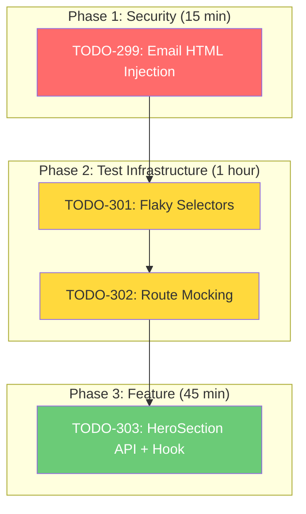

# 📋 Phased Plan: Resolve All Pending TODOs

> **Revision 2** - Updated based on multi-agent review feedback
> - Removed TODO-300 (over-engineering for simple CRUD)
> - Simplified TODO-303 (shared hook approach per user preference)
> - Verified all TODOs still pending as of Dec 6, 2025

## Overview

This plan addresses **4 pending TODOs** (299, 301, 302, 303) identified during the early-access feature code review. TODO-300 was removed as it violates YAGNI (single upsert operation doesn't need service layer).

**Total Estimated Effort:** ~1.5 hours
**Priority Distribution:** 1 P1 (Security), 3 P2 (Testing/Feature)

---

## Problem Statement

After implementing the early-access waitlist feature, code review identified several issues:

1. **Security Risk (P1):** Potential HTML injection in email templates
2. **Architecture Violations (P2):** Direct Prisma usage bypassing service layer
3. **Test Flakiness (P2):** Duplicate forms causing E2E selector ambiguity
4. **Lost Signups (P2):** HeroSection form doesn't call API (mock-only)

---

## Dependency Graph



> **Note:** TODO-300 (Service Layer) removed per review feedback - YAGNI for single upsert operation

---

## Phase 1: P1 Security Fix

### TODO-299: Email Template HTML Injection Risk

**Priority:** P1 (Critical)
**Effort:** S (15 minutes)
**Risk:** High - Blocks production deployment

#### Problem

The early-access notification email interpolates user-provided email addresses into HTML templates. While `sanitizePlainText()` is applied, additional verification is needed.

#### Current Code (`server/src/routes/auth.routes.ts:~920-943`)

```typescript
const sanitizedEmail = sanitizePlainText(normalizedEmail);
// ...
const htmlBody = `
  <p>New early access request from: ${sanitizedEmail}</p>
`;
```

#### Implementation Steps

- [ ] **Verify sanitization coverage** (`server/src/lib/sanitization.ts`)
  - Confirm `validator.escape()` is used for HTML context
  - Check that it handles: `<`, `>`, `&`, `"`, `'`

- [ ] **Add security test cases** (`server/test/http/early-access.http.spec.ts`)
  ```typescript
  describe('XSS prevention in email template', () => {
    it.each([
      ['<script>alert("xss")</script>@example.com'],
      ['" onload="alert(1)"@example.com'],
      ['&lt;script&gt;@example.com'],  // pre-encoded
      ['admin@maсon.com'],  // Cyrillic homoglyph
    ])('should sanitize malicious email: %s', async (email) => {
      // Verify email is escaped in template
    });
  });
  ```

- [ ] **Verify no double-escaping** for pre-encoded entities

#### Acceptance Criteria

- [ ] All XSS attack vectors are escaped in email HTML
- [ ] Pre-encoded entities are not double-escaped
- [ ] Unicode homoglyphs are preserved but safe
- [ ] Security tests pass (new test file)

#### Files to Modify

| File | Changes |
|------|---------|
| `server/src/lib/sanitization.ts` | Verify `escape()` coverage |
| `server/test/http/early-access.http.spec.ts` | Add XSS test vectors |

---

## Phase 2: Test Infrastructure

### TODO-301: E2E Flaky Selectors (Duplicate Forms)

**Priority:** P2
**Effort:** S (20 minutes)
**Risk:** Medium - Blocks TODO-302

#### Problem

Two forms on the homepage have identical `aria-label="Early access request form"`, causing Playwright to find multiple matches.

#### Current Selector Issue

```typescript
// e2e/tests/early-access-waitlist.spec.ts
const form = page.getByRole('form', { name: 'Early access request form' });
// ❌ Matches 2 forms!
```

#### Implementation Steps

- [ ] **Add unique test IDs** to both forms:

  **HeroSection.tsx (~line 75):**
  ```tsx
  <form
    data-testid="hero-waitlist-form"
    aria-label="Early access request form"
    // ...
  >
  ```

  **WaitlistCTASection.tsx (~line 72):**
  ```tsx
  <form
    data-testid="cta-waitlist-form"
    aria-label="Early access request form"
    // ...
  >
  ```

- [ ] **Update E2E selectors** to use test IDs:
  ```typescript
  // Before
  const form = page.getByRole('form', { name: 'Early access request form' });

  // After
  const ctaForm = page.getByTestId('cta-waitlist-form');
  const heroForm = page.getByTestId('hero-waitlist-form');
  ```

- [ ] **Run 5 consecutive E2E passes** to verify stability

#### Acceptance Criteria

- [ ] Each form has unique `data-testid`
- [ ] E2E tests use `getByTestId()` selectors
- [ ] `aria-label` preserved for accessibility
- [ ] 5 consecutive CI passes (no flakiness)

#### Files to Modify

| File | Changes |
|------|---------|
| `client/src/pages/Home/HeroSection.tsx` | Add `data-testid` |
| `client/src/pages/Home/WaitlistCTASection.tsx` | Add `data-testid` |
| `e2e/tests/early-access-waitlist.spec.ts` | Update selectors |

---

### TODO-302: E2E Route Mocking Failures

**Priority:** P2
**Effort:** M (45 minutes)
**Risk:** Medium
**Depends on:** TODO-301 (stable selectors first)

#### Problem

E2E tests use `page.route('**/v1/auth/early-access', ...)` to mock API responses, but interception may not be working correctly.

#### Implementation Steps

- [ ] **Add debug logging** to verify interception:
  ```typescript
  let intercepted = false;
  await page.route('**/v1/auth/early-access', async (route) => {
    intercepted = true;
    console.log('Intercepted:', route.request().url(), route.request().method());
    // ...
  });
  ```

- [ ] **Add method filtering** for POST requests:
  ```typescript
  await page.route('**/v1/auth/early-access', async (route) => {
    if (route.request().method() !== 'POST') {
      await route.continue();
      return;
    }
    await route.fulfill({
      status: 500,
      contentType: 'application/json',
      body: JSON.stringify({ error: 'Internal server error' }),
    });
  });
  ```

- [ ] **Add interception verification** in tests:
  ```typescript
  // After test action
  expect(intercepted).toBe(true); // Fails loudly if mock not triggered
  ```

- [ ] **Verify actual request URL** matches pattern
  - Run test with `DEBUG=pw:api` to see network traffic
  - Confirm URL format: `http://localhost:3001/v1/auth/early-access`

#### Acceptance Criteria

- [ ] Route interception confirmed working (logged)
- [ ] POST method filtering applied
- [ ] Verification flag confirms mock was used
- [ ] All 12 E2E tests pass (including error scenarios)
- [ ] 5 consecutive CI passes

#### Files to Modify

| File | Changes |
|------|---------|
| `e2e/tests/early-access-waitlist.spec.ts` | Fix route mocking |

---

## Phase 3: Feature Implementations

### TODO-303: HeroSection Mock-Only Form

**Priority:** P2
**Effort:** M (45 minutes)
**Risk:** High (business impact - lost signups)

#### Problem

The HeroSection form shows success but doesn't call the API. Users who submit via the above-the-fold form think they're signed up but aren't persisted.

#### Current Mock Behavior

```typescript
// HeroSection.tsx - MOCK ONLY!
const handleSubmit = async (e: React.FormEvent) => {
  e.preventDefault();
  setIsSubmitting(true);
  await new Promise((resolve) => setTimeout(resolve, 800)); // Fake delay!
  setSubmitted(true);
};
```

#### Implementation Steps

- [ ] **Create shared hook** (`client/src/hooks/useWaitlistForm.ts`):
  ```typescript
  import { useState } from 'react';
  import { api } from '@/lib/api';

  export function useWaitlistForm() {
    const [email, setEmail] = useState('');
    const [submitted, setSubmitted] = useState(false);
    const [isLoading, setIsLoading] = useState(false);
    const [error, setError] = useState<string | null>(null);

    const handleSubmit = async (e: React.FormEvent) => {
      e.preventDefault();
      if (!email || isLoading) return;

      setIsLoading(true);
      setError(null);

      try {
        const result = await api.requestEarlyAccess({ body: { email } });

        if (result.status === 200) {
          setSubmitted(true);
        } else if (result.status === 429) {
          setError('Too many requests. Please try again later.');
        } else if (result.status === 400) {
          setError('Please enter a valid email address.');
        } else {
          setError('Something went wrong. Please try again.');
        }
      } catch {
        setError('Network error. Please check your connection.');
      } finally {
        setIsLoading(false);
      }
    };

    return {
      email,
      setEmail,
      submitted,
      isLoading,
      error,
      handleSubmit,
    };
  }
  ```

- [ ] **Update HeroSection** to use hook:
  ```typescript
  import { useWaitlistForm } from '@/hooks/useWaitlistForm';

  export function HeroSection() {
    const { email, setEmail, submitted, isLoading, error, handleSubmit } = useWaitlistForm();
    // ... render with shared state
  }
  ```

- [ ] **Update WaitlistCTASection** to use hook (DRY):
  ```typescript
  import { useWaitlistForm } from '@/hooks/useWaitlistForm';

  export function WaitlistCTASection() {
    const { email, setEmail, submitted, isLoading, error, handleSubmit } = useWaitlistForm();
    // ... render with shared state
  }
  ```

- [ ] **Add E2E tests** for hero form:
  ```typescript
  test('hero form should submit to API', async ({ page }) => {
    await page.goto('/');
    const heroForm = page.getByTestId('hero-waitlist-form');

    await heroForm.locator('input[type="email"]').fill('hero-test@example.com');
    await heroForm.locator('button[type="submit"]').click();

    // Verify API was called
    await page.waitForResponse(
      (r) => r.url().includes('/v1/auth/early-access') && r.status() === 200
    );

    // Verify success state
    await expect(heroForm.locator('[role="status"]')).toContainText(/Welcome/);
  });
  ```

#### Acceptance Criteria

- [ ] `useWaitlistForm` hook created with shared logic
- [ ] Both forms use the hook (DRY)
- [ ] Both forms call API on submit
- [ ] Error handling consistent between forms
- [ ] E2E tests verify both forms persist to database
- [ ] No duplicate form submission logic

#### Files to Create/Modify

| File | Changes |
|------|---------|
| `client/src/hooks/useWaitlistForm.ts` | **CREATE** - shared hook |
| `client/src/pages/Home/HeroSection.tsx` | Use shared hook |
| `client/src/pages/Home/WaitlistCTASection.tsx` | Use shared hook |
| `e2e/tests/early-access-waitlist.spec.ts` | Add hero form tests |

---

### ~~TODO-300: Direct Prisma in Route Handler~~ (REMOVED)

> **Decision:** Removed from plan per multi-agent review
>
> **Rationale:** This is a single `upsert` operation for a non-tenant-scoped feature. Creating a full repository + service layer pattern for ONE database call violates YAGNI (You Aren't Gonna Need It).
>
> **When to revisit:** If early-access grows beyond 3+ operations with business logic
>
> **Action:** Mark TODO-300 as `wontfix` with this rationale

---

## Quality Gates

### Before Phase 2

- [ ] All existing tests pass (`npm test`)
- [ ] TypeScript compiles (`npm run typecheck`)
- [ ] Security tests for TODO-299 pass

### Before Phase 3

- [ ] E2E tests stable (run with `--repeat-each=3`)
- [ ] Selectors uniquely identify forms
- [ ] Route mocking verified working

### Final Checklist

- [ ] TODO-299, 301, 302, 303 marked resolved
- [ ] TODO-300 marked `wontfix` (YAGNI)
- [ ] All tests pass (unit + integration + E2E)
- [ ] No TypeScript errors
- [ ] Commit messages reference TODO IDs

---

## Risk Mitigation

| Risk | Impact | Mitigation |
|------|--------|-----------|
| Security fix incomplete | High | Add XSS test vectors to verify existing sanitization |
| E2E still flaky | Medium | Run with `--repeat-each=3` and `--retries=1` |
| Lost signups during migration | Low | Both forms use same API - no data loss |

---

## Timeline Estimate

| Phase | Duration | Tasks |
|-------|----------|-------|
| Phase 1 | 15 min | TODO-299 security verification |
| Phase 2 | 1 hr | TODO-301 + TODO-302 test infrastructure |
| Phase 3 | 45 min | TODO-303 shared hook + hero form API |
| **Total** | **~2 hours** | 4 TODOs resolved, 1 closed as wontfix |

---

## Success Metrics

- [ ] **Security:** XSS test vectors pass against `validator.escape()`
- [ ] **Test Reliability:** E2E passes with `--repeat-each=3`
- [ ] **Data Integrity:** Both waitlist forms call API and persist to database
- [ ] **Code Quality:** Shared hook extracts common form logic (DRY)
- [ ] **TODO Resolution:** 4 resolved, 1 wontfix with documented rationale

---

## References

### Internal Documentation
- `docs/solutions/CODE-REVIEW-ANY-TYPE-CHECKLIST.md` - Type safety patterns
- `docs/solutions/COMPREHENSIVE-PREVENTION-STRATEGIES.md` - Security checklists
- `server/src/services/booking.service.ts` - Service layer reference implementation

### External Resources
- [Playwright Locators Best Practices](https://playwright.dev/docs/locators#locate-by-test-id)
- [OWASP XSS Prevention Cheat Sheet](https://cheatsheetseries.owasp.org/cheatsheets/Cross_Site_Scripting_Prevention_Cheat_Sheet.html)

### Related TODOs (Resolved)
- TODO-288-298: Early-access security and accessibility fixes (all resolved)
