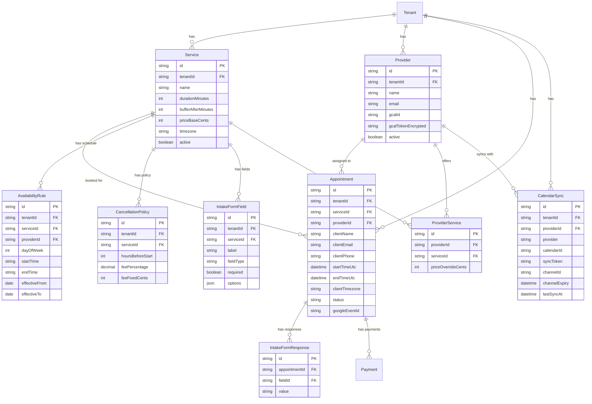

# feat: Scheduling Platform - Acuity Scheduling Alternative

## Overview

Build a comprehensive scheduling platform within MAIS that provides Acuity Scheduling-like functionality for multi-tenant businesses. Each tenant will have their own calendar(s), full booking/scheduling/payment flow management, and QuickBooks-style sales tracking capabilities.

**Estimated Complexity:** High (Major Feature)
**Affects:** End users (clients booking), Tenants (business owners), Platform (MAIS infrastructure)

---

## Problem Statement / Motivation

### Current State

- MAIS has date-only booking for wedding packages (`date: DateTime @db.Date`)
- Google Calendar adapter exists but is read-only (availability check only)
- Stripe Connect integrated for payments but no deposit/refund flow
- No time-slot based scheduling capability
- No QuickBooks-style revenue tracking or reporting

### Why This Matters

- **Market Opportunity:** Global appointment scheduling market valued at $14.33B in 2024, projected to reach $42.15B by 2034
- **User Demand:** 70%+ of customers prefer online booking
- **Platform Differentiation:** Full scheduling + payments + analytics in one platform vs. using Acuity/Calendly + separate payment processor
- **Tenant Value:** All-in-one solution reduces tool sprawl and integration headaches

### Success Metrics

- Tenants actively using scheduling features (target: 50% of new tenants within 3 months)
- Booking success rate >95%
- Zero double-booking incidents
- Revenue tracking accuracy matches Stripe dashboard (100%)

---

## Research Summary

### Industry Analysis (2025)

#### Competitor Landscape

| Platform                | Strengths                                  | Weaknesses                       | Pricing     |
| ----------------------- | ------------------------------------------ | -------------------------------- | ----------- |
| **Acuity Scheduling**   | Feature-rich, multi-calendar, intake forms | Expensive for growing businesses | $20-$69/mo  |
| **Calendly**            | Gold standard UX, 100+ integrations        | Limited customization            | $10-$20/mo  |
| **Cal.com**             | Open source, self-hostable, API-first      | Requires technical expertise     | Free-$15/mo |
| **Square Appointments** | All-in-one POS + scheduling                | Locked into Square ecosystem     | Free-$69/mo |
| **SimplyBook.me**       | À la carte features, compliance            | Complex pricing                  | $8-$50/mo   |

#### Key Features from Market Leaders

1. **Multi-provider calendars** - Staff-specific availability
2. **Service duration + buffer times** - Prevent back-to-back booking issues
3. **Time slot-based booking** - Not just date selection
4. **Intake forms** - Pre-appointment questionnaires
5. **Cancellation policies** - Time-based fee structures
6. **Group appointments** - Classes and workshops
7. **Resource management** - Rooms, equipment alongside staff

### Technical Best Practices (2025)

#### Calendar & Time Management

- **Store all times in UTC**, convert on frontend using IANA timezone database
- **Hybrid calendar sync**: Webhooks for real-time + 15-minute polling fallback
- **Google Calendar API**: OAuth 2.0 mandatory (March 2025), watch notifications for real-time updates

#### Double-Booking Prevention

Three-layer defense (industry standard):

1. **Application-level check** - Fast path availability query
2. **Pessimistic locking** - `SELECT FOR UPDATE` in transaction
3. **Database constraint** - Unique index on `[tenantId, providerId, startTime]`

#### Payment Patterns

- **Stripe recommendations**: Full upfront OR partial deposit with card vaulting
- **No-show protection**: Store payment method, charge only if no-show
- **Cancellation fees**: Time-based graduated structure (>48hr = full refund, 24-48hr = 50%, <24hr = 0%)

### Existing MAIS Architecture

#### Current Booking System (`server/src/services/booking.service.ts:1-332`)

- `createCheckout()` - Stripe checkout session creation
- `onPaymentCompleted()` - Webhook handler for confirmed bookings
- Three-layer double-booking prevention already implemented for dates

#### Calendar Integration (`server/src/adapters/gcal.adapter.ts:1-112`)

- Read-only FreeBusy API integration
- 60-second cache for availability checks
- Service account authentication
- **Gap**: No write capabilities (event creation/deletion)

#### Multi-Tenant Patterns (`server/src/middleware/tenant.ts:1-256`)

- All queries scoped by `tenantId`
- API key validation (`pk_live_{slug}_{random}`)
- Encrypted tenant secrets storage

---

## Proposed Solution

### Architecture Overview

```
┌─────────────────────────────────────────────────────────────────┐
│                        MAIS Scheduling Platform                  │
├─────────────────────────────────────────────────────────────────┤
│  Client Layer                                                    │
│  ┌─────────────┐  ┌─────────────┐  ┌─────────────┐             │
│  │ Public      │  │ Tenant      │  │ Embeddable  │             │
│  │ Booking Page│  │ Admin UI    │  │ Widget      │             │
│  └──────┬──────┘  └──────┬──────┘  └──────┬──────┘             │
├─────────┴────────────────┴────────────────┴─────────────────────┤
│  API Layer (ts-rest contracts)                                   │
│  ┌─────────────┐  ┌─────────────┐  ┌─────────────┐             │
│  │ /v1/public/ │  │ /v1/tenant- │  │ /v1/webhooks│             │
│  │ appointments│  │ admin/      │  │ /calendar   │             │
│  └──────┬──────┘  └──────┬──────┘  └──────┬──────┘             │
├─────────┴────────────────┴────────────────┴─────────────────────┤
│  Service Layer                                                   │
│  ┌─────────────┐  ┌─────────────┐  ┌─────────────┐             │
│  │ Appointment │  │ Availability│  │ Calendar    │             │
│  │ Service     │  │ Service     │  │ Sync Service│             │
│  └──────┬──────┘  └──────┬──────┘  └──────┬──────┘             │
│  ┌─────────────┐  ┌─────────────┐  ┌─────────────┐             │
│  │ Payment     │  │ Reporting   │  │ Notification│             │
│  │ Service     │  │ Service     │  │ Service     │             │
│  └──────┬──────┘  └──────┬──────┘  └──────┬──────┘             │
├─────────┴────────────────┴────────────────┴─────────────────────┤
│  Adapter Layer (Ports & Adapters)                                │
│  ┌─────────────┐  ┌─────────────┐  ┌─────────────┐             │
│  │ Prisma      │  │ Stripe      │  │ Google      │             │
│  │ Repositories│  │ Adapter     │  │ Calendar    │             │
│  └─────────────┘  └─────────────┘  └─────────────┘             │
│  ┌─────────────┐  ┌─────────────┐                              │
│  │ Postmark    │  │ Twilio      │                              │
│  │ (Email)     │  │ (SMS) [P2]  │                              │
│  └─────────────┘  └─────────────┘                              │
├─────────────────────────────────────────────────────────────────┤
│  Data Layer (PostgreSQL via Prisma)                             │
│  ┌──────────┐ ┌──────────┐ ┌──────────┐ ┌──────────┐          │
│  │ Service  │ │Appointment│ │ Provider │ │ Calendar │          │
│  │          │ │          │ │          │ │ Sync     │          │
│  └──────────┘ └──────────┘ └──────────┘ └──────────┘          │
│  ┌──────────┐ ┌──────────┐ ┌──────────┐                       │
│  │Availability│ │Cancellation│ │ Intake  │                       │
│  │ Rule     │ │ Policy   │ │ Form    │                       │
│  └──────────┘ └──────────┘ └──────────┘                       │
└─────────────────────────────────────────────────────────────────┘
```

### Data Model Changes

#### ERD (Mermaid)



#### Prisma Schema Additions

```prisma
// server/prisma/schema.prisma (additions)

model Service {
  id                String   @id @default(cuid())
  tenantId          String
  name              String
  description       String?  @db.Text
  durationMinutes   Int      // 15, 30, 45, 60, 90, 120
  bufferAfterMinutes Int     @default(0)
  priceBaseCents    Int
  timezone          String   // e.g., "America/Los_Angeles"
  active            Boolean  @default(true)
  sortOrder         Int      @default(0)

  // Relations
  tenant            Tenant   @relation(fields: [tenantId], references: [id])
  availabilityRules AvailabilityRule[]
  appointments      Appointment[]
  cancellationPolicies CancellationPolicy[]
  intakeFields      IntakeFormField[]
  providerServices  ProviderService[]

  @@unique([tenantId, id])
  @@index([tenantId, active])
}

model Provider {
  id                String   @id @default(cuid())
  tenantId          String
  name              String
  email             String
  phone             String?
  timezone          String   // Provider's local timezone
  gcalId            String?  // Google Calendar ID
  gcalRefreshToken  String?  @db.Text // Encrypted
  active            Boolean  @default(true)

  // Relations
  tenant            Tenant   @relation(fields: [tenantId], references: [id])
  appointments      Appointment[]
  availabilityRules AvailabilityRule[]
  calendarSyncs     CalendarSync[]
  providerServices  ProviderService[]

  @@unique([tenantId, email])
  @@index([tenantId, active])
}

model ProviderService {
  id                String   @id @default(cuid())
  providerId        String
  serviceId         String
  priceOverrideCents Int?    // NULL = use service base price

  provider          Provider @relation(fields: [providerId], references: [id])
  service           Service  @relation(fields: [serviceId], references: [id])

  @@unique([providerId, serviceId])
}

model AvailabilityRule {
  id            String   @id @default(cuid())
  tenantId      String
  serviceId     String?  // NULL = applies to all services
  providerId    String?  // NULL = applies to all providers (single-provider mode)
  dayOfWeek     Int      // 0=Sunday, 1=Monday, ..., 6=Saturday
  startTime     String   // "09:00" (in tenant/provider timezone)
  endTime       String   // "17:00"
  effectiveFrom DateTime @default(now())
  effectiveTo   DateTime? // NULL = indefinite

  tenant        Tenant   @relation(fields: [tenantId], references: [id])
  service       Service? @relation(fields: [serviceId], references: [id])
  provider      Provider? @relation(fields: [providerId], references: [id])

  @@unique([tenantId, serviceId, providerId, dayOfWeek, startTime])
  @@index([tenantId, dayOfWeek])
}

model Appointment {
  id                String   @id @default(cuid())
  tenantId          String
  serviceId         String
  providerId        String?  // NULL for single-provider tenants

  // Client info
  clientName        String
  clientEmail       String
  clientPhone       String?

  // Time (always UTC in database)
  startTimeUtc      DateTime
  endTimeUtc        DateTime
  clientTimezone    String   // For display in confirmations

  // Status
  status            AppointmentStatus @default(CONFIRMED)

  // Payment
  paymentStatus     PaymentStatus @default(PENDING)
  paymentIntentId   String?  @unique
  depositAmountCents Int?
  totalAmountCents  Int

  // Calendar sync
  googleEventId     String?  // For deduplication

  // Audit
  createdAt         DateTime @default(now())
  confirmedAt       DateTime?
  cancelledAt       DateTime?
  completedAt       DateTime?

  // Relations
  tenant            Tenant   @relation(fields: [tenantId], references: [id])
  service           Service  @relation(fields: [serviceId], references: [id])
  provider          Provider? @relation(fields: [providerId], references: [id])
  intakeResponses   IntakeFormResponse[]
  payments          Payment[]

  @@unique([tenantId, providerId, startTimeUtc]) // Prevents double-booking
  @@index([tenantId, status])
  @@index([tenantId, startTimeUtc])
  @@index([clientEmail])
}

enum AppointmentStatus {
  PENDING      // Awaiting payment
  CONFIRMED    // Paid and confirmed
  COMPLETED    // Appointment occurred
  CANCELLED    // Cancelled by client or admin
  NO_SHOW      // Client did not attend
}

enum PaymentStatus {
  PENDING
  DEPOSIT_PAID
  FULLY_PAID
  PARTIALLY_REFUNDED
  FULLY_REFUNDED
}

model CancellationPolicy {
  id                String   @id @default(cuid())
  tenantId          String
  serviceId         String?  // NULL = default policy for tenant
  hoursBeforeStart  Int      // e.g., 24, 48
  feePercentage     Decimal? @db.Decimal(5, 2) // e.g., 50.00 = 50%
  feeFixedCents     Int?     // OR fixed amount

  tenant            Tenant   @relation(fields: [tenantId], references: [id])
  service           Service? @relation(fields: [serviceId], references: [id])

  @@unique([tenantId, serviceId, hoursBeforeStart])
  @@index([tenantId])
}

model CalendarSync {
  id            String   @id @default(cuid())
  tenantId      String
  providerId    String?  // NULL for single-provider tenants
  provider      CalendarProvider @default(GOOGLE)
  calendarId    String   // External calendar ID (Google Calendar ID)
  syncToken     String?  // For incremental sync
  channelId     String?  // Google webhook channel ID
  channelExpiry DateTime?
  lastSyncAt    DateTime?
  syncDirection SyncDirection @default(BOTH)

  tenant        Tenant   @relation(fields: [tenantId], references: [id])
  providerRel   Provider? @relation(fields: [providerId], references: [id])

  @@unique([tenantId, providerId, calendarId])
}

enum CalendarProvider {
  GOOGLE
  OUTLOOK
  ICAL
}

enum SyncDirection {
  MAIS_TO_EXTERNAL  // One-way: MAIS creates events in Google
  EXTERNAL_TO_MAIS  // One-way: Google events block MAIS availability
  BOTH              // Two-way sync
}

model IntakeFormField {
  id          String   @id @default(cuid())
  tenantId    String
  serviceId   String
  label       String
  fieldType   IntakeFieldType
  required    Boolean  @default(false)
  placeholder String?
  options     Json?    // For SELECT: ["Option 1", "Option 2"]
  sortOrder   Int      @default(0)

  tenant      Tenant   @relation(fields: [tenantId], references: [id])
  service     Service  @relation(fields: [serviceId], references: [id])
  responses   IntakeFormResponse[]

  @@index([tenantId, serviceId])
}

enum IntakeFieldType {
  TEXT
  TEXTAREA
  SELECT
  CHECKBOX
  DATE
  PHONE
  EMAIL
}

model IntakeFormResponse {
  id            String   @id @default(cuid())
  appointmentId String
  fieldId       String
  value         String   @db.Text

  appointment   Appointment @relation(fields: [appointmentId], references: [id])
  field         IntakeFormField @relation(fields: [fieldId], references: [id])

  @@unique([appointmentId, fieldId])
}
```

---

## Technical Approach

### Core Services

#### 1. AvailabilityService (`server/src/services/scheduling/availability.service.ts`)

```typescript
// Pseudo-code for slot generation
interface TimeSlot {
  startTimeUtc: Date;
  endTimeUtc: Date;
  available: boolean;
  reason?: 'booked' | 'calendar' | 'blackout' | 'outside_hours';
}

class AvailabilityService {
  async getAvailableSlots(
    tenantId: string,
    serviceId: string,
    providerId: string | null,
    dateRange: { start: Date; end: Date },
    clientTimezone: string
  ): Promise<TimeSlot[]> {
    // 1. Get service configuration (duration, buffer, timezone)
    // 2. Get availability rules for the date range
    // 3. Generate all possible slots based on rules
    // 4. Filter out: existing appointments, Google Calendar conflicts, blackout dates
    // 5. Convert to client timezone for display
    // 6. Return with 15-minute increment slots
  }
}
```

#### 2. AppointmentService (`server/src/services/scheduling/appointment.service.ts`)

```typescript
class AppointmentService {
  async createAppointment(tenantId: string, data: CreateAppointmentDto): Promise<Appointment> {
    return await prisma.$transaction(async (tx) => {
      // 1. Acquire pessimistic lock
      await tx.$executeRaw`
        SELECT 1 FROM "Appointment"
        WHERE "tenantId" = ${tenantId}
        AND "providerId" = ${data.providerId}
        AND "startTimeUtc" = ${data.startTimeUtc}
        FOR UPDATE
      `;

      // 2. Check availability
      const conflict = await tx.appointment.findFirst({
        where: {
          tenantId,
          providerId: data.providerId,
          startTimeUtc: data.startTimeUtc,
          status: { not: 'CANCELLED' },
        },
      });
      if (conflict) throw new BookingConflictError();

      // 3. Create appointment
      const appointment = await tx.appointment.create({ data });

      // 4. Emit event for side effects
      this.eventEmitter.emit('appointment.created', appointment);

      return appointment;
    });
  }

  async cancelAppointment(
    tenantId: string,
    appointmentId: string,
    cancelledBy: 'client' | 'admin'
  ): Promise<{ appointment: Appointment; refundAmount: number }> {
    // 1. Load appointment
    // 2. Calculate refund based on cancellation policy
    // 3. Process Stripe refund if applicable
    // 4. Update appointment status
    // 5. Emit event (email notification, calendar removal)
  }
}
```

#### 3. CalendarSyncService (`server/src/services/scheduling/calendar-sync.service.ts`)

```typescript
class CalendarSyncService {
  // MAIS → Google
  async pushToGoogle(appointment: Appointment): Promise<string> {
    const event = {
      summary: `[MAIS] ${appointment.service.name} - ${appointment.clientName}`,
      start: { dateTime: appointment.startTimeUtc.toISOString() },
      end: { dateTime: appointment.endTimeUtc.toISOString() },
      description: `Booking ID: ${appointment.id}\nPhone: ${appointment.clientPhone}`,
      extendedProperties: { private: { maisAppointmentId: appointment.id } },
    };

    const googleEventId = await this.googleCalendar.events.insert(event);
    await this.appointmentRepo.update(appointment.id, { googleEventId });
    return googleEventId;
  }

  // Google → MAIS (webhook handler)
  async handleGoogleWebhook(channelId: string, resourceId: string): Promise<void> {
    // 1. Look up CalendarSync by channelId
    // 2. Fetch changed events since last syncToken
    // 3. For each event:
    //    - If has maisAppointmentId: skip (our own event)
    //    - If new busy event: create availability block
    //    - If deleted event: remove availability block
    // 4. Update syncToken
  }

  // Polling fallback (runs every 15 minutes)
  async pollGoogleCalendars(): Promise<void> {
    const staleCalendars = await this.calendarSyncRepo.findStale(fifteenMinutesAgo);
    for (const calendar of staleCalendars) {
      await this.syncCalendar(calendar);
    }
  }
}
```

### API Contracts

```typescript
// packages/contracts/src/scheduling.ts

// === Public Endpoints ===

export const getServices = {
  method: 'GET',
  path: '/v1/public/services',
  headers: z.object({ 'x-tenant-key': z.string() }),
  responses: {
    200: z.array(ServiceSchema),
  },
};

export const getAvailableSlots = {
  method: 'GET',
  path: '/v1/public/services/:serviceId/availability',
  headers: z.object({ 'x-tenant-key': z.string() }),
  query: z.object({
    startDate: z.string().date(), // YYYY-MM-DD
    endDate: z.string().date(),
    providerId: z.string().optional(),
    timezone: z.string().default('America/New_York'),
  }),
  responses: {
    200: z.array(TimeSlotSchema),
  },
};

export const createAppointment = {
  method: 'POST',
  path: '/v1/public/appointments',
  headers: z.object({ 'x-tenant-key': z.string() }),
  body: CreateAppointmentSchema,
  responses: {
    201: AppointmentResponseSchema,
    409: z.object({ error: z.literal('slot_unavailable') }),
  },
};

export const cancelAppointment = {
  method: 'POST',
  path: '/v1/public/appointments/:id/cancel',
  headers: z.object({ 'x-tenant-key': z.string() }),
  body: z.object({
    cancellationToken: z.string(), // Emailed to client
  }),
  responses: {
    200: z.object({
      message: z.string(),
      refundAmount: z.number(),
    }),
  },
};

// === Tenant Admin Endpoints ===

export const createService = {
  method: 'POST',
  path: '/v1/tenant-admin/services',
  body: CreateServiceSchema,
  responses: {
    201: ServiceSchema,
  },
};

export const setAvailabilityRules = {
  method: 'PUT',
  path: '/v1/tenant-admin/services/:serviceId/availability',
  body: z.array(AvailabilityRuleSchema),
  responses: {
    200: z.array(AvailabilityRuleSchema),
  },
};

export const getAppointments = {
  method: 'GET',
  path: '/v1/tenant-admin/appointments',
  query: z.object({
    startDate: z.string().date(),
    endDate: z.string().date(),
    status: z.enum(['CONFIRMED', 'COMPLETED', 'CANCELLED', 'NO_SHOW']).optional(),
  }),
  responses: {
    200: z.array(AppointmentAdminSchema),
  },
};

export const connectGoogleCalendar = {
  method: 'POST',
  path: '/v1/tenant-admin/calendar/google/connect',
  body: z.object({
    authCode: z.string(), // From OAuth redirect
    providerId: z.string().optional(),
  }),
  responses: {
    200: z.object({ success: z.boolean() }),
  },
};

// === Webhook Endpoints ===

export const googleCalendarWebhook = {
  method: 'POST',
  path: '/v1/webhooks/google-calendar',
  responses: {
    200: z.undefined(),
  },
};
```

---

## Implementation Phases

### Phase 0: Foundation (Week 1-2)

#### Deliverables

- [ ] Schema design finalized and reviewed
- [ ] Prisma migration created and tested on staging
- [ ] Mock adapters for calendar sync (`server/src/adapters/mock/calendar-sync.mock.ts`)
- [ ] API contracts in `@macon/contracts` (`packages/contracts/src/scheduling.ts`)
- [ ] ADR for timezone handling (`docs/decisions/ADR-XXX-timezone-strategy.md`)

#### Files to Create/Modify

```
server/prisma/schema.prisma                    # Add new models
server/src/lib/ports.ts                        # Add scheduling interfaces
server/src/lib/entities.ts                     # Add domain types
server/src/adapters/mock/calendar-sync.mock.ts # Mock calendar adapter
packages/contracts/src/scheduling.ts           # API contracts
packages/contracts/src/api.v1.ts               # Export scheduling contracts
docs/decisions/ADR-XXX-timezone-strategy.md    # Architecture decision
```

#### Success Criteria

- Migration applies cleanly to staging database
- Mock adapters pass interface tests
- Contracts compile without TypeScript errors

---

### Phase 1: MVP - Single Provider Scheduling (Week 3-5)

#### Scope

- Service CRUD (tenant admin)
- Availability rules (recurring weekly schedule)
- Time slot generation algorithm
- Booking flow with double-booking prevention
- Payment integration (deposit or full payment)
- Email confirmations
- Google Calendar one-way sync (MAIS → Google only)

#### Explicitly Excluded

- Multi-provider/staff management
- Google Calendar two-way sync
- Automated refunds
- Intake forms
- Reporting dashboard
- SMS reminders

#### Deliverables

- [ ] `AvailabilityService` with slot generation (`server/src/services/scheduling/availability.service.ts`)
- [ ] `AppointmentService` with double-booking prevention (`server/src/services/scheduling/appointment.service.ts`)
- [ ] `CalendarSyncService` for MAIS → Google (`server/src/services/scheduling/calendar-sync.service.ts`)
- [ ] Public routes: `/v1/public/services`, `/v1/public/appointments` (`server/src/routes/public-scheduling.routes.ts`)
- [ ] Admin routes: `/v1/tenant-admin/services`, `/v1/tenant-admin/appointments` (`server/src/routes/tenant-admin-scheduling.routes.ts`)
- [ ] Client booking page (`client/src/pages/BookingPage.tsx`)
- [ ] Service management UI (`client/src/features/tenant-admin/ServicesPage.tsx`)
- [ ] Postmark email templates (booking confirmation)

#### Files to Create/Modify

```
# Services
server/src/services/scheduling/availability.service.ts
server/src/services/scheduling/appointment.service.ts
server/src/services/scheduling/calendar-sync.service.ts
server/src/services/scheduling/cancellation.service.ts

# Adapters
server/src/adapters/google-calendar.adapter.ts
server/src/adapters/prisma/appointment.repository.ts
server/src/adapters/prisma/service.repository.ts
server/src/adapters/prisma/availability.repository.ts

# Routes
server/src/routes/public-scheduling.routes.ts
server/src/routes/tenant-admin-scheduling.routes.ts

# Client
client/src/pages/BookingPage.tsx
client/src/pages/BookingConfirmationPage.tsx
client/src/features/booking/ServiceSelector.tsx
client/src/features/booking/TimeSlotPicker.tsx
client/src/features/booking/BookingForm.tsx
client/src/features/tenant-admin/ServicesPage.tsx
client/src/features/tenant-admin/ServiceForm.tsx
client/src/features/tenant-admin/AvailabilityEditor.tsx

# Tests
server/test/services/availability.service.test.ts
server/test/services/appointment.service.test.ts
server/test/integration/double-booking.test.ts
e2e/tests/booking-timeslots.spec.ts
```

#### Success Criteria

- 3 pilot tenants onboarded
- 50+ bookings without double-booking incidents
- Booking success rate >95%
- Availability calculation <500ms

---

### Phase 2: Enhanced Features (Week 6-8)

#### Scope

- Multi-provider support (staff management)
- Google Calendar two-way sync (webhook + polling)
- Automated refunds based on cancellation policy
- Email/SMS reminders (T-24hr, T-1hr)
- Intake forms (custom fields per service)
- Admin dashboard (today's view, upcoming bookings)
- Manual appointment creation by admin

#### Deliverables

- [ ] Provider management UI and API
- [ ] Google Calendar webhook endpoint (`/v1/webhooks/google-calendar`)
- [ ] Polling fallback job (BullMQ or cron)
- [ ] Cancellation policy engine
- [ ] Twilio SMS integration (optional)
- [ ] Intake form builder
- [ ] Admin dashboard with calendar view

#### Files to Create/Modify

```
# Services (extended)
server/src/services/scheduling/provider.service.ts
server/src/services/scheduling/intake-form.service.ts
server/src/jobs/calendar-sync.job.ts

# Adapters
server/src/adapters/twilio.adapter.ts

# Routes
server/src/routes/webhooks-google-calendar.routes.ts

# Client
client/src/features/tenant-admin/ProvidersPage.tsx
client/src/features/tenant-admin/ProviderForm.tsx
client/src/features/tenant-admin/IntakeFormBuilder.tsx
client/src/features/tenant-admin/AppointmentsDashboard.tsx
client/src/features/tenant-admin/CalendarView.tsx
```

---

### Phase 3: Reporting & Sales Tracking (Week 9-10)

#### Scope

- Revenue dashboard (daily/weekly/monthly)
- Service performance report
- Provider utilization report
- Client history (repeat bookings, lifetime value)
- CSV/PDF export
- Invoice generation
- Payment receipts

#### Deliverables

- [ ] `ReportingService` with aggregation queries
- [ ] Report dashboard UI
- [ ] Export functionality
- [ ] Invoice PDF generation (React-PDF or similar)

#### Files to Create/Modify

```
server/src/services/reporting/revenue.service.ts
server/src/services/reporting/utilization.service.ts
server/src/services/reporting/invoice.service.ts
server/src/routes/tenant-admin-reports.routes.ts

client/src/features/tenant-admin/ReportsDashboard.tsx
client/src/features/tenant-admin/RevenueReport.tsx
client/src/features/tenant-admin/UtilizationReport.tsx
client/src/features/tenant-admin/ClientHistory.tsx
```

---

### Phase 4: Future Enhancements (Post-MVP)

- Group appointments/classes
- Recurring bookings
- Waitlist management
- QuickBooks direct API integration
- Custom domain for booking pages
- Embeddable booking widget
- Mobile app (React Native / PWA)
- AI-powered smart scheduling

---

## Acceptance Criteria

### Service Management

**AC-SM-1: Create Service**

- Given: Tenant admin is authenticated
- When: Creates service with name, duration, buffer, price, timezone
- Then: Service saved with `tenantId`, appears in service list, validation errors for missing fields

**AC-SM-2: Service Availability**

- Given: Service exists
- When: Tenant sets Mon-Fri 9am-5pm, Sat 10am-2pm
- Then: Rules stored in tenant timezone, booking slots generated within windows, last slot respects duration+buffer

### Booking Flow

**AC-BF-1: View Available Slots**

- Given: Client visits booking page for service on specific date
- When: Availability loaded
- Then: Only slots within rules shown, existing bookings blocked, calendar conflicts blocked, client timezone applied

**AC-BF-2: Create Booking**

- Given: Client selects time slot and completes form
- When: Payment processed
- Then: Lock acquired, Stripe charge created, booking record created, calendar event created, confirmation email sent

**AC-BF-3: Double-Booking Prevention**

- Given: Two clients attempt to book same slot simultaneously
- When: Both submit booking
- Then: First succeeds, second receives 409 Conflict with clear message

**AC-BF-4: Cancel Booking**

- Given: Booking exists, client cancels with sufficient notice
- When: Cancellation processed
- Then: Policy evaluated, refund issued if applicable, status updated, calendar event deleted, email sent

### Calendar Sync

**AC-CS-1: MAIS → Google**

- Given: Booking created in MAIS
- When: Calendar sync runs
- Then: Google Calendar event created within 5 seconds, title/description formatted correctly

**AC-CS-2: Google → MAIS (Phase 2)**

- Given: Tenant creates event in Google Calendar
- When: Webhook received
- Then: Busy slot created, availability blocked, idempotent processing

---

## Non-Functional Requirements

### Performance

- Availability calculation: <500ms for 30-day window
- Booking creation: <2s including payment
- Calendar sync: <5s for event creation
- Report generation: <3s for 1000 bookings

### Security

- All queries scoped by `tenantId`
- Google OAuth tokens encrypted at rest
- Rate limiting on public endpoints (100 req/min/tenant)
- Cancellation tokens hashed (not reversible)

### Reliability

- Zero double-bookings (pessimistic locking + unique constraint)
- Calendar sync: Webhook primary, 15-min polling fallback
- Stripe webhook idempotency via database

---

## Dependencies & Risks

### External Dependencies

| Dependency          | Risk Level | Mitigation                                                         |
| ------------------- | ---------- | ------------------------------------------------------------------ |
| Google Calendar API | Medium     | OAuth consent approval can take 1-3 weeks. Start submission early. |
| Stripe Connect      | Low        | Already integrated. Need refund API implementation.                |
| Postmark            | Low        | Already integrated. Need new templates.                            |
| Twilio (SMS)        | Low        | Optional for Phase 2. Graceful fallback to email-only.             |

### Technical Risks

| Risk                                        | Impact   | Probability | Mitigation                                                                       |
| ------------------------------------------- | -------- | ----------- | -------------------------------------------------------------------------------- |
| Database migration breaks existing bookings | Critical | Medium      | Keep `Booking` table separate from `Appointment`. Gradual migration.             |
| Double-booking under load                   | High     | Medium      | Load test pessimistic locking. Add monitoring alerts.                            |
| Timezone conversion bugs                    | High     | High        | Use `luxon` library. Extensive timezone test suite.                              |
| Google webhook reliability                  | Medium   | High        | "Webhooks not 100% reliable" per Google docs. Always implement polling fallback. |

---

## Open Questions (Require Stakeholder Input)

### Priority 0 (Blocking MVP)

1. **Multi-Provider Timing**: Required for Phase 1 or defer to Phase 2?
   - **Impact**: +2 weeks if Phase 1, significant model complexity
   - **Recommendation**: Defer to Phase 2

2. **Payment Options**: Deposit-only, full upfront, or both?
   - **Impact**: Payment flow branching complexity
   - **Recommendation**: Support both, configurable per service

3. **Cancellation Policy**: Standard policy or tenant-configurable?
   - **Impact**: Admin UI complexity
   - **Recommendation**: Standard for MVP (>24hr=50% refund), configurable Phase 2

### Priority 1 (Can Defer)

4. **QuickBooks Scope**: Reporting only or direct API integration?
5. **Calendar Sync Direction**: One-way or two-way for MVP?
6. **Guest Checkout**: Allow or require account creation?

---

## Test Plan

### Unit Tests (Mock Adapters)

- `availability.service.test.ts` - Slot generation edge cases
- `appointment.service.test.ts` - Booking, cancellation, refund calculation
- `timezone-utils.test.ts` - UTC conversion, DST handling

### Integration Tests (Real DB, Mock External)

- `double-booking.test.ts` - 10 concurrent booking attempts
- `calendar-sync.test.ts` - Webhook deduplication, sync token handling

### E2E Tests (Playwright)

- `booking-flow.spec.ts` - Full booking journey
- `cancellation-flow.spec.ts` - Cancel with refund verification
- `admin-services.spec.ts` - Service CRUD operations

### Load Tests (Artillery)

- Target: 100 concurrent bookings/minute
- Monitor: Deadlock rate, p95 latency, error rate

---

## References

### Internal

- `server/src/services/booking.service.ts:57-154` - Existing checkout flow pattern
- `server/src/adapters/prisma/booking.repository.ts:144-150` - Advisory lock pattern
- `server/src/adapters/gcal.adapter.ts:33-110` - Existing Google Calendar read
- `server/prisma/schema.prisma:255-297` - Existing Booking model
- `DECISIONS.md:ADR-001` - Double-booking prevention rationale

### External

- [Acuity Scheduling Developer Hub](https://developers.acuityscheduling.com/)
- [Cal.com GitHub](https://github.com/calcom/cal.com) - Open source reference
- [Google Calendar API Push Notifications](https://developers.google.com/workspace/calendar/api/guides/push)
- [Stripe Booking Systems Guide](https://stripe.com/resources/more/booking-systems-with-payments-101)
- [Solving Double Booking at Scale](https://itnext.io/solving-double-booking-at-scale-system-design-patterns-from-top-tech-companies-4c5a3311d8ea)

---

## Appendix: Timezone Handling Strategy

### Principle: UTC Everywhere, Convert at Boundaries

```typescript
// Database: Always UTC
appointment.startTimeUtc = DateTime.utc(2025, 12, 1, 18, 0); // 6pm UTC

// API Response: Include client timezone info
{
  "startTimeUtc": "2025-12-01T18:00:00Z",
  "clientTimezone": "America/Los_Angeles",
  "displayTime": "10:00 AM PST" // Computed, not stored
}

// Frontend: Convert for display
const displayTime = DateTime.fromISO(startTimeUtc)
  .setZone(clientTimezone)
  .toFormat('h:mm a ZZZZ'); // "10:00 AM PST"
```

### Library: Luxon over date-fns

- Luxon has first-class timezone support
- IANA timezone database built-in
- Better DST handling than date-fns-tz

```bash
npm install luxon @types/luxon
```

---

## Approval

- [ ] Product Lead review
- [ ] Engineering Lead review
- [ ] Security review (tenant isolation, OAuth handling)
- [ ] Ready for implementation
