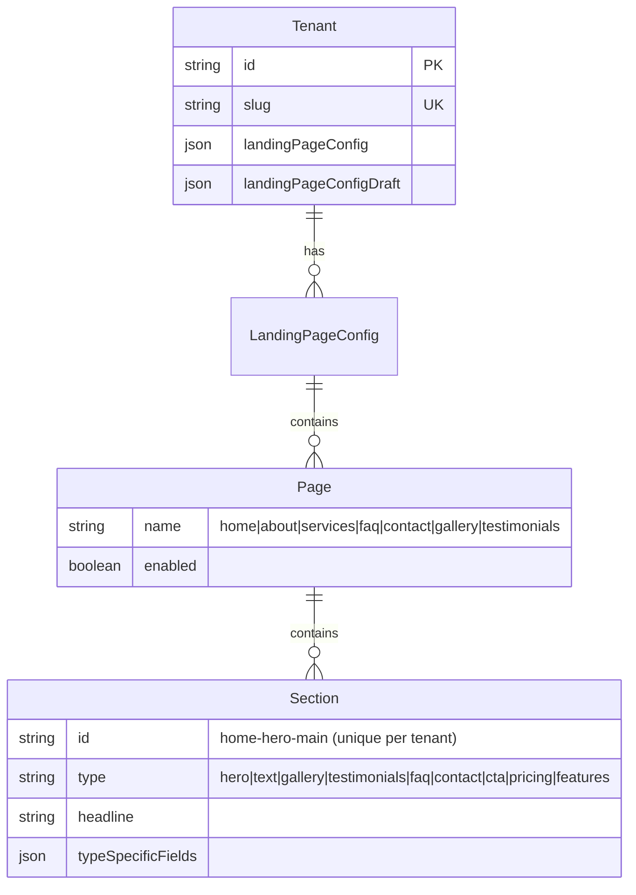

# ✨ feat: Storefront AI-Chatbot Integration

**Created:** 2026-01-08
**Status:** Ready for Review
**Complexity:** A LOT (Comprehensive)
**Estimated Effort:** 12-16 hours

---

## Overview

Transform the tenant storefront system to enable seamless AI-chatbot-guided website building. When tenants sign up, they receive a template website with self-documenting placeholders that the AI chatbot can understand and update by stable section IDs (not fragile array indices).

**Goal:** A tenant can say _"Change the Hero Headline to 'Reset. Reconnect. Return Stronger.'"_ and the chatbot knows exactly where to plug it in via `home-hero-main.headline`.

---

## Problem Statement

### Current State (Broken)

| Issue                                  | Impact                                                                        | Evidence                                          |
| -------------------------------------- | ----------------------------------------------------------------------------- | ------------------------------------------------- |
| **Sections identified by array index** | Indices shift on reorder/delete; AI loses reference                           | `storefront-tools.ts:103-106` uses `sectionIndex` |
| **Generic placeholder content**        | Tenants see "Welcome to Our Studio"; can't reference specific fields          | `landing-page.ts:573-668`                         |
| **Two separate tool systems**          | Onboarding has 5 fields, Build Mode has 8 tools; inconsistent AI capabilities | `onboarding-tools.ts` vs `storefront-tools.ts`    |
| **No section discovery**               | AI cannot list available sections or their IDs                                | No `list_section_ids` tool exists                 |

### Desired State

1. **Stable Section IDs:** Each section has human-readable ID like `home-hero-main`
2. **Self-Documenting Placeholders:** Default content shows `[Hero Headline]` so tenants know what to ask for
3. **Unified Tools:** AI always has full Build Mode capabilities
4. **Section Discovery:** AI can query available sections and their current content

---

## Proposed Solution

### Architecture Overview

```
┌─────────────────────────────────────────────────────────────────┐
│                     TENANT STOREFRONT                            │
├─────────────────────────────────────────────────────────────────┤
│  landingPageConfig (JSON)                                        │
│  ├── pages                                                       │
│  │   ├── home                                                    │
│  │   │   └── sections[]                                         │
│  │   │       ├── { id: "home-hero-main", type: "hero", ... }    │
│  │   │       └── { id: "home-cta-bottom", type: "cta", ... }    │
│  │   ├── about                                                   │
│  │   │   └── sections[]                                         │
│  │   │       └── { id: "about-text-intro", type: "text", ... }  │
│  │   └── ... (7 pages total)                                    │
└─────────────────────────────────────────────────────────────────┘
                              │
                              ▼
┌─────────────────────────────────────────────────────────────────┐
│                     AI CHATBOT TOOLS                             │
├─────────────────────────────────────────────────────────────────┤
│  T1 (Auto-confirm):                                              │
│  • list_section_ids - Discover all sections                      │
│  • get_section_by_id - Get section content                       │
│  • reorder_page_sections                                         │
│  • toggle_page_enabled                                           │
│                                                                  │
│  T2 (Soft-confirm):                                              │
│  • update_page_section - By ID (not index)                       │
│  • remove_page_section - By ID                                   │
│  • update_storefront_branding                                    │
│  • publish_draft / discard_draft                                 │
└─────────────────────────────────────────────────────────────────┘
```

---

## Technical Approach

### Schema Changes

**File:** `packages/contracts/src/landing-page.ts`

```typescript
// NEW: Section ID validation schema
export const SectionIdSchema = z
  .string()
  .min(5)
  .max(50)
  .regex(
    /^[a-z]+-[a-z]+-[a-z0-9-]+$/,
    'Section ID must be {page}-{type}-{qualifier} format (e.g., home-hero-main)'
  );

// MODIFY: Add id field to each section type
export const HeroSectionSchema = z.object({
  id: SectionIdSchema.optional(), // Optional during transition, required after migration
  type: z.literal('hero'),
  headline: z.string().min(1).max(60),
  subheadline: z.string().max(150).optional(),
  ctaText: z.string().max(30).default('View Packages'),
  backgroundImageUrl: SafeImageUrlOptionalSchema,
});

// Similar for all 9 section types...
```

### ID Format Convention

```
{page}-{type}-{qualifier}

Examples:
├── home-hero-main          # Main hero on home page
├── home-cta-bottom         # Bottom CTA on home page
├── about-text-intro        # Intro text on about page
├── about-text-story        # Story text on about page (2nd text section)
├── faq-faq-main            # Main FAQ section
├── gallery-gallery-main    # Main gallery
└── testimonials-testimonials-main
```

**Qualifier Rules:**

- First section of type: `main`
- Subsequent sections: `2`, `3`, `4`, etc. OR semantic: `footer`, `sidebar`
- User-created sections: Auto-generate `{type}-{timestamp}` or let user name

### Self-Documenting Default Content

**File:** `packages/contracts/src/landing-page.ts` (DEFAULT_PAGES_CONFIG)

```typescript
export const DEFAULT_PAGES_CONFIG: PagesConfig = {
  home: {
    enabled: true,
    sections: [
      {
        id: 'home-hero-main',
        type: 'hero',
        headline: '[Hero Headline]',
        subheadline: '[Hero Subheadline - describe your business in one sentence]',
        ctaText: '[CTA Button Text]',
      },
      {
        id: 'home-cta-bottom',
        type: 'cta',
        headline: '[CTA Headline - call to action]',
        subheadline: '[CTA Subheadline]',
        ctaText: '[CTA Button Text]',
      },
    ],
  },
  about: {
    enabled: true,
    sections: [
      {
        id: 'about-text-intro',
        type: 'text',
        headline: '[About Headline]',
        content: '[About Content - tell your story, who you serve, and why you do what you do]',
      },
    ],
  },
  services: {
    enabled: true,
    sections: [], // Dynamically populated from segments/packages
  },
  faq: {
    enabled: true,
    sections: [
      {
        id: 'faq-faq-main',
        type: 'faq',
        headline: '[FAQ Headline]',
        items: [
          { question: '[Question 1]', answer: '[Answer 1]' },
          { question: '[Question 2]', answer: '[Answer 2]' },
          { question: '[Question 3]', answer: '[Answer 3]' },
        ],
      },
    ],
  },
  contact: {
    enabled: true,
    sections: [
      {
        id: 'contact-contact-main',
        type: 'contact',
        headline: '[Contact Headline]',
        email: '[Email Address]',
        phone: '[Phone Number]',
        address: '[Business Address]',
        hours: '[Business Hours]',
      },
    ],
  },
  gallery: {
    enabled: false, // Disabled until images added
    sections: [
      {
        id: 'gallery-gallery-main',
        type: 'gallery',
        headline: '[Gallery Headline]',
        images: [],
        instagramHandle: '[Instagram Handle]',
      },
    ],
  },
  testimonials: {
    enabled: false, // Disabled until testimonials added
    sections: [
      {
        id: 'testimonials-testimonials-main',
        type: 'testimonials',
        headline: '[Testimonials Headline]',
        items: [
          {
            quote: '[Testimonial Quote]',
            authorName: '[Author Name]',
            authorRole: '[Author Role/Title]',
            rating: 5,
          },
        ],
      },
    ],
  },
};
```

### New Discovery Tool

**File:** `server/src/agent/tools/storefront-tools.ts`

```typescript
export const listSectionIdsTool: AgentTool = {
  name: 'list_section_ids',
  trustTier: 'T1', // Auto-confirm (read-only)
  description:
    'Get all section IDs and their content summaries for the tenant storefront. Call this first to discover available sections before updating.',
  inputSchema: {
    type: 'object',
    properties: {
      pageName: {
        type: 'string',
        enum: PAGE_NAMES,
        description: 'Filter by page (optional). Omit to get all pages.',
      },
      sectionType: {
        type: 'string',
        enum: SECTION_TYPES,
        description: 'Filter by section type (optional).',
      },
    },
  },
  async execute(context: ToolContext, params: Record<string, unknown>): Promise<AgentToolResult> {
    const { draft } = await getDraftConfigWithSlug(context.prisma, context.tenantId);
    const pages = draft?.pages || DEFAULT_PAGES_CONFIG;

    const sections: Array<{
      id: string;
      page: string;
      type: string;
      headline: string;
      hasPlaceholder: boolean;
    }> = [];

    for (const [pageName, pageConfig] of Object.entries(pages)) {
      if (params.pageName && pageName !== params.pageName) continue;

      for (const section of pageConfig.sections || []) {
        if (params.sectionType && section.type !== params.sectionType) continue;

        const headline = section.headline || section.content?.substring(0, 50) || '';
        sections.push({
          id: section.id || `${pageName}-${section.type}-legacy`,
          page: pageName,
          type: section.type,
          headline,
          hasPlaceholder: headline.startsWith('[') && headline.endsWith(']'),
        });
      }
    }

    return {
      success: true,
      data: { sections, totalCount: sections.length },
    };
  },
};
```

### Tool Parameter Updates

**Modify:** `update_page_section` and `remove_page_section` to accept ID

```typescript
// BEFORE (fragile)
sectionIndex: { type: 'number', description: 'Index of section (0-based)' }

// AFTER (stable)
sectionId: {
  type: 'string',
  description: 'Section ID (e.g., "home-hero-main"). Use list_section_ids to discover available IDs.'
}
sectionIndex: {
  type: 'number',
  description: 'DEPRECATED: Use sectionId instead. Index kept for backward compatibility.'
}
```

**Executor Logic:**

```typescript
// In storefront-executors.ts
const { pageName, sectionId, sectionIndex, sectionData } = payload;

// Find section by ID first, fall back to index
let targetIndex: number;
if (sectionId) {
  targetIndex = page.sections.findIndex((s) => s.id === sectionId);
  if (targetIndex === -1) {
    throw new Error(`Section '${sectionId}' not found on ${pageName} page`);
  }
} else if (typeof sectionIndex === 'number') {
  targetIndex = sectionIndex;
} else {
  throw new Error('Either sectionId or sectionIndex required');
}
```

---

## Implementation Phases

### Phase 1: Schema Foundation (P0 - Critical)

**Goal:** Add optional `id` field to section schemas, no breaking changes.

**Tasks:**

- [ ] Add `SectionIdSchema` to `packages/contracts/src/landing-page.ts`
- [ ] Add optional `id` field to all 9 section type schemas
- [ ] Update `SectionSchema` discriminated union
- [ ] Add unit tests for ID validation (format, length, chars)
- [ ] Run `npm run typecheck` across all workspaces

**Files:**

- `packages/contracts/src/landing-page.ts` - Schema changes
- `packages/contracts/src/schemas/landing-page.schema.ts` - If separate

**Acceptance Criteria:**

- [ ] Sections with valid ID pass validation
- [ ] Sections without ID pass validation (backward compat)
- [ ] Sections with invalid ID format fail validation
- [ ] TypeScript compiles with no errors

### Phase 2: Default Content Update (P1)

**Goal:** Transform DEFAULT_PAGES_CONFIG to self-documenting placeholders.

**Tasks:**

- [ ] Update DEFAULT_PAGES_CONFIG with IDs and placeholder content
- [ ] Add `satisfies PagesConfig` type check to defaults
- [ ] Update any tests that assert on default content
- [ ] Visual review: create new tenant, verify placeholders display

**Files:**

- `packages/contracts/src/landing-page.ts` - DEFAULT_PAGES_CONFIG

**Acceptance Criteria:**

- [ ] New tenants see `[Hero Headline]` style placeholders
- [ ] All default sections have human-readable IDs
- [ ] No TypeScript errors from default config

### Phase 3: Discovery Tool (P1)

**Goal:** Enable AI to discover available sections.

**Tasks:**

- [ ] Implement `list_section_ids` tool in `storefront-tools.ts`
- [ ] Add to `storefrontTools` export array
- [ ] Register in `REQUIRED_EXECUTOR_TOOLS` (if write tool, else skip)
- [ ] Add tool tests
- [ ] Update agent system prompt with discovery guidance

**Files:**

- `server/src/agent/tools/storefront-tools.ts` - New tool
- `server/src/agent/tools/all-tools.ts` - Export
- `server/src/agent/prompts/` - System prompt update

**Acceptance Criteria:**

- [ ] Tool returns all section IDs with summaries
- [ ] Filter by page works
- [ ] Filter by section type works
- [ ] `hasPlaceholder` flag correctly identifies unfilled content

### Phase 4: Migration Script (P1)

**Goal:** Add IDs to all existing tenant configurations.

**Tasks:**

- [ ] Create migration script `scripts/migrate-section-ids.ts`
- [ ] Implement ID generation algorithm
- [ ] Handle collision detection (multiple same-type sections)
- [ ] Add dry-run mode for preview
- [ ] Add rollback documentation
- [ ] Test on staging database

**Files:**

- `server/scripts/migrate-section-ids.ts` - New script
- `server/prisma/seeds/` - Update seeds with IDs

**Algorithm:**

```typescript
function generateSectionId(
  pageName: string,
  sectionType: string,
  existingIds: Set<string>
): string {
  const baseId = `${pageName}-${sectionType}-main`;
  if (!existingIds.has(baseId)) return baseId;

  // Find next available number
  let counter = 2;
  while (existingIds.has(`${pageName}-${sectionType}-${counter}`)) {
    counter++;
  }
  return `${pageName}-${sectionType}-${counter}`;
}
```

**Acceptance Criteria:**

- [ ] All existing sections get unique IDs
- [ ] No ID collisions within tenant
- [ ] Draft and live configs both migrated
- [ ] Dry-run shows preview without changes
- [ ] Migration is idempotent (safe to run twice)

### Phase 5: Tool Parameter Update (P1)

**Goal:** Tools accept section ID instead of index.

**Tasks:**

- [ ] Add `sectionId` parameter to `update_page_section`
- [ ] Add `sectionId` parameter to `remove_page_section`
- [ ] Update executor schemas in `executor-schemas.ts`
- [ ] Update executors to resolve ID → index
- [ ] Deprecate `sectionIndex` (keep working, add warning)
- [ ] Update tool descriptions

**Files:**

- `server/src/agent/tools/storefront-tools.ts` - Tool definitions
- `server/src/agent/proposals/executor-schemas.ts` - Payload schemas
- `server/src/agent/executors/storefront-executors.ts` - Execution logic

**Acceptance Criteria:**

- [ ] `update_page_section` works with `sectionId`
- [ ] `remove_page_section` works with `sectionId`
- [ ] Old `sectionIndex` parameter still works (backward compat)
- [ ] Clear error when ID not found
- [ ] Tool descriptions reference ID discovery

### Phase 6: Tool Unification (P2)

**Goal:** Expose Build Mode tools during onboarding.

**Tasks:**

- [ ] Modify `advisor-orchestrator.ts` to include storefront tools in MARKETING phase
- [ ] Update onboarding system prompt for full tool access
- [ ] Add guidance for using `list_section_ids` first
- [ ] Deprecate limited `update_storefront` tool (mark but keep)
- [ ] Integration test: onboarding flow with section updates

**Files:**

- `server/src/agent/onboarding/advisor-orchestrator.ts` - Tool registration
- `server/src/agent/prompts/onboarding-system-prompt.ts` - Guidance
- `server/src/agent/tools/onboarding-tools.ts` - Deprecation notice

**Acceptance Criteria:**

- [ ] AI has full storefront capabilities during MARKETING phase
- [ ] `list_section_ids` available during onboarding
- [ ] `update_page_section` works by ID during onboarding
- [ ] Old `update_storefront` still works (deprecated, not removed)

### Phase 7: Agent Disambiguation (P2)

**Goal:** AI handles ambiguous section references gracefully.

**Tasks:**

- [ ] Update system prompt with disambiguation flow
- [ ] Add examples for multi-section scenarios
- [ ] Test: "update the hero" when multiple heroes exist

**System Prompt Addition:**

```markdown
## Section Reference Disambiguation

When user references a section ambiguously:

1. Call `list_section_ids` to find matching sections
2. If exactly 1 match → proceed with update
3. If multiple matches → ask user to clarify:
   "I found 2 hero sections: 'home-hero-main' (Home page) and 'services-hero-main' (Services page). Which one would you like to update?"
4. If no matches → suggest available sections
```

**Acceptance Criteria:**

- [ ] AI asks for clarification when ambiguous
- [ ] AI proceeds directly when unambiguous
- [ ] AI suggests alternatives when no match

---

## Alternative Approaches Considered

### A1: UUID-Based Section IDs

**Approach:** Use `crypto.randomUUID()` for section IDs.

**Pros:**

- Guaranteed uniqueness
- No collision detection needed

**Cons:**

- Not human-readable (`a1b2c3d4-...` vs `home-hero-main`)
- Harder to debug
- Tenants can't reference sections in chat naturally

**Decision:** Rejected - defeats the purpose of AI-chatbot-friendly IDs.

### A2: Keep Index-Based, Add Alias

**Approach:** Keep `sectionIndex` as primary, add optional `alias` field.

**Pros:**

- No migration needed
- Backward compatible

**Cons:**

- Indices still fragile
- Alias is just a label, not an identifier
- Two systems to maintain

**Decision:** Rejected - doesn't solve the core problem.

### A3: Separate Section Table in Database

**Approach:** Move sections from JSON to `Section` Prisma model.

**Pros:**

- Proper foreign keys
- Database-level uniqueness constraints
- Better query performance

**Cons:**

- Major schema change
- Complex migration
- Breaks JSON flexibility

**Decision:** Deferred - consider for v2 if scale requires.

---

## Acceptance Criteria

### Functional Requirements

- [ ] All section types have optional `id` field in schema
- [ ] DEFAULT_PAGES_CONFIG has IDs and `[Field Name]` placeholders
- [ ] `list_section_ids` tool returns all sections with metadata
- [ ] `update_page_section` accepts `sectionId` parameter
- [ ] `remove_page_section` accepts `sectionId` parameter
- [ ] Migration script adds IDs to all existing tenants
- [ ] AI can discover, reference, and update sections by ID

### Non-Functional Requirements

- [ ] **Performance:** Section lookup by ID < 10ms (O(n) scan acceptable for <100 sections)
- [ ] **Backward Compatibility:** Old configs without IDs still load
- [ ] **Security:** IDs validated against regex, no injection risk

### Quality Gates

- [ ] All existing tests pass
- [ ] New tests for ID validation, discovery tool, migration
- [ ] TypeScript strict mode passes
- [ ] Code review approved

---

## Success Metrics

| Metric                                    | Target           | Measurement                 |
| ----------------------------------------- | ---------------- | --------------------------- |
| Section update success rate               | >95%             | Proposal execution logs     |
| AI-guided setup completion                | +20% vs baseline | Onboarding funnel analytics |
| Support tickets for "how to edit website" | -50%             | Zendesk/Intercom            |
| Time to first customization               | <5 minutes       | Session analytics           |

---

## Dependencies & Prerequisites

| Dependency                 | Status   | Notes                |
| -------------------------- | -------- | -------------------- |
| `@macon/contracts` package | ✅ Ready | Schema changes here  |
| Draft/publish system       | ✅ Ready | Already implemented  |
| Build Mode tools           | ✅ Ready | 8 tools exist        |
| Onboarding orchestrator    | ✅ Ready | Needs tool injection |

---

## Risk Analysis & Mitigation

| Risk                                | Likelihood | Impact | Mitigation                                     |
| ----------------------------------- | ---------- | ------ | ---------------------------------------------- |
| Migration corrupts existing configs | Low        | High   | Dry-run first, backup before, validation after |
| ID collisions not detected          | Medium     | Medium | Add uniqueness validation in executor          |
| Placeholder text confuses tenants   | Low        | Low    | Clear styling, AI explains on first visit      |
| Tool unification breaks onboarding  | Medium     | Medium | Feature flag, gradual rollout                  |

---

## Technical Details

### Affected Files

| File                                                   | Change Type       | Phase |
| ------------------------------------------------------ | ----------------- | ----- |
| `packages/contracts/src/landing-page.ts`               | Schema + Defaults | 1, 2  |
| `server/src/agent/tools/storefront-tools.ts`           | New tool + params | 3, 5  |
| `server/src/agent/proposals/executor-schemas.ts`       | Payload update    | 5     |
| `server/src/agent/executors/storefront-executors.ts`   | ID resolution     | 5     |
| `server/src/agent/onboarding/advisor-orchestrator.ts`  | Tool registration | 6     |
| `server/src/agent/prompts/onboarding-system-prompt.ts` | Guidance          | 6, 7  |
| `server/scripts/migrate-section-ids.ts`                | New file          | 4     |
| `apps/web/src/components/tenant/SectionRenderer.tsx`   | Data attribute    | 1     |

### Database Changes

**None required.** Section IDs stored in existing `landingPageConfig` JSON field.

### API Changes

**No breaking changes.** Tools accept new `sectionId` parameter alongside existing `sectionIndex`.

---

## Work Log

| Date       | Action       | Notes                                                        |
| ---------- | ------------ | ------------------------------------------------------------ |
| 2026-01-08 | Plan created | Based on research from 3 parallel agents + SpecFlow analysis |

---

## Resources

### Internal References

- Schema: `packages/contracts/src/landing-page.ts:231-420`
- Tools: `server/src/agent/tools/storefront-tools.ts:85-837`
- Executors: `server/src/agent/executors/storefront-executors.ts:70-131`
- Onboarding: `server/src/agent/onboarding/advisor-orchestrator.ts`

### External References

- [Zod Documentation](https://zod.dev) - Schema validation
- [MAIS Prevention Strategies](../docs/solutions/PREVENTION-STRATEGIES-INDEX.md)

### Related Work

- Previous: Little Bit Horse Farm storefront fix (landingPageConfig not returned)
- ADR-016: Field naming conventions
- Build Mode code review patterns

---

## Open Questions

1. **ID Immutability:** Should section IDs be immutable once created, or allow renaming?
   - **Recommendation:** Immutable - prevents broken references

2. **User-Created Section IDs:** When tenant adds section via UI, auto-generate or let them name?
   - **Recommendation:** Auto-generate with option to customize

3. **Placeholder Styling:** Should `[Field Name]` placeholders have special visual styling?
   - **Recommendation:** Yes - italic, gray text, dashed border

4. **Customer Chatbot Access:** Should the customer-facing chatbot ever see section IDs?
   - **Recommendation:** No - only business advisor chatbot

---

## ERD: Section ID Data Model



Note: Section is embedded in JSON, not a separate table.
